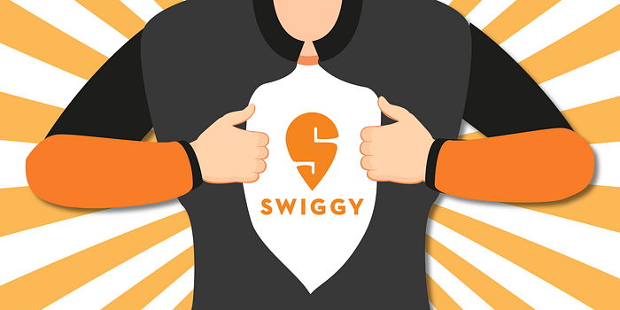
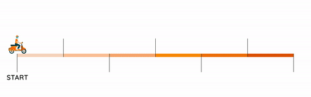
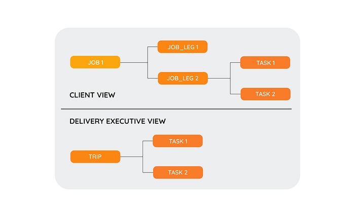
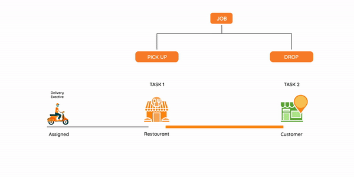
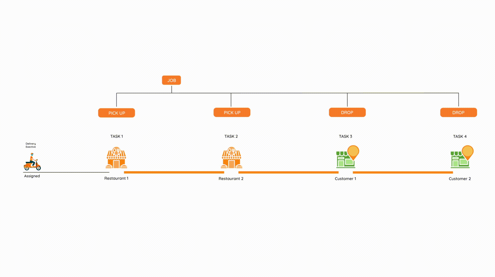
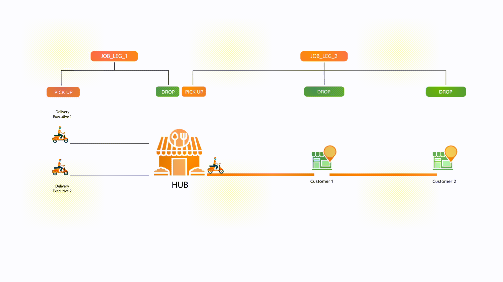
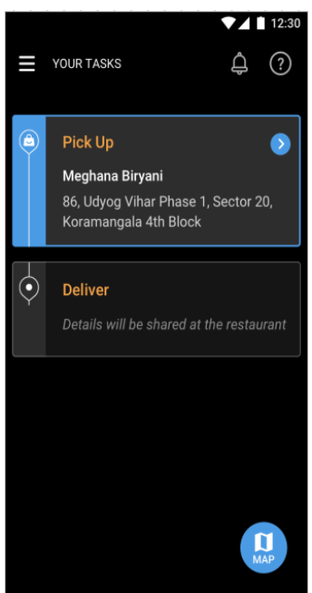
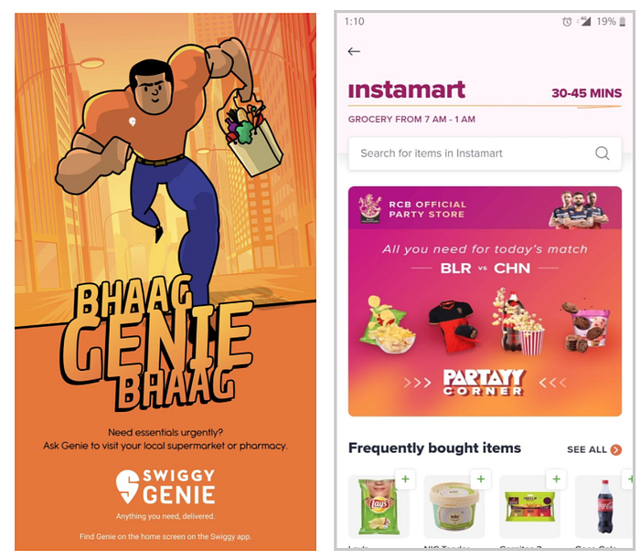

# Re-Architecting Swiggy’s logistics systems

A revamp story that transitioned the largest delivery fleet in the country from being “Hunger saviors” to “Convenience enablers”

Swiggy started as a **hyperlocal** food delivery organization in 2014 and has now evolved into a convenience enabler through services like Instamart, Stores, Genie, etc., and has multiple offerings in the pipeline aimed towards our vision of delivering unparalleled convenience for consumers.

The journey from being ‘Hunger saviors’ to ‘Kings of convenience” has been extremely exciting and challenging to say the least. In this entire journey, multiple systems have been built, re-architected, and extended to achieve the vision. In this article, we would like to share our learnings and experiences in re-architecting Swiggy’s logistics platform which currently powers deliveries for all Swiggy’s offerings and has unlocked multiple other capabilities for future use cases.

---

## Background

> Legacy logistic system was the oldest member of the Delivery team and was addressed as ‘Delivery monolith’ with all due respect

Delivery monolith as the name suggests used to power all critical delivery use cases of the organization. Swiggy being a 3-way market place between Consumer, Restaurant, and Delivery executives, ~ ⅓ critical business logic was owned by the monolith. As the Delivery team grew in size the stack was forked and responsibilities were split (Conway’s law). But, no clean strategy was followed to decommission the monolith.

**Difficulties with the monolith**

- **Maintainability**: Test coverage of legacy monolith was low. Hence, QA time was high and any development was prone to regression issues.
- **Scaling**: System was backed by Mysql and Redis clusters running at the peak of vertical scale and there were multiple issues in partitioning data to scale horizontally.
- **Extensibility**: System was built for hyper-local food delivery and it was tediously difficult to build new capabilities of delivering anything or splitting order delivery into multiple legs.

## Vision

> Around July 2018, we decided to venture into new business verticals i.e. Swiggy Stores and Swiggy Genie. This gave us a direction on how we should start relooking at our tech stack to expand from food delivery space and move towards becoming a true convenience company.

### Vision statement: To build a multi-tenant multi-service-line logistics platform

***What is a multi-tenant platform? **Multiple tenants should be able to use the platform with logical isolation.

***What do we mean by multi-service-line**?: Ability to execute jobs for multiple service lines Ex: Food, Stores, Genie, etc.

## Paradigm shift

Executing our vision required a complete revamp of the way we did deliveries. This brought in a paradigm shift in our delivery model

**Delivery monolith model**

Delivery order is created for every consumer order and the following was the state machine of Delivery orders

*Delivery monolith model*

**Limitations**

- A delivery order is implicitly a two legged pick up drop off Job. Multi legged delivery was not possible
- The delivery order was not breakable. Hence, multi-leg delivery/Hub & spoke delivery was not possible.
- Difficulty in modeling sub-states Ex: Having sub states post reaching pick up point for the delivery partner to shop for items, confirm alternatives with the customer and, pay for items was not feasible in the legacy system.

**Platform paradigm**

- Task: Unbreakable work entity that can be performed by the delivery partner. Ex: PickUp, Drop, Click photo
- Job: Client’s request for the sequence of tasks to be performed
- Job_leg: Component of Job executed by a single delivery executive
- Trip: Sequence of tasks assigned to the delivery executive

*Client view & DE view*

**Single order**

A basic single delivery order job has two tasks of type PICK_UP and DROP. Both the tasks are mapped to a single trip.

*Single order delivery*

Delivery Executive is assigned to the trip. DE marks the arrived status update on pick_up task post arrival at the task location and updates the status completed post picking up the order. DE proceeds to drop location and updates the arrived and the completed status for the drop task.

**Merged Trips**

Platform provides the capability to merge multiple trips. The delivery executive assigned to the trip will be executing the task in the sequence provided by the system.   
The following image shows the state transitions for a two order trip

*Merged Trip*

**Hub & Spoke   
**Platform also provides the capability to fission(break) the job in multiple legs. We can use the fission and merge capabilities of the system to execute deliveries in Hub and spoke model.

*Hub & Spoke*

## Architecture Overview

We implemented an Event driven service oriented multi-tier architecture where services were classified into three stacked tiers

- **Utility:** Services that serve a single or related group of utilities.
- **Platform:** Group of services that abstract out core functionalities of a logistics platform.
- **Service:** These services extend platform functionalities to provide service line customizations

*We will cover this in more detail in future blog posts

---

## Impact

> Paradigm shift has led to magic for Swiggy to keep unlocking new business opportunities with ease

**Capabilities launched**

We have been able to **launch several new business verticals and product offerings** using these capabilities.

- **Single Leg Task: **Platform has enabled us to created single legged jobs Ex: sending our delivery_ _executive to a high volume restaurant/restaurant cluster basis the demand prediction around the restaurant / restaurant cluster in a given time slot.

- **Task requiring different skill sets and multiple tasks to be done: **_Ability to do tasks requiring different skill sets of executives and involving complexities like transaction and clicking proof of delivery. Business offerings like _**_Swiggy Genie and Instamart_**_ have been launched using the platform._

Apart from this, building new delivery platform has opened several avenues for the future:

- **Round trip orders :(Point A- Point B- Point A): **_Ability to do orders requiring round trip for an executive like “Getting your spectacles repaired and delivered back_
- **Scheduled Delivery / Subscription Based Offering: **_Ability to do slotted delivery for say B2B merchants in future_
- **Inter and Intra-city Delivery offerings: **_Ability to do orders having multiple pit stop_

Hope this article was useful and you learned something new today. Feel free to give any suggestions or feedback.

Credits: Vidyanand(co-author), Shivani(Design), Delivery team at Swiggy

---
**Tags:** Hyperlocal Delivery · Software Architecture · Paradigm Shift · Logistics · Swiggy Engineering
