# Real-time Mask and Gear Compliance Check for Swiggy Delivery Partners

> Using Feature Pyramid Networks (Computer Vision)

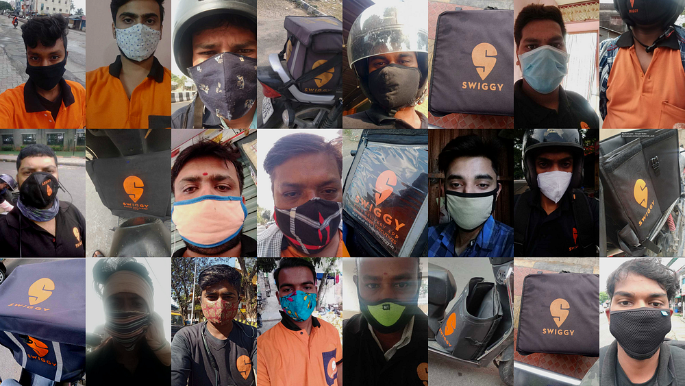

When Lockdown 1.0 was upon us in 2020 in India, the question on the mind of every Swiggy engineer or Data Scientist was, “How can we help our Delivery Partners (DP) and ensure their safety during this pandemic?”. To answer that question, Swiggy’s AI team proposed doing real-time mask detection using Computer Vision, which would encourage Delivery partners to wear masks to protect themselves and our customers during Swiggy deliveries. Soon, our Product team set forth a plan for implementing a self-audit check for mask compliance for our Delivery partners.

And within three weeks of the conceptualization of the idea, working together with our engineering teams, we were able to productionize a model for real-time mask detection. Following the successful launch of the mask compliance check, we were also able to include Gear compliance checks, namely Bag and T-shirts, to ensure our Delivery Partners are wearing Swiggy-authorized attire and carrying Swiggy bags.

## The Problem Definition

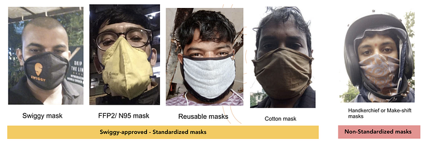
*Mask “type” — Standardized or Non-standardized masks*

What we have at hand is a classical object detection problem — For a given selfie of a person, we are to check if a person is wearing a mask _(classify if it is a face with a mask or not, along with the type of mask_) and to localize the mask (_where is the mask in the image_). This translates to identifying as one of the categories given below, along with localizing the region of a face (_with or without mask_) as** bounding box coordinates **_(top_left, bottom_right)_

- **No Mask Detected **— Person’s face detected without a mask
- **Mask Detected **— Person’s face detected with a mask
- **No Face Detected **— Background or other irrelevant selfies which do not have a face in focus

Later, this definition was updated to find whether the person is wearing a Swiggy approved standardized mask or not (like scarves/kerchiefs)

- **Mask_Type:** Standardized or Non-standardized mask

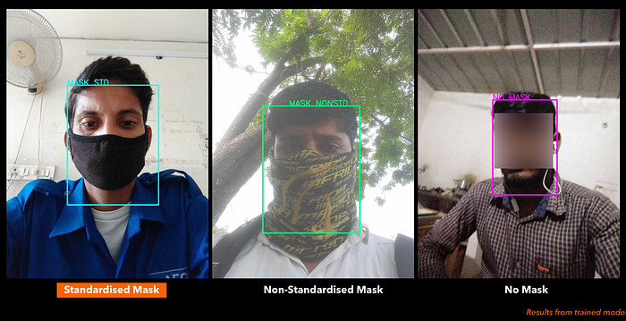

And when we extend this to our gear check, we can find whether they are wearing a Swiggy T-shirt or not for a given selfie and if they have a Swiggy Bag with them or not.

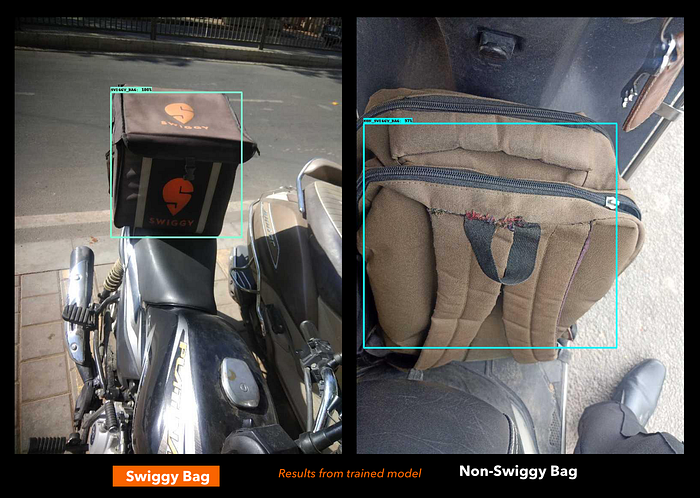

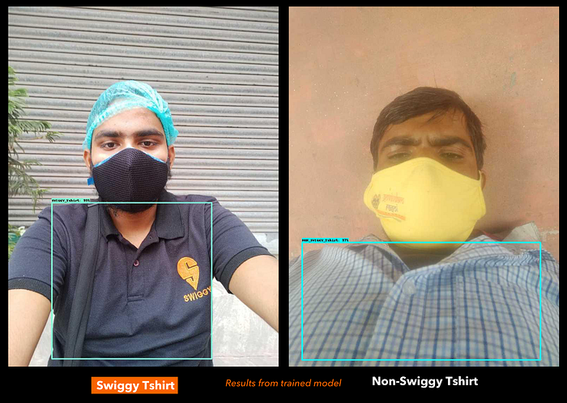

## “Good Enough for a V1!”

Our initial discussions with the Product team were about setting realistic expectations regarding the accuracy of the mask detection model since we were starting with a modest dataset with a shorter Go-to-Market period. The Product team had conducted an on-ground evaluation for mask compliance among Delivery Partners (_where our_ _restaurant partners were asked to take a picture of our DPs when they came to collect their deliveries_). The images from this exercise (around 3.7k) had a good portion of masked faces. We used images of Delivery Partners from our internal sources, ran them through a face detector (Dlib — CNN-based) to get annotated unmasked faces.

To include more masked faces, we also augmented the dataset with around 2k images from [RMFD](https://github.com/X-zhangyang/Real-World-Masked-Face-Dataset) — Real-world Masked Face Dataset, making it a total of 10k images for our V1 dataset. (_We annotated ~5k images with masked faces in a day or two using the VOTT annotation tool from Microsoft._ :))

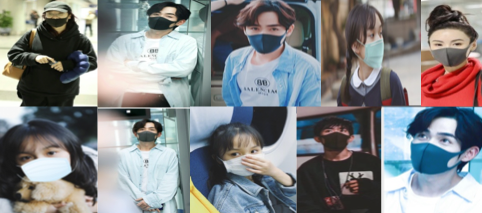
*RMFD images were used to augment the dataset*

The chunk of images from RMFD was mostly of Southeast Asians wearing masks which did not reflect the diversity of Indian skin tones. Nevertheless, as one of our Product Managers put it, “This was good enough for a V1”, since we were able to get an accuracy of **88%,** training the dataset based on a RetinaFace architecture. We were aware of the bias this model could bring, and we wanted to rectify it by curating a better dataset based on the ‘mask selfies’ from the mask check feature once launched. More about it later, but now, let’s look at the object detection model architecture.

## RetinaFace and Feature Pyramid Networks

When an object detection architecture is employed for detecting faces, we call it Face Detection. When we detect text as objects, we call it Text Detection. If we look under the hood of several State-of-The-Art models in Object Detection, we will find “Feature Pyramid Networks” at the heart of it.[ Feature Pyramid Networks](https://arxiv.org/pdf/1612.03144.pdf), or FPNs in short, introduced by FAIR in 2016, can have a customizable backbone — either a heavier model like ResNet or a model like MobileNet for faster inferencing using lesser FLOPs — and are easily modularizable based on the number of blocks and can help detect objects at multiple scales (For instance: an airplane in flight as compared to an airplane on the ground).

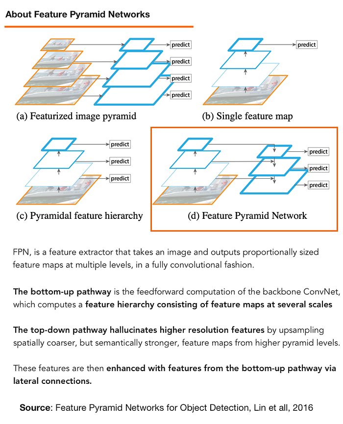

> Leveraging the pyramidal feature hierarchy of CNNs, **FPNs consists of three main components — A bottom-up backbone network, A top-down network, and lateral connections to connect them. **The bottom-up network creates feature maps at different scales, and the top-bottom network takes the last layer of the bottom-up network and upsamples it. Using lateral connections (think of it, like a backward connection), it merges the upsampled output of the top-down network, with feature maps from the corresponding layer from the Bottom-up network.

The intuition behind FPNs is to create rich feature maps for object detection, which have **both strong semantic value **from the upper layers of the Backbone/Bottom-up pathway merged with **fine-grained spatial (localization) features from the earlier layers of the network**.

As the network gets deeper, it starts losing localization features from an image but has higher semantic value. To augment these highly semantic feature maps, we need to “fuse” localization features from the previous layers to it. An FPN achieves this by way of a top-down network. In a top-down network, highly semantic feature maps are upsampled and fused with feature maps from previous layers from the bottom-up network via lateral connections. Doing so, we get rich feature maps that have both high semantic value as well as localization features, which help in Object Detection becoming more effective.

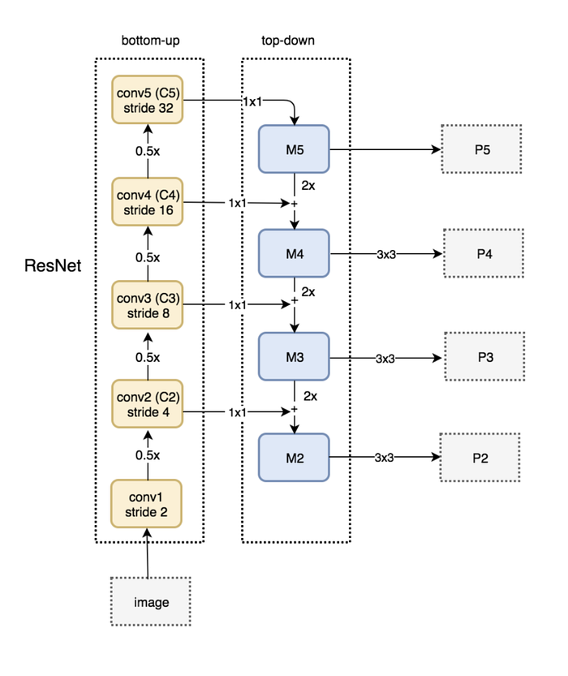

YoloV3 started using FPNs because of this design. [EAST](https://arxiv.org/pdf/1704.03155.pdf) text detector, a SoTA model for text detection, and RetinaFace, a SOTA model for dense face detection, use FPNs as the central aspect of their architecture. And it is for this very reason that we relied on RetinaFace to train our dataset for mask detection. [RetinaFace](https://github.com/deepinsight/insightface/tree/master/detection/RetinaFace) uses FPN and adds a context module that essentially tunes the model to find smaller faces in an image.

For the Backbone network, we chose MobileNet. Since the trained model has to be inferenced on CPUs, MobileNet provides faster inferencing time with its separable depthwise convolutions and 1x1 convolutions.

## Model Deployment and Productionization issues

We trained our first mask detection model on our V1 dataset, based on the RetinaFace implementation in MxNet. We decided to deploy using Dockers on our Swiggy managed Kubernetes cluster. With the inference code for our MxNet model, we used Flask as our WSGI server and Gunicorn to handle multi-threaded requests. The objective was to run a Docker-based MxNet Object detection app as quickly and smoothly as possible for CPU-based inferencing. To handle higher throughputs with a satisfactory p95 of 550ms, we also used MxNet compiled with MKL-DNN. MKL-DNN is a performance-enhancing library from Intel that provides optimized operators standard in CNN models, including Convolution, Dot Product, Pooling, Batch Normalization, and Activation, helping in the acceleration of Deep Learning inference on Intel CPUs.

> **_Pro-Tip: _**Network latency needs to be considered if the deployed model downloads images to be inferenced from an external link. We used connection pools to optimize the network latency since this adds to the response time of the API.

## Lemon, Lemonade, and more data

Though the initial version of the mask compliance product was designed to be a reminder for our Delivery partners to wear masks, the goal of the subsequent versions was to enforce a stricter check to ensure adherence. This would mean we would need a robust model that can generalize well across the given image distribution, with a higher True Positive Rate. With [Andrew Ng urging us to be more data-centric](https://www.youtube.com/watch?v=06-AZXmwHjo), we wanted to build a dataset with good coverage across different scenarios and consistency in annotation for better data quality.

As we started collecting “mask selfies” from Delivery Partners, we began curating our Ground Truth dataset. The data distribution included images from individual DPs across Morning/Noon/Evening/Night and Tier 1, Tier 2/3/4 cities. We in-housed our annotation for these images, relying on our efficient Ops teams to help us. We built an Annotation tool using PyQt5, which was more accessible and better suited for our Ops teams as they navigated annotations for the first time. To see that our annotators are on the same page as us, we had elaborate training sessions with the team. We also had annotation quizzes with the Ops team so that they have a better understanding of our requirements. We had a communication channel where their doubts and queries were resolved within an hour or two. And to make sure we had a lower error rate in annotations, we set up a maker-checker process for our annotations, building a twin tool for validating the annotations.

*Preview of the Annotation tool built, in-house*

## A fallacy in the model — Hand as a Mask

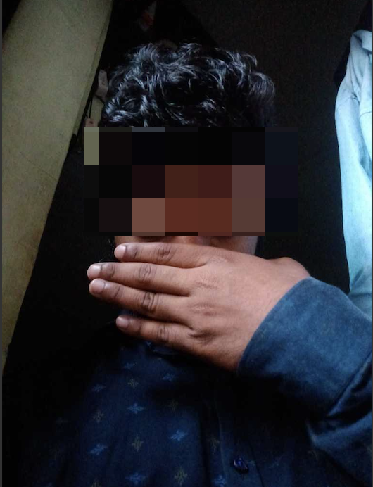
*An example of “hand as a mask” which could lead to false positives*

As we improved the accuracy of our model to 92% in V2, we faced an intriguing challenge, a fallacy in the model. Our field executives found a way to circumvent the model by using their hand as a mask. As shown in the picture, when a person covers their mouth with their hand, it was detected as a mask.

But why was this happening? Face with Mask detection works on facial occlusion. The Object Detection model looks for a facial structure, a person’s eyes, and checks if the nose and mouth are covered. Hence when a person occludes their nose and mouth with hand or other obstructions, the model falsely detects it as a mask.

Moreover, we needed a model with better precision to classify whether a given mask is a Standardized mask compared to a makeshift mask made using kerchiefs.

> Many different kinds of masks were not well represented in our dataset. Curating additional images manually will be a time-consuming task.We needed more negative samples like the image above to show that using “hand as a mask” should not be considered as a mask (NO_MASK)

To solve these discrepancies, we created a **Simulated dataset** from images of Delivery Partners (_taken during their onboarding_) by adding a mask or a hand to a given image. We took 16k images of Delivery Partners (f_aces with no mask_) and selected six different types of masks and four different types of hands (_including palm_) images. We used [remove.bg](http://remove.bg/) and image editing tools to remove the background of these masks and hand images.

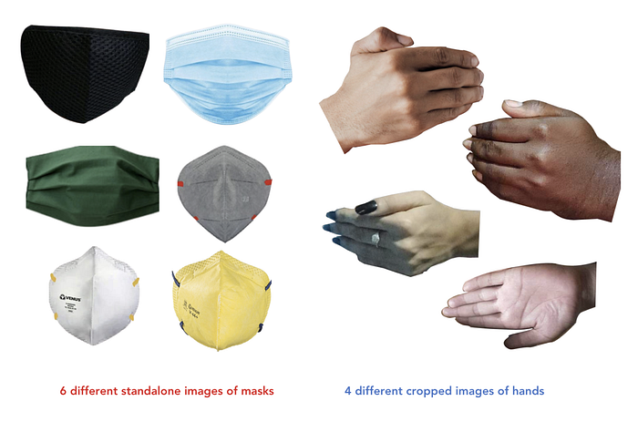

> Based on the facial landmarks from a CV-based Face Detection model, we created synthetic images by aligning a mask/hand image on a given face through a process called registration.

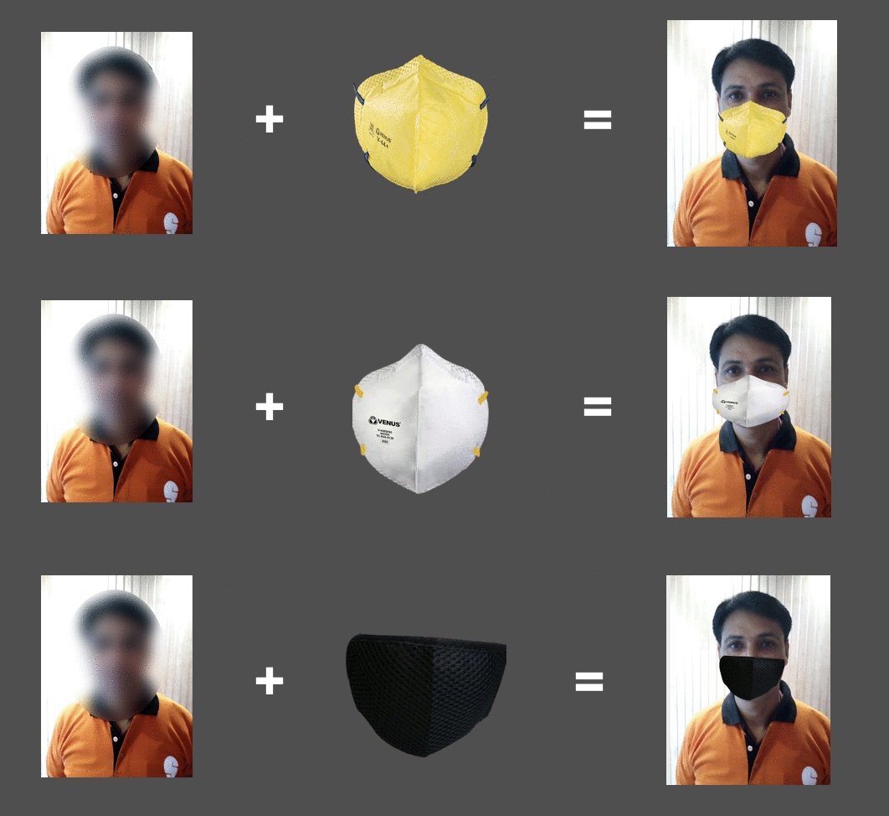

With better data coverage in our dataset and the recent improvement to onboard TensorFlow models (using Tensorflow serving as a sidecar), we started exploring other models with a better backbone for Object Detection and narrowed down on EfficientDet.

## EfficientDet and Improving accuracy

Google released [EfficientNet](https://arxiv.org/pdf/1905.11946.pdf) as a SoTA ImageNet classifier using a novel CNN model scaling based on three dimensions — Width, Depth, and Resolution. Width scaling means adding more feature maps per layer; Depth means adding more layers to the network (Ex: adding more layers to Resnet 18 scaling it to ResNet 50); Resolution scaling means increasing input image size (From 224x224 to 640x640).

> The intuition is that designing CNN architecture depends on these dimensions and they are chosen arbitrarily. Also, scaling only on one dimension (width or depth or resolution) increases the accuracy but plateaus soon with increasing FLOPs. Hence, the Google team uses compound scaling, scaling all three dimensions together, to design model architectures that are computationally efficient (fewer FLOPs) and guarantee better accuracy. _Note: FLOPs refers to Floating Point OPerations_

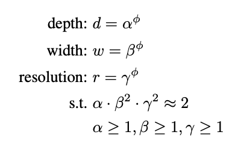

The key idea behind Compound Scaling is to balance the upsampling of width, depth, and resolution by scaling them with a constant ratio. This constant ratio is determined by the parameters 𝝰 (for scaling depth), 𝞫 (for scaling width) and 𝞬 (for scaling resolution) which are exponentiated by φ, which represents the increase in computational resources in a CNN.

FLOPs in a CNN are proportional to depth (d), width² (w²), resolution² (r²). i.e., Doubling the width or the resolution of a CNN increases the FLOPs in that CNN by 4x. So, if we are to increase the network by αᵠ,βᵠ and γᵠ times the depth, width and the resolution respectively, it would mean that FLOPs will proportionally increase by (α · β² · γ²)ᵠ

So, if we are to constrain the parameters — α,β, and γ — such that

> α · β² · γ² ≈ 2

Then, for any new φ, FLOPs will increase by 2ᵠ (_2 to the power of φ_). Based on this constraint and using a grid search for α, β, γ, and _φ _in an MNas-MobileNet based search space, the Google team was able to create a set of backbone architectures with increasing parameters, called as EfficientNets.

[EfficientDets](https://arxiv.org/pdf/1911.09070.pdf) use EfficientNets as their backbone network, as the bottom-up pathway, for its FPN architecture. Now, let’s look at the top-down pathway design of EfficientDets. After FPNs were started to be widely used, it was seen that the one-way directional flow inherently limited the top-down FPN.

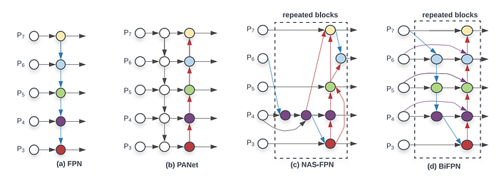
*Source: EfficientDet: Scalable and Efficient Object Detection, Tan et al. l*

To address that, [PANet](https://arxiv.org/pdf/1803.01534.pdf) added another bottom-up pathway after the top-down pathway. In contrast, NASNet used Neural Architecture Search to find a better way to fuse multi-scale features with the localization-heavy features from the lower layers.

Building on top of PANets, EfficientDet treats each bidirectional (top-down & bottom-up, excluding the backbone network) path as one feature network layer and repeats the same layer multiple times to enable more high-level feature fusion. Also, in each feature Bi-FPN layer, it adds cross-scale connections — an extra edge from the original input to output node if they are at the same level to fuse more features without adding much cost.

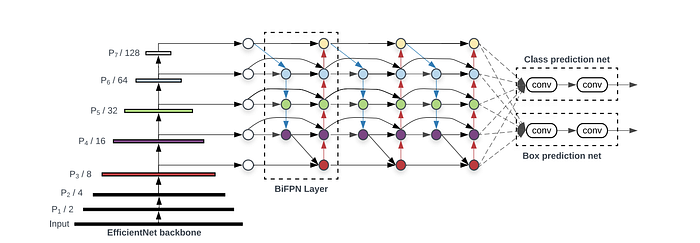
*EfficientDet Architecture*

## Last but not least — Sanity Check

Our Delivery Partners are hard-pressed for time, during deliveries which means they might not be able to take their mask selfies or t-shirt and bag images in ideal conditions. The images may be taken in poor lighting conditions (like under a harsh Sodium Vapour lamp), or the images could turn out to be blurry if their phone was not stable while taking the selfie.

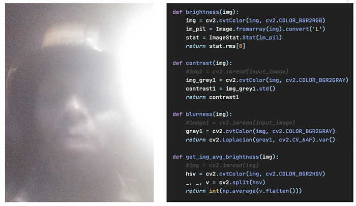
*Handling images with low-light conditions*

To filter out these noisy images and assess the input quality of the selfies sent for inferencing, it is essential to implement some CV-based functions to check the Brightness, Blurness/Sharpness using Laplacian filters and Contrast of an image, as shown above. These functions were later adapted for implementation in the Android app.

## Putting it all together

We annotated 80k images — 40k for mask detection, 20k for Swiggy bag detection, and the rest 20k for Swiggy attire detection. Using Tensorflow Object Detection API, we trained an EfficientDet-D1 model for mask detection along with the simulated dataset, which gave an accuracy of 94%. For Swiggy Bag and Swiggy T-shirt, Efficient-D0 models were trained respectively, each giving us an accuracy of around 93%–94%.

[_Data Augmentation_](https://www.tensorflow.org/tutorials/images/data_augmentation#random_transformations) methods like random crop, random brightness, and contrast, and random horizontal and vertical flips helped improve the generalization of the Object detection models, especially for simulating images taken in real-world conditions.

The future challenges include creating a simulated dataset that reflects the wear and tear of Swiggy bags/Swiggy T-shirts, reliably identifying if a helmet-wearing person (helmet-based face occlusion) is wearing a Standardized mask or not etc.

> A huge shoutout to our versatile MLOps Engineer, [Tejas Lodaya](https://medium.com/u/e9f786e7ee1a?source=post_page---user_mention--adf804b7b902---------------------------------------) ([https://www.linkedin.com/in/lodayatejas/](https://www.linkedin.com/in/lodayatejas/)) for profiling and deploying the above-mentioned Object Detection models using TensorFlow Serving and [Abhay Chaturvedi](https://www.linkedin.com/in/abhay-chaturvedi-0837a48b/) from our Data Science Platform team for productionizing the TensorFlow Object Detection models

---
**Tags:** Face Mask Detection · Mask Detection · Object Detection · Swiggy Data Science · Machine Learning
