# Reflecting on a year of generative AI at Swiggy: A brief review of achievements, learnings, and insights

In the past year, Swiggy has embarked on an ambitious journey into the realm of generative AI, aiming to integrate these techniques to enhance customer experience, boost productivity, improve automation and drive business value. Significant strides have been made in customizing AI models to meet specific needs, addressing challenges such as latency optimization and mitigating issues like hallucination through meticulous data curation and model refinement. Collaborations with prominent AI providers and internal innovation initiatives have expanded the horizons of generative AI at Swiggy, laying the foundation for future advancements. This blog offers a succinct overview of the ideas explored, initiatives prioritized, and the valuable insights gained during this transformative journey.

## Institutionalizing generative AI

In the first quarter of 2023, a dedicated generative AI task force was established, composed of members from Data Science, Engineering and the Strategy team. The primary objective of the task force was to understand the generative AI landscape, evangelize generative AI within Swiggy and work closely with business and functional leaders to drive adoption of generative AI. Over the past several months, we have spoken to over 30+ start-ups, founders, VC’s & big corporates building tools/ products in the generative AI space. We conducted internal workshops and hackathons to crowdsource ideas from across business units. Building upon the insights gained, generative AI was subsequently positioned as a focal point across the entire company.The results of these explorations have been encouraging and helped us uncover several themes and areas that can benefit non-trivially by the adoption of generative AI

## Exploring the Risks, Limitations, and Trade-offs involved in generative AI

Shipping generative AI comes with several risks and limitations that organizations need to consider:

- Customization and Contextualization: Generative AI models need to be tailored to specific contexts, such as vendor SOP docs or food catalogs, to align with in-house use cases effectively.
- Latency Considerations: Different applications have varying latency requirements, like search queries needing responses in around 100ms, while chatbots may tolerate up to 3 seconds. These requirements must be factored into the design and implementation of the AI models and APIs.
- Hallucination Mitigation: To prevent models from producing nonsensical results, they must be trained on sufficient, relevant, and noise-free data. Additionally, providing contextual information and constraints can help improve the quality of generated output.
- Data Security and Privacy: Ensuring that sensitive information, such as personally identifiable information (PII), is masked or protected from unauthorized access or disclosure.
- Guardrails for user input: Implementing measures to prevent queries that are out of context, harmful, or outside the model’s domain, which should be detailed in the product requirements document (PRD).
- Data Usage Agreement: Establishing agreements with service providers for OpenAI API to ensure that data used in the AI models is not used for training purposes without permission.
- Explainability of model output: Understanding how and why generative AI models make certain decisions can be difficult, which may impact their trustworthiness and explainability.

## Framework for selecting generative AI ideas

We used a Demand-Risk framework shown in Figure 1 below, for prioritizing generative AI ideas. The graph divides all the use cases into 4 quadrants of varying levels of demand and risk. Demand is defined as whether there is real and sustainable need for this kind of idea to drive business value. Risk quantifies how likely and how damaging are the possibility of inaccuracies/errors being generated. We mapped all the potential use cases onto the demand-risk chart, as shown below. Use cases in the top left will develop faster and have greater chances of success and adoption. These include initiatives aimed at improving the food catalog coverage and efforts on review summarization to drive customer engagement. The top right quadrant initiatives, although are in demand, come with inherent risks. These include resolution focussed chatbot, initiatives for process automation and mining Biz Intelligence. Ideas on the bottom left quadrant, although inherently low in risks, have lower demand than the rest.

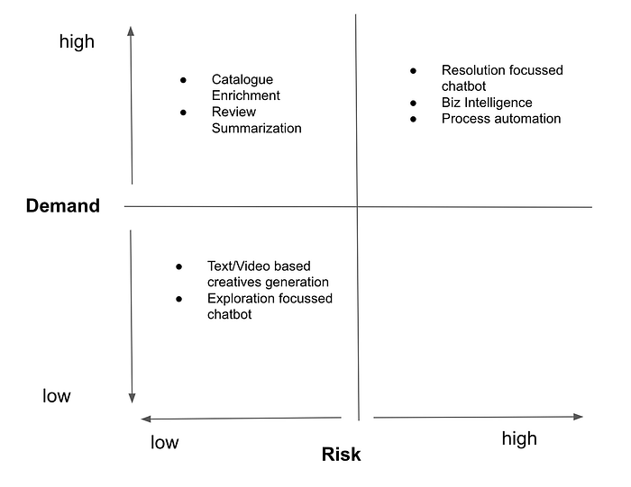

Figure 1: Demand-Risk framework implemented for filtering actionable generative AI ideas ([https://hbr.org/2023/03/a-framework-for-picking-the-right-generative-ai-project](https://hbr.org/2023/03/a-framework-for-picking-the-right-generative-ai-project))

We categorized all the prioritized ideas into 2 broad categories:

- Discovery & Search
- Automation

In the sections below each of the initiatives will be discussed in detail.

## Discovery & Search

1. Catalog Enrichment–image based

Food imagery significantly influences user perception and ordering behavior. Providing appealing and accurate images of dishes enhances user engagement and conversion rates. To expand image coverage in the food catalog, we integrated the Stable Diffusion pipeline and customized it for Swiggy’s needs. We explored three approaches for food image generation: Text2Img, Img2Img, Image blending. While Text2Image is effective for standard items like burgers and pizza, it struggles with Indian dishes. Challenges with off-the-shelf Text2Img models include determining the correct prompt, inconsistent generation even with the same prompt, and images that, while semantically accurate, lack realism. While Text2Image can yield good results with multiple attempts, it is challenging to scale to Swiggy’s needs due to its trial-and-error nature (refer to Figure 2 for sample results). Image2Image, another approach we tested, showed slight improvement but faced similar challenges as Text2Image. To address the need for scalable, stylistically consistent image generation, we developed an image blending pipeline. This pipeline combines the foreground image of the dish with a background that matches the restaurant’s style, conditioned on the input prompt. The image blending pipeline, illustrated in Figure 3, and sample results in Figure 4, provided images of reasonable quality and accuracy. However, these methods did not perform well for several categories of Indian dishes.

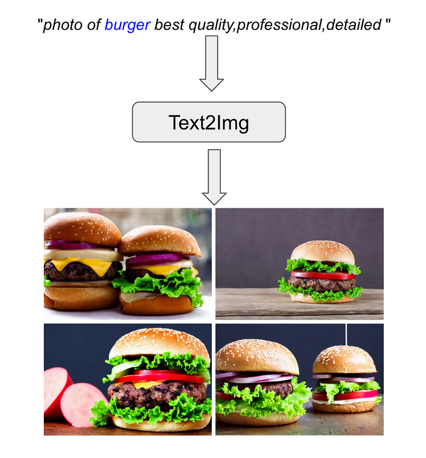

Figure 2: Sample results from Text2Img pipeline

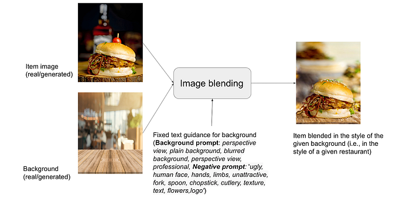

Figure 3: Schematic representing the image blending architecture

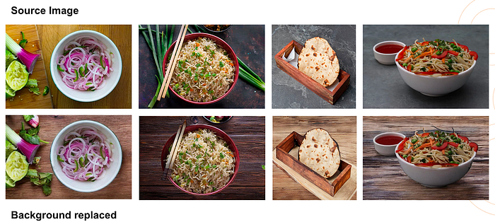

Figure 4: Samples of images generated via the image blending pipeline (original image on top, blended image in the bottom)

The StableDiffusion (SD) model (v1.5) was fine-tuned using LoRA to enhance the generation quality specifically for Indian dishes such as dosa, curry, Indian breads, biryani, and others. A custom LoRA-based SD pipeline was trained for various classes of dish families, with each class representing a group of dishes (e.g., biryani, fried rice, rice, formed a visually similar class.). The trained LoRA checkpoints were then implemented in both Text2Image and Img2Img pipelines. The fine-tuned model, when applied to catalog data, produces visually improved Indian dishes (refer to Figure 5) and adheres more closely to internal standards, such as generating single-item images with the food item centered in the image.

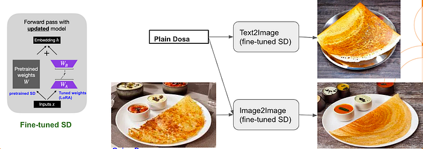

Figure 5: Fine tuned LoRA architecture generated images

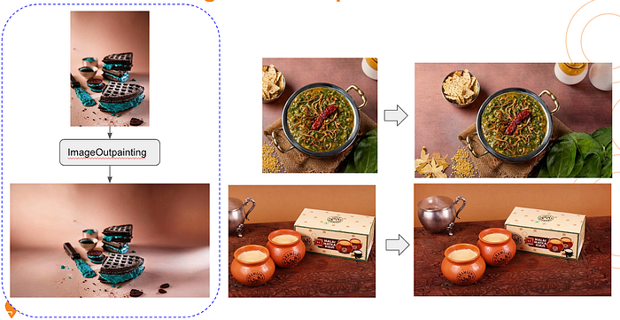

Figure 6: Aspect ratio corrected images via image inpainting pipeline

Another image related use case where generative AI was successfully used involved adjusting the aspect ratio of thumbnail images (e.g., from 1:1 to 1.75:1) to fit the desired aspect ratio of the banner without distorting the images. To achieve this, a custom, in-house out-painting pipeline was developed. The pipeline successfully corrects the aspect ratio of thumbnail images. Examples of the corrected images can be seen in Figure 6.

2. Catalog Enrichment–text based

Providing descriptions for the dish names in the menu enables customers to make informed choices regarding what to order. Similar to image generation efforts, we deployed a customized generative AI pipeline for increasing the coverage of item descriptions for the dishes on the catalog (see Figure 7 below). Descriptions for popular items are easier to generate compared to more nuanced, regional, indian dishes. To better adapt the model, the text generation pipeline was augmented with a config module that provides additional metadata for the dishes, like an internal Swiggy taxonomy for dish mapping and also examples of description across dish families. A human agent in the loop, sanity checks the descriptions and provides feedback for improvement if necessary. Samples of generated descriptions are given in Figure 8.

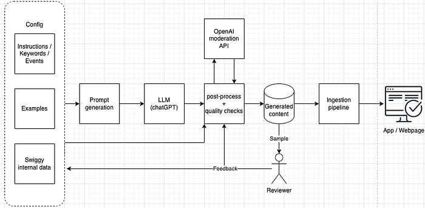

Figure 7: Pipeline for generation of text descriptions

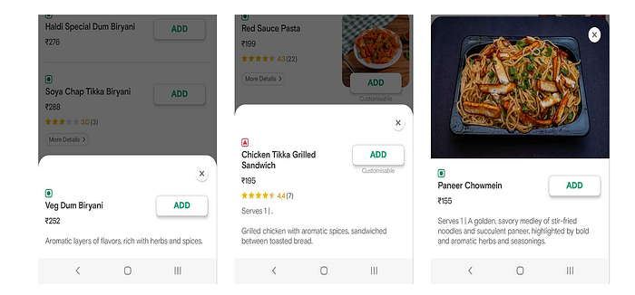

Figure 8: Samples of item description generated for various Indian dishes

3.Review Summarization

Introducing consumer review summaries for restaurants and dishes aims to empower customers to make informed choices, foster trust, and encourage them to explore new culinary experiences. The objective is to generate succinct 2–3 line summaries from a collection of reviews, which will be presented in a dedicated widget on the menu page (see Figure 9). Ratings and reviews are pivotal in establishing trust, influencing various trust-building factors. We leveraged GPT4 with customized prompts for generating review summaries and implemented an internal evaluation metric to establish the quality/customer acceptability of the reviews. In an A/B test involving over 2K restaurants, we observed improvements in funnel metrics, and reductions in cancellations and claims, attributed to enhanced expectation management. The results so far are encouraging and we are currently scaling this product to a larger corpus of restaurants pan India.

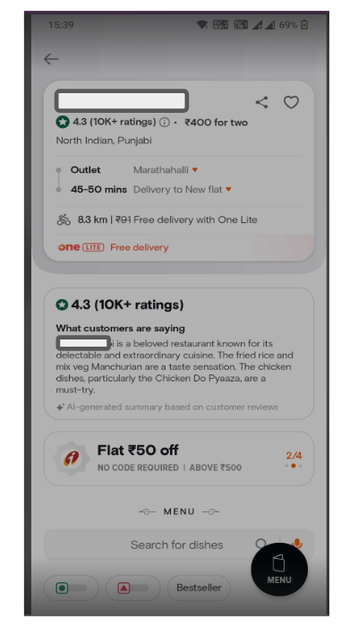

Figure 9: Sample of generative AI based summary

4. Content Flywheel

Users face the problem of too many choices while ordering on Swiggy. The average time spent is **~**10–20 mins to select items from a particular restaurant. Therefore highlighting the top X items on the menu with enticing videos should avoid decision fatigue, reduce menu drop-offs and better conversions. A sample video shown in Figure 10 is generated from a collage of social media images of the brand. The images are processed via an internal Stable Diffusion based pipeline that removes texts and other artifacts from the images and creates a short video. After numerous iterations we found 30-second generative AI based videos were the ideal choice for driving customer engagement and conversions. Hence we are doubling down on AI content, and plan to scale the offering to more brands on the Swiggy platform.

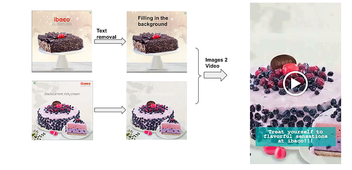

Figure 10: Generation of video from raw images (Video link below)

5.Neural Search

The goal of the neural search model is to enhance the search experience on Swiggy by enabling users to search in a natural language format, reducing the complexity of finding relevant dishes. This involves understanding the intent behind customer queries and serving appropriate results, ultimately improving customer trust and satisfaction. The proposed solution includes building capabilities for natural language understanding of conversational queries, which goes beyond traditional keyword-based search (see Figure 11). Swiggy’s vast database of dish items from numerous restaurants across India poses a significant challenge, considering the variety of potential search queries involved. The current search capabilities struggle with understanding the nuances of natural language, especially for queries with broader or multiple intents. To overcome these challenges, language models are employed to encode query context, better understand intent, and retrieve relevant dishes in real-time, leveraging natural language understanding (NLU) capabilities to disambiguate customer queries and provide accurate results. We had deployed an initial version of the neural search to a small population of swiggy users. Based on the feedback and results we are pivoting towards an improved version of the model to be released by the end of Q1 2024. A more detailed view of the neural search efforts will be published on Swiggy Bytes shortly

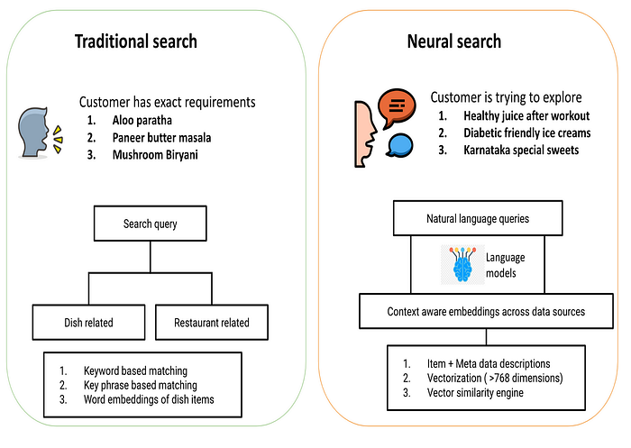

Figure 11: Comparison of neural search and traditional search

## Automation

Restaurant Partner Support

The Swiggy Partner App’s Help Centre contains FAQs addressing common queries from vendors regarding the operational management of their stores. Restaurant owners need quick answers to their questions like ‘How do I set up a new outlet’, ‘How do I mark an item out of stock’, ‘How do customer claims affect my ratings’, etc. However, these FAQs are often dense and time-consuming to navigate, hindering vendors from finding complete solutions to their problems efficiently. To streamline this process, an LLM powered bot was developed to allow users to input their queries directly, fetching relevant answers without the need for manual search. Figure 12 depicts the RAG pipeline we have implemented to address restaurant partner queries. The LLM-based bot improves user experience by providing conversational Q&A and reduces the workload on support teams. The implementation also allows responses in both Hindi and English through WhatsApp, addressing a wide range of questions based on standard operating procedure (SOP) documents.

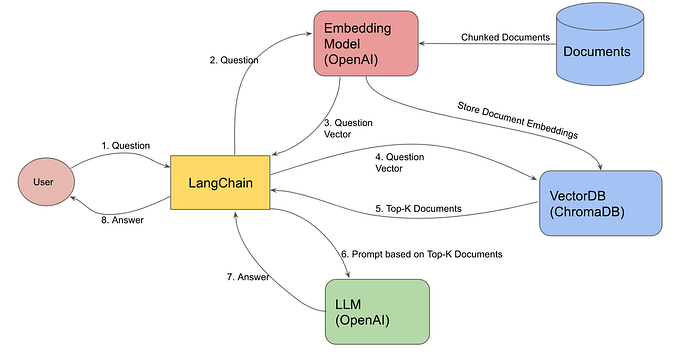

Figure 12: Solution flow for fetching restaurant partner query via a RAG pipeline

We have deployed this feature to a subset of restaurant partners and the initial results look promising. We will be adding more features to the bot and rolling out to a larger audience of vendors.

## Platformizing generative AI capabilities

Platformizing generative AI was another area of research, iterations and experiments that would enable shipping of the various use cases built by the team. The initiative involves developing lightweight tooling and infrastructure to enable interoperability between in-house use cases and external generative AI APIs. The Data Science Platform (DSP) team created a middle layer for generative AI, allowing the onboarding of native Python code and ML models, integration with vector databases, and GenAI API integration (See Figure 13). This platform facilitates integration with existing DSP stacks for model observability, versioning, logging, and security governance, leading to savings in repetitive work, faster execution, and smoother integration. The middle layer for generative AI APIs abstracts out generative AI-specific elements from the engineering team, focusing their efforts on core business logic. It provides a central platform for all generative AI-specific recommendations and knowledge base, ensuring consistency and reducing the chances of misses. The middle layer also ensures central governance, protects against violations such as exposing confidential information, and implements performance optimizations to reduce latency.

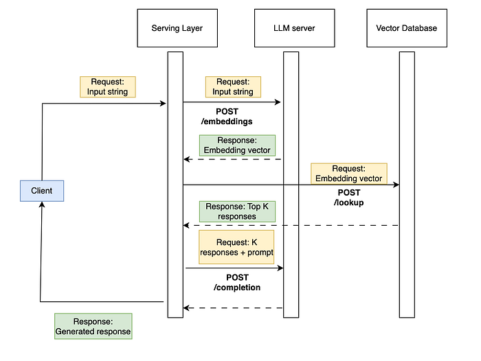

Figure 13: Middle layer for enablement of generative AI model deployment

## Lessons learnt

- It took us about 3–4 months of iterations and experiments to land on potentially high ROI items. Ability to conserve bandwidth by limiting how many inbounds you entertain (both internal and external) will enable focusing on the right projects.
- Setting expectations with stakeholders is necessary to ensure continued sponsorship of generative AI projects. The ideas/demos that ‘wow’ the audience in a hackathon do not necessarily translate to real world products that generate value.
- For non real-time use cases GPT is an ideal candidate considering the tradeoff between cost and quality of results. It is almost impossible to beat GPT with custom models. Customized LLM is the better option for real time use cases, that meets quality requirements for given latencies
- Hallucination was a real problem; Lots of internal-user testing & guardrailing was needed to ensure sanity of results.
- Using GPT directly from OpenAI quickly led to governance difficulties. Moved to third party API.
- We didn’t see a lot of pull for customer-facing conversational interfaces (‘chatbot for food ordering / table reservations’)
- Patience and pragmatism are needed across the board as many of the generative AI models will require time and multiple iterations to ensure sustained ROI.

## Where do we go from here

The next steps in our generative AI efforts will involve building on successful catalog-related use cases, such as image and text-description generation, and AI-generated review summaries which have shown promise. We have also made progress in developing lightweight tooling for generative AI ops and have multiple use cases deployed using Python wrapped on third party APIs as Data Science Platform endpoints, with more in the pipeline. Neural search model is undergoing refinement following initial challenges, and we are leveraging its assets in other areas like Search intelligence and Neural search for Swiggy Instamart. We will double down on the content track in 2024. Additionally, our WhatsApp bot for restaurant owners has been reasonably successful and we are working on ways to increase adoption among the users.

_This has been an all-around team effort with contributions from every function across Swiggy. Special thanks to the key contributors on this effort: _[_Jairaj Sathyanarayana_](https://www.linkedin.com/in/jairajs/)_, _[_Madhusudhan Rao_](https://www.linkedin.com/in/madhusudhanrao/)_, _[_Shyam Adhikari_](https://www.linkedin.com/in/shyam-adhikari-0510b220/)_, _[_Sangeeth Reddy_](https://www.linkedin.com/in/sangeethreddy/)_, _[_Rutvik Vijjali_](https://www.linkedin.com/in/rutvik-vijjali-338410155/)_, _[_Meghana Negi_](https://www.linkedin.com/in/meghana-negi/)_, _[_Abhinav Ganesan_](https://www.linkedin.com/in/abhinav-ganesan/)_, _[_Sagar Jounkani_](https://www.linkedin.com/in/sagar-jounkani/)_, _[_Raj Jha_](https://www.linkedin.com/in/raj-jha/)_, _[_Aditya Kiran_](https://www.linkedin.com/in/aditya-kiran-42918968/)_, _[_Srinivas Nagamalla_](https://www.linkedin.com/in/srinivas-n-54a6b98/)_, _[_Shri Nath Agrawal_](https://www.linkedin.com/in/shrinath-agarwal-9212328b/)_, _[_Abhishek Bose_](https://www.linkedin.com/in/abhishekbose550/)_, _[_Abinash Sahoo_](https://www.linkedin.com/in/abinash-sahoo/)_, _[_Vidhya S_](https://www.linkedin.com/in/vidseeth/)_, _[_Priyanka Chandak_](https://www.linkedin.com/in/priyankachandak/)_ & _[_Siddardha Garimella_](https://www.linkedin.com/in/gsiddardha/)_._

---
**Tags:** Generative Ai Tools · Gpt · Stable Diffusion · Fine Tuning · Swiggy Data Science
