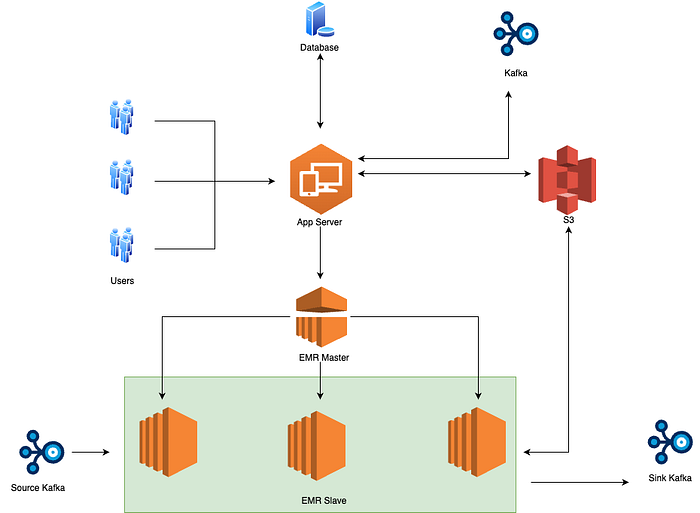
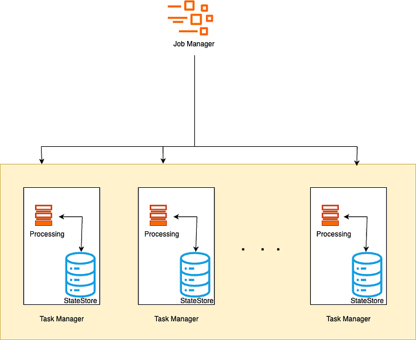
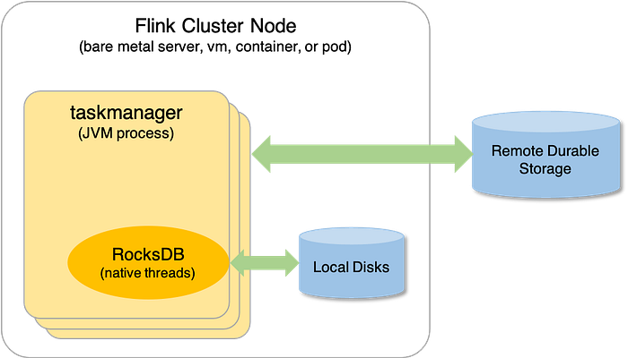

# Rill State Implementation

## Introduction

Swiggy, as a data-driven company, relies on a **reliable, scalable, and evolving platform for real-time data processing**. This capability is crucial for swift, data-driven decisions that improve user experience and operational efficiency, serving critical needs across analytics and data science teams.

**Rill — The Network of Streams — is Swiggy’s in-house streaming analytics platform** designed to address these real-time requirements. Rill makes streaming analytics accessible to both technical and non-technical users, supporting **SQL-based queries for streamlined event stream processing** and **custom code for more complex, low-level logic**. Users can easily configure pipelines to define data sources and output destinations.

Rill currently powers a variety of critical applications, including:

- **Real-time monitoring and alerting**
- **Populating real-time features for Machine Learning (ML) models**
- **Facilitating hyper-local decision-making** at both the ground and application layers.

This robust platform handles diverse use cases, from fraud detection and profane word analysis to processing clickstream data and powering real-time alerting systems.

*Rill Architecture*

Users interact with App Server of Rill which interacts with Database for storing metadata of the users’ pipelines along with S3 for storing artifacts related to each user pipeline. App Server also connects to Kafka for queuing notifications which are further sent to pipeline owners in case of failure/termination of their pipeline. Rill launches its Flink pipelines on YARN with the help of EMR which is responsible for processing of data received from Kafka and emitting the processed data back to Sink Kafka. Rill has also started supporting Delta as source along with kafka and Elastic Cache and Delta as Sink along with Kafka.

## Tech Stack behind Rill

Rill is built on top of Apache Flink.. RILL currently supports reading from both Kafka and Delta Tables (S3), and writing to Kafka, Delta Tables, and Redis (Elasticache/Valkey.) The platform is implemented in Java. Rill pipelines are deployed on Hadoop [YARN](https://hadoop.apache.org/docs/current/hadoop-yarn/hadoop-yarn-site/YARN.html) using a managed service by AWS called EMR.

** Rill currently uses Apache Flink 1.16.1, hence supports all the SQL and Dataset APIs as supported by Flink 1.16.1. We have support for all abstractions over Flink’s Dataset API.

## Challenges

Most of the users are comfortable writing SQL over Kafka topics to process their data. However in some cases, this SQL-like abstraction on stream is not flexible enough. For example,

1. one current limitation with SQL usage of Rill is users cannot process data that requires aggregation over more than 24 hours of data.
2. Rill SQL also doesn’t support [Interval left Joins](https://nightlies.apache.org/flink/flink-docs-master/docs/dev/datastream/operators/joining/#interval-join), however many use cases require historical data (> 24 hours) to process current records and that too in real time.
3. Some of the use cases include aggregation over the last 2 days (or more), joining multiple datastreams with a join window of a few minutes, hours or days. These kinds of use cases are very common in an e-commerce industry like Swiggy.

For such exceptions, users have to choose No SQL route for supporting complex transformations. and one of the known limitation with SQL usage of Rill is users cannot do processing on data which require aggregation over more than 24 hours of data.

By default, RILL supports windowing up to 1 day, with the option to extend to 3 days in certain cases, though this comes with some resource constraints. This limitation is due to RILL’s reliance on Kafka, where most Kafka topics have a retention period of up to 3 days. Additionally, if users wish to store data for longer periods, they will require more resources — such as memory and processing cores to efficiently handle and process the larger datasets with SQL as we cannot do any customisation on how SQL handles these windows.

Hence there was a need to have some mechanism where we can support larger and longer windows to support most of these use cases.

The challenges with these use cases primarily revolve around managing large amounts of data in memory. When storing such data in memory isn’t feasible, the question arises of whether there’s a mechanism to store it locally and retrieve it as needed. Additionally, ensuring the reliability and fault tolerance of this stored data is crucial, especially since pipelines are susceptible to failure. Upon failure, there must be a system in place to reintroduce the data back into the pipeline, ensuring it can be accessed and processed when required.

## How RILL solved the longer lookback Window Problem?

These challenges prompted the RILL team to explore built-in Flink functionalities that could help address the problem, specifically Flink’s State Backend. The larger windows for storing historical data can essentially be viewed as the state of a RILL pipeline, which would be used to process incoming data based on that state.

RILL already utilizes the RocksDBStateBackend for checkpointing and savepointing, so the team investigated how RocksDB could be leveraged to store the intermittent state of a RILL pipeline. Since RocksDB is tightly integrated with Flink and designed for reliability in Flink pipelines, it became the preferred choice due to its key-value nature, which aligns well with RILL’s state storage requirements.

One of the most critical aspects of this challenge, as mentioned earlier, is ensuring persistence and fault tolerance so that, in the event of a pipeline failure, we can resume from the exact point where we left off. The solution was to include the intermediate state as part of our checkpointing and savepointing process. Since we are already storing checkpoints and savepoints on S3, the idea was to extend this functionality to capture and persist the intermediate state of the pipeline, ensuring that recovery is seamless and the pipeline can reliably restart from its last successful state.

Flink provided the solution for this challenge. Whenever a state is created, it is automatically committed to S3 during periodic checkpointing and savepointing. This ensures that the state we maintain is both reliable and fault-tolerant, as it is consistently saved and can be restored in the event of a failure, allowing the pipeline to resume seamlessly from where it left off.

In our case, most use cases involved aggregating data over several weeks or even months. To handle this, we decided to convert our datastream (the continuous data read from Kafka) into a keyed stream. This means we partitioned the datastream based on a key, typically a column from the datastream. By doing so, we can maintain a separate state for each key, allowing us to process new records according to the key they belong to while referencing the historical state of that key, which has been accumulated over weeks or months. This approach enables more effective long-term aggregation and state management.

## Features of the State provided by Flink

1. We can have a record level TTL.
2. They can be local to a key or can be broadcasted over all the executors.
3. We can have Timers set up on record level i.e. if you want to perform some activity prior to expiring your record, this can be easily done or if you want to perform some action post some time, you can easily leverage onTimer functionality,
4. The state can be of various types depending upon the use case: ListState, ValueState, MapState, AggregationState and ReducingState.
5. Decide when to clean up the state.

Since this state gets committed along with the checkpointing, in case of failures when you restart your pipeline, the state automatically gets restored and hence this state also becomes fault tolerant in nature.

This state is first stored locally in memory in the form of Key Value and when your memory is not capable of handling more data then spillage happens, this state is being written to disk and this state is periodically also being written to S3 on checkpointing and savepointing (this interval is configurable).

Let us understand it with the help of a simple use case:

Let suppose the user wants to count the number of orders made by a customer in the last 3 weeks in near real time. In this case for sure the user cannot leverage standard windows as they are at max supported for 3 days. Hence users will need to use State support provided by RILL for longer lookback. In this case your datastream will be partitioned or keyed by your customer_id and hence now you have one state for every customer in the last 3 weeks.

We will use MapState for this use case which will store entries for every time this particular customer orders in the last 3 weeks. Map will store timestamp of the event as the key and number of order for the current time as value. Whenever this customer orders, we will put one entry into the MapState and process all the entries of this map and create one cumulative count of records by summing map entries and sending it as an output. This way we will have the last 3 weeks of aggregated data for every customer.

Now there might arise a question: why aren’t we directly storing cumulative count into the state instead of a single entry every time a customer orders, this is because we also want to expire this state every 3 weeks and hence there is a need to store a single entry.

There might also arise one more question, why are we storing this in a MapState, this can also be done in a ValueState to a ListState which is true, users can choose the state depending on their requirement. We are using MapState here because we also wanted to store the timestamp for every record.

## Trade Offs

- Now we will need to configure more resources for managing and storing the State.
- Checkpointing size will increase as it will now store state as well.
- In rare cases if checkpointing timeout interval crosses, checkpointing might fail for that instance. This might happen in case of network latency.

## Acknowledgements

Thank you Soumya Simanta for guidance in completing this implementation and Thank you Neha for your involvement in the development of the feature.

---
**Tags:** Stream Processing · Flink · Flink Streaming · State Management · Flink State
