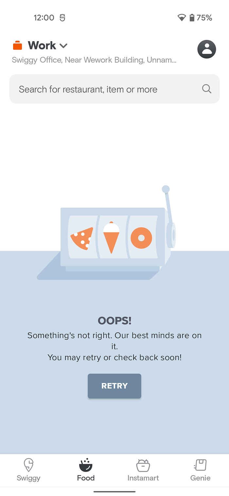

# #BehindTheBug — Learning from our mistakes

Mistakes happen. What is important is how we learn from it. At Swiggy, when it comes to managing and maintaining our tech systems, we follow the same principle. The RCA (root cause analysis) process is an established technique to understand the issue faced and problem solves it. The essence of the process is to learn from it so that it does not happen again, and also to solve the real cause rather than the symptoms.

In this blog series #BehindTheBug, we will be sharing some of the issues we have faced and how we did the RCA process for the same. In this first introductory blog, we will share the framework we use for this and how we manage this as Technical Program Managers.

### “Houston, we have a problem”

It’s 7 PM on a Saturday evening in Pune. Pooja has just received a call from her friends, Sheetal and Radhika. They are coming over to visit in half an hour. She is excited but also nervous to host her friends in her new home. She wants everything to be perfect. As she is busy cleaning up the place, she quickly decides to order snacks and sweets from the famous mithai shop close by. She opens the Swiggy app, eager to order, but alas!

*“OOPS! Something’s not right. Our best minds are on it”*

_“OOPS! Something’s not right. Our best minds are on it”_

And this message is true!

When any tech issue arises, messages flood into our internal communication channel. This channel has tech leads, architects, on-call leaders, and engineers in it. The on-call folks, architects, and engineers jump in, call for a meeting, and examine the dashboards, metrics, and logs. Everyone is keen on finding out the cause of the issue and resolving it as soon as possible. The environment is nearly warlike, thus we refer to the channel as a “tech-war room” with the goal of providing convenience to the customers.

Chances are that we are aware of something amiss much before and the team is actively working on solving it.

### So, Are all issues treated similarly?

No! For instance, restaurant owners are unable to add an item, the monitoring dashboard is down, and services going down, all can be called issues. Therefore we have established a guideline comprising order loss, revenue impact, customer agent impact, and many additional factors to assess the severity of the issues. A high severity issue (S1) is given priority in comparison to other issues (S2, S3). We have automated our process so that Swiggsters can create a JIRA ticket for S1 issues by merely sending an email. This helps us move fast and break the barriers. Technical Program Managers (TPMs) are primarily engaged in S1 issues.

### Ok, something happened. It was then fixed. Now what?

At Swiggy, we pride ourselves on delivering convenience and being a dependable service. So, when a tech issue happens, we know that we have broken our promise to the customer. Immediately after the issue is fixed, the team gets down to discussing the details which funnel into the RCA and an owner is assigned. This is not a time to relax that the job was done or point fingers, but rather a collective moment to reflect and learn. The goal of RCA is not to treat the symptoms but to address the exact cause. This ensures that when that cause is removed, it prevents undesirable effects from occurring again.

RCA is a collaborative process to understand the issue, and not a process to identify the culprit. So, the process is designed to remove judgment on individuals and rather engage in problem-solving.

### What is the RCA Process at Swiggy?

To get started with the process, we’ve created an RCA template. The sections of the template are as follows:

1. **Incident description.**
2. **Business Impact and severity of the incident.  
**_The business impact such as Order loss, Canceled orders, etc._
3. **The blast radius of the incident.  
**_For e.g If service A has two dependent services named B and C, then both B and C will be affected if service A goes down._
4. **Timeline. The timeline should describe:  
**_- Sequence and time of events that led to the incident.  
- Detailed steps that we took to address the problem.  
- Timeline of when the system was restored to the normal state._
5. **Identify root cause/s using the “5 Why” framework.  
** _The 5 Whys method encourages the team to keep asking the correct whys until the root cause of the problem is identified. Read _[**_this_**](https://kanbanize.com/lean-management/improvement/5-whys-analysis-tool)_ to get more ideas about the 5 Whys framework._
6. **Identify action items that need to be addressed and give an ETA for each one.**

The RCA owner owns the document and when it is ready, he/she signs up for AOH (Architect Office Hours) meeting where all the architects and senior engineers review the RCA document. In the meeting, we discuss, debate, and list down the action items which are necessary to prevent the incident from occurring again. Each action item has been categorized into three categories, P0 has the highest priority and requires completion in two weeks.

### RCA Management Practices

Multiple services go down sometimes, and the TPM’s responsibility is to follow up with service owners to ensure that all necessary information is provided for the RCA. To keep track of the action times we use JIRA extensively. We automate reminders in JIRA and send reminders to the owners of the action item that is being delayed. By doing this, we ensure that the action items are completed on schedule.

_We have a saying _**_“Never stop learning because RCAs never stop teaching”_**

Each RCA teaches us something new. We capture key learnings from the RCA and communicate these learnings with the engineering team so they can learn anti-patterns and best practices that they can use in their day-to-day work. And now, in this series of blogs, we will share these learnings with all of you. **Stay tuned!**

---
**Tags:** Swiggy Engineering · Rca · Behind The Scenes · Behind The Bug · Learning
