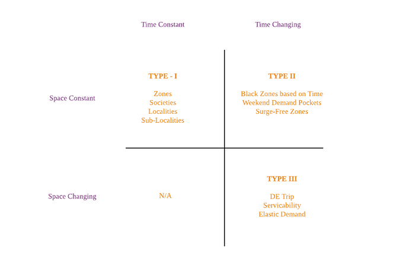
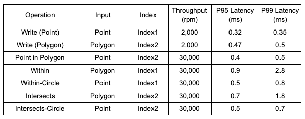
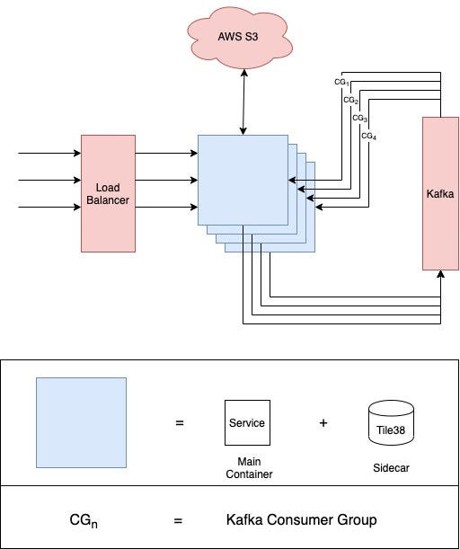

# Running Geo Queries At Scale

_It was the middle of a simmering Tuesday afternoon, in May. There had been quite a few brilliant pitches over that brainstorming session. A few of them, while exceptional, had to be dropped or de-prioritized in the interest of the majority, but there was one that hit the right chord with every single person in the room. Building a platform to leverage Swiggy’s Geospatial data and unearth a plethora of products._

OK. That didn’t happen. Or maybe it did and I wasn’t there. But I promise this is the only piece of (low quality) fiction you will find in this blog. Only facts and opinions from here on. While the rest of it is fictional, the idea presented in this excerpt has some significance — _‘_**_How critical it is for a hyperlocal company like Swiggy to have a charter catering to Geospatial products!_**_’_

While the Geospatial charter offers multiple services/platforms to serve different business use cases, the main focus of this blog is around a platform that can answer questions like ‘which restaurants are near me?’, or ‘which customers are ordering from a given locality?’, to name a few. More business use cases will become evident as you read along.

From a technical standpoint, this blog will talk about

- One of the building blocks of our Geospatial charter — a platform that offers the ability to run Geospatial queries on large datasets.
- An in-depth analysis of design decisions that were taken
- Various technologies evaluated along the way and the justifications behind our choices

I am going to break down the whole journey into questions. The answers to these questions determined our next steps.

### Question 1 — What are the business use cases that can be served by this platform?

This was the requirement gathering phase. To build the platform, we needed to understand what was required out of it. Some of the answers were:

1. **Identify customers living in the same residential complex**: This would be an important piece of information to optimize logistics and ensure a consistent experience for customers within the same residential complex.
2. **Find all Delivery Partners in a given area**: An important metric to determine how many orders can Swiggy fulfil at a given point of time.
3. **Find whether a customer lives in a locality where Swiggy operates: **When a user opens Swiggy, this information would be useful to show appropriate messaging and orchestrate user experience.
4. **Find restaurants near a customer in terms of distance: **This helps filtering out restaurants that are far away from the customer and cannot be delivered from.

We translated these instances to the following queries:

1. Find objects that are located in a polygon (see [GeoJson Specification](https://en.wikipedia.org/wiki/GeoJSON))
2. Identify which polygon does an object lie in
3. Find all objects of a kind near a given location
4. Check if two polygons intersect each other

### Question 2 — What kind of data will we be dealing with?

We categorized our data into 3 categories, based on whether they changed with time or space.

**Type-I:** These entities don’t change with time and their coordinates also remain the same. Examples: service zones, societies.

**Type-II: **These are entities like Black Zones, Offer Zones that don’t change geography but may or may not be active based on time.

**Type-III:** These are objects that change their shape with time. For example, a GPS trace of a Delivery Partner.

### Question 3 — ‘What tools are available that can fulfil the functional requirements?

Traditional, most common RDBMS and NoSQL data stores cannot be used for storing and querying Geospatial data, for the simple reason that it is two-dimensional in nature. (Exception: There are extensions available, like PostGIS for Postgres, that provide Geospatial queries. However, we chose not to use Postgres due to [our earlier experience](https://bytes.swiggy.com/taming-the-elephant-4c06cad7cf48) with Postgres and its vacuuming process was not very favourable). Moreover, the alternatives we evaluated were in-memory data stores which would provide better performance.

Three candidates fulfilled our needs:

1. [Google’s S2](https://github.com/google/s2geometry)
2. [Uber’s H3](https://github.com/uber/h3)
3. [An open-source project, Tile38](https://tile38.com/)

These were are takeaways after evaluating them:

1. S2 and H3 are Geo Indexing libraries. Persistence, High Availability, Failure handling would all have to be built.
2. [Golang version of S2](https://github.com/golang/geo) is WIP and we were operating on Golang stack.
3. Tile38 is a standalone database that works on Redis protocol and takes care of persistence and replication.
4. Tile38 additionally provides Geofencing out of the box which can be evaluated and utilized in future and would keep our tech stack lean.

Based on these learnings, we decided to go ahead with **Tile38** as our GeoIndexing Server.

### Question 4 — ‘What are the non-functional requirements?’

**Availability/Consistency**

Our major use-cases revolved around Type-I and Type-II objects. Since with these objects, updates are rare, we prioritized availability over consistency.

**Elasticity**

The data set was expected to be in the order of hundreds of millions of points. Hence, rebuilding the index was expected to be slow.

**Performance**

We expected the system to have low latency (in the range of 1–2ms).

**Durability**

The system needs to be durable and cannot afford any data loss.

### Question 5 — ‘Does Tile38 fulfil the non-functional requirements?’

Functionally, Tile38 fit the bill for us. It provided all the [queries](https://tile38.com/commands/#search) that we shortlisted in Question 1. The next step was to evaluate the non-functional requirements.

**Elasticity**

Tile38 uses [AOF](https://redis.io/topics/persistence) (Append Only File) for the persistence of data to disk. Each write operation is logged into a file in an append-only fashion. Whenever the server is started, it replays all the operations from the AOF and loads the data in memory. This can be a time-consuming process if the number of objects in the database is huge.

This was expected due to the size of the data that we were dealing with. We accepted this as a known and understandable limitation of the system.

**Performance**

We created 2 indexes in Tile38. Index1 had around a hundred million points and Index2 had a few million polygons with 20 points each distributed over the area of India. The results were as follows (a single core):

These numbers seemed promising for the scale that we expected to begin with and we had the option of horizontally scaling up the application if required.

Another optimization we did to reduce client-side latencies was to ship Tile38 as a sidecar to the querying service.

**Availability**

There were a few strategies that we evaluated to ensure high availability of Tile38.

_Leader-Follower Replication with Redis Sentinel as Monitor_

[Tile38 has Leader-Follower Replication](https://tile38.com/topics/replication/) out of the box. However, it still needs a monitor to ensure that one of the followers is promoted to be the leader in case the leader fails or a new follower is added in case one of the followers fails. [Redis Sentinel](https://redis.io/topics/sentinel) can do that for you. However, Redis Sentinel requires hardware of its own and then there is the concern of ensuring the availability of the monitor itself.

_Ringpop_

[Uber’s ringpop library brings cooperation and coordination to distributed applications.](https://github.com/uber/ringpop-go) However, the project is no longer maintained by Uber. With Uber removing this from its projects also, future support from the community will only decrease. Also, Ringpop uses the chatty Gossip protocol.

_In-Memory Data Grids (IMDG)_

In-memory Data grids, such as hazelcast, are popular choices. But there was an overhead of adding another component in the stack.

_Raft based solutions_

[Etcd](https://github.com/etcd-io/etcd) provides high consistency guarantees at the cost of availability. Our use cases prioritized availability over consistency. This also involved major changes to the deployment pipeline.

_Kafka Backed Masterless Clones [[Selected]]_

Consider n identical nodes of Tile38, in fact, a slightly modified version of Tile38. This slightly modified Tile38 has a Pre Command Hook. This hook publishes a message to a Kafka topic before every write operation. All the other clones listen to this message and update themselves. Since each write needs to flow to all the other nodes in the system, all the nodes are eventually consistent. However, if one of the nodes goes down, it does not impact the availability of the system. Also, Kafka is widely used across different systems in Swiggy. **This helped keep the stack lean**.

One downside to this approach was that we increased the write latency of the system marginally as it involved publishing a message to Kafka. Since this was built to be a read-heavy system, it was an acceptable tradeoff.

**Durability**

As mentioned earlier, Tile38 uses AOF for persistence. As long as we can preserve a valid AOF at all times, the index can be rebuilt in the event of a crash or a re-deployment. However, in Swiggy’s Kubernetes based deployment setup, the disk is ephemeral and the state of the disk is not transferred between container restarts.

Adding another hook and a periodic job in Tile38 solved this problem. The periodic job would run every half an hour and upload TIle38’s AOF to a specific AWS S3 location. The hook was a PreStartup Hook that triggered a download of the latest AOF present in the same S3 location before the Tile38 server started up. This meant that every Tile38 node that started up had an AOF to build the index from. However, there was a possibility that this AOF, which was downloaded from S3, was stale by at most half an hour. To fix this we kept the retention period of messages in Kafka to a value higher than 30 minutes and set the offset of all the consumer groups to “earliest” on startup. This meant reprocessing some messages but that added very little cost and ensured that all data was available at startup.

### Question 6 — ‘What does the whole platform finally look like?’

With all the questions answered and the complete design in place, we built ourselves a platform that empowered various systems in Swiggy to make decisions based on very valuable Geospatial data. The platform met all our functional and non-functional requirements …for now.

---
**Tags:** Location Intelligence · Swiggy Engineering
