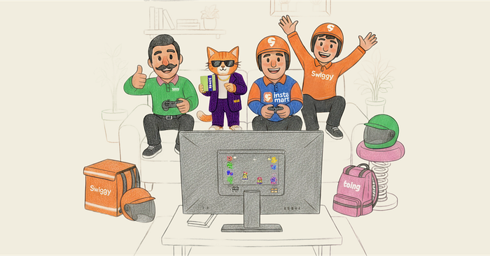

# Scaling Swiggy’s Mobile Ecosystem [1/n]

Our apps ecosystem has grown into a family of apps — **Snacc, Instamart, Toing, Dineout (Swiggy version)**, **Crew** and more. Each of these apps plays a unique role in solving different customer and business problems.

While this expansion unlocks agility and faster innovation, it also brings a new set of challenges. Managing multiple apps in production isn’t just about shipping code faster — it’s about ensuring **quality, stability, and consistency** across the ecosystem without one app affecting the other.

This shift requires **thoughtful planning, clear processes, strong engineering practices and strict governance.**

## Key Challenges in a Multi-Apps World

## 1. CI/CD at Scale

Automating build, test, and deployment pipelines for multiple apps means handling diverse requirements while maintaining reliability. Failures in one app’s pipeline should never cascade into others.

## 2. Release Management

Coordinating release cycles across apps is complex. Each app has its own stakeholders, timelines, and dependencies. A structured release calendar and strong governance are essential to avoid chaos.

## 3. Observability for All Apps

Every app must have **critical metrics tracked independently** — crashes, ANRs, latency, error rates, user perceived page load etc. We have strong governance around this to ensure we do not see any divergence from BAU numbers.

## 4. Reusability Across Apps

This is our secret of moving fast. As they say — “No code is the best code”, we try to reuse as much as we can. We measure, celebrate and reward reusability as a metric.

## 5. Quality Guidelines

Consistency matters. Whether it’s coding standards, testing practices, or accessibility checks — shared quality guidelines prevent fragmentation across apps. Any consumer app that goes out to production, we run an automated BAT suite for all apps to ensure no side effects.

## 6. Branching Strategy

It’s critical to keep our release cuts clean. Managing separate release branches for each app while still delivering the latest changes in every release requires a well-defined branching strategy — one that minimizes merge conflicts, speeds up reviews, and ensures stable, predictable releases.

## 7. Modularisation

Modularisation is about packaging only what’s needed. By breaking apps into well-defined, independent modules, we keep boundaries clean and codebases maintainable. This not only improves testability and reusability but also enhances developer experience and long-term maintainability.

## 8. Maintaining High Stability

As the number of apps grows, the risk of regressions increases. Investing in **automated testing, gradual rollouts, and strong monitoring** ensures stability isn’t compromised.

## 9. Clean Boundaries

Clear boundaries ensure that backend systems remain context-aware — understanding the origin of requests and responding appropriately. This prevents cross-app leakage, enforces ownership, and keeps the ecosystem robust.

## 10. Third-Party Library Management

Keeping it so loosely coupled as possible that there is no interference. Any third party library integration or sdk that we use , we made sure that these are handled as separate projects and maintained independently.

## 11. Cost Implications

More apps mean higher build, test, and monitoring costs. So tracking and optimizing costs at every stage of development and release becomes very critical.

## 12. Feature Flags and A/B Experiments

Poor flag management can lead to unpredictable behavior across apps. Segregating experiments and configs for each app becomes very important in a dynamically changing environment like Swiggy.

## 12. Data Security

Ensuring data security and integrity across multiple apps while maintaining consistent state management. For example, if a user places an order in the Instamart app, it should be reflected in the Swiggy app as well. However, if a user places an order in the Snacc app, it should remain visible only within the Snacc app.

## The Way Forward

Managing multiple consumer apps isn’t just a technical journey — it’s a cultural one. It forces us to rethink how we organize teams, standardize processes, invest in tooling, and measure success. At Swiggy, we’re evolving our engineering playbook to meet these challenges: smarter CI/CD pipelines, reusable components and libraries, stronger observability frameworks, and scalable experimentation platforms.

Our goal is simple: **move fast, scale confidently, and deliver delightful experiences across every app we build.**

PS: Thanks to our lead product designer, Ezaz Ansari, for the brilliant cover image.

---
**Tags:** Android · Mobile App Development · IOS
