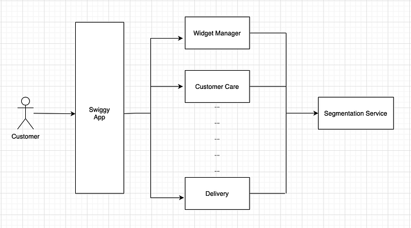

# Segmentation at Swiggy — Part 1

> We all like to be given special attention, and really appreciate it when someone knows our preferences well. And at Swiggy, we want the customer to always feel special and comfortable. So, we have taken efforts on personalizing their experience through customer segmentation. The widgets you see, the type of offers you get, and the overall consumer experience are tailored based on a customer’s profile so that we can offer them the most convenient way to get convenience services. How do make this magic happen? Let's deepdive into our series of blogs on segmentation services.

Swiggy, India’s largest food ordering and delivery platform, has taken major steps in customizing the customer journey to make it more effective. This customization is based on customer’s behaviour & preferences, allowing Swiggy to provide more relevant products. This is made possible by collecting data points across the entire journey (Discovery, Purchase, Order, Delivery) and deriving segments from these data points.

For example, when a customer has a history of purchasing only veg items, we should understand and internalise that preference and show only relevant banners, restaurants etc. We do this by assigning that customer to the “Veg” segment and customising their homepage experience.

### How is that possible? Who decides a different Home page?

Not only the homepage, across customer’s different touchpoints in Swiggy App, these segments are applied for an enhanced experience. Some such experiences are:

Home Page

- Based on customer purchase history and affinity to restaurants/banner widgets, they will see different home page versions, different callouts (communication in Homepage/Menu), different offers callouts, etc.
- Example: Customers who have only ordered Veg will see Veg Restaurants.

Purchase Journey

- Based on customer previous transactions, they will see Special Offers on the Cart page.

Post Order

- Based on customer previous transactions, they will get special preference in assignments of Delivery Executives and also Customer Support.

Across the customer interactions in the Swiggy app, the product features are mapped to different customer segments, and every product/domain needs to determine the segment of a customer. All these product owned systems call a central Segmentation System to find out the customer segment.

*Illustration of different Product Systems interacting with Segmentation Service during customer interactions across Swiggy App*

When a customer opens the Swiggy App, the services encompassing the products (restaurant listing, offers, pricing, customer care etc.,) query the Segmentation System for customer-relevant segments and these services render the feature based on their segment mapping.

Example: Consider a Customer who frequently orders Pizza. When this user opens the Swiggy App, the Widget-Manager System gets called and, among a range of curated Restaurant Collection Banners, the system filters and puts up the Pizza Restaurant Collection Banner on top. Here, the Widget-Manager fetched all customer segments like Favourite_Cusine, Favourite_Dish etc., from the Segmentation System and applied the segment filtering on the banners, there by providing personalized homepage experience.

### Designing Segmentation System for Scalability and High Availability

With a high-level understanding of the Segmentation System and how it gets used by different domains/services, we will enlist core functional & non-functional requirements for the system:

_Different segment types_

Segmentation Service as a platform offers a simple way of separating customers into groups. These groups are based on certain traits. These could be as simple as — Is User New to Swiggy, or could be complex attributes that are powered by data science and analytics systems.

- Evaluating Segments in Real-time: With requirements from product/business to be able to define segments on real-time events like Customer_Order_Count, Customer_Last_Order_Time etc., the Segmentation System supports Rule-based segments specific to their Business. Example: “First_Time_Customer” which means “Customer_Order_Count == 0”, “Inactive_Customer” means, “Customer_Last_Order_Time > X months”, “Repeat_Customer” means, “Customer_Order_Count > Y” etc. Both the Segments First_Time_Customer and Repeat_Customer use the same input data (Customer_Order_Count), but with rules, we are able to create different segments which are used to provide customized experience in Swiggy.
- Derived Segments through Analytics: Analytical Engines process the warehouse data say customer’s historical order data for customer’s number of transactions, total transaction amount, weekly frequency of transaction, Used Payment instrument, etc. to derive intelligent segments. An example segment could be “Active_Customer” meaning a customer who frequently transacts with Swiggy and has high order values.

_High Performing Low Latency System_

- Low latency: With different domains/services building segmented features, the Segment API becomes a blocking call before they can apply their business logic. This directly adds to the App page load time and hence latency should be on the lower side (latency SLA p99 < 50 ms).
- High Availability & Scalability: Segmented features make the customer journey personalized, providing a better customer experience. This demands the Segmentation System to be highly available & scalable across customer flows to provide a consistent & reliable experience. (Availability SLA > 99.99)

Upon defining our needs, the team then set out to design this segmentation system to horizontally **scale, helping us serve ******2.5M requests per min****** with a ******latency below 25 milliseconds****** (99th percentile) in production and all this with just ******six c5.2xlarge EC2 Nodes******! **🚀 🚀 🚀

Curious to know how we did this?

Stay tuned to learn more about the design and architecture of this system in our next blog!

---
**Tags:** Segmentation · Customer Lifecycle · Customization · Personalization · Swiggy Engineering
