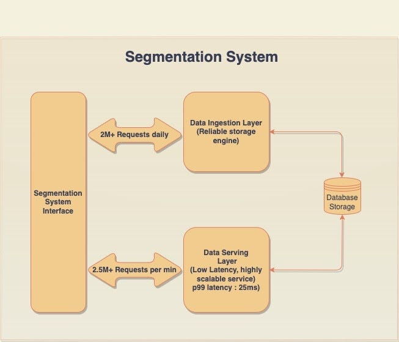
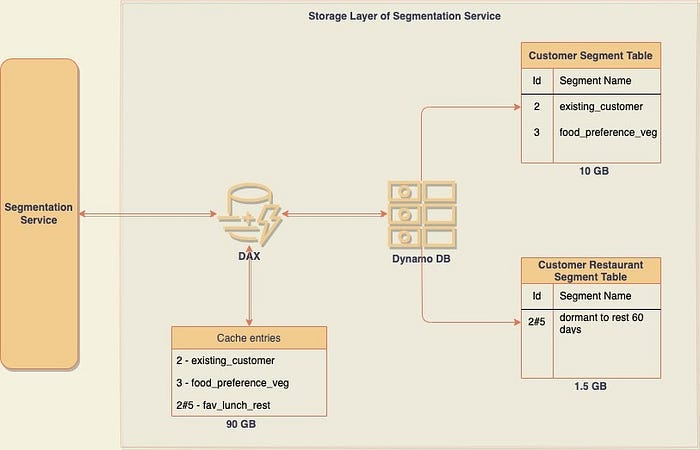

# Segmentation at Swiggy — Part 2

In the last article, we covered what the Segmentation system is and does — in a nutshell. To go through the article again or if you haven’t, read part 1, please read it [here](./segmentation-at-swiggy-part-1-d9566ab1a442.md). In this edition, we will share the internal architecture of the Segmentation System and what were the prominent issues faced by the team during scaling this system.

### High-Level Architecture of Segmentation System

Before we explain the architecture of the segmentation system, let’s go through some jargon we will be using throughout the blog

1. **ENTITY: **An “**entity”** is an independent object across the Swiggy ecosystem. For simplicity of this discussion, we are assuming we are dealing with only 2 entity types as of now: Customer entity type and Customer#Restaurant entity type (this can be interchangeably used as C and C#R entity types throughout the reading). A **Customer** entity type represents an end-consumer that uses the Swiggy platform and interacts with the platform by placing orders. Similarly, a **Customer#Restaurant** entity type represents the relationship between a specific consumer and a specific restaurant registered with Swiggy.
2. **SEGMENTS: **Segments are a classification of an entity into groups based on certain rules. For example, a Customer#Restaurant entity type can belong to a segment called “_fav_lunch_rest_” which simply means that a customer with ID say “_11_” likes to order his lunch frequently from a restaurant ID “22”.

### System Overview

S**egmentation** is a low latency, highly available, and scalable group of services that enable a segmented user experience for every customer of Swiggy. This system is leveraged by most of the product and business teams at Swiggy to provide a personalized customer experience.

This system captures, computes, stores, and serves segments pertinent to the lifecycle of all entities** **within Swiggy. It is a central source of records that serves both factual and inferred intelligence about the entities and the segments to which they belong.

**System Components**

1. **Data Ingestion Layer: **Segments in the segmentation system can be ingested either in real-time or periodic batch ingestion.

**_Real-time ingestion_** → This represents events that are ingested based on the transactional activity of users on the Swiggy platform. Example: order placed, order delivered, payment confirmation, super purchase, etc.

**_Bulk Ingestion_** → These are the derived segments from DW data and are ingested in bulk through scheduled jobs. Example: “_High_Transaction_Customer_” segment can be calculated by looking into the ordering patterns of the customers. This segment can be calculated for all customers, say, at the weekly level and then ingested in the Segmentation system.

Ingestion of these segments is done reliably, which ensures data correctness and completeness within SLA. This layer also enforces data governance checks like range, [min, max], data type, etc. through Ephemeral EMR Cluster & Spark processing before the data is persisted into data storage. Segmentation service at present maintains 280+ types of different segments.

**2. Data Serving Layer:**

The layer is responsible for Client AuthN/AuthZ and serving the list of segments for the entity ID passed in the request. For example: given Client ID + entity, the serving layer returns all the segments of the requested entity — which belongs to the requested ClientID. (Client ID should be whitelisted as part of Client onboarding).

The serving layer of the Segmentation system gets more than 2.5 Million requests per minute during peak hours. These requests are served with a p99 latency of 25ms.

**Data Storage**

The Segmentation system uses **AWS DynamoDB **(NoSQL storage) for storing the [entity ID — segment mappings]

**Data Modelling**

Each entity type in the Segmentation system occupies a different table in dynamo DB. Going on with the assumption that we only have 2 entity types for the purpose of simplicity, these 2 tables would be -

1. Customer_Segment table
2. Customer#Restaurant_Segment table.

The partition key for the table is the entity ID which will be unique. Against the entity ID, we have the list of segments to which the entity belongs.

Sample record structure in customer segment table :

_{_

_“customer_id”: “11”, _**_//Partition Key_**

_“customer_status_group”: {_

_“existing_customer”_

_}_

_}_

Similarly, sample record structure in customer restaurant segment table :

_{_

_“customer_restaurant_id”: “11#22”, _**_//Partition Key_**

_“customer_restaurant_dormancy_group”: {_

_“_fav_lunch_rest_”_

_}_

_}_

**Caching**

Segmentation service uses **DAX** (**Amazon DynamoDB Accelerator**) for caching the data and providing low latency.

DAX serves as a read-through and write-through cache for the Segmentation services. For more information on DAX, please read [here](https://docs.aws.amazon.com/amazondynamodb/latest/developerguide/DAX.html).

**Scaling Issues**

As it can be visualized from the storage modeling below, the Segmentation system used different tables for different entity types but shared a single DAX cluster for all DynamoDB tables.

We can see, both C and C#R entities shared the same cache storage but since the dynamo DB tables sizes were very low (1.5 GB and 10 GB respectively), this did not seem like a problem at first.

Prior to explaining the reason for this skewed storage size between DAX and DDB, let’s briefly go through the concept of negative caching to understand the problem better.

**Negative Caching**

> Source: [AWS Documentation](https://docs.aws.amazon.com/amazondynamodb/latest/developerguide/DAX.consistency.html#DAX.consistency.negative-caching)

_DAX supports something called _**_negative cache entries_**_ for the item and query cache. A negative cache entry occurs when DAX can’t find requested items in the underlying DynamoDB table. Instead of generating an error, DAX caches an empty result and returns that result to the user. So the next time the same item is requested, instead of querying the dynamo DB, DAX can return the previously stored negative cache entry (basically empty result) to the user._

To read more about negative caching, please visit [here](https://docs.aws.amazon.com/amazondynamodb/latest/developerguide/DAX.consistency.html#DAX.consistency.negative-caching).

Negative Caching is a useful concept since it saves direct DB calls to DynamoDB and returns an empty response at the cache layer itself (if DDB has no data for the item) thus reducing latencies.

**Problems faced by Segmentation System with Negative Caching**

While Negative Caching is useful in terms of saving direct DDB calls, in terms of storage, it caused almost 100% of storage utilization for the Segmentation system. Due to this, the system experienced excess cache evictions.

It can be seen from the above diagram that the storage size of DynamoDB tables was just 11.5 GB combined but at DAX (which was common across all tables), the same storage was to the order of 90 GB. Most of this storage was coming from the negative cache entries.

**Reason for high Negative Cache entries**: The Segmentation system in phase 1 was queried for Customer segments primarily and everything worked smoothly. DAX hit percentage was ~ 95% and eviction percentages were very low. But with new clients onboarding to the system and with new segment requests, the system also started serving Customer#Restaurant segments after some time.

At the Customer#Restaurant level, very few segments are registered. This is because a customer, in most of the scenarios, interacts with a minimum of 1 to a maximum of 500 restaurants. So, this table contains entries for the Customer#Restaurant combinations where the customer has previously interacted with a restaurant.

But when the customer opens the Swiggy App and visits the Home page, the Segmentation system receives calls for all Customer Restaurant combinations (c-r1 to c-r500) to know different segments tagged to this Customer#Restaurant combination. Since the customer had only interacted with very few of these 500 restaurants, most of the Get Segments calls doesn’t have any values in the DDB table thus returning an empty response. At the DAX layer, all these empty responses are stored as negative cache and hence the size of DAX storage.

**_DAX Configurations for Segmentation:_**

The Segmentation system had the following initial DAX Configurations based on expected usage -

- Number of Nodes: 2 (replica + master)
- Instances Type: r4.4xlarge (Usable memory : ~91 GB)
- TTL: large TTL, more than a month.

The total memory with r4 Cluster type was approx 91 GB, which filled up pretty rapidly because of enormous negative caching entries. The TTL was huge, so none of the entries used to get evicted because of TTL expiry (In the next article, we will share the reasons for having a larger TTL). Therefore, the only way to make room for more cache entries was the LRU eviction at DAX.

DAX metrics with negative caching after C#R segment queries:

1. DAX storage Utilization ~ 100% (or 91 GB).
2. Eviction Rates: 500 MB per minute.
3. Cache Hit Percent: 55–60%

These metrics indicated a problematic state for the system as the DAX hit ratios should be around 85–90%. The high eviction rates and high storage utilization because of negative cache entries in DAX instances caused the CPU utilization of DAX instances to shoot up to 80% for the segmentation system. This drastically impacted the promised latency SLAs to our clients. Solving the problem by increasing the storage would have been a short-term fix only. This is since user traffic is expected to increase with time and higher storage would also become a bottleneck sometime in the future.

As more clients were trying to onboard to the Segmentation System, adhering to the promised SLAs (latency/availability) and scaling the Segmentation system became the prime concern for the team. In the next article, we will look into how we went about addressing this issue. We will also answer the question of why we had a larger TTL and why we didn’t replace DAX with other cache storage like Elastic cache or Redis.

---
**Tags:** Segmentation · Swiggy Engineering · Dynamodb · Caching · Technology
