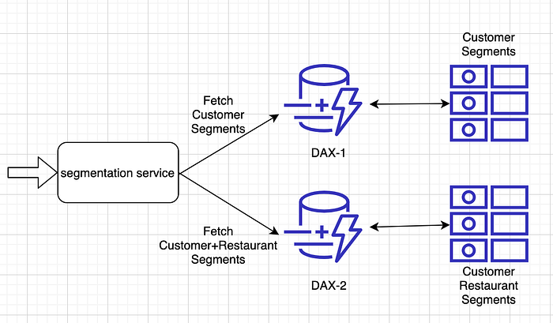
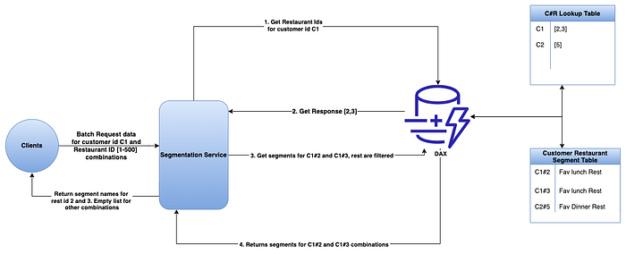

# Segmentation at Swiggy — Part 3

Co-authored with [Sandeep Kumar Sahu](https://medium.com/u/28312c43827?source=post_page---user_mention--b740f7a3697d---------------------------------------)

In the last 2 blogs, we shared how the Segmentation system works in Swiggy and what were some issues faced by the team while scaling the system. If you haven’t read the blogs or want to re-read them, please visit [blog1](./segmentation-at-swiggy-part-1-d9566ab1a442.md) for the system overview and [blog2](./segmentation-at-swiggy-part-2-a1fcb503751d.md) for the system architecture and scaling issues. This is the third and final blog of this series where we will talk about how we solved the issues mentioned in the last article along with a quick problem recap.

## Problem Recap

We shared in the last blog that the team was struggling with a very high cache eviction at the DAX layer. This high cache eviction was causing the DAX CPU to shoot up to ~ 80%. The high cache evictions were happening because of the higher TTL value and the cache storage being occupied by the negative cache entries. Most of the Customer#Restaurant items are associated with no segment because a customer interacts with very few restaurants. These requests got missed at DynamoDB and became a negative cache entry at DAX. Since the DAX cluster was common for both C and C#R, this impacted serving both Customer and Customer#Restaurant segments, with the service failing to adhere to the SLAs for most requests.

We will now share the solutions we went through for fixing this issue. The team planned for both short-term and long-term fixes. A short-term fix was immediately required to address the issue at the moment, but over time, the issues might resurface. Hence, we also started to figure out a proper solution that would work in the long term without hiccups.

### Short term Solutions

1. **DAX Cluster Sizing — **Switching to a larger node type could provide more capacity and enable higher throughput. This is because the current configuration of DAX couldn’t sustain our application’s workload, especially with high CPU utilization on the primary node in the cluster, high eviction rates, and high cache memory utilization.

**_Cons_**_ _**_with this approach:_**

- Upgrading a DAX node type on production isn’t completely an easier option. We must create a new cluster with the new node type whose cache is empty, and AWS doesn’t have a mechanism to copy cache data from the old cluster. So we might have to manually warm up the new cluster. Also, when the prod traffic is flipped from the old to the new cluster, a high no. of requests would be cache misses and land on DynamoDB as the cache is empty. In case the table’s capacity is under-provisioned, we would see high DynamoDB request throttling.
- As we onboard more clients and segments to segmentation service, the DAX negative cache storage will indefinitely grow, and upscaling the DAX clusters wouldn’t be cost-effective as larger clusters mean higher costs.

**2. Sharding/Vertical Partitioning — **As explained in the high-level architecture, Segmentation has different tables for different entities. But the DAX nodes were shared. When the team started looking into the negative cache problem, we realized that the negative cache size differs significantly based on the Entity type. Example: Customer#Restaurant has a very high negative cache value compared to the Customer entity.

So by logically splitting the segmentation service to route to different DAX clusters based on entity type, the load could have been distributed. This can be understood from the diagram below -

**_Cons_**_ _**_with this approach :_**

- This still doesn’t resolve Customer#Restaurant DAX performance issues. This will only help in minimizing the impact of negative cache on the Customer entity, meanwhile.

**3. DAX with shorter TTL and Smaller Cluster** — In the previous blog we had mentioned that we had set a higher TTL. The reason being the system mostly received API calls for the Customer entity types and the cache hit rate was ~ 99%. Also, the data size of the Customer entity table was just one-tenth of the DAX configured storage and so it was handled very easily with most of the requests being a hit. It did not make sense then to expire items based on TTL. But with C#R API calls starting and with the previously discussed query patterns, the negative cache got built up pretty rapidly.

In this approach, the team wanted to explore the option of having a cost-effective DAX cluster that works with an optimal cache hit rate. Shorter TTL would mean lower DAX storage. The team wanted to find an optimal TTL, that maintains a 70+% cache hit.

**_Cons_**_ _**_with this approach :_**

- As new clients were onboarding and with the high negative request pattern, storage will always grow with time if the cache hit rate is to be more than 70%. For example, DAX storage was 60 times compared to the DDB table size of C#R. So even with shorter TTL, we might have to upgrade DAX clusters for maintaining the optimal cache hit rate. This would imply the same issues as option 1 above.

Based on the pros and cons mentioned above, in the short term, the team decided to go with **Option 2 — Sharding.** This approach helped us minimize the impact on our Customer entity calls and segregate the problem of negative caching to a different DAX cluster.

### Long-term Solutions

While we were separating the DAX for both entity types, we also started exploring options to find the proper fix for this issue.

Below are the options we explored to address the same -

1. **DIRECT CALLS TO DDB** — This approach meant removing DAX as a cache layer and directly hitting DynamoDB for all API calls. Although the p99 would still be under 30ms, it would mean very high RCU costs because of the following reasons -

- Same requests from a Customer in a given session (lunch/dinner) are repeatedly processed and served by DDB.
- DynamoDB reads have an account level capping. We required reads at a massive scale in millions/second, which would also grow with time.

**2. REDIS as a CACHE **— Redis doesn’t store negative cache requests, hence this would mean low storage in the cache. Redis will cache only positive records for which the size is already very low. But using Redis as a cache had other disadvantages -

**_Cons_:**

- This option requires overhead maintenance of reliable writes between DDB and Redis. This means the application would have to maintain consistency between Redis and DDB for every write. Maintaining consistency between cache and DDB was by default taken care of by DAX, and the application didn’t have to maintain this logic earlier.

**3. BLOOM FILTER — **Bloom filter is a probabilistic data structure that can be used to see if an item has never been added previously. It is probabilistic because it’s possible to have false positives but not false negatives.

Source: [Wikipedia](https://en.wikipedia.org/wiki/Bloom_filter)

To understand more about bloom filters, please visit [here](https://www.educative.io/answers/what-is-a-bloom-filter). A lot of other good resources are available online as well to understand the concept.

To use a bloom filter, the team explored the following 2 options -

- **Central Bloom Filter (Single Bloom Filter for all Customers)** — In this approach, we will create an array of k bits and m hash functions through which every C or C#R item will be passed. For every “write”, we would pass the item through “m” hash functions and set the bits accordingly. While reading, we would pass the C item again through the “m” hash functions again and see if all bits are set to 1.  
**_Cons_ — **The major drawback of this approach was that the customer base is of the order of millions, and it would be unsustainable to update the bloom filter for every single write. For updating a single record, we would need to pass the record through multiple hash functions and then calculate and set the bits to 1. Doing this for hundreds of thousands of writes per minute would be very difficult.
- **Separate Bloom Filter for each Customer entity **— Having separate bloom filters for every customer made more sense because now writes of each customer will not impact others and each bloom filter can be updated separately. This approach will also help in filtering out the data before querying DAX, thus taking care of the said problem.  
This approach would have been ideal had there been multiple restaurant IDs associated with every customer. But as mentioned previously, in a real production scenario, a customer interacts with a handful of restaurants (minimum of 1 to a max of 500 restaurants). Storing these few restaurants in the bloom filter would have been a waste of computing resources, as we must pass these IDs through hash functions and set the bits in real-time. Hence, the team decided to directly store the restaurant IDs for every customer in a proxy lookup table, which would act as a bloom filter for us. This approach is shared below.

**4. PROXY LOOKUP TABLE — **Applying the first principle, the team realized the need for a smarter look-up to DAX instead of blindly going for all requests. In this approach, we planned to create a proxy table in DynamoDB with Customer ID as the key and restaurant IDs as values.

The read and write flows will be updated as follows with this approach -

- **Write-Flow** — During each C#R segment ingestion, update the “restaurant-ids” set in the Lookup Table under the customer key, along with the C#R DDB table.
- **Read-Flow** — For all C#R Segment Requests for a Customer, fetch the “restaurant-ids” set from Lookup Table and filter negative restaurant-ids. Query C#R Data Tables for segment data with the found restaurant ids. The lookup table in this case acts like a bloom filter, and we only hit the data table when a C#R entry is valid.

The diagram below explains the flow -

**_Pros_**: The advantage of using this proxy table is a **100% cache hit rate**. The restaurant IDs for a given customer are typically low and hence this approach also offers a predictable storage growth with time.

**_Cons_**: This can impact CPU and latency costs on the application side because of value deserialization and key existence checks.

## CONCLUSION

Based on the above options and the pros and cons for each, the proxy table approach was the most suitable and simple design to go forward with. The team decided to take a small hit on the application side CPU and latencies, which came with the benefits of having a very high cache hit rate and zero overhead of cache management through DAX.

## POST-DEPLOYMENT RESULTS

> The proxy lookup table solution was a successful release in production! It got rid of the problems our system faced with negative caching. The application latency(p99) dropped from 50 ms to well under **25 ms**, which was a **2x** improvement. The system was able to handle **2.5M RPM** with just “**6” c5.2xlarge EC2 nodes**. The release also brought down the cost of DAX significantly for us (**around 4–5 times**).

---
**Tags:** Swiggy Engineering · Segmentation · Customization · Customer Lifecycle · Technology
