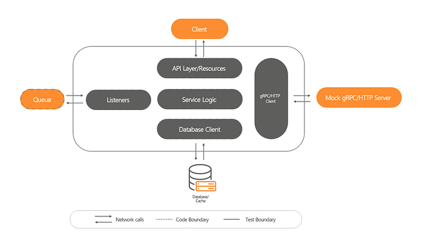

# Service Level Testing for Microservices in Swiggy

As of today, Swiggy operates over 400 microservices in production. Over the last few years, the number of microservices shot up from tens to hundreds. At the same time, the deployment velocity in production went down: feature releases stretched from days to weeks, minor enhancements also required days of development and test time. Investigation revealed that the several types of defects (e.g. network, I/O, API contracts related) were not covered by unit tests. Unit tests are effective with independent functional modules (say within a monolith), however are inadequate in the microservice landscape where communication, data marshaling, etc. account for a large portion of a service. This blog post talks about service level tests that solved the challenges in testing raised by microservice architecture, and how a library, Oh My Test Helper, evolved in Swiggy eased the adoption of service level tests.

## What is Service Level Testing (SLT)?

Service level tests validate the API surface of a microservice. They are the **black-box tests of service behavior, via APIs, **providing s_tandalone_ functional validation of services.

**In a service level test, the service has to run with its endpoints exposed resembling production, with the following service dependencies set up locally:**

- Databases, Queues, Caches.
- Mock HTTP/gRPC endpoints invoked by the service.



## Why are Service level tests important?

To understand this, let us contrast service level tests with unit tests in the context of microservices. Two limitations pop up in unit tests. One, unit tests typically do not cover testing the API surface. Two, unit tests skip testing communication and contracts with external services, databases, etc. Hence contract or network communication defects elude unit tests. In the microservice world, contracts and communication account for the majority of the code in a service. Consider a service exposing CRUD API: The majority of the code would be setting up the API endpoints, database, and downstream network communication clients, with some business logic. Unit testing will not test the database and downstream contracts, not validate contracts exposed by the microservice to the client, not verify data marshaling and unmarshalling happening at the API layer. However, service level tests come equipped to deal with these defects.

## Challenges

Nothing comes free in this world. With the added benefits came the complexity of writing service-level tests. Several developers voiced concerns in writing service-level tests.

_“It takes more time to write _service-level tests_ than to write actual code.”_

Service level tests took longer to write as it needs to

1. Setup service dependencies: databases, queues, cache, gRPC, HTTP endpoints.
2. Start the service with a configuration similar to production.
3. Interact with dependencies: When calling the service API and validating the response, we also need to assert that messages have been published to queue(or written to a database) by the service as expected.

Service level tests are no doubt essential in the microservices world. However, there was no clear way to proceed when developers got down to brass tacks. Specialized CI environments, docker-compose, spring test helpers, test containers were evaluated. None of these addressed all the developers’ pain points, and developers had to choose and learn each of these.

## SLT as a solution

Across microservices, repeated patterns emerged when interacting with components like AWS DynamoDB, MySQL, Kafka, etc. Some examples include

1. the code required for pushing a message and verifying a message from a Kafka topic.
2. Code required for setting up, validating requests to gRPC mock.As all this. boilerplate code put the burden on the developers, test quality reduced, and development time increased.

Some open-source solutions (e.g. [gripMock](https://github.com/tokopedia/gripmock)) proved hard to use in service level tests. gripMock didn’t expose method calls to manipulate the mocks. Hence, mock configuration needs to be done outside test code. Running tests was not a single-step process anymore, and the mock manipulation became even more difficult if we wanted to change mock responses for different tests in the same test suite. To address above mentioned problems, a custom solution was built within Swiggy.

Good software is built on layers, each layer providing a higher level of abstraction. A library was developed in Swiggy to reduce boilerplate code and combine the learnings across services. As a result, the complexity of the service level test decreased, and developers spent more time writing meaningful test cases. The library’s name: Oh-My-Test-Helper.

The library comes in two languages: golang and Java. Code samples from golang are listed below.

### How to test Kafka consumer service.

Step 1: Initialize kafka container with a single line:

```
container, err := kafka.NewContainer()
```

Step 2: The container has bootstrap servers which you can set in your application config.

```
cfg.PrimaryBootStrap = container.BootstrapServers() 
cfg.AutoOffsetReset = “earliest”
```

Step 3: Produce Kafka and test.

```
containers.Kafka.Produce(kafka.Message{
 Topic: “address_updates”,
 Key: “”,
 Value: “{\”aid\”:1}”,
 Headers: nil,
 })
```

### How to test gRPC service.

Step 1: Initialize gRPC container with a single line:

```
container, err := NewContainer(“7777”, func(server *grpc.Server) {
 hello.RegisterHelloAPIServer(server,   &hello.UnimplementedHelloAPIServer{})
 })
```

hello is the package of the proto definition of HelloAPI.

gRPC mock is started on port 7777 in localhost.

Step 2: Create a stub on the gRPC mock server.

```
err = container.CreateStub(&Stub{
 Request: &Request{
 Package: “hello”,
 Service: “HelloAPI”,
 Method: “Hello”,
 },
 Response:&Response{
 Data: &hello.HelloResponse{Message: “Hi!”},
 Err: nil,
 }
, 
})
```

Step 3: Verify the request received once the test is executed.

```
count, err := container.GetRequestCount(&Request{
 Package: “hello”,
 Service: “HelloAPI”,
 Method: “Hello”,
 })
```

## Oh My Test Helper Library

The need for the library is evident from its adoption numbers — In the last 6 months, just under a hundred microservices have started using the library. Clients of the library achieved code coverage numbers of 90%+ with ease and service tests stopped feeling alien to the developers. Developers started to not only focus on coverage numbers but write meaningful test cases testing all the service behaviors. The library was adopted aggressively because it reduced the time to write an SLT by exposing simplified interfaces that reduce complexity, and by providing tooling to debug while also enhancing the quality.

## Conclusion

Initially, we had allocated several days for writing the service level tests in the project plan. With the tooling provided by the library, time to write service-level tests has decreased to hours. We are planning to open-source the library soon and are excited to work with the community in the journey to write reliable test cases for microservices while enhancing the developer experience.

---
**Tags:** Microservice Architecture · Testing Framework · Golang · Java · Swiggy Engineering
