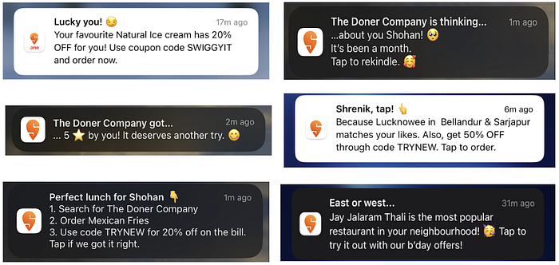
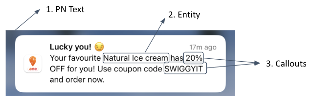
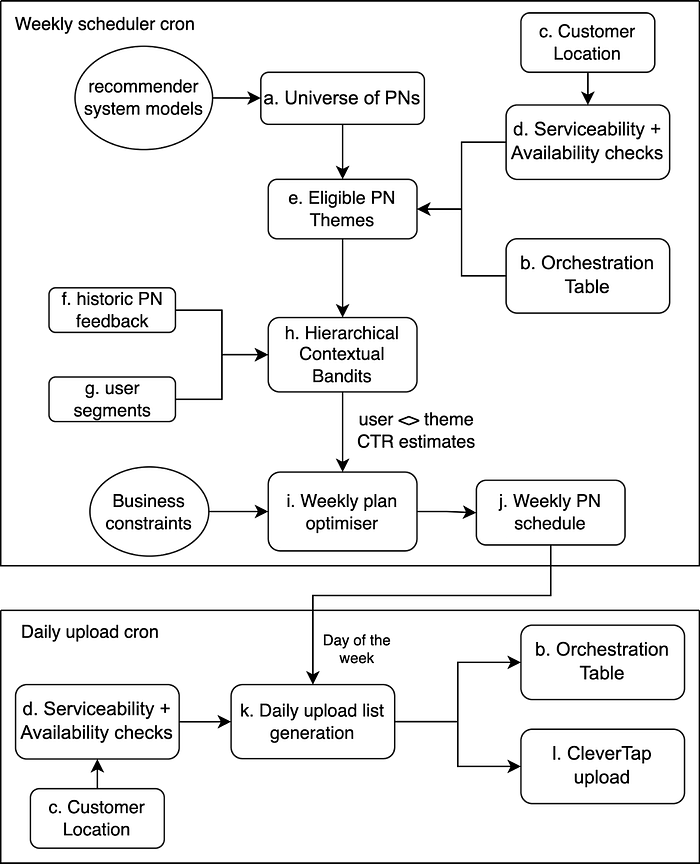
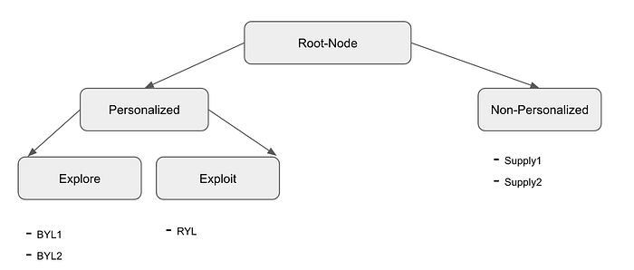

# Smart Push notifications (Multi-Armed Bandits at Swiggy: Part-4)

Co-authored with [Viswanath Gangavaram](https://www.linkedin.com/in/viswanath-gangavaram-4336937/)

This is part-4 of our blog post series on Multi-armed Bandits (MAB) at Swiggy. In [Part-1](./multi-armed-bandits-at-swiggy-5b1a4b1c2724.md), we introduced the fundamental concepts of MABs, and we briefly talked about various products that are currently powered by MABs at Swiggy. In [Part-2](./multi-armed-bandits-at-swiggy-part-2-ec6c4f7e7e29.md), we studied regret, and convergence properties of some of the popular MAB algorithms namely Epsilon Greedy, Softmax, Upper Confidence Bound, and Thompson Sampling. In [Part-3](./contextual-bandits-for-ads-recommendations-ec210775fcf.md), we deep-dived into how contextual MABs are powering Ads recommendation on the Swiggy App, and we also talked about practical aspects of productionising MABs.

In this blog post, we are giving a detailed account of Smart Push Notifications, one such project where we employed MABs, and briefed the complete end-to-end pipeline that powers Smart Push Notifications.

## Terminology

**Push Notification (PN):** An alert (typically a pop-up or a message) generated by an application when the application is not open, notifying the user of its offerings.

**CTR (click-through rate):** # of PNs clicked / # of PNs sent

[**CleverTap**](https://clevertap.com/)**:** A platform, with which we send PNs to user devices

**Smart Push Notifications:** An end-to-end system that orchestrates all eligible PNs for a given user and creates an optimised weekly plan by satisfying a given set of constraints.

**Entity:** An entity is a restaurant or a dish or cuisine that appears in a PN.

**Note:** PN theme / PN / Theme: In the article, we used three terms interchangeably.

## Push Notifications

Let’s admit it, push notifications (PNs) are a tricky territory! Sending too few of them translates to leaving money on the table; sending too many — you risk annoying the user. Another dimension to take into consideration is incorporating diversity and novelty aspects. For example, a user may have a higher affinity towards a specific PN but sending it over and over again might lead to fatigue in the long run.

*Image-1: Example PNs sent by Smart Push Notifications*

As seen in Image-1&2, a push notification is composed of three different types of content 1) PN-text: The English text in the title and the body 2) Entity: Restaurant/Dish/Cuisine name mentions, and 3) Callouts: user name/user’s location/user’s rating/discount.

*Image-2: Components of a Push Notification*

We designed various personalised, and non-personalised recommender systems to suggest restaurants/dishes/cuisines (entities) be shown in the PNs. Personalised recommender systems suggest based on the user’s preferences, whereas non-personalised recommender systems suggest based on the user’s location like top-rated restaurants in the user’s location.

Creating a PN-text is a creative art with rich dividends if we get it correct. We have seen a 2–3x lift in the CTRs with different PN-text for the same data recommenders, and callouts. We have an in-house content team, who regularly innovate on the PN-text.

For every PN-text, and data recommender we created multiple variants with different callouts like user name, user’s location, and best available discount for a given user. Regularly, we have seen a 20–40% lift in CTRs with these callouts.

## The Problem Setup

Given the way the PNs are composed, and how the users are expected to react to them, we can see the following properties of the data science problem at hand 1) the Heterogeneous nature of optimization set up at a user level 2) The constraints to optimize for a given time period 3) The dynamic nature of PN campaigns.

**1. Heterogeneous nature of optimization set up at a user level:**

> a. Each user is eligible for different types of PNs.  
> b. A user might be eligible for more PNs than we can send in a period (week).  
> c. Variance in the optimal number of PNs per user in a time period.

**2. The constraints to optimize for a given time period:**

> a. Do not send a PN more than n1 times in a week.  
> b. Do not send a PN more than n2 times in a day.  
> c. Do not send more than n3 PNs in a week/day.

**3. The dynamic nature of PN campaigns:**

> a. The continuous innovation in PN-text leads to an ever-increasing number of PNs  
> b. New data recommendation systems mean new types of PNs  
> c. A PN’s CTR changes with time  
> d. Multivariate nature of PN’s CTRs as a function of user’s attributes  
> e. A given PN is more similar to some PNs than other PNs

One of the ideal modelling candidates to model the dynamic nature of the PNs is through contextual MABs, given their inherent nature to handle explore/exploit dilemmas. To further reduce the regret of the MAB algorithm in the “cold start” stage, we employed a hierarchical variant of MABs (refer to Image-4), wherein we estimated a set of CTRs for a given PN from a terminal node to the root node and took the weighted sum of CTRs by taking an advantage of similarity among the PNs. To model the changes in CTR trends, we are estimating multiple CTRs with feedback data from different intervals of time and taking the weighted average of the estimated CTRs to compute the final CTR estimate.

To handle the heterogeneous nature of the optimization setup at a user level, and the constraints to optimize for longer periods, we pose the problem as an integer optimization problem.

## Unserviceable menu visits

While we send location-sensitive PNs, we need to be aware of the user’s location, otherwise, we will end up having a bad user experience with unserviceable restaurant menu visits, whenever a user is far away from the serviceable limits of the restaurant after they clicked on a PN. To tackle the issue, we are using the user’s most frequently visited location from the past, and along with it, we modelled the probability of the user’s current location being the user’s most frequently visited location given the user’s attributes. If this confidence score is more than x, we send these location-sensitive PNs, otherwise, we restrict to sending only location-insensitive PNs, like PNs taking the user to the Swiggy app’s home screen on a click.

## End-to-End Pipeline: An intelligent orchestration of PNs with constraints

*Image-3: End-to-End Smart Push Notification pipelines for Weekly Scheduler, and daily upload Jobs*

The various blocks in the system flow represented above starting from Eligible PNs to pushing the notifications into CleverTap are described below.

### a. Universe of PNs

This module tracks all the possible PNs that can potentially be sent to a user. This is derived from the outputs of the various recommender systems (such as Restaurants You Love, Items You Love, Because You Ordered, etc), PN-text, and callouts.

### b. Orchestration Table:

The Orchestration table maintains which user received which PN and the corresponding entity (restaurant/dish) recommendations. It is used to avoid repeating the same entity recommendation within a specified time period and in building the eligible PN entities for weekly modelling. It is updated daily to hold the last N days of data uploaded to CleverTap.

### c. Customer Location:

The customer location module is used to predict the customer’s location along with an associated confidence score. We make use of this predicted confidence score, if the confidence score is less than X, then we mark the user to be ineligible for receiving the location-sensitive PNs.

### d. Serviceability + Availability checks:

This module along with the orchestration table is used to filter eligible themes from the universe of available PNs. We check the serviceability of the entities recommended in the PNs by validating if the user is within a K km radius of the recommended restaurant. At the same time, the availability of a restaurant is validated by ensuring that the restaurant is taking orders at the time of sending PNs. By employing an accurate customer location prediction model and restaurant availability and serviceability checks before sending PN, we reduced landings on unserviceable PN sessions significantly compared to when not using them.

### e. Eligible PN Themes:

The universe of potential PNs is trimmed down using the orchestration table, serviceability, and availability checks. Only the PNs that satisfy the aforementioned validations are processed further through the pipeline to generate the final week’s plan for all the users.

### f. Historic PN feedback:

We gather the impressions and clicks data for each user in our user base, which is used to build an aggregated feedback dataset that contains the #impressions and #clicks at a user, PN theme level. This feedback data is used as input to our HCB module, which estimates the click-through rate using contextual bandits.

### g. User Segments:

When we observe the data at a user level, the feedback data would be very sparse as the rate of a PN getting a click from a given user is very low. To avoid using sparse feedback data, we mapped each user present in our user base to a segment.

### h. Hierarchical Contextual Bandits:

SmartPN aims to emit an optimised weekly plan at a user level based on the estimated click-through rate (CTR) for each push notification. HCB is used to estimate CTR for each push notification and these estimated CTRs go as input to the weekly plan scheduler. To reduce the initial complexity, we employed segmented hierarchical bandits as hierarchical contextual bandits (HCBs) that make use of the impressions & click data for PNs at the user-segment level and perform hierarchical Thompson sampling over PN-types tree and emit an estimated CTR for each user, theme pair. An illustration of the PN-types tree is given below.

*Image-4: PN-types tree: Encodes PNs similarity*

Notes on Image-4:

1. Here BYL1, BYL2, RYL, Supply1, and Supply2 are actual PNs. Exploit, Explore, Personalised, Non-Personalised, and Root-Node are logical nodes, which capture the similarity among PNs.
2. Logical nodes encode human intelligence.
3. Nodes separated by smaller distances are regarded as more similar to each other than nodes separated far apart. For example, BYL1 is more similar to BYL2 than Supply1.

### i. Weekly plan optimiser:

This module takes in the optimal number of PNs and the estimated CTRs from HCB as the inputs and outputs of a weekly PN schedule at a user level. We make use of linear programming which aims to optimize for maximising the overall CTR attainable at a user level, under a given set of diversified business constraints. We used the MIP library in python to model the constraints and the optimization problem at hand.

### j. Weekly PN schedule:

The output of the optimiser is a weekly plan at a user level, with details like the PN and the entity to be recommended for each of the next 7 days. This plan is generated every Sunday and is used for the next 7 days to create the PNs to be sent to the eligible users.

### k. Daily upload list generation:

This generated schedule is then used by the daily uploader module to create the day’s final upload list. We rerun all the serviceability and availability checks using similar logic described earlier in section d. In addition, we also check for available discount coupons used for powering the discount campaigns. The PNs which satisfy all the validation checks are made to be part of the final upload list.

### l. CleverTap upload:

We make use of the final upload list generated in the earlier step and gather all the necessary metadata required for showing the PN to the user. We then upload these PN details for each user into CleverTap, which finally disburses the notifications to all the eligible users.

## Learnings from experimentations

Some of the learnings from our experiments with variants of HCBs and the optimization parameters are summarised below:

- We tested “Max number of PNs per PN type = 1” Vs. “Max number of PNs per PN type = 2”, we found that “Max number of PNs per PN type = 1” is working significantly better than the other variant. This proved our hypothesis that if we send more of our champion PNs in a given time period then the champion PNs lose their goodness.
- We evaluated UCB as against Thompson sampling, and what we found is Thompson Sampling significantly works better than UCB in this use case.
- Another interesting insight that we found is that the majority of the incremental benefit from Smart Push Notifications is coming from the high transacting user base, so to reduce the running cost, we restricted Smart Push Notifications only to targeting a high transacting user base. A point to be noted is that the goodness of Smart Push Notifications is a function of the PN copies that it’s given, so currently, we are working on PN copies that are best suited for a lower transacting user base.
- Cost optimisations: 1) to reduce the running cost, instead of estimating CTR for each <user, PN>, we tried to estimate the CTR at a <segment, random cohort, PN>, and assign this CTR to every user within the same segment, and random cohort. We experimentally found that this run-time optimisation has no significant effect on the overall performance as compared to estimating CTR for every user. 2) Given the run-time of the optimiser is directly proportional to the number of constraints that it needs to satisfy, one trick that we found is that if the estimated CTR is less than a particular threshold then we removed that PN from the eligible list of PNs that a user can get, this significantly reduces the number of constraints inputted to the optimiser.

## Endnotes

In conclusion, we are long on MABs, and so far in this series, we have covered how MABs are addressing the fundamental dilemma of [explore-exploit trade-off](./multi-armed-bandits-at-swiggy-5b1a4b1c2724.md), we studied [regret properties](./multi-armed-bandits-at-swiggy-part-2-ec6c4f7e7e29.md) of various MAB algorithms, and we have seen how contextual MABs are powering our [ads recommendations](./contextual-bandits-for-ads-recommendations-ec210775fcf.md), personalising [Swiggy homepage layout](./personalising-the-swiggy-homepage-layout-part-ii-450c55a40058.md), and enabling smart push notifications at Swiggy. Next up is a blog piece that intertwines the fields of MABs, and causal inference.

Until then, Swiggy karo, phir jo chahe karo 😁

Acknowledgments: Smart Push Notifications wouldn’t be possible without the persistent efforts of [Shrenik Surana](https://in.linkedin.com/in/shreniksurana), [Shohan N](https://in.linkedin.com/in/shohan-n-10a354122), [Bhavi Chawla](https://in.linkedin.com/in/bhavi-chawla-a07723175), [Dharun Surya](https://www.linkedin.com/in/dharun-suryaa-09b372176), and many others.

Credits to [Jairaj Sathyanarayana](https://www.linkedin.com/in/jairajs) & [G Abhinav](https://in.linkedin.com/in/abhinav-ganesan) for reviewing this article.

---
**Tags:** Multi Armed Bandit · Reinforcement Learning · Linear Programming · Push Notification · Swiggy Data Science
