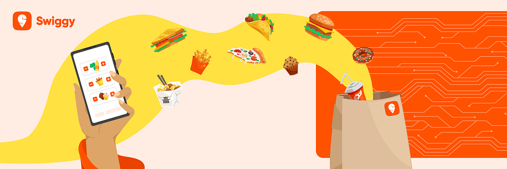
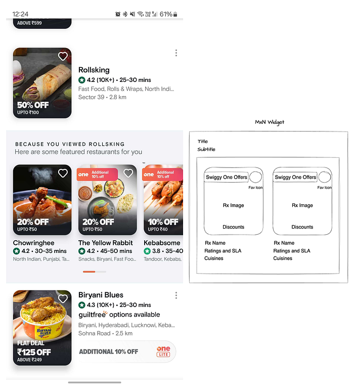
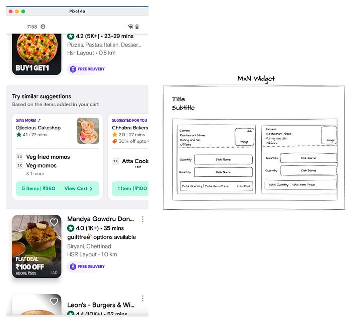
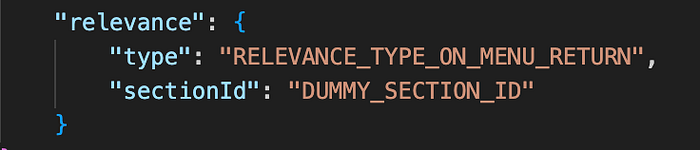
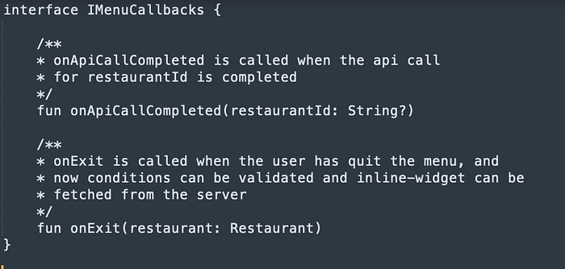
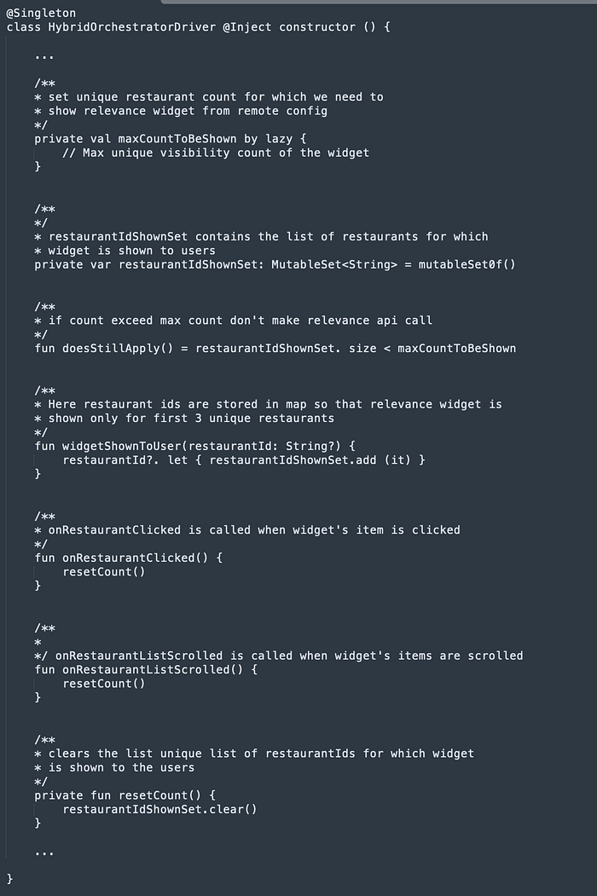
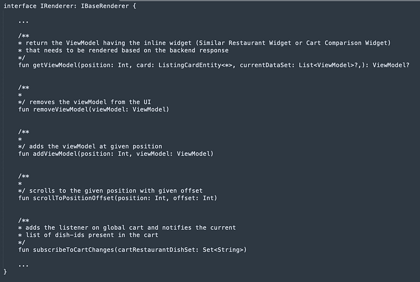
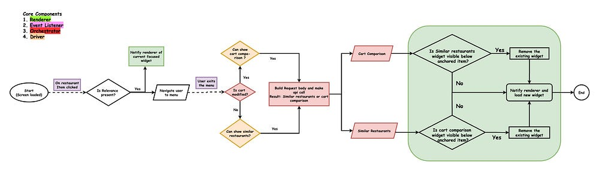
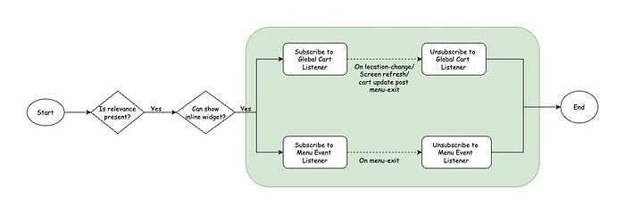
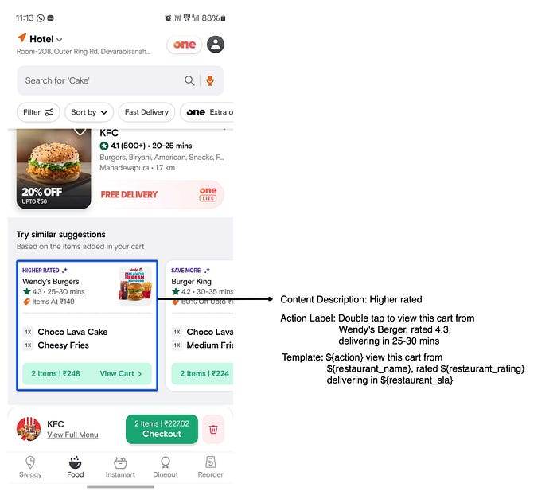

# Smart Select: Tailored Cart Suggestions

In this blog post, we’ll explore Swiggy’s innovative approach to enhancing user experience through the real-time implementation of widgets on discovery screens. We’ll dive into the process of leveraging user interactions to dynamically add widgets, providing a comprehensive understanding of how these interactions drive the customisation and refinement of the user experience.

## Why did we developed Cart Comparison Widget?

Despite strong indications of user interests, a significant number of users create one or more carts but drop from the platform due to difficulty in item selection.

Users can now effortlessly find carts similar to the cart that they have created. Swiggy will now recommend carts based on their specific needs, analyzing factors such as lower cart prices, best offers, faster delivery options, higher-rated restaurants or gourmet selections, eliminating the need to browse multiple restaurants.

## How does it work?

The cart comparison widget appears on the UI when users browse the menu and add items to their cart. Upon returning to the discovery screen, the widget will render a list of similar carts. Clicking on any of these carts will open an intermediate screen showing the restaurant and pre-added item details, along with options to view the full menu or proceed to checkout for placing the order. Users can also swipe cards to explore other carts available in the widget.

## Widget Roles & Display Criteria

Widgets play a vital role in this context, offering users convenient access to relevant information and functionality without extensive navigation. Two key widgets, the Similar Restaurant Widget and the newly introduced Cart Comparison Widget, aim to enhance user engagement and satisfaction by providing tailored suggestions and simplifying decision-making processes.

### Similar Restaurant Widget (Existing widget)

Similar Restaurant Widget holds the list of restaurants similar to the last visited restaurant.

Intent of the widget:

1. Discover more restaurants similar to the restaurant user love.
2. When some items are unavailable at a particular restaurant, this widget makes it convenient to quickly go to a similar restaurant to order the item they were looking for.

*Similar Restaurant Widget Properties*

### Cart Comparison Widget (newly introduced)

Cart Comparison Widget holds the list of carts similar to the cart user has created from the restaurant menu.

Intent of the widget:

1. Recommend similar carts from other restaurants with higher ratings, lesser delivery time, better deals, lesser cart value or gourmet selections.
2. Reduce user time to build similar carts from other restaurants.
3. Discover more restaurants similar to the restaurant users love.

*Cart Comparison Widget Properties*

### Client<>Backend Contract

Client will send the updated cart to the backend to decide which widget needs to be rendered. It’s possible that Similar Restaurant Widget comes up as a back-up widget for Cart Comparison when there are no recommendations available for the current cart.

Currently Similar Restaurant Widget is triggered on exit of the menu when the user has not modified the cart and the decision to decide whether a call needs to be made to backend depends on the relevance object that we get from backend in the eligible items in the response.

Sample Relevance Object:

Here type(“RELEVANCE_TYPE_ON_MENU_RETURN”) in relevance tells us when the user exits from the menu, an api call if eligible needs to be made to backend to render the dynamic widget using the given sectionId in the object.

Both Similar Restaurant Widget and Cart Comparison Widget are powered by m*n widget ([Link for reference](./swiss-knife-that-powers-the-swiggy-app-dff9dc49a580.md)).

## Key Components

### Event Listener

Responsible for notifying listeners about menu events to prompt necessary actions.

### Orchestrator

Orchestrator makes the api call with required restaurant and cart details in the request body and handles the parsing of response and widget creation. Once the widget is created it is passed to the renderer to load the widget on the UI.

Note: Each relevance type has its own orchestrator responsible for handling the required actions as per user interactions.

### Driver

Responsible for maintaining the frequency of the individual widgets anchored below unique restaurant items/widget in a particular app session.

### Renderer

Responsible for anchoring the view passed by the orchestrator below the interacted widget and notifying the orchestrator of the existing widget so that it can swap if required the existing widget with the updated one.

All the above-mentioned components are activated only if the required relevance exists for a particular widget and when the user interacts with it.

## How does it work?

*Similar Restaurant And Cart Comparison Widget Workflow*

## Ensuring clean memory and listener behaviour

To mitigate potential memory leaks or erratic widget behaviour caused by the rendering of widgets on discovery screens, we subscribe to listeners only upon user interacts with restaurant cards. This enables us to monitor menu interactions and events continuously. Upon exiting the menu or page refresh/global cart updates, we unsubscribe the listeners to ensure efficient memory management.

*Listener’s Workflow*

## Recommended Carts are Accessible to All

At our core, inclusivity is fundamental. By integrating accessibility support, we’ve empowered specially abled users to confidently navigate and explore recommended carts, enabling them to fully immerse themselves in their food journey.

*Accessibility Information*

## Visual Experience

*Cart Comparison Widget Demo*

## Acknowledgements

I am Sidharth Gupta from the Android Mobile team at Swiggy. I would like to thank [Raj Gohil](https://medium.com/u/1bf9bdb89775?source=post_page---user_mention--38267fdca12b---------------------------------------) for his continuous support and guidance.

---
**Tags:** Swiggy Mobile
