# Solving the Last-Last Mile Maps: PoI Entry Gates

> How we built an algorithm to identify entry gates for a PoI leveraging our Delivery Partners’ trajectory data

With contributions from [Abhinav G](https://medium.com/u/5463683f79ea?source=post_page---user_mention--f7fb0d5ddd47---------------------------------------), [Jose Mathew](https://medium.com/u/498810a537c?source=post_page---user_mention--f7fb0d5ddd47---------------------------------------), and [Kranthi Mitra Adusumilli](https://medium.com/u/b5d31e8066c3?source=post_page---user_mention--f7fb0d5ddd47---------------------------------------)

## Introduction

The last-mile delivery may just seem as simple as picking up the order from the restaurant and delivering it to the customer’s address. However, there are a lot of challenges involved, that drove us to dig even deeper to solve its crucial constituent: the last-last mile (LLM) leg.

LLM leg in Swiggy’s order lifecycle is composed of a Point of Interest (PoI) and its sub-entities namely internal roads and buildings, entry gates and exit gates, and parking spots. A PoI is defined as a geographical location with simply associated metadata that could include a name, unique address identifier, information about the building at the location such as opening and closing hours, and other complex metadata like a three-dimensional model of the building at the location.

Customer PoIs, in Swiggy’s context, are mostly societies, tech parks, office complexes — typically buildings or gated communities. These PoIs are typically represented as a point on a digital map or as a polygon indicating the boundary of the PoI. We refer to polygon representations of PoIs as PoI polygons. The goal of our proposed algorithms is to identify entry gates of our PoI polygons dataset for pan India, that are within a haversine distance of 20 meters of the ground truth gate. The threshold set ensures a seamless Delivery Partner (DP) experience for routing through gates.

## Problem Statement

For the LLM leg of the delivery partners’ trajectory, there is a caveat in navigation. The current map service providers do not necessarily route through the entry gates, as the destination is just the customers’ location. This creates a problem for the customer location that falls on the backside of PoI as it might route to the street in the backside where delivery partners (DPs) can’t access the PoI. Also, identifying the nearest, accessible entry gate especially in large PoIs sometimes creates a hassle for the DPs and thus increases their delivery time. The foremost by-product of this delay are hangry (hungry and angry) customers, and baffled delivery partners exchanging innumerable calls to find the ultimate delivery location. This meddles with Swiggy’s aim for a seamless customer experience by consistently providing them ‘silent’ deliveries, accurate delivery promises, and expected time of arrival (ETA) for their orders, at the same time obstructing delivery partners’ experience that was made better by making them feel efficient and providing them a hassle-free delivery experience. Hence, by utilizing PoI and its entities we wish to compute and serve multimodal (multiple modes of transport, here — 2-wheeler and foot), accurate LLM directions for the delivery partners to do doorstep delivery.

We will also make use of entry gates as a representative point for a PoI. Presently, customers within the same PoI see varying sets of serviceable restaurants/stores and move their pin location to get access to a favorite restaurant. Using this as a representative, all customers in that PoI will benefit from consistent serviceability. Therefore, the provision of pre-defined entry gates that are routable and in case of multiple gates, accessible (entry to delivery partners is allowed only from a particular gate), unlocks a host of new use cases to solve the LLM delivery challenges.

In this blog, we will discuss how the Data Science team at Swiggy built an unsupervised machine learning model, to identify entry gates for a PoI by leveraging historical GPS trajectory data of its DPs. We explored OSM entry gates data which was then very sparse and unreliable as it’s crowdsourced and open source. Thus, to scale for our PoI data, we built two algorithms implementing clustering to identify clusters that are most probable for an entry gate. The novelty of our work is the rule-based selection of “valid” clusters, that filters out improbable clusters.

## Solution

We propose and evaluate two algorithms that identify entry gates of PoIs in an unsupervised manner. Both proposals take advantage of historical trajectories of delivery partners delivering completed orders to PoIs and the PoI physical boundary data.

Before we deep dive into the detailed methodology, let’s look at some important definitions.

The input to the algorithms is the geospatial data in their geometrical representation.

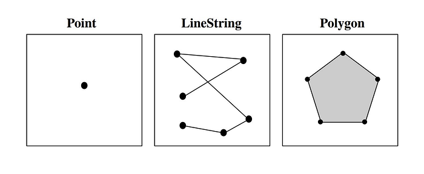
*Illustration of Well-Known Text (WKT) representation of geographical geometry*

_Definition 1_. **_GPS ping (POINT)_**: a GPS ping is represented by a POINT geometry (x,y) where x and y are longitude and latitude. It also has auxiliary data like timestamp, accuracy, and event.

**Accuracy**: The GPS receiver triangulates the location based on time-stamped signal inputs from multiple satellites. Android’s Location API outputs the positional accuracy for a GPS Ping from this data as a radius in unit meters. If a GPS ping has an accuracy of 50 m, this implies that the position estimate is within a 50 m radius of what should be the ‘actual’ position (the center of this 50 m radius circle). The accuracy of the position estimate is affected by factors such as clock drift at the receiver, non-line-of-sight signal reception, and multipath signal fade. Thus, the accuracy measurements received are not too reliable. Nevertheless, the higher the value of the accuracy field, the faulty the GPS ping.

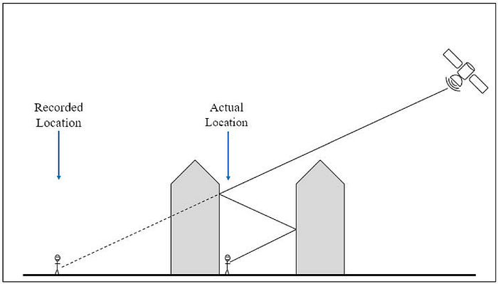
*Source: researchgate.com. The figure shows the urban canyon effect. Estimated locations differ from actual locations due to GPS signals reflecting off of tall buildings (non-line-of-sight signal reception; signal getting blocked due to tall buildings).*

**Event**: GPS ping has an associated event for the activity DP is carrying out. Usually, when DPs reach the entry gate, or parking spot of a PoI they tend to mark “**reached**” that gets stored as the event.

_Definition 2_. **_Trajectory (LINESTRING): _**A delivery partners’ trajectory is a sequence of GPS pings ordered in increasing order of their timestamp, T = {P₀, P₁, … , Pn}, where t₀ < t₁ < … < tn and ∀ᵢ ∈ [0, n]. This is represented as a **_LINESTRING _**that is a series of **POINT** that identifies the route of a line.

_Definition 3_. **_PoI Boundary (POLYGON): _**PoIs are **POLYGON** that is a representation of an area**_. _**They consist of a sequence of at least three POINT tuples that form the [exterior ring and a (possible) list of polygons with holes](https://shapely.readthedocs.io/en/stable/manual.html#polygons). For our use case, holes are largely irrelevant because our problem consists of private compounds which most likely don’t have holes.

Entry gates are identified through the aggregation of reached GPS pings marked by DPs (**Approach I)** as well as intersections of DP trajectories (**Approach II)** with PoI polygons. For both Approach I and Approach II, we use **DBSCAN** (Density-based spatial clustering of applications with noise) clustering on the trajectory data. Both the approaches require PoI polygons that encompass the private area of the PoI such as residential complexes, offices, tech parks, etc.

### DBSCAN — a brief summary

DBSCAN is a well-known spatial clustering technique. It can help to solve the spatial point classification into inliers and outliers. DBSCAN is a density-based clustering algorithm that works on the assumption that clusters are dense regions in space separated by regions of lower density. It groups ‘densely grouped’ data points into a single cluster. The rationale behind Approach I is that the entry gate for a PoI has a higher density of reached GPS pings than other entities inside a PoI. Also in view of Approach II, intersection points of the trajectory and the boundary are much denser at that segment of the PoI boundary where the DPs enter from.

There are two hyperparameters of DBSCAN that are tuned on a small dataset of 121 PoIs for which we had ground truth gates.

**ε**: This parameter specifies the maximum distance between two data points for one to be considered as in the neighborhood of the other, and hence consider these to create clusters. Basically, with ε** **you control how close data points in a cluster should be.

**MinPts:** the minimum number of points to form a dense region. This is mostly dependent on the order volume for the PoI.

We use [‘haversine’ distance](./learning-to-predict-two-wheeler-travel-distance-752d836d741d.md) as the **distance_metric** as we are dealing with geographical data.

If there are more than MinPts points within a distance of ε from that point, (including the original point itself), we consider all of them to be part of a cluster. DBSCAN produces clusters that fall completely within the PoI polygon, completely outside the PoI polygon, partially inside, partially outside (overlapping with the polygon edges).

### Hyperparameter tuning based on Order Volume for a PoI

As an initial baseline to solve this problem, we experimented with a base dataset of 121 PoIs that had their entry gates marked by third-party providers and further validated and rectified, if required, by our Product Ops team. Our Ops team used satellite imagery, real estate websites containing details of the PoIs, and, some by human intelligence (familiarity with the locality of the PoI) to validate the entry gates.

Clusters are sensitive to order volume (orders placed in 3 months) for a PoI for any given choice of the hyperparameters.

For low order volume (orders lesser than 100 in 3 months) PoIs, all the points were classified as noise by DBSCAN, hence no clusters were formed with the hyperparameters used. Consequently, no gates can be identified for them. We decrease the MinPts hyperparameter for such PoIs.

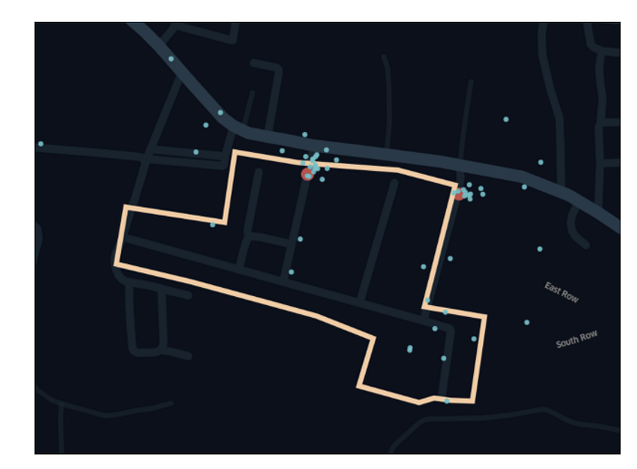
*Example: Low order volume PoI. The blue points are DPs pings, and red is the ground truth gate.*

We also observe that for order volume of 3 months, above 100 and below 7000 there were PoIs (about 30%) for which the following error modes emerged.

- _False Gates _— Some or all of the_ _clusters formed are aberrant, with a distance greater than 20 m from the ground truth. Thus, leading to false gates.
- _Missed Gates_ — Some or all of the ground truth gates weren’t recognized by the clustering algorithm, leading to missed gates.

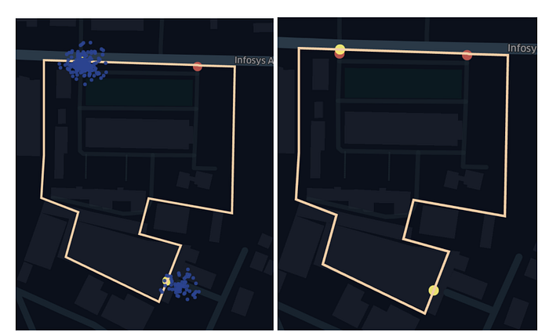
*Example: False Gate and Missed Gate Error Mode*

In the example above, the PoI has two actual entry gates marked as red points and two algorithmically identified gates marked as yellow in the image on the right. The image on the left illustrates the clusters where the cluster on the top identifies the actual gate, whereas the other cluster at the bottom-right of the image gives a _false gate_. The other ground truth gate is a _missed gate_ due to no clusters formed to identify it.

With increasing order volume for a PoI, we got clusters falsely representing gates and for very low order volumes we got no clusters. Therefore, we used a lower and upper bound of order volume. The hyperparameters were accordingly tuned during this qualitative evaluation of gates.

### Algorithm I: Clustering on Reached GPS Pings

The initial approach involves clustering on reached GPS pings of each order for 3 months for a PoI. We firstly preprocess these pings, that is, remove GPS pings that are highly inaccurate (GPS ping accuracy > 100 m). These preprocessed pings are taken as an input to the DBSCAN clustering algorithm. The system diagram for the algorithm is presented below.

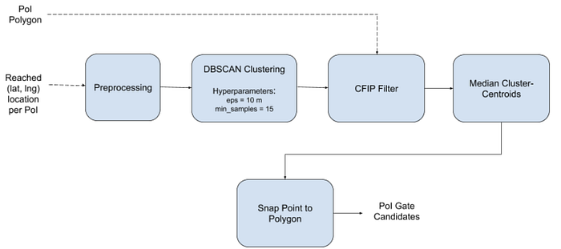

From anecdotal analysis, the confidence on gates when DPs mark reached at the boundary of the PoI was observed to be much higher than when DPs mark reached well within the PoI polygons. Examples of the same have been illustrated below.

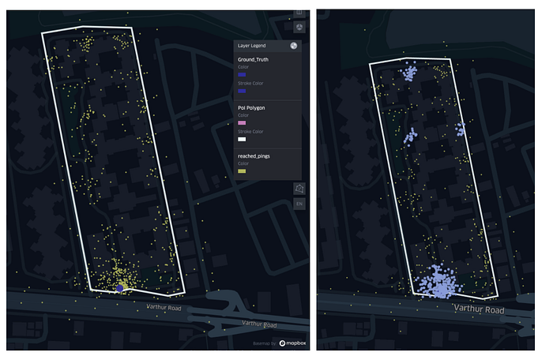
*Example1: Single-gate PoI*

The purple point in the left image is the ground truth entry gate. The yellow points are the dispersed reached pings marked by DPs that they mark on their phone mostly at the entry gates or parking spots near the sub-PoIs (buildings within the PoI). Also, the densest cluster observed in the right image is at that segment of the PoI boundary from where the DPs enter. An example for two gates PoI is given below.

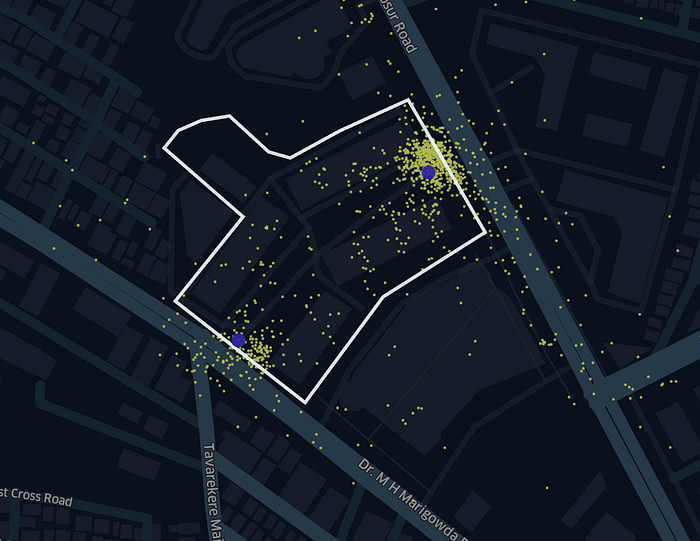
*Example2: Double-gate PoI*

Therefore, we define a metric, namely Cluster Fraction in Polygon (CFIP) to shortlist the most probable clusters for entry gates.

We evaluate the CFIP metric for each cluster DBSCAN gives as an output for each PoI. This metric is used to select “valid” clusters that lie close to the boundary of the PoI polygon. Mathematically, **Cluster Fraction inside Polygon (CFIP)** is defined as

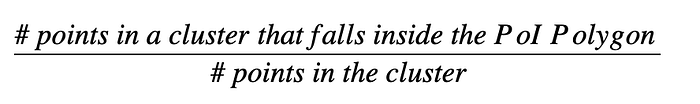

Thus, we declare clusters valid if 3 % <= CFIP < 98 % and discard invalid clusters. An example visualisation for a PoI is as follows.

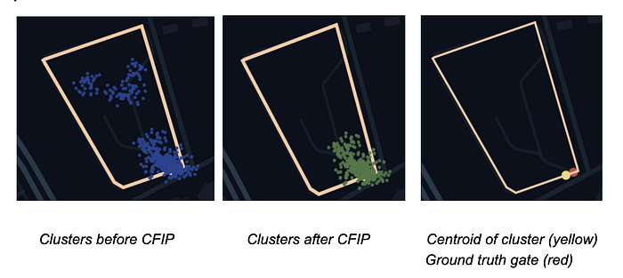

Lastly, we compute the median centroids of valid clusters and snap these cluster centroids to the nearest edge of the PoI polygon to get the algorithmic entry gate.

### Algorithm II: Intersection of DE Trajectories with Polygon Boundary

The second approach we tried has an input of PoI polygons and the DPs’ trajectories of orders delivered to the customers within the PoIs. We preprocess the trajectories and discard the highly inaccurate pings. Following this, we evaluated points of intersection between all the trajectories on the PoI polygon boundary. The below diagram is the pictorial representation of the intersection point of DP trajectory with the PoI boundary.

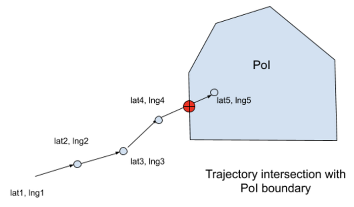
*Pictorial representation of how we get an intersection point of DP trajectory with the PoI boundary*

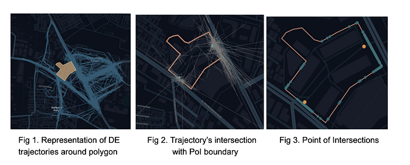

We run DBSCAN clustering on these intersection points and compute the median centroid to get the algorithmic gate. Below is the flowchart for the approach, and the identified gates plotted.

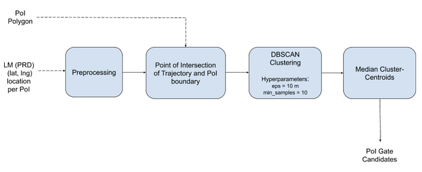

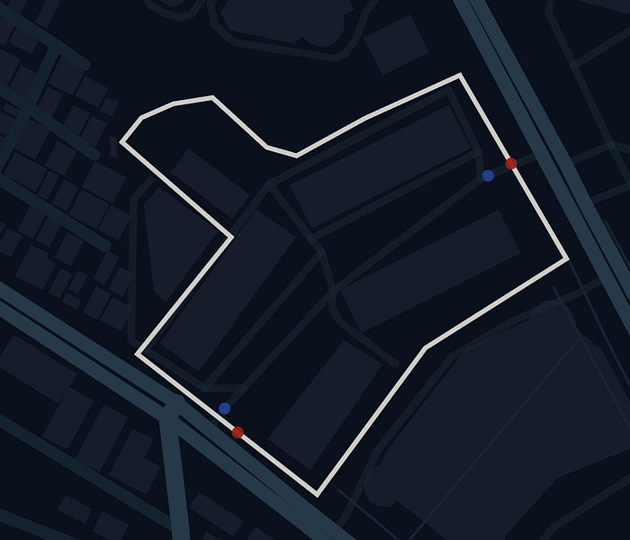
*Algorithmic Gates (Red) and Ground Truth Gates (Blue)*

## Evaluation Metrics

We present two metrics below, the first one is precision-recall based, and the second one is distance-based.

### Precision & Recall

_Algorithmically identified (AI) gate_: The point outputs of the algorithms, described in the sections above indicating the entry gates.

_Ground Truth (GT) gate_: The AI gates were manually validated. The AI gates provided an additional signal for manually rectifying the GT gates which were identified using satellite imagery.

_Definition:_ A** gate pair (AI gate, GT gate)** is said to be matched if they lie within a haversine distance of **20 m**.

Precision = #TP / (#TP + #FP),

Recall = #TP / (#TP + #FN).

_Definitions_

- True Positives (TP): Set of matched gate pairs (AI gate, GT gate).
- False Positives (FP): Set of non-matched AI gates.
- False Negatives (FN): Set of non-matched GT gates

We evaluated Precision and Recall on about 10,000 pan India PoIs stored in the database.

Single AI gate PoIs constitute about 65% of these PoIs and the rest are PoIs having at least two gates. We got the following results while evaluating:

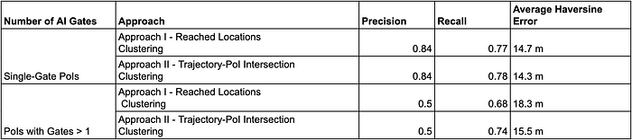

Our Ops team made use of these AI gates as evidence for manual validation to identify and rectify an entry gate of a PoI using Satellite imagery. Overall, about 60% PoIs in our database for which we evaluated the metrics, either of the approaches was helpful in identifying the gate. For 17% of these PoIs, the two approaches solely resulted in false gates or missed gates and hence were unsuccessful in identifying the gate. For the remaining PoIs, gates recognized only by Approach I and not Approach II were 9.5% PoIs, and gates recognized only by Approach II and not by Approach I were 13.5% PoIs.

## Conclusion

We propose two approaches to generate POI entry gates by estimating the centroid of the clusters formed by the DP reached ping data within POI as well as the intersection point between the last mile trajectory followed by the DP and the physical boundary of the POIs using DBSCAN clustering algorithm. We intend to enhance these techniques by using additional features related to speed and acceleration of the DP based on the pings data and take an ensemble of the two approaches, as some gates identified by approach I weren’t identified by approach II, and vice-versa. Validation of these entity points is a challenge as of now. Evaluating crowd-sourced validation of data and DPs feedback can overcome these limitations. Besides, to advance the quality of the entry gates data especially for 2-gate cases where error modes arise like false-positive gates or not identifying the other gate, we aim to formulate an adaptive way of choosing hyperparameters dependent on certain factors. Furthermore, we plan to benchmark DBSCAN against other clustering algorithms.

---
**Tags:** Swiggy Data Science · Machine Learning · Geospatial Intelligence · Points Of Interest · Metrics
