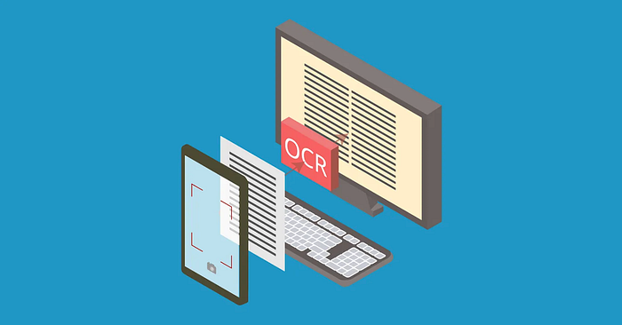
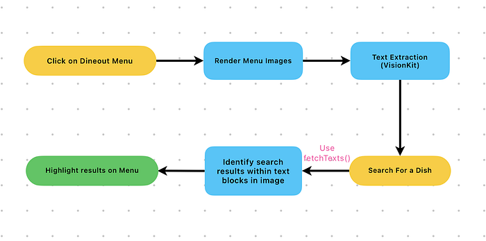

# Streamlining Menu Browsing with OCR Text Recognition



*Image credits: Getty Images*

In the vibrant world of modern dining, platforms like Swiggy’s Dineout offer endless culinary adventures. However, the excitement often wanes when navigating extensive restaurant menus becomes cumbersome. Searching for a favorite dish, like pizza, amidst a lengthy menu can be time-consuming and frustrating, leading to a sub-par user experience.

A solution is required to swiftly and precisely extract and search items from these menus, facilitating customers in effortlessly locating specific dishes. With Optical Character Recognition (OCR) technology, users can now effortlessly type in their desired dish and be swiftly directed to relevant menu sections with their preferences highlighted. This article delves into the iOS implementation of OCR, showcasing its potential to transform menu navigation and enhance the user experience.

### What’s the Problem?

In our quest to reimagine menu item navigation, we tried to target one major problem with the existing menus:

- **Tedious Search**: Searching for specific dishes like pizza can be time-consuming, and important items might be overlooked.

### The Vision Behind the Magic:

To simplify menu navigation, we utilized Apple’s [**VisionKit**](https://developer.apple.com/documentation/visionkit). This powerful framework provides a range of solutions for image analysis, including text recognition, which we have leveraged for our OCR process.

### Unlocking the Power of on-device OCR:

We utilise VisionKit’s **OCR** capabilities to extract text from images. On-device OCR processes images directly on the user’s device. VisionKit analyzes pixel information and isolates important data and extract text without the need for internet connectivity, ensuring privacy and real-time performance.

This is a crucial step as it transforms the visual data from the images into a format that can be processed and analysed in real-time. The extracted text is then indexed and made searchable, thus, enabling users to easily look for specific items.

### Seamless Search, Sensational Results:

Following text extraction, a **search functionality** allows users to input their desired item, **highlighting these items** within the menu. This simplifies the process of finding specific dishes or beverages, enhancing the overall user experience by making navigation more intuitive and less time-consuming.


*Flow for searching on menu*

The end result of this implementation is a more **user-friendly** solution for browsing restaurant menus. This is particularly beneficial for menus that span multiple pages, as it highlights the search results on all pages.

Now when you crave the same authentic Italian Margherita pizza, simply input “Margherita”, and like magic, the app dynamically highlights appropriate pizza options within the menu and takes you to the response.


*Search Experience on Dineout Menu*

In conclusion, our solution significantly improves the** ease and efficiency of menu navigation**, providing a more enjoyable and **convenient pre-dining experience** for all users.

### Implementation:

Ready to peek under the hood? In this section, we’ll dive into the technical magic behind our OCR integration. Discover how we transformed searching menus from a chore into a delightful experience.

We have created a function — `fetchTexts` to fetch the text from the given image and draw highlights around the text blocks identified when `isRender` is true else we call the function `didFinishDetection` with the string results. This function is explained in detail below:

```
/// Fetches the text from the given image and calls the appropriate method based on the `isRender` flag.
///
/// - Parameters:
///   - cgImage: The CGImage representation of the image.
///   - isRender: A Boolean value that determines whether to render the image or not.
///   - image: The UIImage representation of the image.
///   - searchText: The text to search for in the image.
    
    fileprivate func fetchTexts(_ cgImage: CGImage, _ isRender: Bool, _ image: UIImage, _ searchText: String?) {
        // 1
        let requestHandler = VNImageRequestHandler(cgImage: cgImage)
        // 2
        let request = VNRecognizeTextRequest { (request, _) in
            // 3
            guard let observations = request.results as? [VNRecognizedTextObservation] else {
                return
            }
            if let searchText, isRender {
                let boundingRects: [(frame: CGRect, string: String)] = observations.compactMap { observation in
                    
                    // 4
                    guard let candidate = observation.topCandidates(1).first else { return (.zero, "") }
                    
                    // 5
                    let stringRange = candidate.string.startIndex..<candidate.string.endIndex
                    let boxObservation = try? candidate.boundingBox(for: stringRange)
                    
                    // 6
                    let boundingBox = boxObservation?.boundingBox ?? .zero
                    let frame = self.getConvertedRect(boundingBox: boundingBox, inImage: image.size, containedIn: self.scaledSize)
                    return (frame, candidate.string)
                }
                for item in boundingRects {
                    // 7
                    self.drawBounds(item.frame, text: item.string, searchText: searchText)
                }
            } else {
                let mappedStrings: [String] = observations.compactMap { observation in
                    guard let candidate = observation.topCandidates(1).first else { return nil }
                    return candidate.string
                }
                // 8
                didFinishDetection(mappedStrings)
            }
        }
        // 9
        request.recognitionLevel = .accurate
        
        do {
            // 10
            try requestHandler.perform([request])
        } catch {
            print("Unable to perform the requests: \(error).")
        }
    }
}

// Steps 1 - 10 are explained below
```

This method utilizes VisionKit’s text recognition capabilities to extract text from a given image represented as a `CGImage`. It accepts parameters such as `isRender` to determine whether to render the image, `image` representing the UIImage representation of the image, and `searchText` specifying the text to search for in the image.

**Text Recognition Process**: Within the `fetchTexts` method, a `VNRecognizeTextRequest` is created to perform text recognition on the provided image. Detected text observations are obtained from the request results, and based on the `isRender` flag, either bounding rectangles and strings are extracted for rendering highlights on the image, or the recognized strings are mapped and passed to the `didFinishDetection` method. Step-by-step explanation of how the code works:

1. Create image request handler for searching in the image
2. Create a VisionKit request to convert the image to smaller blocks with text
3. Extract the result of OCR as array of smaller text blocks
4. Find the top observation — i.e. most probable result
5. Find the bounding-box observation for the string range.
6. Get the normalized CGRect value for the frame of observation.
7. Draw the highlights for the searched text around the frames from last step. (Implement a drawBounds function for this)
8. Call completion handler for detected texts with the array of strings identified
9. The recognition level for image request handler is set as accurate. There are two recognition levels provided for the same: `accurate` and `fast`
10. Perform the text-recognition request in try catch block

### Menu Mastery: Impact and Beyond

The adoption of OCR technology heralds a new era of dining discovery on Swiggy Dineout, with far-reaching implications for users and restaurateurs alike. The impact extends beyond mere convenience, encompassing:

- **Informed Decision Making**: Users can effortlessly search for their favorite items amidst extensive menu listings.
- **Intuitive Interface**: Our solution offers a visually engaging and user-friendly experience.

### Conclusion

As the culinary landscape continues to evolve, our commitment to innovation remains unwavering. With OCR technology as our guiding light, we’ve embarked on a journey to redefine the way users discover and savor the flavors of the world. Together, let us unlock the menu magic and embark on a culinary adventure like never before. Welcome to a world where every dish tells a story, and every bite is a revelation — welcome to the future of dining discovery on Swiggy Dineout.

The potential of VisionKit extends beyond Swiggy Dineout. Other apps can also leverage its powerful text recognition capabilities to enhance user experiences across various domains, from document scanning to real-time translation. As for Swiggy, the possibilities with VisionKit are vast. Imagine using it to detect allergens, suggest popular dishes, or even provide nutritional information at a glance. By continuing to explore and innovate with VisionKit, Swiggy can further revolutionize the way we interact with food, making dining not only more convenient but also more informed and enjoyable.

Special thanks to [Darshita Golchha](https://medium.com/u/94206509fe3b?source=post_page---user_mention--71e89f5bda28---------------------------------------), [Priyam Dutta](https://medium.com/u/828c8792b774?source=post_page---user_mention--71e89f5bda28---------------------------------------), [Agam Mahajan](https://medium.com/u/ede4f93130a7?source=post_page---user_mention--71e89f5bda28---------------------------------------), [Raj Gohil](https://medium.com/u/1bf9bdb89775?source=post_page---user_mention--71e89f5bda28---------------------------------------), [Tushar Tayal](https://medium.com/u/400467f4ffab?source=post_page---user_mention--71e89f5bda28---------------------------------------), [Preetichandak](https://medium.com/u/881f7762391?source=post_page---user_mention--71e89f5bda28---------------------------------------) and [Saptarshi Prakash](https://medium.com/u/afd6d52c92c2?source=post_page---user_mention--71e89f5bda28---------------------------------------) for the execution of this project.

---
**Tags:** IOS · Ocr · Swiggy · Swift · Vision Kit
