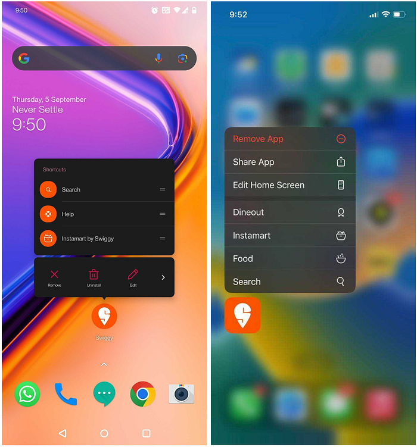
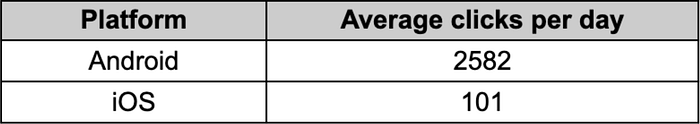
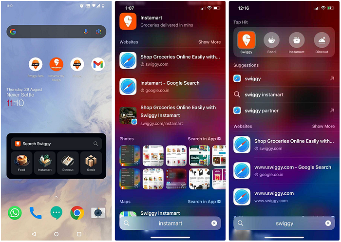
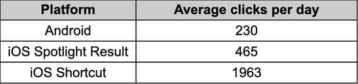
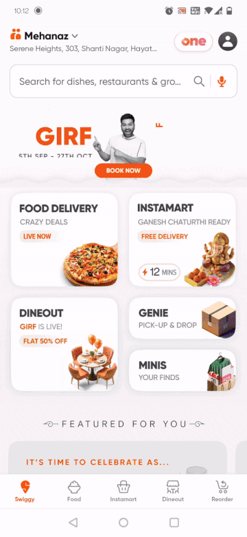
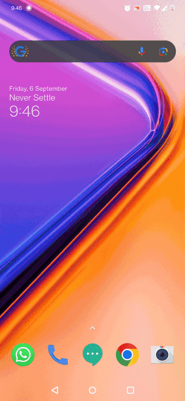
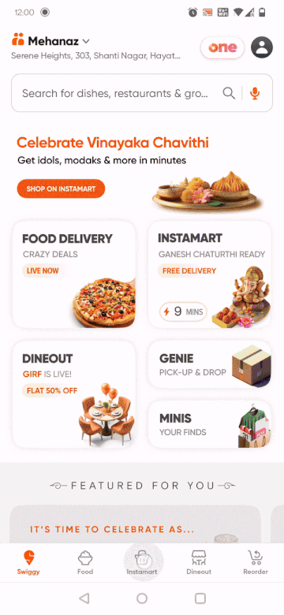
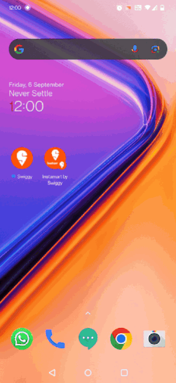

# Super Discoverability for a Super App


*Image by Freepick*

Swiggy operates multiple business lines and offerings through a single app. As the business lines grow and occupy more space in a user’s mind, we are working towards incrementally improving the discoverability space occupied on the user’s mobile.

One challenge that is unique to Swiggy is the business line’s availability is location-dependent, hence the capability we use needs to be dynamic which can be toggled at runtime.

This article contains various things we have done to leverage the capabilities of Android and iOS to surface our offerings. The article details the touchpoints and the impact each of these implementations has brought. It also discusses how multifold benefits can be reaped with user onboarding and consent journeys.


---

## Dynamic Shortcuts on Android and Dynamic Quick Actions on iOS

Android and iOS allow apps to showcase shortcuts to users whenever they long-press the app icons. These are called dynamic shortcuts on Android and dynamic quick actions on iOS. The framework gives you control over the availability of these shortcuts based on any business logic. In our case, for example, Instamart is not present in all cities where Swiggy is operating, so we add the Instamart shortcut only in cities where it is available.


*Dynamic Shortcuts on Android and Dynamic Quick Actions on iOS*

**Android**

The Android developer’s [article](https://developer.android.com/develop/ui/views/launch/shortcuts/creating-shortcuts) is comprehensive and captures details of creating all kinds of shortcuts  
In short, the following code will render the Instamart dynamic shortcut on Android.

```
val shortcut = ShortcutInfoCompat.Builder(context, "id1")
        .setShortLabel("Instamart by Swiggy")
        .setIcon(IconCompat.createWithResource(context, 
                 R.drawable.instamart_shortcut))
        .setIntent(Intent(Intent.ACTION_VIEW,
                Uri.parse("https://www.swiggy.com/instamart")))
        .build()
if(isInstamartAvailable){
  ShortcutManagerCompat.pushDynamicShortcut(context, shortcut)
}
```

**iOS**

[This](https://developer.apple.com/documentation/uikit/menus_and_shortcuts/add_home_screen_quick_actions) Apple developer page provides information about creating and operating static and dynamic quick actions.  
The following code block shows how to create a dynamic quick action for Instamart.

```
var shortcutItems = UIApplication.shared.shortcutItems ?? []
if let existingShortcutItem = shortcutItems.first {
    guard let mutableShortcutItem = existingShortcutItem.mutableCopy() as? UIMutableApplicationShortcutItem
        else { preconditionFailure("Expected a UIMutableApplicationShortcutItem") }
    guard let index = shortcutItems.index(of: existingShortcutItem)
        else { preconditionFailure("Expected a valid index") }

    mutableShortcutItem.localizedTitle = "Instamart"
    shortcutItems[index] = mutableShortcutItem
    UIApplication.shared.shortcutItems = shortcutItems
}
```

Handling is based on localizedTitle and done in this manner from the AppDelegate

```
func application(_ application: UIApplication, performActionFor shortcutItem: UIApplicationShortcutItem, completionHandler: @escaping (Bool) -> Void) {
    SwDeeplinkCoordinator.shared.deeplinkOriginScreen = .appDelegate
    AppProvider.settingsProvider.appLaunchEventModel = AppLaunchEventModel(source: .forceTouch)
    return completionHandler(handleShortCutItem(shortcutItem: shortcutItem))
}

private func handleShortCutItem(shortcutItem: UIApplicationShortcutItem) -> Bool {
    guard let identifier = QuickActionUtility.Identifier(rawValue: shortcutItem.type) else {
        return false
    }
    if(identifier == "Instamart"){
      launchIntamart()
      return true
    }
}
```

The following table shows the number of clicks being recorded for the Instamart shortcut/option on each platform per day



Implementation is straightforward but even after being a capability offered across devices and operating systems, it is not a popular option in terms of usability and users don’t seem to be using it much.


---

## Widgets on Android and iOS Spotlight and Shortcuts

Widgets have been present in Android for a long time. Spotlight search has been available on iOS. An improvement on the spotlight search was made by introducing the shortcuts capability in iOS 17


*Widgets on Android, Spotlight search and Shortcuts on iOS*

**Android**

This [article](https://developer.android.com/develop/ui/views/appwidgets) from Android developers is a good starting point for creating your widgets

In a nutshell, it has three components

AppWidgetProviderInfo — This defines the widget configuration

```
<appwidget-provider xmlns:android="http://schemas.android.com/apk/res/android"
    android:minWidth="@dimen/dimen_320dp"
    android:minHeight="@dimen/dimen_158dp"
    android:targetCellWidth="4"
    android:targetCellHeight="3"
    android:updatePeriodMillis="86400000"
    android:description="@string/app_widget_description"
    android:initialLayout="@layout/preview_layout"
    android:previewImage="@drawable/preview_image"
    android:previewLayout="@layout/preview_layout"
    android:widgetCategory="home_screen">
</appwidget-provider>
```

AppWidgetProvider — This is responsible for maintaining the state

```
class SwiggyNavTileWidget : AppWidgetProvider() {

    override fun onUpdate(
        context: Context,
        appWidgetManager: AppWidgetManager,
        appWidgetIds: IntArray) {
        ...
    }

    override fun onEnabled(context: Context?) {
        super.onEnabled(context)
        ...
    }

    override fun onDisabled(context: Context?) {
        super.onDisabled(context)
        ...
    }

    override fun onReceive(context: Context?, intent: Intent?) {
        super.onReceive(context, intent)
        ...
    }
}
```

View Layout — This defines how the widget would look like

```
<LinearLayout xmlns:android="http://schemas.android.com/apk/res/android"
    android:orientation="vertical">

    <LinearLayout
        android:id="@+id/search_bar"
        android:orientation="horizontal">

        <ImageView
            android:src="@drawable/swiggy" />

        <TextView
            android:text="@string/search_swiggy"/>

        <ImageView
            android:src="@drawable/search_icon" />
    </LinearLayout>

    <LinearLayout
        android:orientation="horizontal">

        <ImageView
            android:src="@drawable/food" />

        <ImageView
            android:src="@drawable/instamart" />

        <ImageView
            android:src="@drawable/dineout" />

        <ImageView
            android:src="@drawable/genie" />

    </LinearLayout>
</LinearLayout>
```

A broadcast receiver ties up the entire thing to the system

```
<receiver android:name="in.swiggy.android.launcherwidgets.SwiggyNavTileWidget">
  <intent-filter>
    <action android:name="android.appwidget.action.APPWIDGET_UPDATE" />
      </intent-filter>
        <meta-data
          android:name="android.appwidget.provider"
          android:resource="@xml/nav_tile_widget_info" />
 </receiver>
```

**iOS Spotlight Search  
**[This](https://developer.apple.com/documentation/corespotlight/adding-your-app-s-content-to-spotlight-indexes) article from Apple talks about adding search terms for your apps to the spotlight index  
In short, you will need to make the following changes

```
func addSpotlight(itemName: Dictionary<String,String>) {
    let attributeSet = CSSearchableItemAttributeSet(itemContentType: kUTTypeText as String)
    attributeSet.title = itemName[SpotlightConstants.title]
    attributeSet.contentDescription = itemName[SpotlightConstants.description]
    let searchableItem = CSSearchableItem(uniqueIdentifier: Spotlight.Identifer.cart,
                                          domainIdentifier: Spotlight.Domain.openFoodCart,
                                          attributeSet: attributeSet)
    CSSearchableIndex.default().indexSearchableItems([searchableItem], completionHandler: nil)
}
```

**iOS Shortcuts  
**We are using [AppShortcutsProvider](https://developer.apple.com/documentation/appintents/appshortcutsprovider) to implement these shortcuts.  
There is an upcoming blog that talks about this in great detail. It will be linked in the comments as soon as it goes live.

The following table shows the number of clicks being recorded for the Android widgets and iOS spotlight search and iOS shortcut clicks for the Instamart option per day



The implementation is not easy in Android and the users are using widgets less with each new Android update. A user onboarding journey wasn’t created given the low adoption of Android widgets in the peer group.

Shortcuts on iOS have brought down our spotlight search results clicks and with more users updating to newer versions of iOS, we expect this number to go higher.


---

## Multiple Launcher Category Activities in Android

**android.intent.category.LAUNCHER **informs the Android launcher that it should render this Activity as an entry point for the app. Normally apps declare a single launcher Activity. We have taken a bet to declare multiple launcher activities and see if we get good traction for our other offerings.

A user onboarding journey is showcased as a half card for users who have more than **5** Instamart orders so that they can choose to create a shortcut for Instamart on their app drawer.


*Onboarding journey to nudge users to add a shortcut*


*Launchers now support looking up Instamart through search*

It is a simple implementation to declare an Activity alias in the manifest

```
<activity
    android:name=".activities.IMLauncherActivity"
    android:launchMode="singleTask"
    android:icon="@mipmap/im_launcher_icon"
    android:enabled="false"
    android:exported="true">
        <intent-filter>
            <category android:name="android.intent.category.LAUNCHER" />
        </intent-filter>
</activity>
```

It is disabled by default, we enable it in the code once users consent to create a shortcut for Instamart.

```
context.packageManager.setComponentEnabledSetting(
    componentName,
    PackageManager.COMPONENT_ENABLED_STATE_ENABLED,
    PackageManager.DONT_KILL_APP
)
```

The following table shows the number of clicks being recorded for the Android Activity


It is a simple yet powerful idea providing users to create shortcuts for the most used features of the app and hooking it into the default functionality of the operating system like a launcher search.


---

## Implementing Pinned Shortcut and Label Changes

Though the launcher category provided phenomenal results, a few things had a scope for improvement. A lot of users would be accessing Swiggy directly via the launcher home. Even in the app drawer, it was possible that many users would be searching for Swiggy not realizing there would be an Instamart shortcut.


*User journey with a pinned shortcut*


*Launcher search using Swiggy search term*

We changed the label from Instamart to **Instamart by Swiggy **which would bring this up as a search result for both **Instamart** and **Swiggy** search terms

Initial data suggests the clicks on the app drawer entry go up by **30%** after the label changes

The following code shows how to create a [pinned shortcut](https://developer.android.com/develop/ui/views/launch/shortcuts/creating-shortcuts#pinned)

```
val shortcutIntent = Intent(context, IMLauncherActivity::class.java).apply {
    action = Intent.ACTION_VIEW
    putExtra(IS_FROM_PINNED_SHORTCUT, true)
}

val shortcut = ShortcutInfoCompat.Builder(context, SHORTCUT_ID)
    .setShortLabel(LABEL)
    .setLongLabel(LABEL)
    .setIcon(IconCompat.createWithResource(context, `in`.swiggy.android.R.mipmap.im_launcher_icon))
    .setIntent(shortcutIntent)
    .build()

ShortcutManagerCompat.requestPinShortcut(context, shortcut, null)
```

We are shipping the changes of adding a pinned shortcut with our next release. A comment will be added on how users react to the pinned shortcut implementation and what kind of traction we see there.   
A few limitations of this approach are   
 • Minimum supported version is Android 8 (Oreo)  
 • A pinned shortcut can only be disabled and cannot be removed programmatically


---

In summary, a super app gives a lot of advantages in terms of maintenance, reusability, cleaner code, and a huge audience being able to discover new offerings easily.  
The small disadvantage is the space it occupies on a user’s phone compared to running multiple apps with focused offerings.  
We are invested in improving the discoverability of various offerings by Swiggy.

_Thanks to Tarun Mehta, Varun Gupta_,_ Darshil Agrawal, and Parth Nenava for implementing the features highlighted in the article. Sincere gratitude to _[_Tushar Tayal_](https://www.linkedin.com/in/ttayal/)_ and _[_Sambuddha Dhar_](https://www.linkedin.com/in/sambuddha-dhar-84769356/)_ for reviewing and providing feedback to improve the article._
