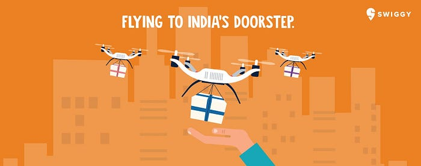
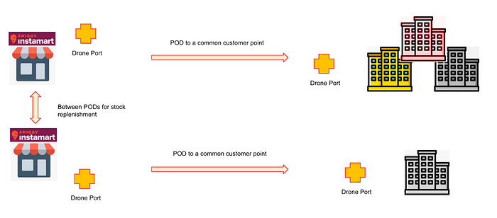

# Swiggy awards contracts for its drone trials

When we made the call for RFP for Drones as a Service a few weeks back, we did not expect the overwhelming response we got. Over 345 registrations in total. After an extensive evaluation process covering legal, financial, and technical rounds, we finalised the award of the RFP.

The pilot will be executed in two tranches,

**Tranche 1 — Garuda Aerospace Pvt. Ltd.** (_in Bengaluru)_ and **Skyeair Mobility Pvt Ltd. (**_in Delhi — NCR). _The pilot will start with immediate effect.

**Tranche 2 — ANRA + TechEagle Consortia** and **Marut Dronetech Pvt. Ltd. **The pilot will commence after collating the learnings from the first tranche.

## What is the Pilot about?

The pilot is to evaluate the feasibility of drones for the middle mile use case, particularly for Swiggy’s grocery delivery service Instamart. Drones will be used to replenish stocks between seller-run dark stores and from a store to a common customer point. A delivery partner will then pick up orders from the common point and deliver them to the customer’s doorstep.

## Why the Tranches?

We have finalised 4 vendors in two tranches who have a mix of capabilities in drone hardware, potential to scale up, investment in innovation, research and development, and the overall ability to deliver the service.

Tranche 1 will start from the first week of May and tranche 2 will commence after we get results from the former. Our intent is to use valuable learnings from the first tranche and design a tranche 2 experiment to specifically address any shortcomings that are identified.

## Looking ahead

The pilot will commence in Bengaluru and Delhi-NCR with Garuda Aerospace and Skyeair Mobility. Based on the progress, expansion will take place in the region and beyond.

This is an exciting and challenging journey.

We look forward to working with our partners and using the findings from these pilots as the stepping stone in unearthing possibilities for drone-assisted deliveries in the e-commerce space.

## About the companies

- [Garuda Aerospace Private Limited](https://www.garudaaerospace.com/about.html) Over the years this company has provided drone-based solutions, as well as related software and analytical tools, to boost productivity in businesses . They have designed drones for diverse applications and have clients in the government and private sectors all around India.
- [Skyeair Mobility Pvt Ltd.](http://skyeair.tech/) has been extensively working in the Healthcare and E-commerce industries with government and private projects
- [ANRA Technologies](https://www.anratechnologies.com/home/) **+ **[TechEagle](https://www.techeagle.in/) Consortia. Swiggy has worked with ANRA technologies last year for the BVLOS experiments. They are known globally as a drone service provider and for their airspace solutions.
- [Marut Dronetech Pvt. Ltd.](https://www.marutdrones.com/) ‍has been at the forefront of developing end-to-end, sustainable solutions for persisting social and ecological issues by integrating emerging technologies of drones, AI, Data Science, and IoT.

---
**Tags:** Drones · Drone Service · Drone Delivery · Swiggy Research · Innovation
