# Swiggy Design Language System

> Foundation that drives Swiggy’s brand new UI experience.

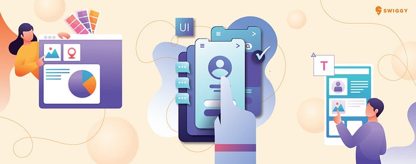

In this article I am going to briefly describe about Swiggy’s own Design Language and how did we integrate it with our storefront app.

## A brief background:

> Last year we started Project **UX4.0** which is to redesign Swiggy’s consumer app. This completely changed the way we used to follow design requirements. Being a UI heavy application like Swiggy, we agreed on the fact that it definitely needs:**1. Strong design guidelines:** Mobile/Web development requires design mocks before implementation. With different designers, similar UIs should not have different design tokens(size, color, fonts etc). For example, a button which is reused in multiple screens should have exact same design tokens for all the screens.  
> **2. Refined way of designing: **Pre-define a set of design tokens, and pre-build UI components, which can be reused for all design mocks. This also aggregates all such tokens and layouts at a single place which is very easy to maintain and scale.**3. Streamlined design sign-off process: **Consistency in the design for all the products, helps design team to quickly review the product post development and increase productivity and decrease release timeline.**4. Design consistency across platforms: **Common design guidelines for all platforms(Android/IOS/WEB).

## Introducing DLS(Design Language System)

After several month’s discussion among developers and design team, we had come up with the option of creating a framework which solves all the requirements mentioned above. We decided to build a library/SDK which is very easy to integrate and applications will completely rely on this as a design inventory to build new products/features.

In one sentence:

“_This library drives the foundation of Swiggy’s UI_”

## Understanding DLS:

**Design language system(DLS)** combines the set of reusable design tokens, components, standards and documentation. It facilitates the design and development team to reuse the tokens, components. It also defines a set of rules and principles to build components which ensures consistency in user experience across all platform. From a developer perspective it’s very easy to consume these tokens and components and build new UIs which reduces the development effort and product release timelines significantly.

## DLS Architecture:

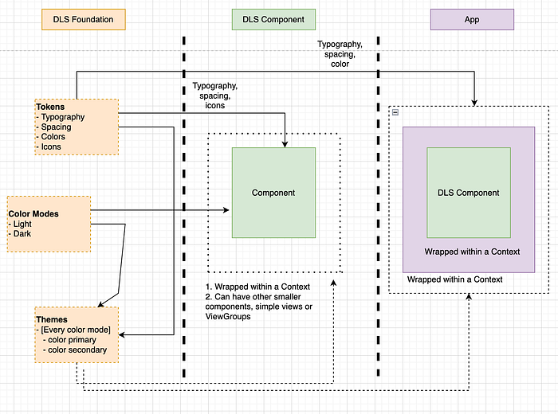
*DLS Architecture*

DLS architecture is based on two major parts.

1. **Foundation**: This is the granular part of DLS. This consists of:  
a. **_Tokens_**: These are the molecular values needed to build and maintain a design system. This comprises of:

- **Typography**(text size, fonts etc)

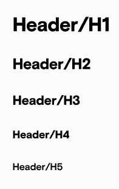
*Example of DLS Typography*

- **Spacing**(pre-defined dimensions for item spacing)

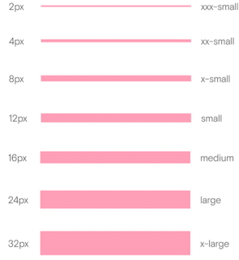
*DLS Spacing tokens*

- **Icons**(set of commonly used icons)

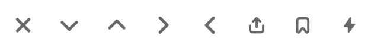
*DLS Iconography*

- **Colors**(base colors) Ideally these tokens should not be directly used except for some special cases. These should be wrapped within themes or color tokens.

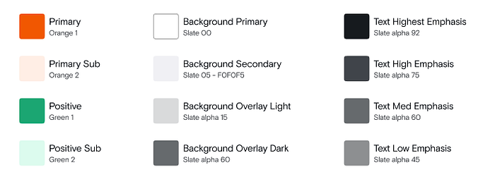
*Color tokens with light color mode*

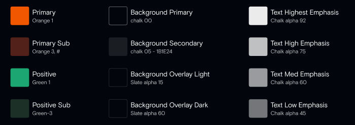
*Color tokens with dark color mode*

b. **_Color Modes_**: Color modes are different sub-language of a visual language(theme). This is largely used to fulfil user display preference. DLS supports two color modes as of now.  
 - light  
 - dark  
 This can be extended to more(High contrast etc.).

c. **_Themes_**_: _These are objects of certain shape that contain a set of design tokens, which collectively describe a particular visual language. For example: Storefront Theme is the basic theme for Storefront widgets. Gourmet theme is specific to Gourmet pages.

**2. Components: **DLS components are reusable, predefined set of Views/View Groups which can be consumed by application based on requirements. These can be independent or compound components. Independent components are simple part of a complex layout (ImageView, Buttons etc.) whereas compound components are conjunction of one/more independent components and tokens. For example Image Card is an independent component, whereas RestaurantList is a compound component.


*Image Card Component*

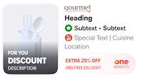
*Restaurant List Component*

> DLS components are always wrapped with a context which has the theme and color mode information. This information is used to identify the color tokens to be used in that component. So, DLS components never use color tokens directly.


---

## DLS Integration with APP:

Starting with UX4.0, each feature will use DLS tokens and components for design requirements. In this section I will discuss how we integrated DLS tokens and components with examples and code snippets. I will be using Android examples as I am more into Android development :D .

To integrate DLS library, we need to add the gradle dependency in the **build.gradle** file.  
`implementation("in.swiggy.android:dls:$dlsVersion")`

**_Using DLS tokens Directly_**_:_

DLS tokens can be used independently in any of the views.

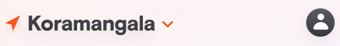
*Location Header*

In this example, for the **text view(Kormangala)** I am going to use DLSTextView, a wrapper over AppCompatTextView provided by DLS library which enforces to use DLS tokens and themes.

```
<in.swiggy.android.dls.textview.DlsTextView
 android:id="@+id/heading"
 android:layout_width="0dp"
 android:layout_height="wrap_content"
 android:layout_marginTop="@dimen/spacing_x_small"
 android:ellipsize="end"
 android:maxLines="1"
 android:theme="@style/Theme.Swiggy.Storefront.Light"    
 app:dlsTextColor="text_color_highest_emphasis"
 app:dlsTextStyle="h3"
 android:importantForAccessibility="no"
 app:layout_constraintEnd_toEndOf="@id/imageCard"
 app:layout_constraintStart_toStartOf="@id/imageCard"
 app:layout_constraintTop_toBottomOf="@id/imageCard"
 tools:text="Koramangala" />
```

Here we need to focus on two things:

1. DlsTextView is enforcing developer to use dlsTextColor and dlsTextStyle attributes, which internally translates to DLS typography and color tokens.
2. It’s mandatory to wrap DlsTextView with DLS theme attribute. Although, it is also acceptable that the parent container which holds this DlsTextView already wrapped with a DLS theme attribute.

**_Using DLS Independent Components_**_:_

While creating a compound layout, we can use prebuilt DLS components independently.

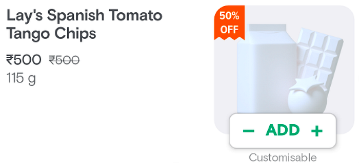
*Restaurant Dish Item*

For the above layout we used DLS ImageCard component for the right side image view. Internally, ImageCard is a CardView with an integrated ImageView.

```
<in.swiggy.android.dls.imagecard.ImageCard
    android:id="@+id/product_card"
    android:layout_width="@dimen/dimen_156dp"
    android:layout_height="@dimen/dimen_144dp"
    android:onClick="@{vm.onImageClick}"
    android:visibility="@{vm.productImageVisibility}"
    app:assetId="@{vm.assetId}"
    app:cardBackgroundColor="?attr/colorBackgroundSecondary"
    app:imageCardCornerRadius="@dimen/dimen_16dp"
    app:imageCardElevation="@dimen/dimen_0dp"
    app:imageCardPlaceholder="@drawable/im_placeholder_transparent"
    app:imageLoader="@{vm.imageLoader}"
    app:imageUrlBuilder="@{vm.imageUrlBuilder}"
    app:layout_constraintEnd_toEndOf="parent"
    app:layout_constraintTop_toTopOf="parent">

    <in.swiggy.android.view.DiscountRibbon
        android:id="@+id/discount_ribbon"
        android:layout_width="wrap_content"
        android:layout_height="wrap_content"
        android:layout_gravity="top|start"
        android:theme="@style/Theme.Swiggy.Storefront.Dark"
        android:visibility="@{vm.discountRibbonVisibility}"
        app:discount="@{vm.discount}"
        app:ribbonColor="@{vm.discountRibbonColor}"
        app:ribbonPaddingBottom="@dimen/dimen_4dp"
        app:ribbonPaddingEnd="@dimen/dimen_6dp"
        app:ribbonPaddingStart="@dimen/dimen_6dp"
        app:ribbonPaddingTop="@dimen/dimen_4dp"
        app:ribbonTextSize="@dimen/dimen_13sp" />

</in.swiggy.android.dls.imagecard.ImageCard>
```

**_Using DLS Compound Components_**_:  
_We can use built in compound components as well from DLS library.

> Note: The decision of making a DLS compound component is based on the following facts:   
> 1. Reusability  
> 2. Less configurability: This means even if two different components visually looks same, it depends on the difference of their data set whether to merge them in a single component

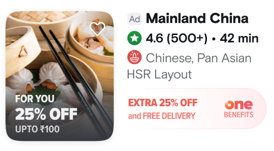

```
<in.swiggy.android.dls.restaurantlist.RestaurantListItem
    android:id="@+id/dls_search_res_item"
    android:layout_width="match_parent"
    android:layout_height="wrap_content"
    android:theme="@style/Theme.Swiggy.Storefront.Light"
    app:dataModel="@{vm.asDataModel()}" />
```

app:dataModel=”@{vm.asDataModel}”

The above line of code is to set the corresponding data model for the component. **Data Model **is the api exposed by DLS library to set/update data to be populated in the UI. Before integrating any compound component, it’s recommended to verify and understand it’s DataModel. There is a separate foundation repository maintained, that documents all the DataModels for all the compound components.

```
// Creating a DataModel
fun asDataModel(): RestaurantListDataModel {
    val rating: String = ""

    val logoImage = ""

    val imageData = null

    val subText: SubtextType = SubtextType.WithoutIcon(duration)

    return RestaurantListDataModel(
        restaurantName,
        getDescriptionType(),
        area,
        rating,
        subText,
        offerData,
        isPromoted,
        !isOpen.get(),
        restaurant.availability?.inActiveMeta?.inactiveTitle,
        restaurant.availability?.inActiveMeta?.inactiveSubtitle,
        nextOpenMessage,
        contentDescription,
        actionContentDescription,
        imageData,
        oneLabelInfo,
        logoImage
    )
}
data class RestaurantListDataModel(
    val title: String,
    val description1: DescriptionType,
    val description2: String,
    val subtext1: String,
    val subtext2: SubtextType,
    val offerData: OfferData?,
    val isPromoted: Boolean?,
    val isInactive: Boolean?,
    val inactiveTitle: String?,
    val inactiveSubtext: String?,
    val inactiveDescription: String?,
    val accessibilityLabel: String,
    val accessibilityCtaLabel: String,
    val imageData: ImageData?,
    val oneLabel: OneLabel?,
    val logoImage: LogoImage?,
)
```

> Before using DLS component, it’s recommended to verify and understand the usability of any component/tokens in its DLS Playground APP.


---

**Future Goals:**

DLS library is continuously growing with new components. We will integrate this library for all its services(Instamart, Genie etc). We are also monitoring performance of each component and will keep on optimising to achieve the best user experience.


---

By this time I hope it’s pretty much clear what DLS library is and how we integrated this in our Swiggy Consumer APP. Feel free to give any suggestions or feedback. Thanks for reading this blog and happy coding.

## Acknowledgments

> I am Sambuddha Dhar from Android Mobile team at Swiggy. I would like to thank my colleagues [Rajender Gohil](https://medium.com/@rajgohil044) ,[ Anik Raj](https://medium.com/@anikrajc), Naveen Kumar, Nihar Ranjan and my manager [Tushar Tayal](https://medium.com/@tushar.tayal_43056.) for helping me in finishing this blog.

---
**Tags:** Design Language System · Mobile App Development · Swiggy Mobile · UI · User Experience
