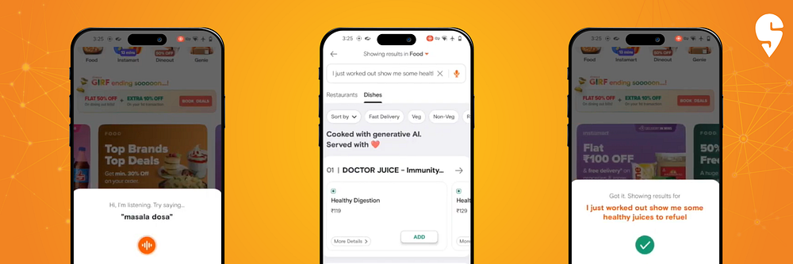

# Swiggy’s Generative AI Journey: A Peek Into the Future

- _Swiggy’s AI-powered neural search helps users discover food and groceries in a conversational manner, receiving tailored recommendations_.
- _Swiggy will use Generative AI techniques for a Dineout conversational bot, guiding users to preferred restaurants while dining out_.
- _Swiggy is also building generative AI-led solutions for its ecosystem of restaurant and delivery partners._

With the remarkable progress in Generative AI, the way customers interact with technology has undergone a significant transformation. At Swiggy, we have taken a lead in using generative AI techniques to build products and services to enable intuitive ordering experiences. We understand that choosing what to order from the multitude of options available on our app can often be a daunting task. Swiggy has heard your feedback, and with neural search, we aim to alleviate this pain point and make decision-making a fun and effortless process. Swiggy’s neural search enables users to search using conversational and open-ended queries and receive recommendations tailored to their specific needs. This makes it easier for consumers to find what they’re looking for without having to use or remember specific keywords.

Imagine being able to type queries like, _“I just finished my workout. Show me healthy lunch options_,” or “_Show me vegan-friendly starters”_ Swiggy’s neural search understands these open-ended, conversational queries and provides you with personalized recommendations. The neural search capability has been built using a Large Language Model (LLM), adapted to understand the terminology related to dishes, recipes, and restaurants and Swiggy-specific search data. We have 50 million-plus items in our food catalog covering a wide variety of options. Through a meticulous two-stage process, the model has been fine-tuned to respond accurately to relevant food-related queries, in real-time. These capabilities have been developed in-house, giving us greater control over the product, faster iteration time, and the flexibility to adapt to changing market trends.

Here’s a demo video of the neural search.

Swiggy’s neural search feature will be in pilot by September and based on the learning and results, we hope to roll it out to all search traffic in our app. This functionality not only improves the discoverability of specific items but also opens up the top of the funnel for broader queries. **Additionally, neural search will soon support voice-based queries and queries in select Indian languages, making it even more accessible to users across different language preferences.**

At Swiggy, we understand that unfamiliar dish names can sometimes be perplexing. That’s why we have leveraged generative AI techniques to enrich our catalog with images and detailed descriptions of items. Whether it’s the enticing “Chicken Dominator” pizza or the popular breakfast item “Nool Appam” from Kerala, our enhanced catalog empowers you to make informed decisions with increased visual coverage and comprehensive dish descriptions.

The Generative AI efforts at Swiggy also go beyond just food. **We are integrating neural search into Swiggy Instamart, where customers can discover groceries and household items in a conversational manner, making shopping more intuitive and efficient.**

**Swiggy Dineout, our restaurant discovery platform, is another area where we are harnessing Generative AI techniques to transform the way consumers explore dining options. Our unique Dineout conversational bot acts as your virtual concierge, guiding you to restaurants that meet your preferences, be it ambience, kid-friendliness, valet parking, ratings, cost, to name a few**.

In our pursuit of enhancing customer service, we are collaborating with a third-party to develop a GPT-4 powered chatbot. This bot will enable efficient and empathetic service to oft-asked customer queries, ensuring a seamless and delightful experience.

We are also building generative AI-led solutions to better serve our restaurant and delivery partners. For example, we are piloting in-house tuned LLMs to empower restaurant partners to self-serve on processes and questions related to onboarding, ratings, payouts, etc, leading to faster issue resolution and streamlining. A conversational assistant powered by this LLM will be available in the restaurant-owner app and via WhatsApp.

The Generative AI story at Swiggy has only just begun, and we are excitedly working towards a future where these methods work hand in hand with human intelligence to serve our customers better than ever before and unlock immense business value.

---
**Tags:** Generativeai · Swiggy Data Science · Neural Search · Conversational AI · OpenAI
