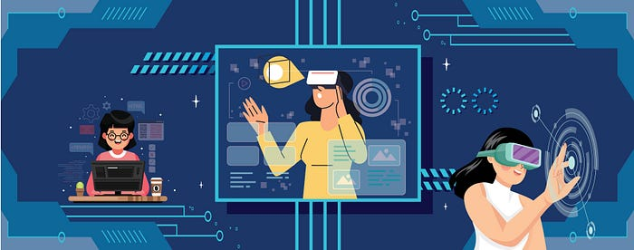
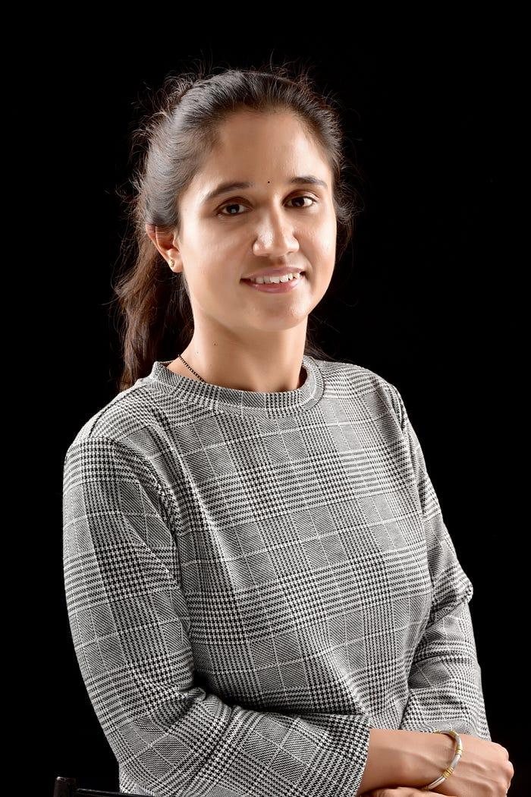
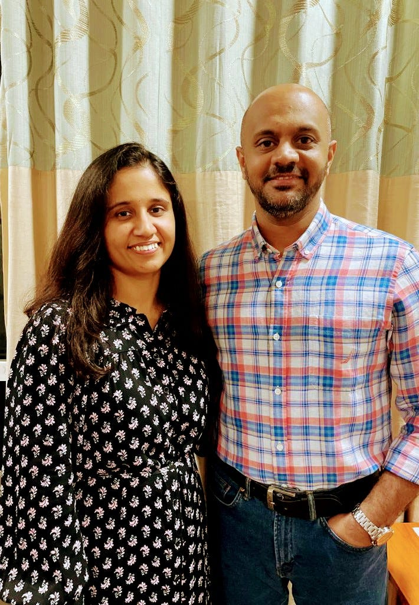

# Swiggy’s leading lady of data science

As the Assistant Vice President — Data Science at Swiggy, Goda Doreswamy Ramkumar is busy making sure you get your orders right. So it’s hard to imagine that if things had gone a different path, we would probably be seeing her on the big screen. She laughs when she says, “That’s right, my childhood dream was to become an actress, data science just happened.”

Work however has its fair share of ups, downs and emotional turns a movie would offer. Heading one of the niche technical roles, in a profession where women occupy a significantly small space, Goda is clearly the leading lady here.

*Goda Doreswamy Ramkumar, Assistant Vice President, Data Science Swiggy*

Today she absolutely loves what she’s doing, but back in her graduation she was studying something different.

“Initially, data science wasn’t even a term. I was majoring in biotech and somewhere around that time, I developed an interest in operations research. So I got my first job in that area which was more into mathematical optimization and statistics,” says Goda.

She went on to work with Sabre Airline Solutions where she worked with several airline companies. That field eventually transformed into data science “as it is an amalgamation of Math stats optimisation and algorithms”. She says, “After 10 years at my first job, I moved to Ola and post that my journey into the startup field began.”

**The person responsible for your Swiggy orders reaching you**

The online food business in India is estimated to reach about $21 billion by 2026, Goda and her team are doing their part to ensure Swiggy is moving towards that direction.

The team works tirelessly behind the scenes to make sure your orders reach you on time. “When a customer places an order, the right expectation, in terms of delivery time and product availability, needs to be set and delivered on. This is where we come in,” Goda explains.

Data science works on several problem statements, but she is clear on one thing, “it isn’t magic.” She explains, “Any B2C company that’s running billions of orders and transactions can’t do without data science. Hyperlocal convenience adds another layer of complexity to that. Right from the time customers open the app, to the time when it starts locating them, and the order is delivered; there are millions of decisions being made every second behind the scenes by algorithms built by data scientists.”

But it isn’t just the customers that data science solves for. There are four dimensions that the team covers — customer, delivery executive, vendor, and the sustainability of the business/platform,” Goda says.

Elaborating further on solving delivery executive issues she says, “Let’s take a recent example, during the pandemic crowding around restaurants wasn’t allowed. So here’s where data science came into play, we had to work on controlling that issue. Another instance is how we make sure that a DE is busy during their work hours. Most DE’s don’t like to be idle for long because it affects their goals, so we use data science to help them reach these targets.”

Data science works wonders for companies, but Goda wants people to understand that it isn’t a “magic wand”.

> “When it comes to data science there’s this expectation that it solves for everything and quickly.The biggest challenge is to set the right expectation of what data science can and cannot do in how much time. The models that you build, the data handling that you do, are all tools that have an impact on the business. But in order to make it really work, setting the right expectations and having the right strategy to collect the right data is essential.” says Goda.

**Breaking barriers in tech**

Making a space in a niche tech market isn’t easy.“I feel as if there’s a responsibility that I have to deliver on,” she says when talking about her leadership role. “Over the years I’ve had roles where I have been able to change the culture a bit and make sure women’s requirements are being met and I’m happy to be able to do that,” she adds.

Today Goda heads the Data Science team at Swiggy, but she’s had her fair share of challenges along the way. She says, “One difference that stands out between men and women is maternity, which in one way could be a ‘down period’ for many since the feeling of catching up can get frustrating. That was a challenge for me too. So, I proposed that we should be able to work half and be paid half. That eventually became a policy and that helped me in bouncing back guilt-free.”

What also helped Goda was that she learnt to rely on people — team and family. She doesn’t try to be “that super person who can do everything”. “Take my team for instance, they can write better code than me and even manage several projects better than me, my peers have a lot of input to give… I think that reliance on others and accepting that you need help will sustain you,” she says.

*Goda with her daughter and her husband*

**Creating space for women**

According to a study conducted by the Centre for Monitoring Indian Economy (CMIE), almost 21 million women left jobs between 2017–2022, with reasons ranging from safety at jobs, to responsibilities at home. Goda believes that the issue needs to be dealt with at the grassroot level.

> “When it comes to diversity and inclusion everyone thinks about hiring at the top of the funnel. They try to bring in representation of different kinds of profiles, but I think the real problem starts at the grassroot level. That’s where many women start dropping off their careers. The reason you can’t find a lot of women leading tech is because many of these potential leaders drop out of their careers at an early stage owing to family responsibilities, wanting to start a family and not enough career opportunities. This needs to be the focus area, to make things conducive for women to come back even if there’s a break,” Goda says.

As a leader in the tech space, she believes it is important that women speak about how they manage work and personal life, so that others can get inspired too. Speaking about how she tries to maintain a balance she says, “There are a few things to this — how you look at yourself, what you inflict upon yourself and your immediate surroundings.

“I got lucky with my surroundings because right from my partner to my in-laws and my daughter they are all very understanding of what my role demands. Given the cultural conditioning, several women inflict themselves with expectations that they should be able to do a lot of things, ‘this is what is expected out of me’, ‘this is what “a good mother” or “a good wife means”; and many others. I’ve been shameless to an extent to say I can’t do this part. So being accepting of your strengths and weaknesses is very important to strike that balance because when that happens your surroundings will also respond to that. And it creates more acceptance.”

### Having worked at Swiggy for close to two years now, Goda is glad things worked out. “My interaction with Swiggy was much before I joined. I was at a company that worked with startups by establishing their journey through data science. What got me interested in Swiggy was the ability to create an impact, it’s such an untapped market to play a big role. Being close to such challenging problems and solving them got me excited. I’m glad that it worked out because I look forward to sitting in front of my laptop every morning.”

Over the years Goda has solidified her role as a leader in the tech space. Like many, she effortlessly takes on different roles. But one that she cherishes most is being a mother to her daughter. “My daughter sometimes comes up to me and checks my schedule to find time to spend with me. I’m lucky that my child has adapted to my ways of working and we find time to bond,” says Goda.

Speaking about how she unwinds she says, “I’m passionate about dancing, that’s my way of meditation. My daughter and I love to work on art and that’s another thing that keeps me grounded. These are the moments where I forget everything else. I think people should find that balance to keep their sanity intact.”

Goda has paved a way for herself and many women in tech, but she is not one to rest on past laurels.

And if we’re to go by the movies she so loves, it’s obvious that this is a Goda show all the way and it promises to be every bit exciting and inspiring.

_Story by Priyanka Praveen_

---
**Tags:** Swiggy Life · Women In Tech · Data Scientist Career · Employee Experience
