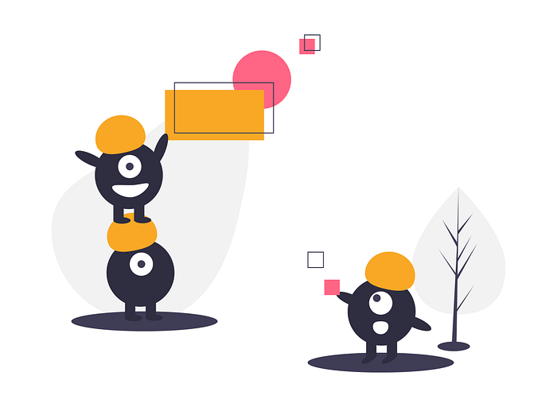
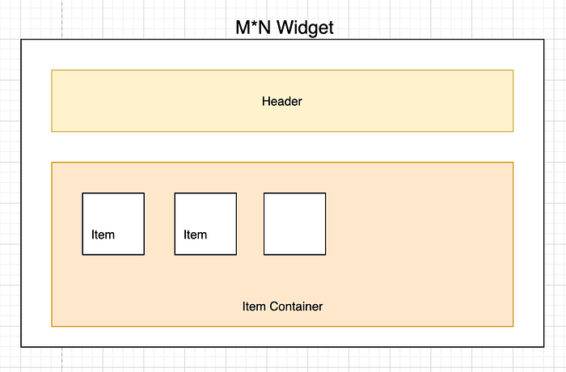
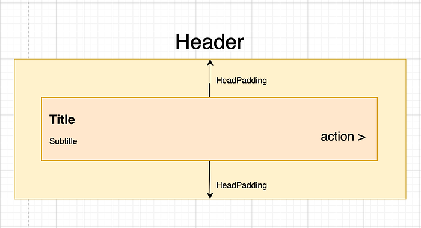
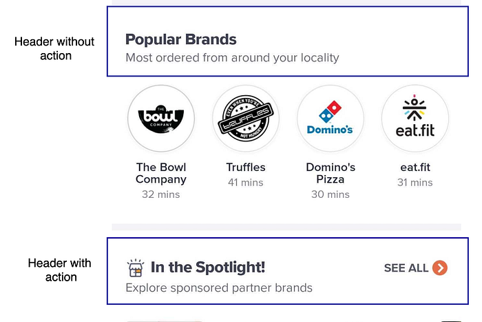
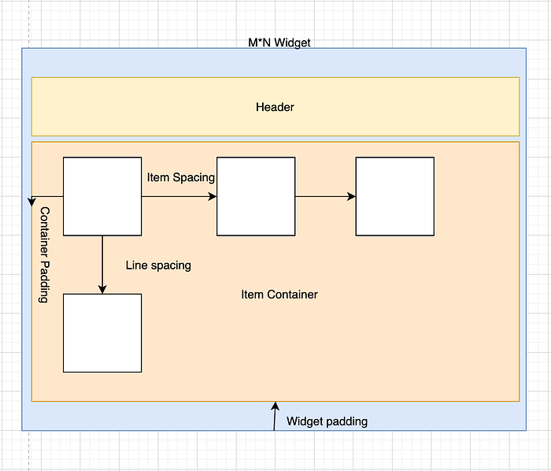
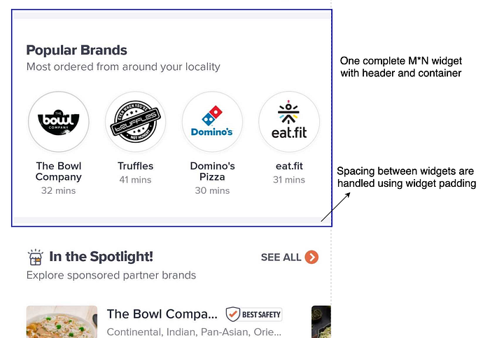
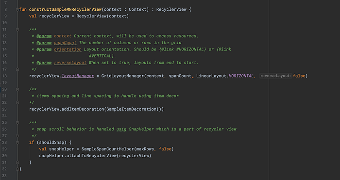
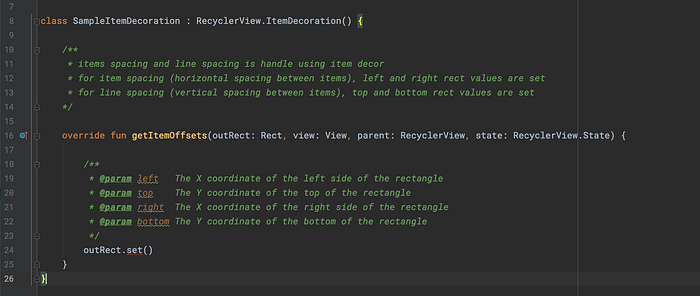
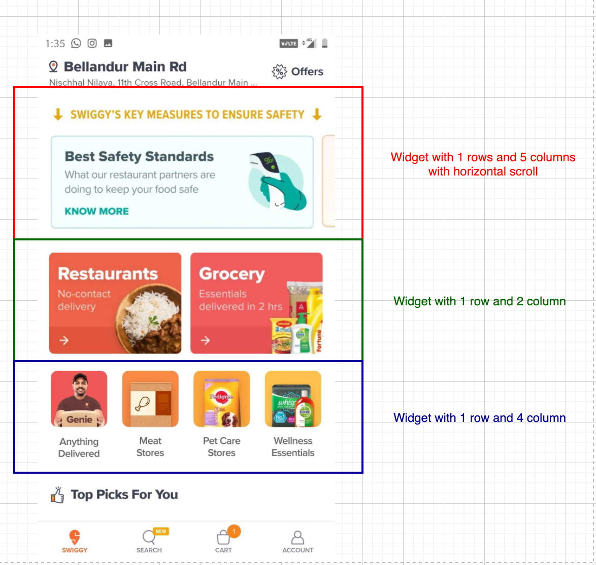
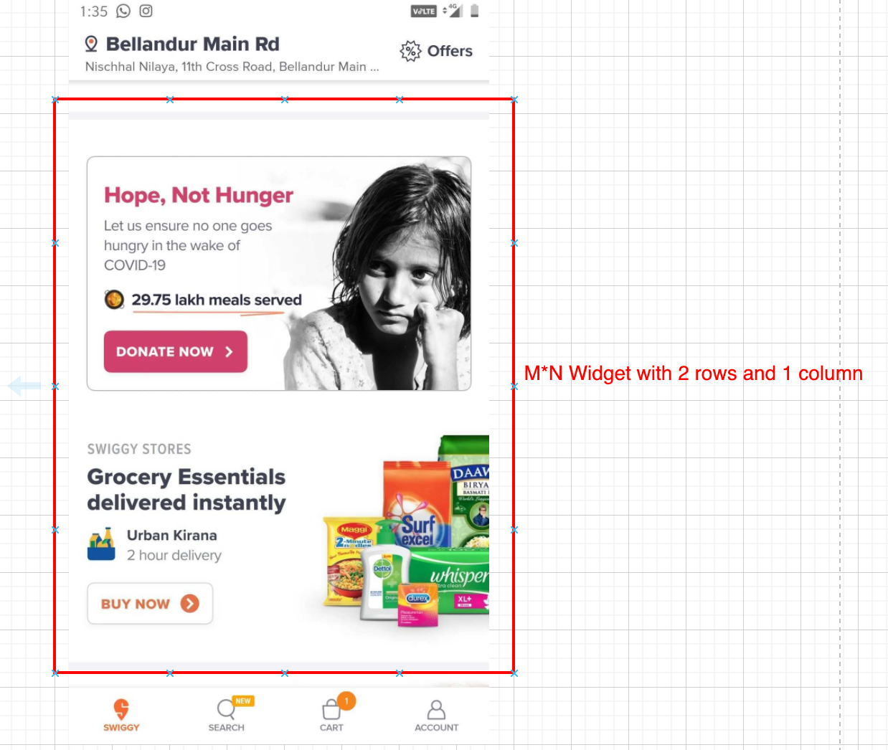

# Swiss knife that powers the Swiggy App

> The story of a widget behind Swiggy’s dynamic homepage

In this article, we will be sharing how we are dynamically changing the complete Swiggy home page screen with a single widget. This widget is used extensively on the Swiggy home page and we are planning to use it across the app. So, let’s get started.



### Why we developed M*N?

Below are the issues that pushed us to develop M*N

1. New widgets for each type of configuration.
2. Extra development effort for each type of widget.
3. Difficult to maintain multiple widgets.

### M * N (M cross N) Widget

The super widget is called M*N (M cross N) since it has M rows and N columns. The number of rows and columns can be configured dynamically. As of now, this widget only supports image-based elements and we are planning to integrate other aspects such as videos, gifs, etc; in the immediate future. We implemented this widget in both the [Litho](https://github.com/facebook/litho) framework and Native RecyclerView as few pages of the app are built using litho and few using native, but both the view uses the same view model, which holds all complex logic. This widget helps us in changing the home page dynamically at runtime based on the configuration sent from the backend.

There are four important components in this widget.

1. Header
2. Item Container
3. Item
4. Parent Widget (which holds all the components)



### Header

The header has title, subtitle, and action. Title and subtitle are just strings and the header click action is handled through _action block _which will be either a deep link or some predefined action. The header also has header styling, which will be the padding inside the header component. The header is an optional component, a widget can be configured without header as well. Below is the structure of the header component.



```
"header": {
              "title": "title",
              "subtitle": "sub title",
              "action": {
                "link": "",
                "type": "",
                "text": "action"
              },
              "header_styling": {
                "padding": {
                  "left": 13.0,
                  "right": 13.0,
                  "top": 32.0,
                  "bottom": 32.0
                }
              }
            }
```


*Header UI with and without action block.*

### Container

Item container is the main component of this widget. It handles how many rows and columns should be rendered in the container. It also handles the scroll behavior of the container. Horizontal Spacing between items is handled by **_itemSpacing_** and vertical spacing between item rows handled by **_lineSpacing._**

Two types of scroll behavior can be configured for the container.

1. Horizontal scroll (free-scrolling the complete items)
2. Snap Scroll (scrolling one column by column)



```
"layout": {
              "rows": 1,
              "columns": 6,
              "horizontal_scroll_enabled": true,
              "should_snap": false,
              "item_spacing": 13.0,
              "line_spacing": 13.0,
              "widget_padding": {
                "top": 13.0,
                "bottom": 13.0
              },
              "container_style": {
                "container_padding": {
                  "left": 13.0,
                  "right": 13.0,
                  "top": 0,
                  "bottom": 13.0
                }
              }
            }
```

### Item

Each item in the M*N widget is an image view. so only images can be configured as of now. we are also planning to integrate video and gif. Each item’s width and height are calculated based on the **_type_**.

There are two **_types_** of reference

1. _Absolute_: TYPE_ABSOLUTE
2. _Relative: _TYPE_RELATIVE

**_Absolute_**

In Absolute type, item height and width will be the exact value as we get. With the below configuration, each item’s width will be 100, and the height will be 150 in Dip.

```
"style": {
                "width": {
                  "type": "TYPE_ABSOLUTE",
                  "value": 100
                },
                "height": {
                  "type": "TYPE_ABSOLUTE",
                  "value": 150
                }
              }
```

**_Relative_**

In Relative type, item’s width depends on container width or device width, and items height depends on device height or item’s width.

The relative type has furthermore classification

```
1. RELATIVE_DIMENSION_REFERENCE_DEVICE_WIDTH
2. RELATIVE_DIMENSION_REFERENCE_CONTAINER_WIDTH
3. RELATIVE_DIMENSION_REFERENCE_WIDTH
4. RELATIVE_DIMENSION_REFERENCE_DEVICE_HEIGHT
```

REFERENCE_DEVICE_WIDTH

Item width will be the complete width is multiplied by the value (fraction value).

```
finalWidth = width * value
```

REFERENCE_CONTIANER_WIDTH

Item width is **calculated** by subtracting device-width with widget padding, container padding, and the number of item spacing.

```
width = deviceWidth - widgetPadding.left - widgetPadding.right - containerPadding.left - containerPadding.right - item spacing
finalWidth = width * value
```

RELATIVE_DIMENSION_REFERENCE_WIDTH

Item height uses this relative type, to tell its height depends on the width of the item. so first, item width is calculated and from it, item height is calculated. The width type cannot be of type REFERENCE_WIDTH only height is configured with this.

```
itemWidth = devicewidth * widthFactor
itemHeight = itemWidth * heightFactor
```

Sample item style configuration.

```
"style": {
                "width": {
                  "type": "TYPE_RELATIVE",
                  "value": 0.4,
                  "reference": "RELATIVE_DIMENSION_REFERENCE_CONTAINER_WIDTH"
                },
                "height": {
                  "type": "TYPE_RELATIVE",
                  "value": 1.4,
                  "reference": "RELATIVE_DIMENSION_REFERENCE_WIDTH"
                }
              }
```

### Widget Container

This contains the header and item container components. A widget can be configured with or without the header but the item container is a must. The main purpose of this container is that it is used as the spacing between the widgets.

```
"widget": {
  "header": {},
  "layout": {
    ...
    "widget_padding": {
                "top": 8.0,
                "bottom": 8.0
              },
    ...
  },
  "items": [{},{}],
  "style": {}
}
```


*M*N Widget with spacing on top and bottom*


---

### Implementation

In Android, we implemented the widget in both Litho and native RecyclerView. We will be looking at how we implemented it in RecyclerView. Implementation is pretty straightforward, as we are using recycler view with **GridLayoutManager, ItemDecorator, and SnapHelper.**

**GridLayoutManager**: Used to construct the item container grid, with M rows and N columns

**ItemDecorator**: Used to giving space between the horizontal items (Rows items)and the vertical items (Column items)

**SnapHelper**: Snap Scroll behavior of the RecyclerView is achieved through this helper, which is part of the RecyclerView library.


*RecyclerView sample*


*ItemDecoration sample implementation*


---

### Advantages

1. Single widget to construct pages across the app.
2. Easy to maintain and highly configurable from the backend.
3. Support for multiple items (video, gif, restaurant cell, etc..) in a single widget.
4. Dynamic screen/page without app release.


---

### Widget in Action




*M*N widget in Swiggy homepage*


---

### Future plans

1. Integrating video, gif and Image with Text in widget items.
2. Integrating restaurant cell inside the widget. So that the complete page can be handled using a single widget.
3. Reusing the widget across the app.

Hope this article was useful and you learned something new today. Feel free to give any suggestions or feedback. Please do check out my previous blogs as well. [Fan(s)tastic: Search for blazing-fast results](./fan-s-tastic-search-for-blazing-fast-results-46aa706313ef.md) and [Login/Signup Improvements in Swiggy’s Android App](https://bytes.swiggy.com/login-signup-result-improvement-in-swiggy-android-app-b933ff242c70)

## Acknowledgments

> _I am Viswanathan from Android Mobile team at Swiggy, I would like to thank my colleagues _[Sourabh Gupta](https://medium.com/@sourabhgupta_63169), [Manjunath Chandrashekar](https://bytes.swiggy.com/@manjunath.c23), Rajat Sharma and Madhu Karudeth for helping me in finishing this blog.

---
**Tags:** Swiggy Mobile · Swiggy Engineering
