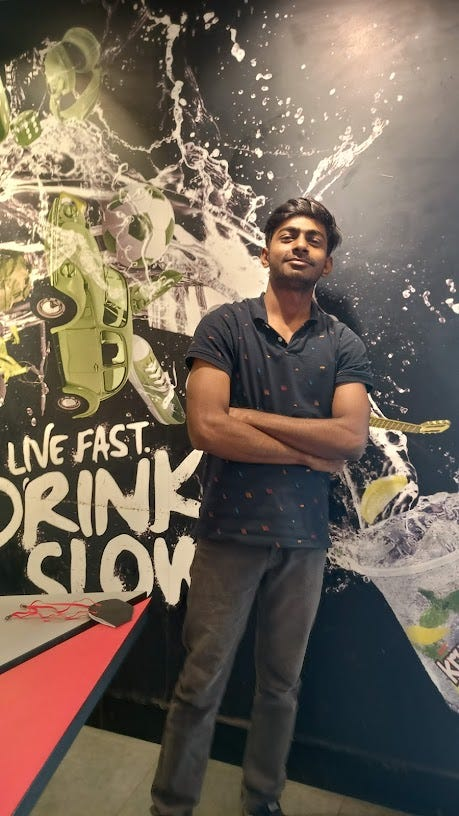
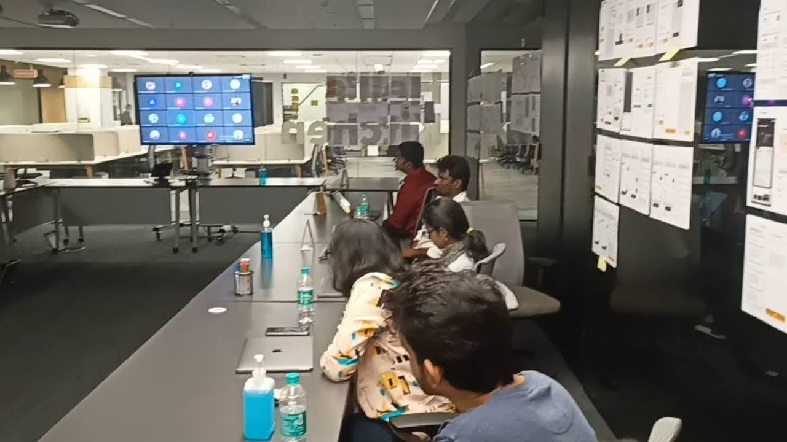
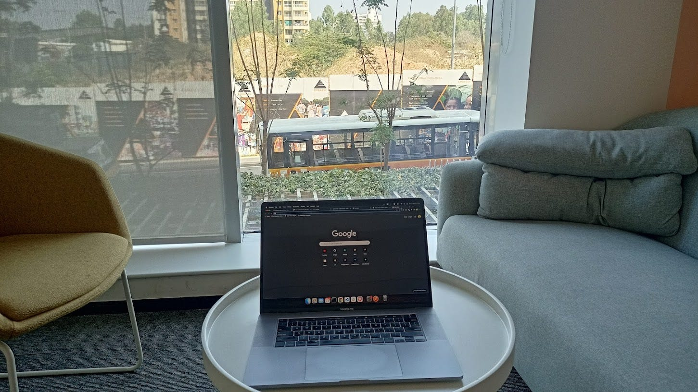
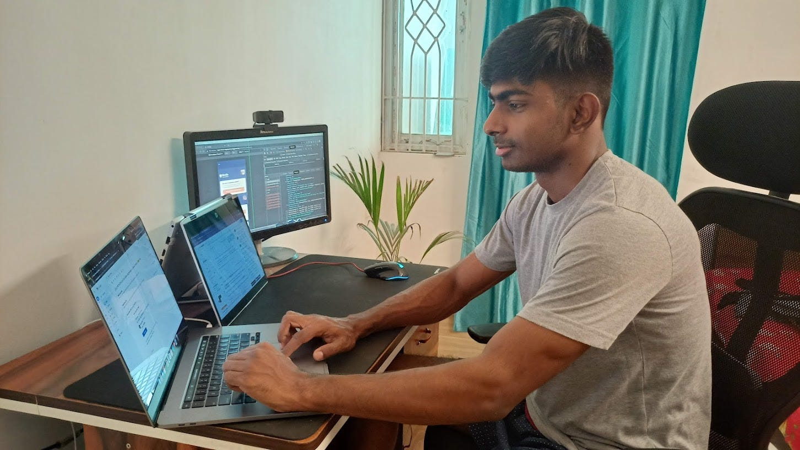

# The Curious Case of a Software Development Engineer — From Intern to SDE-1

If there’s anything that truly defines Abhishek Raj, it is the belief that questions hold more power than anything else. And to get them answered is his ultimate mission. Complementing his college education, he worked on a host of fascinating side projects to grasp all the nuances of being a software developer, sharpening his coding game to perfection, and channelling his entrepreneurial streak every step of the way.

Here is the journey of an enthusiastic, passionate techie, and a Swiggster who does the SDE-1 title proud!

**1. What gets you excited to work? And what is it that you enjoy about solving tech problems at Swiggy?**  
I’ve been inherently curious since I was a child. I’ve always wanted to understand how things work the way they do, and this makes working in tech extra exciting for me. And further, figuring out how things can be improved upon, is in itself a fascinating process for me. To put it simply, this is the job for me and I absolutely love the process. As for Swiggy, I’ve been here for close to a year, and from day one I’ve known that we work at a scale of millions of users. So, anything we solve — especially the tech problems — they are at a large scale. That’s what makes it extremely interesting.

**2. What would you say technology means to you? How did you decide on making it your career?**  
Technology is… everything to me. Quite literally. I’ve always been an avid user of everything- tech. I believe that tech is synonymous with ‘opportunity’ — and personally, it has given me a lot. I started out by studying engineering in college. Although I was curious about a lot of things, I chose to study electronics. Through my constant research and reading up, I spent a  
considerable amount of time browsing Google. This one time, I stumbled upon a blog post that quite simply said, “If you want a job in tech, you must learn to program”. This made me quite nervous to be honest, because programming wasn’t really a part of my syllabus at that point of time and even though I’d tried my hand at it, I hadn’t seen much success. Having said that, I started pursuing a course on programming and found that I actually  
enjoyed it. After that, there was no looking back. I still believe it’s the field that chose me and not the other way around.

**3. Tell us a bit about your education. Where did your career journey begin?**  
In 2018, I started studying electronics and telecommunications engineering at KIIT university. It was during the second semester that, while scrolling through the internet, I happened upon a page about programming. I was a little apprehensive of it all since it is a tough subject, but I still studied C programming. With time, I continued pursuing it along with Python and other programming languages which helped me overcome my apprehension. By the end of the second semester, I was working on a WordPress project where I was developing plugins using PHP. I even did a bunch of side projects. One interesting endeavour was my very own entity that I developed as an anonymous URL shortener and file sharing system. I scaled it to around 30k  
hits per month — that’s 1–2k hits per day. I did try generating revenue out of this but it was unsuccessful, so in time I decided to shut it down. Apart from all of this, I tried my hand at creating an algorithm much like YouTube’s adaptive video algo, where the video adapts to the best quality possible as per your internet connection. I tried creating the algorithm for the front- and back-end process too, and I think this turned out to be one of my best projects.  
All in all, the journey was productive for me. Even during the pandemic, I landed a very good internship, working on a product called Messenger X. We were creating chatbots which was the aspect that I directly worked on. I built a lot of key products for them, including some of the tools used to actually create the chatbots. Around 30–40 chatbots are now created using those very  
tools, which are live on their platform. That was my first big project that garnered users at a large scale — around 200–300k. After this, I received an internship opportunity from High Radius which is a B2B fintech company. And then came my internship with Swiggy. Apart from interning at different companies, I also co-organised an India-wide, inter-college Hackathon as part of a Google Developer Student Clubs initiative. This event included around  
14k participants from across the country. Essentially, I did my best to stay actively involved in multiple tech-related avenues, working on  
around 50–60 side projects as a whole. Some were successful, some weren’t — but they were all a learning experience.

**4. How did your Swiggy journey start? How has it been since day 1?**  
So, I am an active LinkedIn user. Through the platform, I connected with Ashish Arora who is currently VP of Technology at Swiggy, and happened upon a hiring post for interns. I applied and received a call back a few days later, and found out I had bagged the internship, which went on for six months. Eventually, I received a full-time offer from Swiggy in March 2022 and I’ve been here ever since. I also got offers from Google and Glams actually, but chose Swiggy because of its culture and the team here.

**5. Tell us a little bit about your team and the kind of work you’ve been doing with them?**  
Currently, I’m a part of the Genie team. I’m proud to say that together, we’re responsible for building Swiggy Genie up to what it is today. To be specific, I started my work with the cancellation fee function, which I implemented on the cart page. It’s been a pleasure to witness Swiggy Genie growing over time. I’d say that this project is very close to my heart. Often when I find relatives or anyone else using Genie via the features I’ve created, it gives me such a sense  
of fulfilment to tell them that I work at Swiggy. As for Swiggy One, I was an intern when it was allotted to me. It felt great to be able to see it come to life as it was a big project for the company. In fact, we had to work on certain aspects of it in a record time of two weeks. It was a fantastic experience as an intern.

**6. What is an SDE 1’s life like at Swiggy?**  
As an SDE1, life is essentially about solutioning. I have to consistently document every aspect of the solution, right from concept to execution. We work closely with our seniors to get these reviewed and approved, and then begin the coding process. If we are ever stuck or if we ever need to discuss and bounce ideas off of each other, support is just a call away. We also get to mentor interns or juniors, and I make sure to guide them just as my team has guided and encouraged me since day one.

**7. What is one lesson or one piece of advice you would want to give aspiring engineers?**  
Practice coding daily! Engineering is made up of several different aspects, so try out everything to understand what you really like and enjoy — especially if you haven’t decided on your specific path. Try back-end, app work, and front-end, read blogs and start building your own projects. This is what will help you showcase your unique skills to the world. Present your work on sites  
such as Medium, Def2, and LinkedIn, because it’s the best way to show the actual deployment of your skills, and goes a long way in helping to get a job.

**8. For someone aspiring to take on a tech role, why would you recommend Swiggy as a place to work?**

Everyone I know in this field wants to work on projects at scale. And Swiggy does just that, impacting millions of lives every day. Working at Swiggy means you’ll be solving problems for these millions. Secondly, the team is great to work with, and I really appreciate the work-life balance here. Also, we are given the autonomy to pursue projects that we’re truly interested in.  
Across teams and disciplines, our inputs and ideas are welcomed with open arms. If you’re a Swiggster, exploration and experimentation are a part of the package.

**9. What Swiggy value do you identify with the most?**  
Always be curious, always be learning — no doubt about it. I have always been the kind of person to question things. For instance, in a meeting with the product manager, I like to understand why things are being done the way they are being done. Regardless of department, be it engineering, sales, or marketing; I seek to understand everything. I don’t believe in being a  
specialist; I identify with being a generalist who wants to know everything.

---
**Tags:** Swiggy Life · Swiggy Engineering · Employee Experience · Startup Culture · Employee Stories
