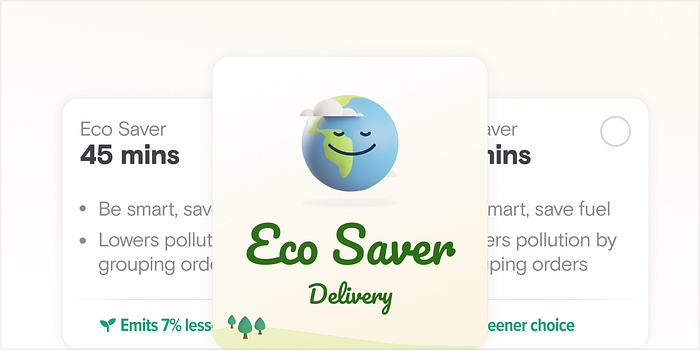
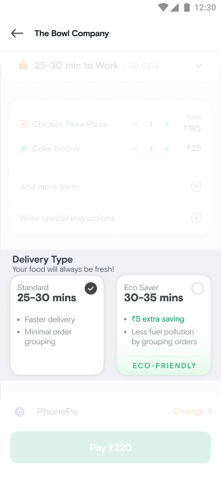
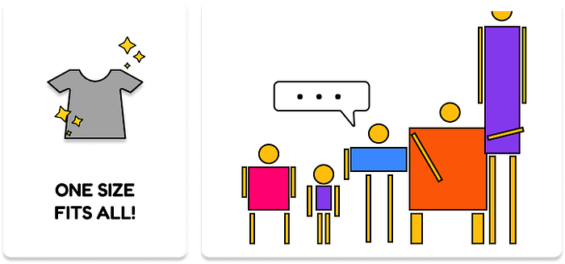
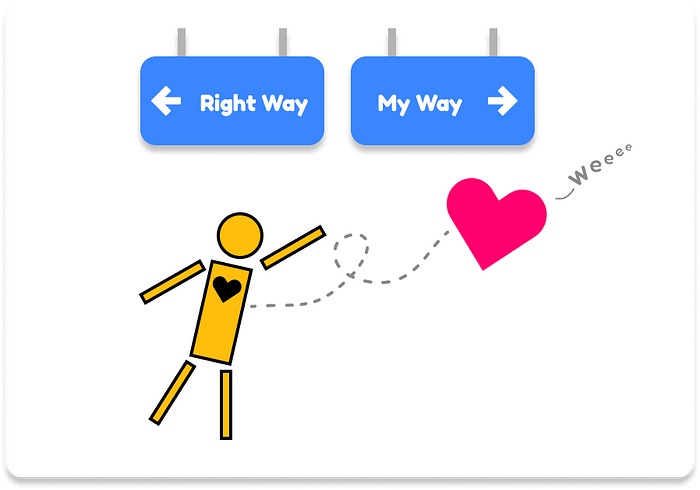
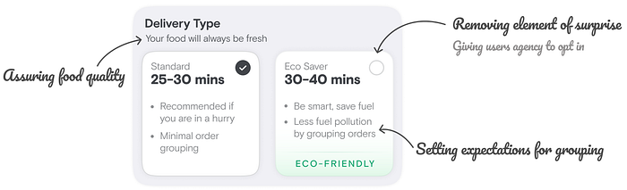
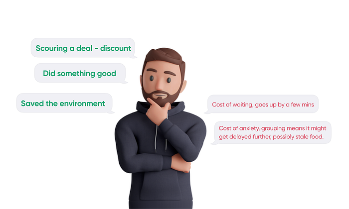
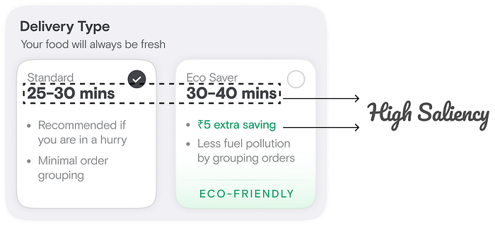
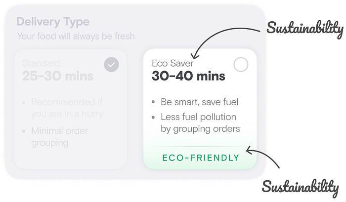
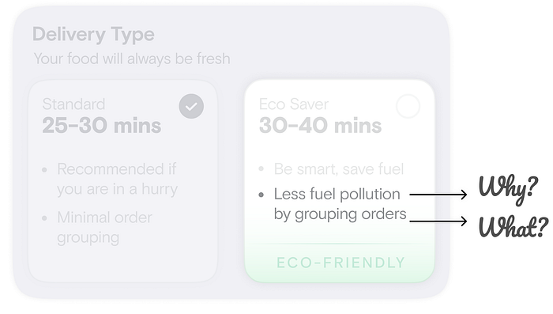

# The Curious case of Eco Saver

> We have not inherited this earth from our forefathers; we have borrowed it from our children.

This statement underscores the need for each one of us to collaborate and adopt sustainable practices to protect our planet. A study in China last year showed how a single “green nudge” on delivery apps can lead to more sustainable choices by consumers. The scale at which Swiggy operates — with our riders collectively travelling millions of KMs a day to serve lakhs of customers — sets a stage where even a small step can amount to a significant dent on this path.

We decided to put this to action with the honest belief that if given a choice, every consumer would also like to do their bit to ensure greener deliveries.

And that is why, earlier this year, Swiggy launched the Eco-Saver delivery option to all users on Swiggy.

Swiggy is known for its seamless and super quick deliveries, but what if adding 5–10 minutes to this delivery also made it better for the planet?

Today, we are doing lakhs of deliveries on Swiggy via the Eco Saver delivery mode _daily_. This is a significant number, considering the fast-paced world that we live in. It is evident that our customers are willing to wait a few minutes longer to receive their orders, while also doing their bit to minimise carbon emissions. This new delivery mode lets Swiggy’s customers get a token discount by waiting a little longer, thus transitioning Swiggy from a 1-size-fits-all delivery experience to a custom-fit one where users who are seeking affordability now also have a way out!

*Get me one that fits me!*

By grouping nearby orders, we not only reduce the number of trips and thus fuel consumption and carbon footprint, but also increase the efficiency of our delivery network and earnings for our delivery partners.

> So far, we have been able to cut CO2 emissions by **more than 300 tonnes**, that’s the equivalent of **planting 10k+ trees**!

With the resounding allies we’ve got with Swiggy users, we’re sure of excelling on this path even further!

---

Hello people!

This is the story of how we built Eco Saver. A tale of getting a few things right in the first step, iterating and experimenting excessively for the rest, and optimising to find a spot where we could create delightful experiences for our consumers while growing the business simultaneously.

**The Hypothesis**

> If we can partner with consumers by incentivising them through monetary and/or sustainability benefits, we can cater to diverse user needs, make the delivery network more efficient and make the planet a better place to live.

So, how do we go about building an offering that:

1. Lets the user voluntarily participate in contributing to the environment, resulting in a delightful experience?
2. Gives our users a way to opt for affordability v/s convenience as per their need?
3. Leaves an impact on the environment?

## The answer came up in the form of consent based grouping of orders

Let’s dig into the journey of how we built and scaled this up in less than 9 months! The reading ahead is structured in the following sections:

1. Inception of the product — starting with user insights
2. Our path to PMF
3. Keeping the journey seamless despite added cognition
4. Scaling the product — role of Product Marketing
5. Going to Market & Measuring success

---

**Inception — starting with User Insights**

User Insights is all about developing a deep understanding of our consumers and their context. The better we understand them in the context of our business, the better product we can build that speaks directly to their core needs.

In order to build an offering around grouping of orders, we delved deeper into how consumers perceive it and what their experience looks like. A little while ago, we saw the benefits of grouping orders. Despite rationally understanding the benefits of order grouping, our users didn’t seem to have as good an experience with it. _This was reflected in the NPS scores for grouped orders._ They remained significantly low in spite of us improving the experience of grouped orders, like delivering them faster so that the food doesn’t get stale.

Why would this happen? One wonders…

*Follow the heart…or be your rational self?*

We are emotional beings. We might be creatures of logic but as per several studies, over 90% of our decisions are subconsciously driven, which tap into our emotions heavily. Talking to our users, we found out how they really felt about order grouping:

1. They sensed a **lack of control** over their experience from the moment they got to know about their order getting grouped.
2. They were **sceptical** about their order getting delayed and their food possibly getting stale.
3. They were **surprised to be intimated** about their order getting grouped.

Brené Brown, a psychologist and an author, in her book ‘_Atlas of the Heart_’ describes Anxiety as:

> “Escalating loss of control, worst case scenario thinking and imagery, and total uncertainty”

_We can see how anxiety is the core emotion at play here_. What good is hot food delivered on time if the ordering experience is filled with anxiety?

## We thought to ourselves, is there a way to group orders in an elegant and graceful manner?

An Operational mind would say: let’s make our operations more efficient and alleviate delays for grouped orders. A Customer Experience mind would say: let’s promise higher delivery times to set expectations right in the first place. But neither of these solve the core problem — anxiety. These are ways to tackle the problem rationally but they fail to address the emotion behind the user’s experience.

We then thought of this problem from a product lens. How can the product solve for this anxiety?

---

**Our Path to Product-Market Fit**

With the core psychological need identified, we started thinking of ways to fulfil it.

A holistic way of thinking here is to start from the consumer belief or behaviour you want to drive. In this case, this is

> “Consumers opt for a sustainable choice of delivery 1 out of 10 times they place an order on Swiggy.”

We started by focusing on the pain point that will make users change their behaviour.

The core consumer pain point was anxiety due to a sense of lack of control over their delivery experience. We had to reduce the element of negative surprises in the fulfilment journey. The way to do this is to enable users’ freedom of choice through clear communication on what each delivery mode entails, assure them of their concerns and let them decide the kind of experience they want.

The other sources of anxiety to be handled were scepticism around order delays and food staleness.

_But why would someone opt for this? What’s in it for them?_

Next, we come to crafting the right value proposition. By presenting it as an opt-in to the user, we solved for the sense of lack of control over their experience. But how do we now make customers choose Eco Saver?

We needed to present a value proposition that looks promising. In exchange for a relaxed delivery time, we offered:

1. Monetary benefit: A nominal discount.
2. Gratification from doing something good: The environmental benefits of choosing Eco Saver.

The user’s mental model while making this decision will look something like:

*If the perceived value (green, on the left) is higher than the pain (red, on the right), the user will opt for Eco Saver*

---

**An extra decision in the journey — how do we keep it seamless?**

Adding an extra step in the ordering journey can potentially degrade the consumer experience, especially when it adds to the cognitive load. Given how dense Swiggy’s Cart page is with all the information around items, discounts, bill, delivery times etc., it was of utmost importance to make sure Eco Saver stands out, but not in a way that discourages the user to proceed ahead. Eco Saver differentiates on 2 parameters — delivery time and discount.

The consumer now has to evaluate both the options and _as a guide, our role is to make this process seamless, efficient and as quick as possible_. We do that by presenting the 2 delivery modes next to each other, with the respective delivery times and the money trade-offs having high salience so that this information is easy to skim.

Seeing this screen, the user quickly registers both the delivery times and the Eco Saver discount. Highlighting benefits through copies like ‘Recommended if you are in a hurry’, ‘Less fuel pollution…’ and the ‘Eco Friendly’ tag at the bottom helps the user quickly register the gives and the gets and assess fitment as per their need.

And a decision is made.

---

**Selling the product — the role of Product Marketing**

Human beings are driven by stories. We love hearing and telling stories and that’s how we relate to each other. Marketing helps us do exactly that — make the user relate to the product more.

With this in mind, how do we position this new delivery mode? What story do we tell?

Beyond the realms of rational decision making, making a decision often boils down to our value systems. A narrative that makes us feel rooted in a core value is favoured more.

In our initial interactions with consumers, we saw a lot of users connecting with Eco Saver delivery being good for the environment. With this in mind, we began writing an Eco-friendly story around this:

### Users can help build a sustainable future and in some cases, they also get a discount as a cherry on the top.

What do we name the offering? What do we talk about in the story? How do we frame the villain of the story — order grouping? These were some of the questions we had to answer.

A mix of consumer interactions and A/B experiments helped us figure out:

1. The right name/nomenclature of the offering.
2. The right copies to drive correct comprehension of the benefits, especially the ones related to the environment. (Do people understand what CO2 savings means?)
3. The right communication to narrate how the initiative is helping the environment. (Do they understand how grouping leads to less fuel consumption? Less pollution? If not, what’s a simple way to explain this to them?)

*Bringing out the story through name and badges*

A crucial element in positioning is the _villain of the story — order grouping_. With the value proposition in place, we now need to think about how to set expectations with our users around order grouping. A simple FYI-ish communication like ‘this order will be grouped’ can potentially raise alarm bells in the minds of the user and steer them away. Does this mean we get covert about this? No, that would be unethical.

The way to go about such things is to enable the users to empathise with _what’s_ happening by tying it to _why_ it’s happening.

---

**Going to Market & Measuring success**

It’s rarely the case that you get a product right in the first go. It’s often an iterative journey to an optimal spot. This was also the case with Eco Saver. With so many variables at play here, we ended up running 9+ experiments with 30+ test variants for more than 6 months to arrive at the place we are at now — seeing a positive impact on all fronts!

Some of the questions we found answers to along the way are:

1. What should be the ideal delivery time for Eco Saver? How does it impact product adoption and order grouping?
2. What should be the ideal discount for Eco Saver and how does it impact product adoption and the product PnL? How does this vary with user demographics? With geographies? Do environmental factors play a role in the user’s mental model?
3. How do we best communicate the sustainability story to our users through the product name and badges?
4. Where should we place the Eco Saver widget on the Cart so as to not impact existing user journeys?

The iterative process involves testing existing hypotheses and generating new ones. By closely monitoring unexpected metric movements and diligently seeking explanations for observed user behaviours, we can develop new hypotheses.

While we continued to experiment and go deep into the numbers, we were also speaking to our users in parallel to understand their rationale behind opting for Eco Saver. This helped us discover the fact that our users are much more inclined towards sustainability than we had anticipated. This insight was a cue to package the product in a manner that spoke closely to this deep rooted value of our users.

Overall, the Eco Saver product added value on multiple fronts:

1. Lifted experience of grouped orders on the platform — **NPS shooting up significantly to the tune of 1.5–2X!**
2. Affordability/Sustainability seeking users found a better product fit — **we’re doing lakhs of Eco Saver orders in a single day!**
3. Swiggy got a **boost in order grouping on the platform,** thus resulting in a **more efficient network** and reducing the time to find a delivery partner
4. Swiggy provided convenience to its users in a more sustainable way — we’re **saving tons of CO2 emissions** daily!
5. Swiggy’s delivery partners now earn more for their effort

While the numbers tell a story, the story that touches our hearts is often the one told by our users themselves!

> “It gave me a discount over and above the coupon! I am generally okay with waiting extra for my food and I also got to do something for the planet.”_- Sarala Biswas_“It gave me the best deal! I got discount and felt nice for contributing something to the environment.”_- Praven_“Unless I am in a hurry, there is no reason for opting for standard delivery. I would love to use it for instamart too!”_- Prashant Jadhav_

> **_Consumer love, undoubtedly, is the most fulfilling part of building products._**

**What’s next?**

We’ll continue to solve for the diverse need states of our users and are working on something interesting for the coming months. Keep watching this space for more!

---

P.S. If you read through the article, we are hoping you learnt a thing or two. Do tell us your favorite product management lesson from this story in the comments section below!

_Illustrations by _[_Shubhangini Dhall_](https://www.linkedin.com/in/shubhangini-dhall-426517168/?originalSubdomain=uk)_ and _[_Sanyam Jain_](https://www.linkedin.com/in/sanyamjain18/?originalSubdomain=in)

---
**Tags:** Product Management · Logistics · Food Delivery · Swiggy · Swiggy Product
