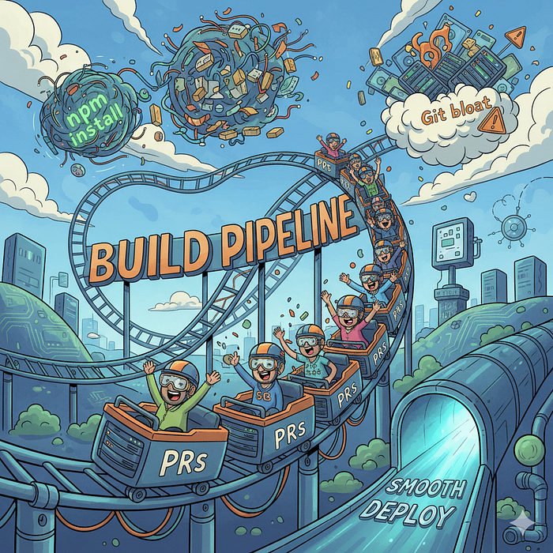
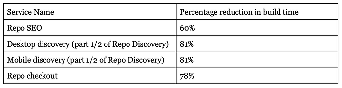

# The Hidden Cost of Waiting: Build Time as a Productivity Killer

Build times are the silent productivity killer in engineering teams. The longer they get, the less developers experiment, the less often features get shipped, and the more frustration builds up.

**This is going to be a long journey, so hold on tight and read on, because the results will be worth it.**



## Problem

What starts as a small inconvenience quickly snowballs: a build that takes 5 minutes one year may stretch to 50+ minutes as the repo grows, dependencies pile up, and processes become bloated. Left unchecked, build times can drag the team’s velocity to a crawl. At Swiggy, we always optimize for Speed of Execution, and hence, over the past few months, we set a goal to reduce our build times from a record high of approximately an hour.

Over the past few months, we underwent an intentional **build optimization exercise**. The goal wasn’t just speed — it was also **stability, reproducibility, and scalability** as the team and codebase continue to grow.

Many challenges arise from using a multi-repo (Lerna workspaces), which is what the initial steps were primarily about solving. We serve not only the same application, but also serve as an SDK to different teams. Given the above complexities involved, the initial build time was quite high without specific efforts put into optimization.

Here’s a breakdown of the strategies we implemented, why we tried them, and what kind of impact they had.

## Steps taken

## Doing a tar copy of node_modules to Docker instead of a direct copy

**Problem:** Copying node_modules directly into Docker is notoriously slow **due to the large number of small files**. Docker must process each file individually, which makes the copy step painfully slow.

**Solution**

Instead, we ran the following:

```
tar -czf main-app.tar -C main-app/ .
ADD main-app.tar.gz ./
```

This simple change reduced the time spent in the copy step by more than half. Archiving compresses and batches files, and Docker loves fewer large files over thousands of tiny ones.

This deals specifically with how the COPY command works at the OS level, as doing an individual file copy means first acquiring memory lock for doing a copy, then file lock, then doing a copy. Therefore, we did an optimization, where instead of doing COPY directly, we first tar the whole directory we want to copy over, copy the TAR, and then decompress directly on Docker. This is especially useful for teams using Node and Docker, where you would see the largest gains (as node_modules is huge, but can be useful for mvn and go modules also).

👉 **Impact:** Much faster copy step, reduced disk I/O thrashing.

## Migration to yarn and yarn workspaces

**Problem: **Using NPM with Lerna workspaces. While this works fine from the get-go, and everyone is deeply familiar with NPM. In practice, Lerna with Yarn workspaces simplifies a lot of underlying issues. Our project itself is on node 14, so we can’t use npm workspaces, as node 14 uses npm 6 only, which would have created lots of confusion.

**Solution**

We moved from **npm** to **Yarn**, and then from single-project installs to **Yarn Workspaces**.

Why?

- Yarn’s install process is **parallelized** and much faster than npm (especially npm v6 and earlier).
- Workspaces avoid redundant installs across packages by hoisting shared dependencies.
- Linking between local packages becomes automatic — no more npm link headaches.

Our monorepo setup became significantly more manageable: fewer node_modules directories, less duplication, and a smoother DX. This also reduced issues due to different packages having different versions.

As a side effect, it’s easier to detect which versions are being used overall in the project by looking at a single lock file.

👉 **Impact:** Cold installs became faster, and CI/CD pipelines saw fewer redundant dependency downloads.

## Doing yarn install in the final dist folder instead of copying from the build.

**Problem: **Our initial flow installed dependencies in one place and then copied them into the distribution folder. It worked, but copying dependencies slowed things down.

**Solution**

By switching to **running yarn install directly in the final dist folder**, we ensured consistency and avoided duplication. We also didn’t carry over the crust of libraries that were only used for testing.

These modules had already been installed once in the process during build, so everything is already cached to be reused from yarn itself. There’s no extra time for module resolution, thus.

👉 **Impact:** Cleaner builds, fewer cache invalidations, and faster installs.

## Lerna workspace, removing individual builds of packages

**Problem: **Before, each package inside the monorepo had its **own build step**. That meant compiling multiple times, even when only a subset of packages had changed.

**Solution**

By combining **Lerna with Yarn Workspaces**, we:

- Skipped unnecessary work for unaffected packages.
- Had Lerna intelligently detect dependencies between builds.

This change was one of the biggest wins: the pipeline stopped redoing work, and build times dropped drastically. We saw improvements of up to 25% just from this step.

This also resulted in much better tree shaking of elements, as the webpack build can directly detect from source what is being used.

We were earlier using rollup first to build these sub-packages into tree-shakable individual components. Next, we were again doing a pass with these on WebPack, essentially building the same thing twice.

We therefore decided to remove the rollup build when Webpack is running. This gave us 2 benefits: reducing the multi-pass for subpackages, and another larger benefit was that since Webpack is the final build pipeline, it was able to tree-shake these packages much better, reducing the size of the bundle generated.

👉 **Impact:** Saved multiple minutes per build, especially in large monorepos.

## Removing publish and running publish for SDK on a separate thread

**Problem: **Some of our repositories, while serving as deployables themselves, also serve as an npm library to other repositories to use internally. Thus, we need to both build the app individually and also publish the packages for usage by other repositories.

We previously bundled **SDK publishing** into the same pipeline as the main build. However, publishing SDKs (often to npm or an internal registry) is a slow and network-intensive step. This also required us to build sub-packages inside the main build pipeline, even though Webpack itself was doing the actual build for end users of the repository.

**Solution**

By moving SDK publishing into a **separate asynchronous process**, we allowed builds to complete quickly while the publishing happened in parallel.

👉 **Impact:** Main build times improved by several minutes, and developers didn’t have to wait for unrelated publish steps.

👉 **Sub-Impact:** We don’t need to publish for each build when we don’t need it for SDK usage. This reduced the number of versions published to the registry, reducing the storage requirements on the registry end.

## Parallelizing builds

**Problem: **Different applications in the same Lerna scope were being built sequentially, instead of in parallel. These weren’t dependent on each other. However, due to the initial pace of movement for creating new packages, these were still being built one after another.

**Solution**

We restructured pipelines to run these **jobs in parallel wherever possible**.

👉 **Impact:** Reduced the time spent on running things in sequence, shaved 20–30% off total pipeline time.

👉 **Sub-Impact:** We are now able to only build things if there are changes to that build.

## Using an alias for build names across environments

**Problem: **This was a subtle one. We noticed Docker and CI caching weren’t working optimally because we were packaging the same Dockerfile twice and running the Dockerfile twice also. For example:

- _My-app-staging_ in the staging environment.
- _My-app_ in production

**Solution**

Once we **adopted aliases for builds across environments instead of different builds**, the build only needed to happen once.

👉 **Impact:** Builds got reused between the staging and production environments, cutting down repetitive installs and builds.

## Deletion of git tags and branches

**Problem: **One of the most surprising bottlenecks came from **Git itself**.

Our repo had accumulated:

- **3,00,000 tags** (most unused)
- **2,200 branches** (many stale)

The tags are generated on each build and publish, thus over the years, with multiple devs working on the same, they have accumulated to a huge number.

This slowed down every Git operation in CI/CD: cloning, fetching, and checking out branches.

**Solution**

We pruned aggressively, bringing the repo down to:

- ~1,000 tags
- ~100 branches

Suddenly, clone and fetch times dropped significantly. Developers also enjoyed faster local checkouts and less clutter when browsing history.

👉 **Impact:** Faster Git operations across the board, especially in CI/CD environments.

## The three-legged journey


## Repo SEO

This repo takes care of all the SEO pages that Swiggy serves, and runs React for it, with SSR included inside.

Being a newer service and using well-established and highly opinionated build processes, this was the first service we turned our eyes to. This uses turborepo and Next.js to deploy the service.

There were 2 steps we did here:

1. Removing a copy of node_modules and doing a tar of the whole build instead, and decompressing on Docker itself. This shaved off approximately 30% of build time.
2. The second step involved moving the publishing of SDKs to a separate parallel pipeline. This shaved off another 25% in build time.

Thus, we reduced our build times by approximately 60%. In savings terms, given the number of PRs raised weekly on this, we are saving approximately 10 man-hours/week.

## Repo discovery

This is the repo that takes care of the core order journey workflow, account management, etc.

The next big step was our oldest repository, which served 2 services. This being an older repository, it had a lot of crust added to it. This repo uses Express, Nunjucks, React & React Router together.

The steps we took were:

1. Migrating from npm to yarn
2. Running server and client webpack compile in parallel
3. Running desktop and mobile builds in parallel
4. Removing the copy step of node_modules and doing a tar of the whole repository instead, and decompressing on Docker itself.
5. Removing a sleep step that was added due to the cp command, as cp runs in async and sends a completion signal before the actual files are written from cache.
6. Removing build and publish of internally linked monorepo packages
7. Too many layers were added in the Dockerfile by adding too many commands. We simplified the number of total commands from 32 to approximately 15
8. Removing multiple builds for both Docker and eEC2(Debian) containers
9. Moving staging as a separate deployable to a Docker build alias

Thus, we reduced our build times by approximately 80%. In savings terms, given the number of PRs raised weekly on this, we are saving approximately 50 man-hours/week.

As a side benefit, before all these steps, we had regular issues with build failures due to the publish and build running into race conditions. We went from a high build failure number of 10–20 a week on dev branches to 0.

## Repo Checkout

This is the repository that serves our checkout and payments UI. Thus, we wanted to move towards this last once we had finalized all our moving pieces and had all learnings in place. The overall steps are pretty much the same as what we did in the Discovery Repo.

This repo used a stack of Hapi, React, and a custom Router.

The steps we took were:

1. Migrating from npm to yarn
2. Running server and client webpack compile in parallel
3. Running the proxy server and the Main app in parallel
4. Removing the copy step of node_modules and doing a tar of the whole repository instead, and decompressing on Docker itself.
5. Removing a sleep step that was added due to the cp command, as cp runs in async and sends a completion signal before the actual files are written from cache.
6. Removing the build of subpackages for the main application build and moving the publishing of these as SDK to another parallel pipeline
7. Removing multiple builds for both Docker and EC2 (Debian) containers
8. Moving staging as a separate deployable to a Docker build alias

Thus, we reduced our build times by approximately 80%. In savings terms, given the number of PRs raised weekly on this, we are saving approximately 80 man-hours/week.

As a side benefit, before all these steps, we had regular issues with build failures due to the publish and build running into race conditions. We went from a high build failure number of 20–30 a week on dev branches to 0.

## Final Output 📈📈📈

Each of these optimizations stacked up. Alone, they shaved off seconds to minutes. Together, they completely transformed the experience:


*Build time reductions, 60% for SEO, 81% for Discovery flow, 78% for checkout flow*

But the benefits went beyond raw numbers:

- Developers felt less friction and frustration.
- Faster iteration cycles encouraged more frequent commits and experiments.
- CI/CD pipelines became more reliable and predictable.

## Closing Thoughts

There’s no one-size-fits-all solution for build optimization. The right approach depends on your repo structure, CI/CD setup, and team workflows.

That said, a few lessons stand out:

1. **Measure everything** — You can’t optimize what you don’t track.
2. **Look for systemic bottlenecks** — Sometimes the slowest step isn’t in the code (e.g., Git bloat).
3. **Optimize for caching** — Caches are the biggest lever in CI/CD performance.
4. **Don’t optimize prematurely** — Focus only when builds actually slow developers down.

Build time reduction is rarely glamorous work, but it pays off in spades. Every minute saved compounds across the team and across the year.

Thanks to [Rahul Arora](https://medium.com/u/a04d7e9b49c4?source=post_page---user_mention--98d08bc7fd73---------------------------------------), [VarunSharma30](https://medium.com/u/b789bde26475?source=post_page---user_mention--98d08bc7fd73---------------------------------------), [surya singareddy](https://medium.com/u/373bdcdb2a97?source=post_page---user_mention--98d08bc7fd73---------------------------------------) [Rahul Dhawani](https://medium.com/u/a432091a1f67?source=post_page---user_mention--98d08bc7fd73---------------------------------------), [Tushar Tayal](https://medium.com/u/400467f4ffab?source=post_page---user_mention--98d08bc7fd73---------------------------------------) for helping take this live end-to-end.

---
**Tags:** Nodejs · NPM · Monorepo
