# The OSM Distance Service Part 1: Evaluation Metrics and Routing Configurations

Co-authored with [Chandramouli. K](https://www.linkedin.com/in/chandramouli-k/), [Rahul Vippala](https://www.linkedin.com/in/rahul-vippala/), [Jose Mathew](https://www.linkedin.com/in/jose-mathew-550aa525/).

In hyperlocal commerce (online food & grocery delivery), distance plays a critical role in every aspect of the platform’s operation. It impacts areas such as entity discovery (serviceable restaurant in Food or dark store in Instamart), delivery time estimates, delivery fees, and payouts for delivery partners (DP). Real-time integration with third-party map services is often not feasible due to their high latency, which makes them unsuitable for our scale. Moreover, the cost associated with such services is prohibitive for large-scale operations. Alternatively, we use OpenStreetMap (OSM) data to estimate distances, offering a scalable, cost-effective, open-source solution. Since Swiggy primarily employs two-wheelers for deliveries and most third-party mapping services offer only four-wheeler travel distances at reasonable rates, OSM is a more viable option for accurate two-wheeler distance evaluations.

However, OSM data is prone to errors due to its crowdsourced nature, leading to missing road segments, incorrect road directions, phantom road segments, absent connections between segments, and inaccurate road accessibility information. These issues can significantly impact the reliability of distance computations and routing decisions. It’s crucial to understand the regions where OSM data is reliable. This helps us prioritize improvements, such as fixing missing road segments or addressing other inaccuracies, thereby enhancing the dependability of the OSM database. To achieve these, we structure our approach into two key steps, each covered in this two-part blog series.

1. **Assessing OSM road quality and benchmarking routing configurations**: In the first part, we introduce the metrics and system architecture that help evaluate the quality of OSM road data, enabling us to pinpoint where OSM data is most reliable and where improvements are needed. We also benchmark different routing configurations to identify the optimal setup for accurate distance computation using OSM data.
2. **Detecting missing roads and connectivity with machine learning**: Our internal assessments reveal that missing road segments and a lack of connectivity between road segments are the most frequent sources of distance inaccuracies. The [second part](./the-osm-distance-service-part-2-fixing-roads-90bd6d3bb60f.md) of this blog series outlines our machine learning pipeline, designed to detect missing road segments and connectivity issues, thereby supporting targeted fixes in the OSM database.

## The Metrics

In this section, we propose two key metrics: OSM-average-path-length-similarity (APLS) and delta-coverage. The OSM-APLS metric assesses the quality of OSM road data by comparing it against internal and external data sources, aiming to determine the accuracy of distance calculations between locations. We leverage historical first-mile (FM) and last-mile (LM) trips completed by our delivery partners (DPs) to assess OSM road quality, particularly in regions with a high density of orders. The delta-coverage metric captures the temporal variation in the routes taken by DPs. Combined with the OSM-APLS metric for a given geohash (e.g., L5 geohash), it helps validate the temporal stability of OSM road quality within that geohash.

## Terminologies

FM trip: First-mile (FM) trip is the journey DP undertakes to reach a restaurant partner or a dark store from the assigned location.

LM trip: Last mile (LM) trip is the journey DP undertakes from the restaurant partner or a dark store to the customer location.

Trajectory distance (TD): Distance estimate obtained as haversine distance aggregated across the GPS points in a given trajectory. This distance estimate is noisy since the GPS points are noisy.

Snapped route distance (SD): Distance estimate obtained by aggregating the length of the road segments along the snapped route. The snapped route is obtained using GraphHopper’s map-matching [library](https://github.com/graphhopper/map-matching). The snapped route is predicted by matching the noisy GPS trajectory to the OSM road network so that the actual road trajectory taken by the DP is obtained. Since the fidelity of the snapped route depends on the accuracy of the [map-matching](https://www.microsoft.com/en-us/research/publication/hidden-markov-map-matching-noise-sparseness/) algorithm and the reliability of the OSM road network, this distance estimate is also noisy.

OSMᵢ = OSM distance for a trip-i,

TPDᵢ = Third-party distance obtained from a maps service provider for a trip-i,

TDᵢ = Trajectory distance for a trip-i,

SDᵢ = Snapped route distance for a trip-i.

## The OSM-APLS Metric

As noted in [[1]](https://dl.acm.org/doi/pdf/10.1145/3493700.3493726), all the distance measurements mentioned are inherently noisy and not accurate on their own. In [1], we defined the “ground truth” distance for a trip as an ensemble derived from these four sources, though its coverage remains limited. While the mean absolute error (MAE) metric relative to this synthesized ground truth provides directional accuracy, it does not help pinpoint areas where OSM distance estimates have high confidence.

The Average Path Length Similarity ([APLS](https://spacenet.ai/sn5-challenge/)) metric evaluates the similarity between two graphs based on path lengths, and is commonly used to assess road quality in maps generated from satellite imagery via computer vision algorithms. Drawing inspiration from this, we introduce the OSM-APLS metric _Mᵢ _for trip-i, as given below.

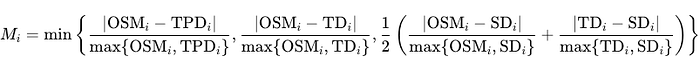

The core idea behind this metric is to utilize multiple distance sources to validate the OSM-derived distance. Since SD_ᵢ_ represents the OSM-snapped version of TD_ᵢ_, it cannot directly validate the OSM distance. Instead, we only use SD_ᵢ_ to validate the OSM distance when the snapped distance itself is highly reliable, meaning that the trajectory distance and the snapped distance closely align. This ensures that the validation is based on confident distance matches.

We now roll up the metric _Mᵢ _to the desired level of aggregation. The desired level of aggregation that worked for our internal use cases is the L5-geohash pair _(g₁, g₂)_

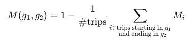

This metric lies in the interval [0, 1] and is not symmetric in _(g₁, g₂)_ since the road networks are not necessarily symmetric. We say that the OSM distance in the region _(g1, g2)_ is of high confidence if _M_ _(g₁, g₂)_ > threshold _t_.

### The Coverage Metrics

- The **coverage **metric is evaluated as the fraction of OSM road segments covered by GPS trajectories spanning X days/months in a given L5 geohash, i.e.,

- The **delta coverage **metric is evaluated as the fraction of OSM road segments that are covered by GPS trajectories in a block of X days/months but were not covered in the preceding block of X days/months. Let  
_S₁_ = Set of OSM IDs that intersect with GPS points of trips in the L5 geohash in a contiguous block of X days/months.  
_S₂_ = Set of OSM IDs that intersect with GPS points of trips in the L5 geohash in the preceding block of X days/months.

The delta coverage metric helps us identify the route patterns that have changed substantially over a period of time. If this metric takes a low value, it indicates that the routes taken haven’t changed substantially over a period of time. This metric in conjunction with the OSM-APLS metric helps estimate both the point-in-time and temporal reliability of the OSM road network.

Evaluating the coverage and delta coverage metrics over a time-span of a few weeks involves overlapping billions of GPS points against millions of road segments on OSM in India. Therefore, handling the scale of the data requires using geospatial indexing. We implemented this in Spark using Uber’s [H3 cells](https://h3geo.org/) as the indexing scheme. The evaluation pipeline is described below.

### Pipeline for Evaluating Coverage Metrics

The schematic below represents the modules for evaluating the coverage and the delta coverage metrics. These modules are described subsequently.

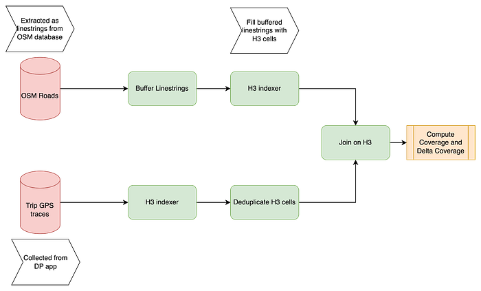

The OSM roads extracted from the OSM database are represented as linestrings. These linestrings are buffered into polygons with a 5 m buffer width as shown below.

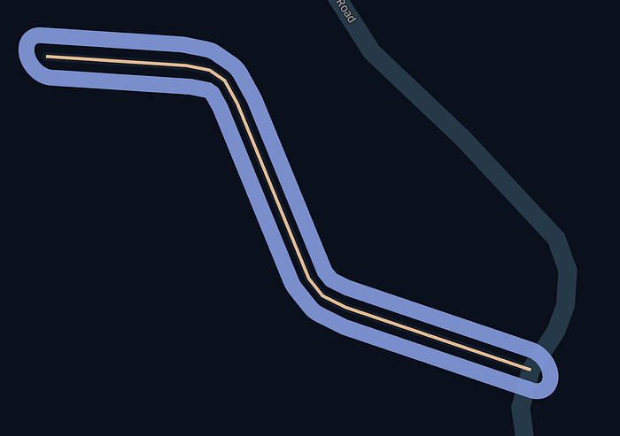

The buffered OSM linestrings are further indexed by filling them with [H3 cells](https://h3geo.org/docs/core-library/restable/). We use H3 cells of resolution 13 with an edge length of 3.5 m.

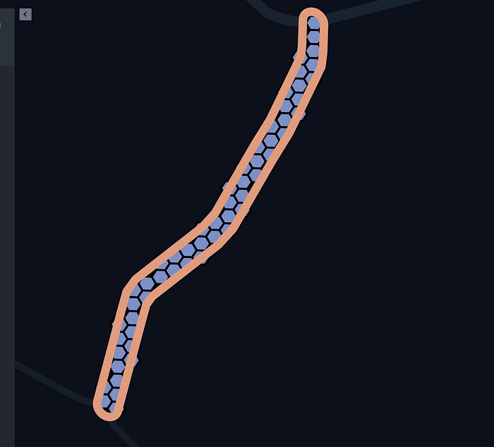

The GPS points of FM and LM trips are also indexed using H3 cells of resolution 13. The small dots representing the GPS points of a trip and the corresponding H3 cells are shown below. Some dots appear to fall outside the H3 cell because of radius of the dots. In reality, they lie within the H3 cell. These H3 indexed GPS points are further deduplicated across trips.

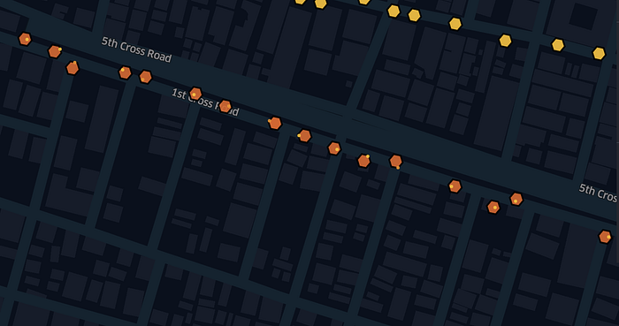

The indexed trips and the linestrings are then joined on the H3 indices. A snapshot of intersection between H3 cell for a latest trip and buffered OSM linestring is presented below.

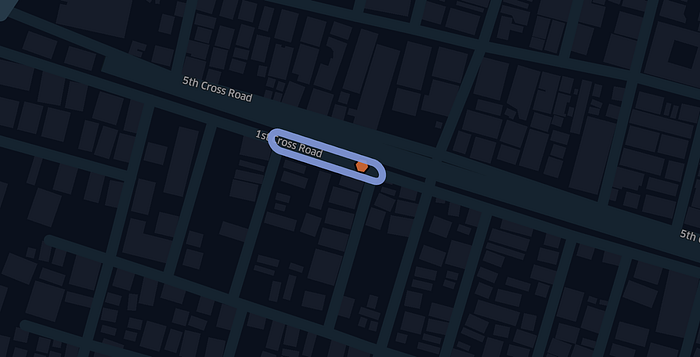

The coverage and the delta coverage metrics are then computed efficiently as defined above.

## Routing Configurations

Typically, OSM distances are calculated using a least-cost path between pairs of locations. We leverage [Graphhopper](https://github.com/graphhopper/graphhopper/tree/eace9b011e3c7ce4906818d5ac7b36d98abb3dd2), an open-source routing engine to efficiently compute these distances at scale. Graphhopper provides routing configurations for two-wheeler (motorcycle) and four-wheeler (car) vehicles. The four-wheeler profile restricts routing on certain road segments using highway tags. Since our deliveries are predominantly carried out on two-wheelers, the motorcycle routing configuration is of primary interest. These configurations, alongside cost parameters — ‘shortest’, ‘fastest’, and ‘short-fastest’ — determine how road segments are weighted in the graph. Ultimately, Graphhopper computes the optimal route as the least-cost path across the OSM road network. In this section, we evaluate these cost configurations.

In the ‘shortest’ configuration, the road segment length is the weight, while the ‘fastest’ configuration relies on an estimated travel time for each segment. The ‘short-fastest’ configuration combines both approaches, using a weighted average of the segment length and travel time. In essence, the weightings are as follows.

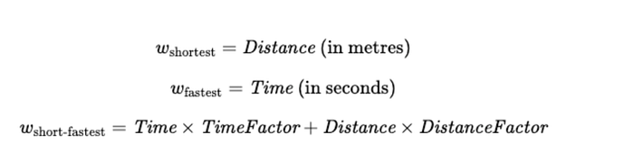

where

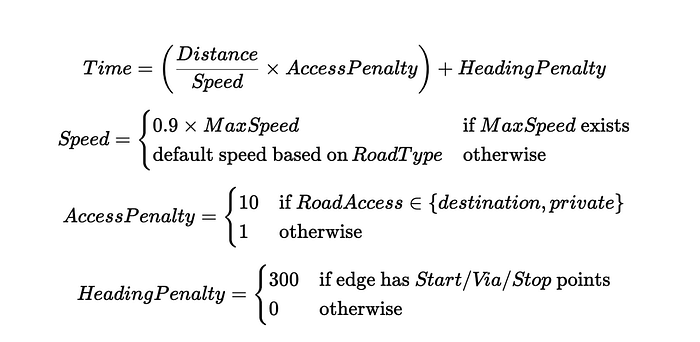

Graphhopper’s default configuration sets the parameters as _TimeFactor_=1 and _DistanceFactor_=0.07. This implies that the cost of one hour of travel time is approximately 14 times the cost of travelling one kilometre in distance. These parameters can be adjusted according to specific business requirements. However, for evaluation purposes, we retain the default settings. The default speed values used for time calculations in Graphhopper are listed below, with maximum speed values (_MaxSpeed_) sourced from the OSM roads database where available.

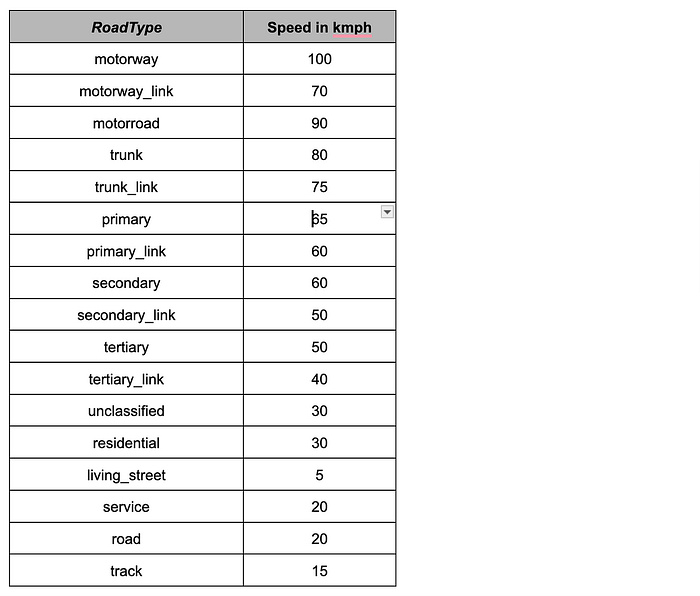

### The Evaluation

We compare various routing configurations — motorcycle shortest (OSM_MS), fastest (OSM_MF), and short-fastest (OSM_MSF) — with a third-party four-wheeler distance (TPD) using multiple evaluation metrics. The first metric is the Mean Absolute Error (MAE) relative to the synthesized ground truth (SGT) defined in [1]. Given the limited coverage of SGT, we also assessed the OSM-APLS metric. SGT integrates TPD, OSM_MF, trajectory distance, and snapped route distance. Despite this, TPD and OSM_MF exhibited higher MAE than the OSM_MSF configuration. The OSM-APLS metric further confirms that OSM_MSF is the most accurate routing approach among the configurations tested

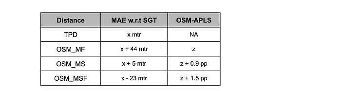

In the [next part](./the-osm-distance-service-part-2-fixing-roads-90bd6d3bb60f.md) of this blog series, we will introduce the design of a machine-learning system to detect missing road segments, connectivity, and incorrect travel directions on OSM. This is crucial for enhancing the accuracy of OSM distance measurements and routing efficiency.

## References

[1] Gaurav et al, “[Learning to Predict Two-Wheeler Travel Distance](https://dl.acm.org/doi/pdf/10.1145/3493700.3493726)”, ACM CODS-COMAD 2022.

---
**Tags:** Geospatial Intelligence · Location Intelligence · Maps · Openstreetmap · Roadmaps
