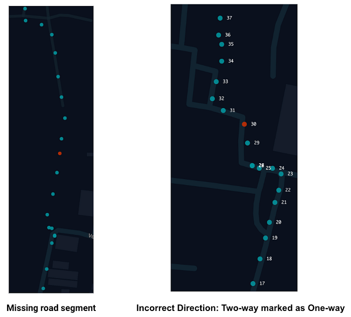
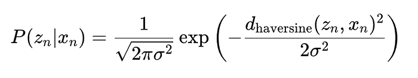
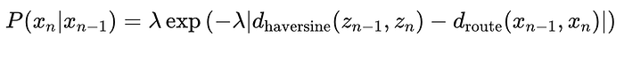
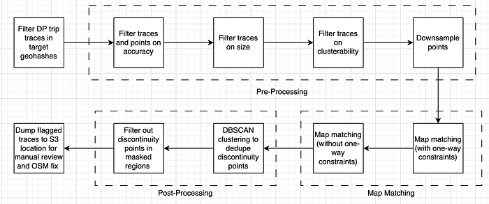
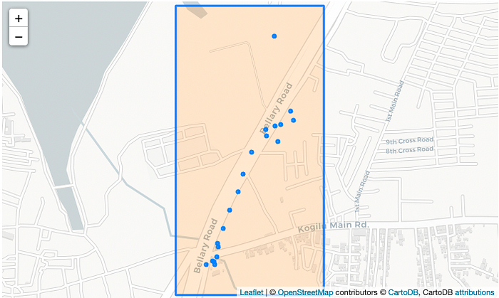
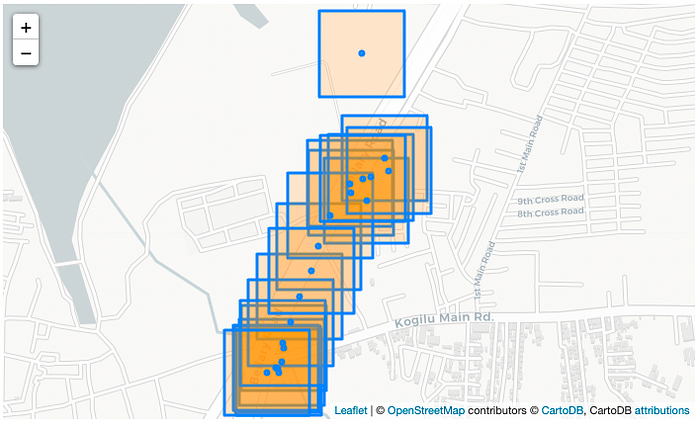
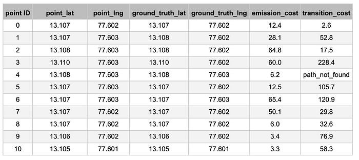
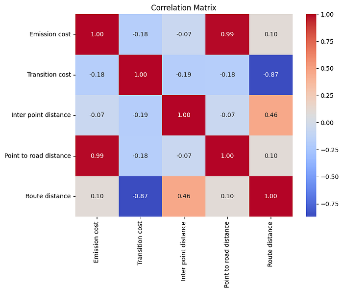
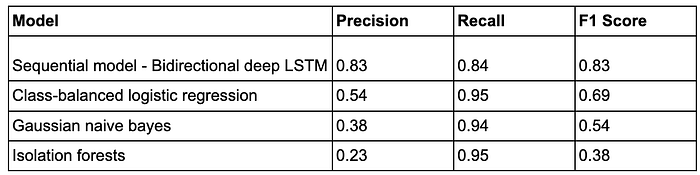

# The OSM Distance Service Part 2: Fixing Roads

Co-authored with [Sagar Jounkani](https://www.linkedin.com/in/sagar-jounkani/), [Jose Mathew](https://www.linkedin.com/in/jose-mathew-550aa525/).

In [Part 1](https://medium.com/@abhinav_ganesan/the-osm-distance-service-part-1-evaluation-metrics-6e8686ca814f) of this blog series, we introduced the OSM-APLS and delta-coverage metrics to assess the accuracy of OSM distance calculations. We also evaluated the various routing cost configurations and concluded that the motorcycle short-fastest configuration is the most accurate one offered by the Graphhopper library. Road segments must be accurately represented within the OSM database for accurate distance computation. Our anecdotal analysis of several samples in India has identified three predominant error modes:

1. **Missing Road Segments**: These refer to road segments that exist in reality but are not present in OSM.
2. **Missing Connectivity**: This indicates instances where two road segments are physically connected but lack a connector in OSM.
3. **Incorrect Travel Directions**: This pertains to situations where a two-way road is mistakenly designated as one-way, or vice versa.

In this blog, we propose machine learning systems to address these issues — specifically targeting missing road segments, missing connectivity, and incorrectly marked one-way roads. Our objective is to enhance the accuracy of OSM distance computation and improve routing efficiency. Examples of missing road segments and incorrect travel directions are given below. The blue dots represent the GPS trajectory of a delivery partner (DP). The red dots approximate the locations with a missing road segment and the travel direction is incorrectly specified.

The unsupervised ML system design presented in this blog is inspired by the Catch Map Errors (CatchMe) [algorithm](https://www.uber.com/en-IN/blog/mapping-accuracy-with-catchme/). We also present an improvement in the coverage of missing road/connectivity detections over the unsupervised system using a self-supervised ML system. The inputs to the algorithms are historical GPS trajectories of DPs.

## Map-Matching Primer

A useful task often accomplished with GPS traces is determining the underlying road segments where the noisy GPS points are observed. This task is called map matching. A road segment is just a pair of (lat, lng) indicating the start and end locations of the segment and a sequence of points representing the segment trajectory between the start and endpoints. A seminal paper by [Newson and Krumm](https://www.microsoft.com/en-us/research/publication/hidden-markov-map-matching-noise-sparseness/) solved the map-matching problem using a Hidden Markov Model (HMM) formulation. The HMM formulation incorporates a stochastic and Markov relationship between road segment sequences (which are the hidden states that we want to estimate) and the GPS trajectory. The problem statement in map matching is to identify the most likely sequence of road segments among several hypotheses that underlie the GPS trajectory. The model takes into account the graph connectivity between the road segments and the accuracy relationship between an underlying road segment and a GPS observation. Map matching is sensitive to the accuracy of the GPS points (i.e., noise in the GPS measurements) and the GPS sampling frequency. The sampling frequency influences the distance between the consecutive GPS points. Therefore, we use the accuracy values and the inter-point distance as preprocessing steps.

The objective function in map matching is to minimise the sum of emission and transition costs across consecutive GPS points. The emission cost specifies the negative logarithm of the likelihood that the vehicle is at map location _xₙ _given a GPS location _zₙ_.

_dₕₐᵥₑᵣₛᵢₙₑ_​_(zₙ, xₙ)_ is the Haversine distance between the GPS observation _zₙ_ and the projected map point _xₙ. _The projection is just a perpendicular projection in the Cartesian coordinate system achieved using the ST_ClosestPoint function in PostGIS. The parameter _𝜎 _is the standard deviation of GPS noise. The parameter was taken to be the median of accuracy values in the DP traces dataset.

The transition probability represents the likelihood of transitioning from the map point _xₙ₋₁ _to _xₙ_, given the distance between consecutive GPS points. The transition cost is the negative logarithm of the transition probability.

_dₕₐᵥₑᵣₛᵢₙₑ​(zₙ₋₁, zₙ)_ is the Haversine distance between consecutive GPS points _zₙ₋₁_​ and _zₙ_​, _dᵣₒᵤₜₑ(xₙ₋₁,xₙ)_ is the distance along the road network between the projected points, λ is the inverse mean of the exponential distribution. A lower value of λ implies higher tolerence for incorrect route estimate. We found that a value between 0.5 to 1 works generally well in terms of precision of the algorithm.

## The Unsupervised Algorithm

*Workflow of the unsupervised algorithm comprising pre-processing, map-matching, and post-processing steps. The flagged traces are validated manually by the Operations team and the road segments are fixed on the OSM database.*

The pipeline takes the GPS points from FM and LM trips of DPs and discovers a set of missing road candidates which can be fixed manually on the OSM database. GPS trace is a sequence of GPS points recorded at some frequency. For example, a GPS point is represented by the attributes: _{‘lat’: 12.8511542, ‘lng’: 77.6526123, ‘timestamp’: 1581944969108, ‘accuracy’: 28}, _where lat and lng fields are in units of degrees, the timestamp represents the UTC in milliseconds, and accuracy is in units of meters. The (lat, lng) is the estimate of location triangulated by the GPS receiver based on time-stamped signal inputs from multiple satellites. The accuracy of the position estimate is mainly affected by the scattering of signals in the receiver’s environment. The accuracy value is an estimate of the accuracy of the predicted location. The higher the value, the more inaccurate the predicted location is.

**Pre-processing**

We sample trips from the previous X-days in a set of target geohashes using the start and end locations of the trips. These target geohashes can be identified using the OSM-APLS metric presented in the first part of the blog series. The GPS points in the trips are then pre-processed as follows.

- **Accuracy filter**: Remove trips that have a high mean accuracy value (high value implies high drift from the true location) and remove GPS points with very high accuracy value (i.e. noisy GPS measurement)
- **Point count filter**: Filter out trips if the number of points in the trip is below a certain threshold. Such trips tend less informative, covering small distances or they might just be cases where the DPs are parked close to the restaurant and walking to pick-up the order.
- **Clusterability filter: **Filter out trips if the fraction of points in a trip that can be clustered using DBSCAN is high (> 0.5). This indicates a likely scenario where the DP is travelling a small distance on the vehicle and spends more time walking or waiting in the traffic. Such scenarios have no useful signals to offer in terms of detecting missing road connectivity on OSM.
- **Downsample points** in the filtered trips based on the inter-point distance. For a given distance threshold _k_, no two consecutive points can have distance < _k _in the trip. The first and last points are preserved irrespective.

**Map-matching**

The map-matching algorithm uses the HMM model with the road segments representing the nodes of the graph, and the sum of emission and transition costs taken to be the edge weight on the graph. The [Viterbi decoder](https://en.wikipedia.org/wiki/Viterbi_algorithm) efficiently identifies the most likely sequence of road segments taken by the DP in the trip as a minimum-cost path in the graph. The candidate road segments for every GPS point in the trip need to be sampled to define the nodes. This can be done in two ways, viz. full-tile and broken-tiles sampling, as visualized below.

*Full-tile sampling: Sampling OSM road network based on a polygon containing all the points of a trip with a search radius of 100 m*

*Broken-tiles sampling: Sampling OSM road edges from a polygon around each point*

We found that the full-tile sampling helped improve the recall of detecting missing road segments and missing connectivity issues by ~2.5 times. Full-tile sampling reduces false positives of missing road segments that arise due to signal loss from DP devices leading to increased sampling duration between consecutive points. Such cases will likely be falsely flagged as connectivity issues with broken tile sampling.

The map-matching algorithm fails to assign a projected location on the road network for a GPS po in a trip if at least one of the following happens.

1. There are no roads within the search radius of the point. This is an unlikely case if the search radius is large enough. A 100 m search radius typically suffices in densely populated geographies like India.
2. There are no routes between the projected candidates for 2 consecutive GPS points on the sampled road network graph. This happens very likely due to road segments missing near the points.

Below is a representative output of map-matching on a trip trajectory. It shows the features generated at a point level (emission cost, transition cost) and the ground truth estimated lat-lng. In cases where the transition cost is above a practical threshold, we output “path_not_found” indicating a potential missing road candidate.

*Example output of map-matching algorithm applied to DP trip trace.*

- **Apply map-matching again, without one-way constraints and retain trips with path-discontinuities**. A second iteration of map-matching without one-way constraints is applied on trips with path discontinuities in the initial iteration of map-matching. The second iteration is required to remove false positives due to DPs traveling in the opposite direction to traffic on a road segment marked as one-way. Such movements could be legitimate — like DPs walking near delivery points, temporary parking, etc. It could also indicate actual traffic rule violations or incorrect one-way tagging in OpenStreetMap. Trips with path-discontinuities in the second round are much more likely to be true positives for missing road/connectivity cases, hence this step helps in improving the overall precision of the pipeline by ~10%.

**Cluster candidates**

- **Apply DBSCAN clustering on all discontinuity points** and select the point closest to the centroid of each cluster. This step is a deduplication layer for the flagged discontinuity points since the algorithm can flag points from multiple trips for the same missing road/connectivity on OSM. This helps in reducing the manual effort for the operations team that helps fix flagged missing road/connectivity on OSM. Post clustering, we preserve all outlier discontinuity points.
- **Filter out discontinuity points** **in the masked regions**. This helps eliminate cases where the same missing road/connectivity issues are flagged from pipeline job that runs on successive days by masking areas that are under manual review from previous job runs. Fixes to OSM data for issues flagged by the pipeline has a lag of X days. Hence, [H3 cells](https://h3geo.org/) (at resolution 10, side length = 65m) for discontinuity points are masked for job runs for next X+1 days.

The shortlisted trips with the missing connectivity candidates along with the locations of the _path_not_found_ are manually validated. The connectivity was then fixed on the OSM roads database. The precision of this algorithm was validated to be ~63% over a few lakh DP trip points that were flagged and manually reviewed for missing road/connectivity.

## The Self-Supervised Algorithm

In urban areas with congested road networks, the unsupervised algorithm has a high rate of false negatives, i.e., missing connectivity not being flagged as _path_not_found_ due to an alternate nearby route. The alternate route will likely have a higher transition probability in the trip trace but not high enough to be flagged as _path_not_found_. Tuning the parameters to make the algorithm more sensitive to transition cost often results in high false positives as GPS noise can also increase transition cost. These issues restricted the coverage of the unsupervised model. We trained a classification model to identify GPS points in the DP trip trace emitted from a missing road segment to overcome these issues. The positive labels were synthesized by deleting OSM road segments, for simulating missing road cases, in congested urban areas and running map-matching for DP trips in that area. The features used are as follows.

1. Emission cost from the map-matching algorithm.
2. Transition cost from the map-matching algorithm.
3. Inter-point distance: _dₕₐᵥₑᵣₛᵢₙₑ​(zₙ₋₁, zₙ)._
4. Point to road distance: _dₕₐᵥₑᵣₛᵢₙₑ_​_(zₙ, xₙ)._
5. Route distance: _dᵣₒᵤₜₑ(xₙ₋₁,xₙ)._

Some of these features are strongly correlated, as illustrated below. However, the strongly correlated features can be thought of as non-linear feature transformations of each other.

*Correlation matrix of features.*

The training dataset had a class imbalance ratio of 98:2, i.e. 2 discontinuity points for every 100 points. Class balancing was implemented by weighting loss by the inverse of the class frequency. As a result, rarer class samples had a larger weight that increased their contribution to the overall gradient thereby reducing the error for such samples.

*Performance comparison of sequential model vs non-sequential models.*

The above metrics are for the positive class as evaluated on the synthetic test set. The bidirectional LSTM model performed the best as it captured the sequential pattern in features like transition cost increasing as the GPS points pass over a missing road segment and decreasing thereafter. The expected range of transition costs also depends on the GPS noise represented by the emission costs. Other non-sequential models had a higher recall but a much lower precision as these models couldn’t easily distinguish between genuine missing road points and normal variations in features like transition and emission cost due to the variations in GPS noise. The actual precision as validated on the flagged and manually reviewed trips was ~65%. The coverage improved by 4x relative to the unsupervised algorithm.

Thank you for following along with our two-part blog series! We hope you found it insightful for improving OSM distance accuracy as we explored evaluating the OSM road network, selecting the optimal routing configurations for OSM distance computations, and leveraging ML algorithms to enhance the road network on the OSM database.

---
**Tags:** Geospatial · Location Intelligence · Maps · Openstreetmap · Roadmaps
