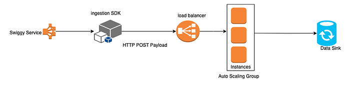

# Unlocking Cost Savings: Compression in Ingestion’s ALB Optimization

Co-Authored By [Vikash Singh](https://medium.com/u/e6a2591997f2?source=post_page---user_mention--c7f99fecd744---------------------------------------)

Swiggy is a data-driven company, The platform that manages its data must not only be robust and scalable but also constantly evolve to meet growing demands. Continuous optimization and innovation are essential to ensure the platform delivers high performance, reliability, and efficiency. This enables Swiggy to make faster, more informed decisions while seamlessly scaling with the business.

## Overview of Ingestion

Before diving into the specifics of this blog, let’s first provide a quick overview of Swiggy’s event-ingestion service.

*General overview of Swiggy’s event ingestion service*

Any Swiggy service can interact with our event ingestion API or integrate with the ingestion SDK to seamlessly send data for processing. The HTTP request body carries the event, which is ingested into the data sink in real-time. This real-time data is then available for a variety of use cases, including analytics, machine learning models and features, debugging, historical analysis, and business decision-making.

## The Cost Bump

At one of our recent cost review meetings, we stumbled upon something quite surprising — on one of our highest traffic days, our ALB (Application Load Balancer) costs exceeded our EC2 (Elastic Compute…
