# Uplift Modeling aka Heterogeneous Treatment Effects Evaluation

This is joint work with [Kenneth Foo](https://www.linkedin.com/in/kfoofw/) (cross-posted from the authors’ Github article with some changes)

**1. Why uplift modeling?**

With causal inference, we conduct experiments where the treatment assignment is randomized, and we observe the outcomes (conventionally known as Y) on the experimental units. To calculate the average treatment effect within the whole population, we take the average value of the outcome within the treated group and compare it against the average outcome value within the control group. Since the treatment assignment is randomized, the only difference between both groups is the treatment effect, and we can conclude that the resultant difference is the causal effect of the treatment.

**However, we can expect certain subgroups within the general population to experience a greater treatment effect compared to other subgroups. For example, in the context of a marketing treatment using a coupon, customers with a history of seeking discounts may have a higher incremental response rate compared to other groups.**

This brings us to the topic of heterogeneous treatment effects (HTE), which implies that different subpopulation groups have varying treatment effects. By identifying that different subgroups will have different response rates to the treatment, we can perform ‘uplift modeling’ to identify and rank the subgroups that have the best _incremental_ response rates and prioritize them.

Uplift (also known as incremental value) modeling is based on a generic framework using the theory of Conditional Average Treatment Effect (CATE). For a given Treatment T, the incremental value is the difference in expected outcomes between T = 1 and T = 0, conditioned upon some covariates/features X.

*Conditional Average Treatment Effect(CATE)*

For a given set of covariates X, we assume conditional independence between the treatment assignment T and the potential outcomes (Y^1,Y^0). This is also known as conditional exchangeability/unfoundedness.

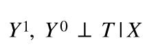
*Conditional exchangeability assumption*

Based on the actions taken by customers/units with an intervention (e.g. a promotional offer), there is a fundamental segmentation that separates units into four groups.

- **The Persuadables**: Customers who only take the action because of the intervention
- **The Sure Things**: Customers who would have taken the action independent of whether they were given an intervention or not
- **The Lost Causes**: Customers who will not take the action independent of whether an action is given or not
- **The Do Not Disturbs**: Customers who will respond negatively if given the intervention

The objective of any uplift modeling exercise is to identify The Persuadables and prioritize them while avoiding the rest.

In this article, we will discuss uplift modeling in a business setting where:

- the customers are the experimental units,
- the customers’ demographic information can be captured by covariates X
- the treatment/intervention T is a business action (e.g. promotion),
- and the outcome is a binary metric of interest (e.g. customer purchase behavior)

Some or all of these techniques are used in various business cases at Swiggy. However, for the purposes of demonstration, we use the Criteo advertising dataset available on the open web.

**2. Uplift modeling with Meta-Learners**

There are various approaches through which we can model incremental value. In this article we cover four such techniques:

- Single Model Approach (S-Learner)
- Two Model Approach (T-Learner)
- X-Learner
- CATE-generating Outcome Transformation approach

All the above formulations can be thought of as algorithmic frameworks to model incremental value, in which one can incorporate any typical ML algorithm as a base learner. These types of frameworks are typically referred to as Meta Learners in the literature.

**2.1 Single Model Approach (S-Learner/SMA)**

The **S-Learner** can be thought of as a “single” model approach. We model the outcome Y conditional on X _and_ T (where T is treated as one of the covariates) with the data. A downside is that if the set of X features is very large (or high dimensional), estimating the causal effect of T on Y might be difficult since T is just one out of many covariates. In the following notation, M represents a particular supervised learning model applied to predicting Y conditional on X and T.

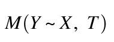
*Supervised learning model*

After creating the model, the CATE for a given unit (with its corresponding set of X features) is estimated via:

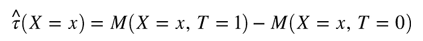
*CATE estimate with S-Learner*

**2.2 Two Model Approach (T-Learner/TMA)**

The **T-Learner** on the other hand uses two models: one for the treated group (represented by M_1), and one for the control group (represented by M_0). Given that there are separate models for the corresponding groups, the T feature is not included as a covariate in the modeling.

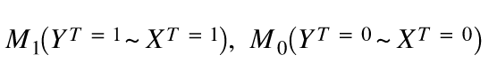
*Two separate supervised learning models on test and control dataset*

After creating the two models, the CATE estimation for a given unit (with its corresponding set of X features) is estimated via:

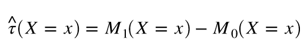
*CATE estimate with T-Learner*

With the T-Learner, note that there is data inefficiency in the modeling since we only use the treated group data for one model, and the control group data for the other model. To overcome this data inefficiency, we can take a look at the X-Learner.

**2.3 X-Learner (XL)**

The **X-Learner** consists of two stages each with two models. The two models in the first stage are essentially the same as the two models in the T-Learner.

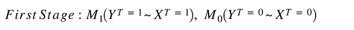
*First state models for X-Learner*

Once M_1 and M_0 are created, we can use them to predict the counterfactual outcomes on their corresponding counterpart data group to calculate the intermediate values D.

- For the Control group data, we calculate the intermediate variable D^0 based on the M_1 counterfactual outcome prediction minus the observed outcomes

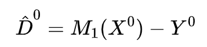

- For the Treated group data, we estimate an intermediate variable D^1 based on the observed outcome minus the M_0 counterfactual outcome prediction.

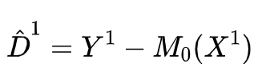

Thereafter, in the second stage, the two models (say, M_11 and M_00) are created using the intermediate values D^1 and D^0 accordingly:

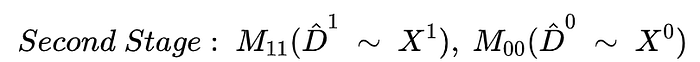
*second stage models for X-learner*

Subsequently, the CATE estimation for a given unit (with its corresponding X features) is shown by the following:

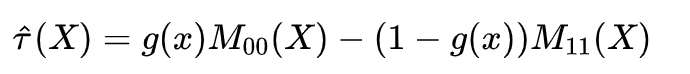
*CATE estimate with X-Learner ( Typo in the equation : instead of -(1-g(x)), it should be (1-g(x)) without minus)*

Where g(x) is some function and typically created as the propensity scoring model.

The X-learner is by design more robust to local sparsity than the T-learner. When g(x) is close to one, i.e. almost all data near x is expected to be in treatment, the base-learner built on control data M0 is expected to be poorly estimated. In this circumstance, the algorithm gives almost all weight to M00 since it does not depend on M0. The opposite pattern holds when g(x) is close to zero.

**2.4 The CATE-generating Outcome Transformer (OT) approach**

A key insight is that we can characterize CATE as a conditional expectation of an observed variable by transforming the outcome using the treatment indicator and the treatment assignment probability.

Define the CATE-generating transformation of the outcome, as following

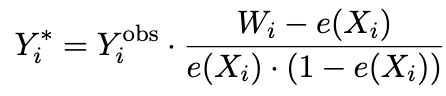

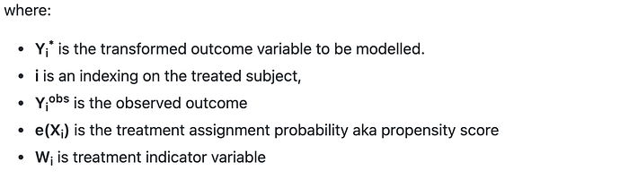

Suppose that unconfoundedness / conditional exchangeability assumption holds, then

*Conditional expectation of transformed outcome as a CATE estimate*

The biggest advantage of the CATE-generating Outcome Transformer approach is that it directly models CATE with a single model, which results in a robust model. This can be observed in tighter confidence intervals in qini, aqini and cgains for the OT approach in Treatment vs. Conversion scenario that we will see in the ‘demonstration using the Criteo data’ section.

**3. Evaluation techniques**

Evaluation of uplift models involves various metrics. However, before we get into those metrics, one should understand how to read a gain chart. In the x-axis, we seek to rank the population according to the predicted treatment effects. Thereafter, we can calculate the metric of interest on the y-axis.

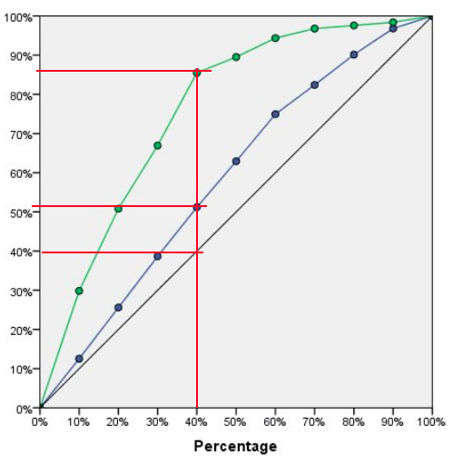
*Fig 1: Example Gain Chart*

The typical benchmark for evaluative comparison is a randomized model — represented by the diagonal line. In the chart above, the green and blue lines show the gain performance for uplift models that have rank-ordered the population subgroups. For a given population percentage (vertical line at a x-axis value), we can read off the graph to compare the y-values between different models and also against the benchmark value. This difference represents the performance lift, and it can possibly lead to some form of value optimization. For example, as shown by the red line along the green curve, by targeting 40% of the population, one captures about 85% of the possible gain value compared to targeting the whole population.

In uplift modeling, there are 3 common evaluative measures:

- Qini curve
- Adjusted Qini curve
- Cumulative Gain curve

**Qini curve**

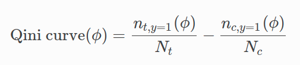

The population fraction ϕ is the fraction of population treated (in either treated t or control c, as indicated by the subscripts) ordered by predicted uplift (from highest to lowest). The numerators represent the count of positive binary outcomes corresponding to either the Treatment group or the Control Group. The denominators however do not depend on the population fraction and are instead the total count of either Treatment or Control in the experiment. Mathematically, the value represents the difference in positive outcomes between the Treatment vs Control, for a given population quantile. The bigger the value is, the bigger the treatment effect.

The intuition is that since we ranked the population by descending predicted treatment effects, we would expect the Qini value to be higher at the earliest quantile of the population (where the treatment effect is bigger), and taper off with increasing population quantiles (where the treatment effect is smaller).

**Adjusted Qini curve**

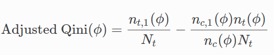

This modified fraction is formulated to represent the fraction value while adjusting for the count of positive outcomes in Control as if the total Control group size were similar to the total Treatment group size. This is particularly applicable for cases where the treatment group is much smaller compared to the control group (where the rationale could be that you may not want to expose a potentially harmful treatment to a large proportion of your population).

**Cumulative Gain Curve**

There are different variants of the Cumulative Gain metric, but for this article, the formula is based on the following:

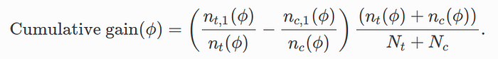

The first bracket shows the difference in fractions in the Treatment vs Control groups, whereby the numerators represent the count of positive outcomes while the denominator represents the count of Treatment/Control based on a given population.

The Adjusted Qini Curve can also be reformulated in a different way to illustrate that it is similar to the Cumulative Gain, but with a different multiplier.

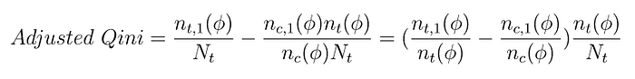

Based on the revised formulation of the Adjusted Qini, we can see the difference in the multipliers.

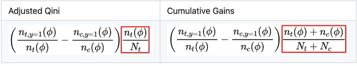

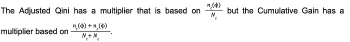

Given the cumulative gain uses both Treated and Control populations at every fraction in the adjustment factor, we emphasize that the cumulative gains chart is less biased than the adjusted Qini curve. However, the adjusted Qini can be useful when the Treated group is much smaller compared to the Control group in the experiment. Under such a scenario, the adjusted Qini allows us to value the treatment group members are valued disproportionately higher.

**Model Comparison with Area Under Curve (AUC) Differential**

To incorporate the various metrics for evaluation, we have to refer back to the gains chart visualization. As mentioned, the randomized model is the typical benchmark that is represented by the diagonal 45-degree line.

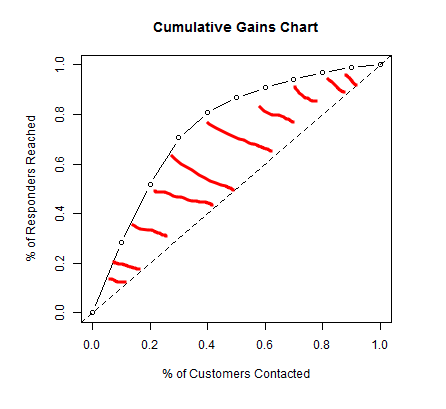
*Fig 2: Example Gain Chart with AUC differential between a given model (curve with circular dots and solid lines) versus a randomized model benchmark (curve with dashed lines)*

When we evaluate a model’s performance relative using the Qini formulation, for example, we calculate the Q coefficient which is represented by:

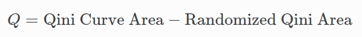

This difference in area is represented by the red shading in the above figure. Note that the same can be done for Adjusted Qini or Cumulative Gain as the metric.

**4. Demonstration using the Criteo dataset**

The Criteo dataset ([http://ailab.criteo.com/criteo-uplift-prediction-dataset/](http://ailab.criteo.com/criteo-uplift-prediction-dataset/)) consists of about 13 million observations on the following variables:

- **f0, f1, f2, f3, f4, f5, f6, f7, f8, f9, f10, f11:** feature values (dense, float)
- **treatment**: treatment group (1 = treated, 0 = control)
- **visit**: whether a visit occurred for this user (binary, label)
- **exposure**: treatment effect, whether the user has been effectively exposed (binary)
- **conversion**: whether a conversion occurred for this user (binary, label)

With this dataset, the treatment assignment is randomized with the ratio between the Treated and Control group being 85% to 15%.

Based on the difference in treatment assignments, we can take a look at the breakdown of two different outcome distributions, namely ‘Visit’ and ‘Conversion’.

With Visit as an outcome, the response rates are

- Control group: 80105/ (80105 + 2016832) = 3.82%
- Treated group: 576824 / (576824 + 11305831) = 4.85%

With Conversion as an outcome, the response rates are:

- Control group: 4063 / (4063 + 2092874) = 0.194%
- Treated group: 36711 / (36711 + 11845944) = 0.309%.

### Uplift modeling setup

Since the Criteo dataset is fairly large, for faster experimentation cycles, we work with a 50% random sample. We evaluated different uplift modeling approaches using: a) GBT as base learners, b) default hyper parameters, c) 5-fold cross validation, d) using Qini, Adjusted Qini & Cumulative Gains (cgains) metrics.

We will analyze the results of two scenarios of treatment variable T vs. different outcome variables:

1. Treatment vs Visit
2. Treatment vs Conversion.

**Treatment vs. Visit**

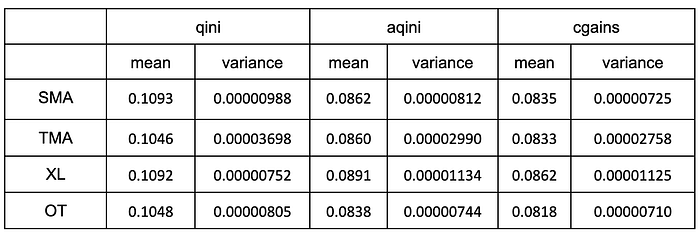

> We observe that, in general, the T-Learner (TMA) tends to have a slightly higher variance compared to the rest. This could be because T-Learner itself comes with inefficient use of data where it develops separate models for Treated and Control groups. Since the Control group, at 15% is much smaller than Treatment, its variance is likely to be higher.

**Treatment vs. Conversion**

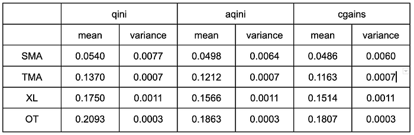

> The OT framework performs significantly better than all other meta-learners with cgains of 0.181 with the least variance of 0.0003 on cross validation metrics. The SMA is, again, the least performing. It is worth experimenting with class imbalance correction to see if that helps the SMA.

**Conclusions**

A big difference between the Visit vs. Conversion scenario is that in the latter case, both OT and XL perform better than the SMA and TMA. Note that the difference in scenarios is that the Visit outcome has ~4–5% response rate while the Conversion outcome has about 0.2 to 0.3% response rate.

> For the OT and XL, we posit that by explicitly incorporating propensity score models in their formulation, there is some form of ‘weighting correction’ that allows for better modeling of the incremental treatment effect, especially in low response rates scenarios. Thus, they can perform significantly better than SMA and TMA.

All of the notebooks used in this article are available here.

- [5 Fold Cross Validation Notebook](https://github.com/kfoofw/applied_learning_articles/blob/main/uplift_modelling_with_Criteo_dataset/notebooks/Criteo%20-%20Plots.ipynb)
- [CV Results Visualization Notebook](https://github.com/kfoofw/applied_learning_articles/blob/main/uplift_modelling_with_Criteo_dataset/notebooks/results_visualisation/Results_Visualisation.ipynb)
- [Example CGAINS chart for various meta learners](https://github.com/kfoofw/applied_learning_articles/blob/main/uplift_modelling_with_Criteo_dataset/notebooks/Uplift%20Modeling%20With%20Criteo%20Dataset.ipynb)

**5. Selected references**

1. [Machine Learning for Estimating Heterogeneous Causal Effects](https://www.gsb.stanford.edu/faculty-research/working-papers/machine-learning-estimating-heretogeneous-casual-effects)
2. [Meta-learners for Estimating Heterogeneous Treatment Effects using Machine Learning](https://arxiv.org/abs/1706.03461)
3. [Leveraging Causal Modeling to Get More Value from Flat Experiment Results](https://doordash.engineering/2020/09/18/causal-modeling-to-get-more-value-from-flat-experiment-results/comment-page-1/?unapproved=16&moderation-hash=7fa9a26e6386c27d25dbca6d1c777441#comments)
4. [Free Lunch! Retrospective Uplift Modeling for Dynamic Promotions Recommendation within ROI Constraint](https://arxiv.org/abs/2008.06293)

---
**Tags:** Uplift Modeling · Causal Inference · Meta Learners · Swiggy Data Science
