# Using Deep Learning for Ranking in Dish Search

With contributions from [Srinivas Nagamalla](https://www.linkedin.com/in/srinivas-n-54a6b98/) and [Anurag Mishra](https://www.linkedin.com/in/anuragmishracse/)

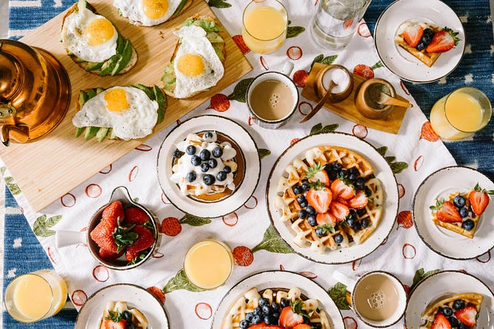
*Source: unsplash.com*

Swiggy’s Search is the primary entry point for customers who have a higher intent of what they want to order or want to explore the restaurants and dishes served. This requires us to solve the important task of understanding customer’s intent intelligently and serve them with relevant results. This is a non-trivial task as customers don’t always convey their intent clearly when typing search queries which often contain spelling mistakes and sometimes vague or semantically complex. This adds an additional responsibility to correctly understand customer’s intent on top of serving them with relevant results.

Dish search in general can be broadly divided into two steps: a) Dish Retrieval and b) Dish Ranking. Retrieval helps in constricting the search space from millions of dishes to hundreds. These dishes are then ranked to show more relevant ones at the top. In this blog, we take a look at using Deep Learning techniques for Dish Ranking.

## Input features: What makes a dish relevant to a customer?

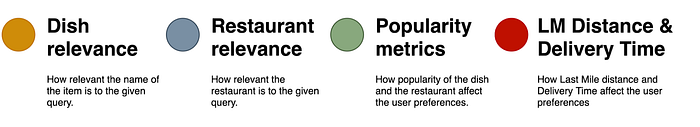

Given a dish query, the hierarchy can broadly be classified as follows:

**Relevance of the dish**: Given a user query, we want to retrieve dishes with relevant names from our index. Dish names vary widely.

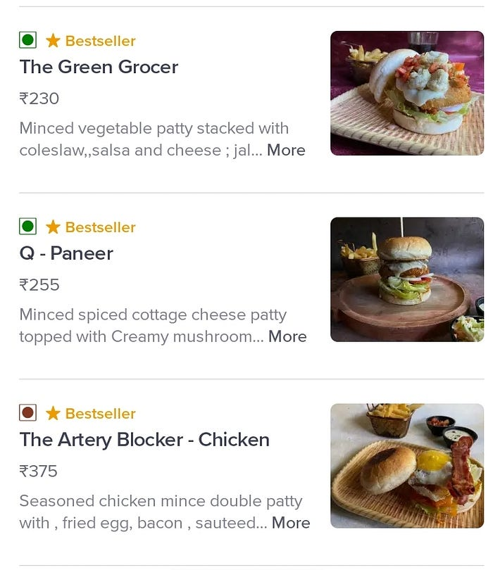
*Figure 1: Examples of dishes with artistic names.*

Dish names can range a wide spectrum, from being vaguely definitive to being very artistic. For example, consider the names of burgers from the restaurant _Da-Bang Burgers, Grills and Pastas_: _Artery Blocker, Green Grocer, Q — Paneer._

Also, we have to consider the wide variety of languages used in our culturally diverse country. For example, “chicken” can be called _Murgh in Hindi, Kozhi in Tamil_ etc. When we get a query for “chicken”, we have to account for all these variations. Not to mention the variations the dish names have in spellings. Biryani has three popular spellings: _Biryani, Briyani and Biriyani._ Chicken in Hindi is spelled either _Murg or Murgh_ etc. Indian words and spellings are phonetic in nature and there being no standard means to phonetically transcribe words from Indian languages to English, these variations occur.

**The restaurant the dish is from: **Each and every restaurant has their own style of preparation for the same dish. For example, ‘Chicken Biryani’ from ‘Paradise Biryani’ is a lot different from ‘Chicken Biryani’ from ‘Shah Ghouse’. A burger from ‘Chilli’s’ is very much different from a burger from ‘KFC’. Yet, it is almost impossible to quantitatively determine what makes them different from just the dish name or description, since we need to put a number on taste, which is difficult from using just catalog information.

But we can try to implicitly learn to encode this information into restaurant features, by matching query terms to restaurants.

**Popularity features (of both dish and restaurant): **Popularity is another equally important factor a user might consider when ordering food. Popularity affects the order preferences in different ways. For example, consider the case of chain restaurants like _KFC, McDonald’s, Domino’s_ etc. No matter which part of the country we order from, we get the same product, same taste and same standards. On the other hand, we have the case of regional favorites, regional tastes which is a market best served by local/regional restaurants. Statistical popularity features also tell us a lot in terms of how we should rank the items.

**Time and Distance: **One of the most important factors which a user will consider when ordering food is the delivery time. In general, restaurants nearer to a customer’s location are more preferred compared to the ones that are farther, since delivery time can significantly change the taste and temperature of the food being delivered, which can directly affect the satisfaction of the customer.

## Model: A modular approach to solving the problem

Whenever we get a query from the user, the relevant dishes are retrieved from our Food index. These relevant dishes, along with the query are then passed to our ranking model, to get a score for each retrieved dish. The dishes are sorted based on these scores. And this sorted order is the final order of dishes which will be shown to the users. The kind of features we use per dish are shown in Figure 2 and are explained in the sections that follow.

To teach our model how to rank dishes, we train our model on click-through information from historical data. For training we used data collected over a period of one month, and for validation, we used a week’s data from a much later period. From the historical data, dishes which are clicked more frequently for a query should be more relevant to other dishes. Based on this intuition, we model our training objective, which is explained later in this section.

### Architecture

Our architecture was inspired by a paper from Google, titled: [**Neural Ranking Model with Multiple Document Fields**](https://arxiv.org/abs/1711.09174)**. **They attempted to solve Web page ranking for web queries using a modular approach, where they model each of the different input fields separately first and then combine them together. We adopted a similar approach to our problem, the different fields in our case being: semantic inputs, restaurant inputs, popularity inputs and distance-time inputs. An overview of our model is shown in Figure 2. We explore how we model each of the input fields below. Each of these models give a score (semantic, restaurant, popularity and distance scores), and the weighted sum of these is considered the final score of the model given a query and a dish.

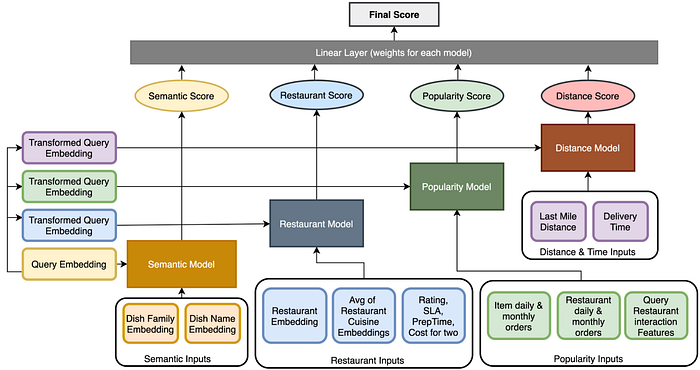
*Figure 2: The model architecture.*

### Semantic Model

For our semantic model, the inputs were query, dish name and dish family. We get the dish-family information from Swiggy’s in-house [Food Taxonomy](./decoding-food-intelligence-at-swiggy-5011e21dbc86.md). The family represents the class a given dish belongs to. For example: _Veg Extravaganza_ from _Domino’s Pizza_ belongs to the _Pizza_ family. This can greatly help in places where the dish names are not descriptive of the dish.

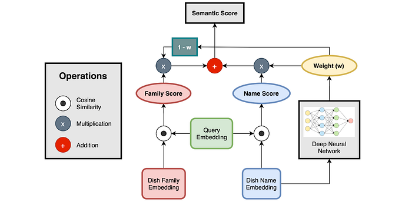
*Figure 3: Semantic Model*

Given a string, we used a trigram tokenizer to convert the input into sub-tokens. These were passed through an embedding matrix to get an embedding for each of the sub-tokens. The average of these embeddings were considered as the embedding of the given string. Using this approach, we get three embeddings: query embedding (q), dish name embedding (n), dish family embedding (f).

We then compute cosine similarities between the query (q) and both name embedding (n) and family embedding (f). Let’s call these values _cos_qn_ and _cos_qf_. We then get a weight (_w, 0<=w<=1_) by passing the dish name embedding through a deep neural network. This _w_ is then used to weigh _cos_qf_ and _cos_qn_ as shown in Figure 4. The pictorial representation for the same is shown in Figure 3.

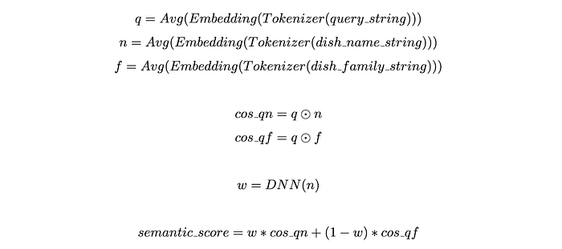
*Figure 4: Equations of the Semantic Model.*

The intuition behind the usage of _w_ and the weighted sum is that, if the dish name is not particularly descriptive of the dish (for example: a burger with name : “Green Grocer”), more attention should be paid to the dish family information, while if the dish name already had information about the family (eg: chicken burger), then family information can safely be ignored. The model implicitly learns how to assign weights based on the training data.

### Restaurant, Popularity and Distance-Time Models

1. **Restaurant Input:** Concatenation of [restaurant embedding](https://bytes.swiggy.com/using-embeddings-to-help-find-similar-restaurants-in-search-1d1417dff304), average of restaurant cuisine embeddings and features like rating, preparation time, cost for two and SLA.
2. **Popularity Input:** Concatenation of normalized values of daily orders and monthly orders of both dish and restaurant and query-restaurant interaction features.
3. **Distance-Time input**: Concatenation of normalized last-mile distance and max delivery time.

For numerical features, we also passed different transformations of the values (like squared, root etc) along with the original values. This is a common practice in using numerical features with DNN based models.

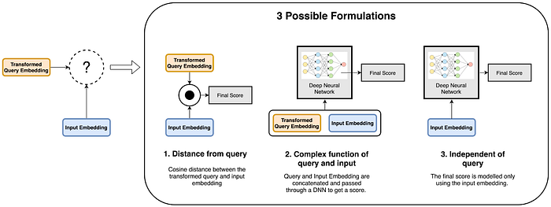
*Figure 5: Different ways of modeling to get a score given input features and query.*

For these three kinds of inputs, we experimented with different ways to obtain their respective scores. The entire process can be divided into two steps:

1. **Query Transformation:** Transform the query embedding (_q_) to a different space using a Linear transformation. Let’s refer to the transformed query as (_tq_)
2. **Modeling**: Given transformed query (_tq_) and different input features (like restaurant, popularity and distance-time), what function do we use to get a score?

For the Modelling part, we experimented with 3 different formulations given query and input features, as shown in Figure 5. These are as follows:

1. **Distance of input from the query**: Cosine similarity between the transformed query embedding (_tq_) and input features represents the score of this model.
2. **Complex function involving query and input:** Concatenate the transformed query embedding (_tq_) and input features and pass them through a deep network to get a score.
3. **Independent of query: **Compute the score based only on the input features. Note that for this step, we can ignore the query transformation step completely. This is to model features which have a direct impact on ranking irrespective of the query.

But given the huge number of possible combinations, we made our experiments iterative, where we selected the best way of modeling individually for each kind of input and then combined them together. We found that the following formulations worked best for each of the different kinds of inputs as shown in Table 1.

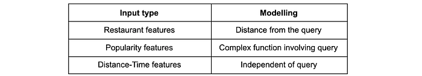
*Table 1: Best ways of modeling different inputs found by experimentation*

### Getting the final score

The weighted-sum of the scores based on each of the different inputs (semantic, restaurant, popularity and distance-time) is considered the final score. The way we get weighted-sum is by using a linear layer without bias. The weights are learned as part of the end-to-end process during training. Finally, when given multiple dishes for a given query, they are sorted according to this weighted sum.

## Training Objective

For training our models, we consider three different types of dishes for a given query. These types of dishes are:

1. **Clicked dish:** Dish which was shown and was clicked by the user for a given query.
2. **Shown dish:** Dish which was shown but not clicked by the user for a given query.
3. **Random dish:** Irrelevant random dish to the given query which was not shown to the user.

One training sample for our model is made of one dish from each of these types and the corresponding query. Some examples for the same is shown below in Table 2, where each row corresponds to one sample.

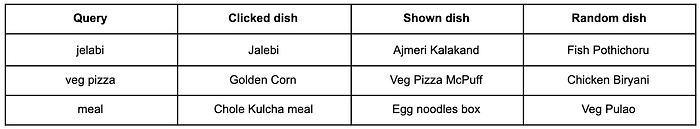
*Table 2: Example training samples from historical click-through data.*

Given these three kinds of inputs, our model is trained to differentiate between them. We use Margin Ranking loss for training the model. This is shown in Figure 6.

*Figure 6: Margin ranking loss. x1, x2 denote the two predictions. margin denotes the minimum difference that we require between x1 and x2.*

Margin Ranking Loss is computed on pairs of predictions. For any pair of predictions x1 and x2, the loss tries to assert that x1 should be greater than x2 by at least the given margin. If the condition is satisfied, the loss is 0. If the condition is not satisfied, the loss value is proportional to how much the difference d (d = x1 — x2) is less than the given margin.

In our case, we require the prediction scores of different types of items to be in the following order: clicked dish > shown dish > random dish. The margin between each pair of these three dishes were chosen experimentally and are as shown in Table 2. In Table 2, we require that the items in column x1 should be greater than those in column x2 by the corresponding values in the margin column.

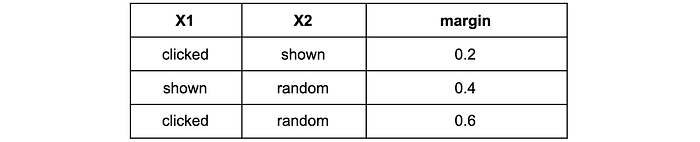
*Table 2: Margins between different types of Dishes used for training*

This formulation gives us three loss values for each training sample. The average of these loss values is considered as the final loss, which is then used to train the model using Gradient Descent.

## Results

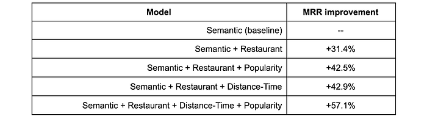
*Table 3: Results*

We use the Semantic Model as a baseline and show the improvement of our model in MRR as we keep adding more input features. As we can see, adding more features drastically improves the quality of our model. The highest boost in MRR comes from adding the restaurant features to the Semantic Model, which, on top of providing restaurant relevance, helps the semantic model in differentiating between dishes with similar names.

## Conclusion

In this post, we saw how to use a deep learning model to rank dishes in Swiggy’s dish search. We did a review of the wide variety of features being used in our ranking like dish relevance, restaurant features, popularity features and distance of the user from the restaurant along with delivery time. We then presented our model architecture to encode these features along with examples of training documents from our historical click logs and the final training objective.

---
**Tags:** Learning To Rank · Deep Learning · Swiggy Data Science · Recommender Systems · Food Delivery
