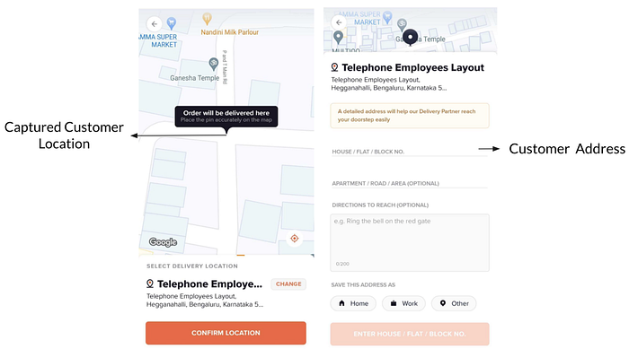
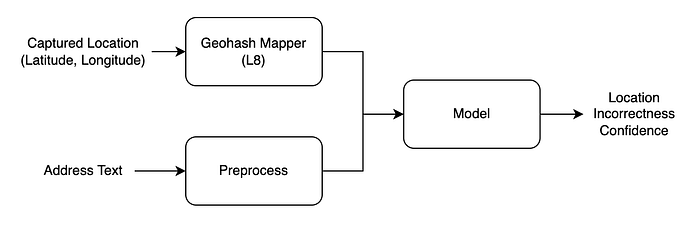
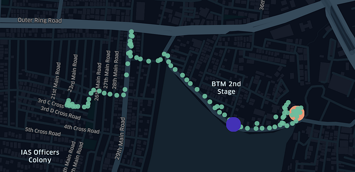
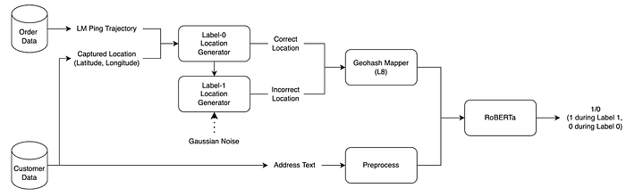
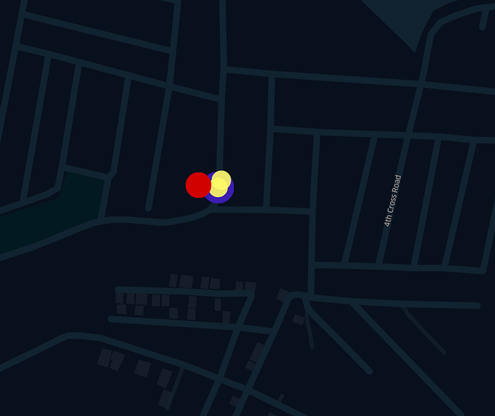
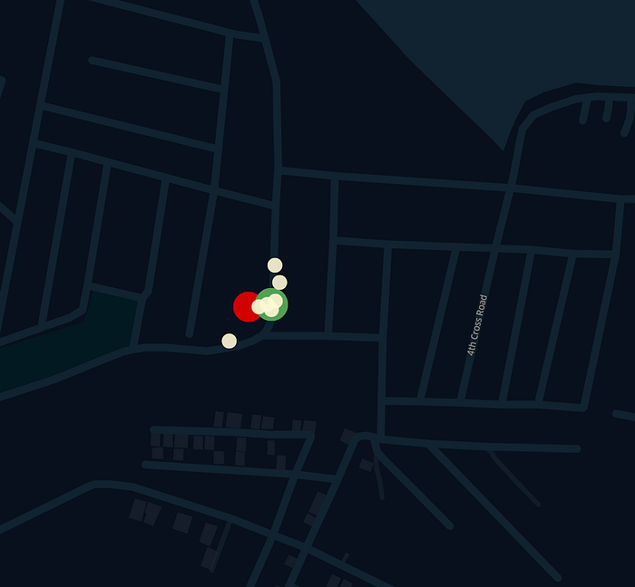
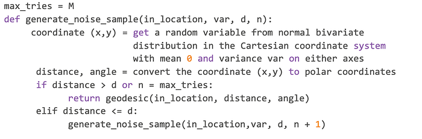
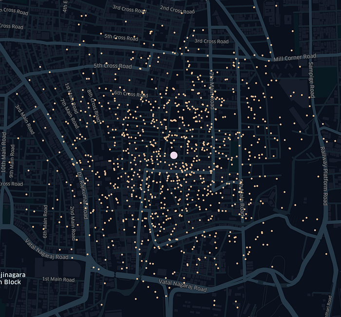
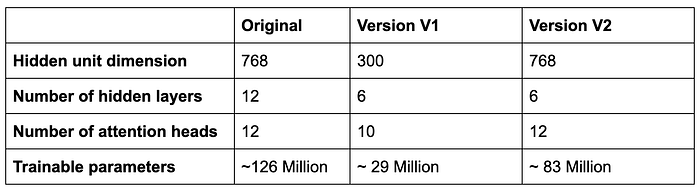
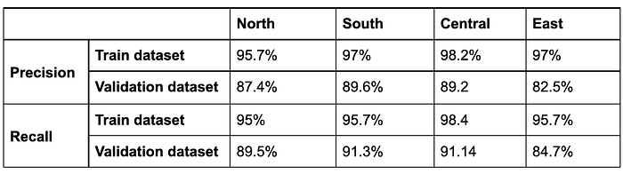

# Using deep learning to detect dissonance between address text and location

Co-authored with [Abhinav Ganesan](https://www.linkedin.com/in/abhinav-ganesan/), [Jose Mathew](https://www.linkedin.com/in/jose-mathew-550aa525/)

## Introduction

Every time customers want to order to a new address on the Swiggy app; our customers encounter the following address onboarding flow. The first screen gives the information about the customer’s location captured by their device GPS. After confirming the location, the customer is redirected to the next page, where the customer enters the address in textual format. Capturing the correct customer location during customer address onboarding is of utmost importance as they represent the final destination to which the order has to be delivered by our Delivery Partner unless the text address contains a well-known landmark. Since GPS signals are susceptible to noise, the captured GPS location may not represent the customer’s actual location. In this blog, we formulate this problem as a binary classification problem and use a deep learning model to flag addresses with incorrectly captured locations.

*Address onboarding screenshots*

Let us first define some terms and acronyms used in the blog.

**DP**: Delivery Partner

**GPS**: Global Positioning Service

**Captured Location**: Location (latitude, longitude) of customer captured during address onboarding.

**Delivered Ping:** GPS ping (latitude, longitude) that represents where the order was delivered as marked by the DP on the DP’s app.

**Address text**: Address text of the customer captured during onboarding.

**LM trip**: Last mile (LM) trip is the journey DP makes from the restaurant partner to the customer location.

**Geohash**: Geohash encodes a geographic location into a string of letters and digits. It quantizes the geographical locations into grids and the grids can be configured at different resolutions such as L1 to L12. The cell width of L8 geohash is at most 38.2 m, and the cell height of L8 geohash is at most 19.1 m.

**Haversine distance:** It is the shortest distance between two points on the surface of a sphere. The earth’s surface is approximated to be a sphere and the haversine distance represents an approximation of the shortest distance between two points on the earth’s surface. The road network distance is often longer than the haversine distance between two points.

## Motivation

Customer locations are essential for hyperlocal eCommerce deliveries because of bounded, and at times, aggressive delivery time promises. Unless the text address contains a well-known landmark, the customer location indicated by the geographical coordinates (lat, lng) as seen on a map is the beacon for the DP. Therefore, incorrect customer location impacts most downstream delivery systems and adversely affects the customer experience (CX) and the DP’s delivery experience (DX).

1. In the worst case, the DP cannot reach the correct customer location because the captured customer location shown to the DP is far away from the correct location. Therefore, the customer ends up canceling the order. Such order cancellations are recorded in our database using an appropriate disposition.
2. Incorrect captured location impacts the CX and the DX even if the DP manages to deliver the order successfully. When the DP reaches the incorrect location, the DP informs the customer that (s)he is unable to find the address. The customer then directs the DP over the phone to the correct location. Hassles of finding the right delivery location frustrate the DP and the hungry customer waiting for the order. In addition, this leads to a breach of promises of the expected time of delivery (ETA) of the order.
3. DPs are assigned to the orders using the captured locations, and hence, incorrect captured locations lead to suboptimal DP assignments. The adverse impact on CX is amplified during batched orders, where one of the orders is associated with an address-location mismatch, which impacts the delivery times of the other orders.

Swiggy idealizes the world of silent deliveries where the DPs shouldn’t have to call the customers, and the orders are delivered well within the ETA promises. One of the building blocks of this ideal is to get the customer’s location accurate. In this blog, we formulate a simplified version of this problem as flagging addresses with incorrectly captured locations using a deep learning (DL) model. The accurate locations are obtained by manually tallying the address text with the locations using publicly available information on real estate websites or popular mapping services. Since our focus is currently on addresses whose orders are cancelled due to incorrect addresses, the scale of the manual exercise is manageable.

## A Self-Supervised Model Approach

We assume that customers enter valid and correct text addresses since it is in the customer’s interest to get the order delivered to the correct address. Further, the customers are de-incentivized from arbitrary order cancellations by our customer care executives. Therefore, our problem statement reduces to classifying if the captured location accurately represents the address text. We achieve this by using aggregates of (address location, address text) tuples. We train a classifier on a dataset of label-0 which comprises consonant (address location, address text) tuples, and a dataset of label-1 which comprises dissonant (address location, address text) tuples. The primary challenge we address in this blog is the design of these label-0 and label-1 datasets. This label-0 dataset is constructed from the ‘delivered’ signals captured from the DP’s app for successfully delivered orders. The label-1 dataset is synthesized by perturbing the locations in the label-0 dataset. The details are presented in the subsequent sections.

### Features

The captured location and the address text constitute the input features of the model. Since location is a numeric feature, we convert the same into a string feature using the geohash encoding. This overcomes having to deal with input data with different scales and different data types. Thus, the features into the model are given by the L8 Geohash of the captured location and the address text separated by a separator token.

The output of the model is binary where 1 (0) indicates that the captured customer location is inaccurate (accurate).

The address text is preprocessed as explained in [this](./mining-pois-via-address-embeddings-an-unsupervised-approach-c86edb397742.md) blog for mining points-of-interest.

*Inference flow of the model*

### Challenges in Label Generation

The DPs mark orders as delivered on their app when they hand over the order to the customer. This signal is annotated with the GPS location where the order was marked as delivered and fed back into the system. We use these ‘delivered’ locations to identify if the captured locations are accurate. However, the DPs may not mark the order as delivered exactly at the customer’s doorstep. Further, the delivered location itself might be noisy. An instance of the DP marking the order as delivered far away from the correct customer location.

*DP marks the order as delivered (location indicated by the purple circle) far away from the correct customer location (indicated by the red circle). The green points represent the DP’s LM trajectory.*

In the subsequent sections, we describe how we overcome these challenges for label-0 and the label-1 synthesis. A summary of the dataset preparation is presented pictorially below and the details follow in the subsequent sections.

*The training flow of the model*

### Label-0 Synthesis

We use the following algorithm to generate label-0 samples.

1. We first synthesize the location of a customer address from the delivered location of all orders that are successfully delivered to the address. This location is referred to as the synthetic location. As each order has a delivered location, we augment these delivered locations with locations from GPS traces of LM trajectory that are within _x meters_ from the delivered location, We shall call these the augmented delivered (ADEL) locations. Now, we aggregate the ADEL locations across all orders for each address by computing the median of the latitudes and the longitudes to end up with the synthetic location. A pictorial example of generating synthetic location is presented below.
2. For each address, we compute the Haversine distance between the captured and the synthetic location. If this distance is at most _y meters_, then we label that address as label-0 indicating that the captured location is correct.

The following figures represent the outputs at each stage of Label-0 synthesis of an address.

*This figure represents the LM trajectory of a successfully delivered order to the address. Here, the red point represents the captured location, the purple point represents the delivered location, and all the remaining points represent the LM trajectory of the DP.*

*This figure represents the locations after calculating the ADEL locations of an order. Here, the red point represents the captured location, the purple point represents the delivered location, and all the remaining points represent the augmented locations.*

*The green point represents the synthetic location computed as the median of the ADEL locations, represented by brown circles, of multiple orders under an address.*

The intuition behind augmenting the delivered location for each order using the GPS traces from the LM trajectory is that a single GPS location is highly likely to be noisy and aggregation of neighborhood locations in the trajectory de-noises singular location estimates. We use the ADEL locations for orders only if there are at least two augmenting locations for each delivered location. Therefore, not every customer address that has an accurate captured location and has a successfully delivered order can be labelled as label-0. If the median of these ADEL locations is close enough to the captured location of the address, it is unlikely to be a coincidence, and therefore, taken to be validation of the correctness of the captured location. After manual validation of a few hundred samples that are labeled as label-0 in this way, we found that the accuracy of label-0 is approximately 90%.

### Label-1 Synthesis Using Label-0 Perturbation

**The Vanilla Approach: **A natural extension of the label-0 synthesis is to generate label-1 by using the complementary criterion, i.e., the distance between the synthesized location and the captured location is taken to be more than y meters. However, on manual validation of such label-1 dataset, we found that the synthesized label-1's were only 31.8% accurate which is unreliable to train the classifier on. Some causes of the low accuracy are as follows.

1. The DP marks the order as delivered far away from the customer’s location.
2. The address belongs to a gated community or apartment where the DPs are sometimes not allowed to enter into the private compound.
3. Users edit an address if they move to a different location or a different city.

We tried to solve the first problem by modifying the delivered location to the location in the LM trajectory that is nearest to the captured location. We then recalculated the synthetic location based on this newly defined delivered location. If the distance between the new synthetic location and captured location is at least _y meters_ we considered these addresses as label 1. The second problem could be solved by increasing the threshold of _y meters_ on the distance between the captured and the synthetic location to classify the address as label-1. However, this results in discarding genuine label-1 addresses. The third problem is not easily solvable because the locations are accurately captured when the customers edit the address after moving to a different location and the delivered locations are naturally spread out across time resulting in false tagging as label-1. Nevertheless, the solutions to the first two problems did not increase the accuracy of label-1 significantly without significantly impacting the coverage.

**The Synthesis**

Since the label-0 dataset is of high accuracy, we synthesize the label-1 dataset from the label-0 dataset by perturbing the captured location, and as a corollary, the label-1 dataset is also of high accuracy. In other words, we are guaranteed that the perturbed captured location does not correspond to the address text.

*Pseudocode for perturbing the label-0 location*

In practical settings, the captured location is Gaussian distributed around the ground truth customer location. However, it is hard to estimate the variance of the Gaussian distribution in the [WGS-84 coordinate system](https://en.wikipedia.org/wiki/World_Geodetic_System), and hence, we resort to approximations. We use a Gaussian distribution in the Cartesian coordinate system which gives us greater control over the minimum distance to which the _in_location_ must be perturbed. This distance is specified using the parameter _d._ The variance_ var_ is fit to quantiles of actual bad captured locations that we sampled and manually validated in the vanilla approach. The geodesic function uses an ellipsoidal earth model to obtain the location in the WGS-84 coordinate system. We use an off-the-shelf implementation available [here](https://geopy.readthedocs.io/en/stable/). The label-1 location is thus obtained as

label-1 location = generate_noise_sample(label-0 location, _var_, d, 1).

The address text for the label-1 dataset is taken to be the same as the label-0 dataset. This ensures that the location and the address text pair for the label-1 dataset are dissonant.

*Samples of perturbed points represented in brown color around a label-0 location represented in pink color for d =125 meters. One such sample is taken to be a label-1 location.*

## RoBERTa Model Training

We train the classifier in two phases, i.e., pretraining of the [RoBERTa](https://arxiv.org/pdf/1907.11692) model using a masked language model (MLM) and fine-tuning the entire model with the classifier head added on top of the CLS token. We experimented with two trimmed-down versions of the original RoBERTa model. The difference in the parameters for the two versions and the original RoBERTa model are presented in the table below. We use the leaner versions of RoBERTa to optimize for both training and inference time.

*Difference between the default RoBERTa model and our version.*

We segregated the top 10 cities (by order volumes) into 4 zones namely North, East, South, and Central India. We chose the V2 model over V1 since the training time for V2 is smaller as compared to V1 for the same level of performance. This is because the V2 model has a larger number of parameters to learn the variation in address semantics of the different cities within each zone faster.

We pre-train the RoBERTa model for MLM from scratch instead of initializing using pre-trained models on data sources such as Wikipedia and [BookCorpus](https://arxiv.org/pdf/1506.06724) because the semantics of these texts is quite different from the semantics of Indian addresses. We used off-the-shelf implementation of the RoBERTa model (MLM and Classification) from the [HuggingFace](https://huggingface.co/docs/transformers/model_doc/roberta) library.

### Metrics and Experiments

Train and validation are split in an 85:15 ratio of data for which the labels were generated. The metrics achieved on the train and the validation datasets are presented below for the four zones.

*Precision and recall of train and validation datasets for each zone.*

In typical NLP classification tasks such as the SST-2, a sentiment classification task in the [GLUE](https://arxiv.org/pdf/1804.07461) benchmark, only the classification head of RoBERTa is fine-tuned by freezing weights of the underlying architecture after pre-training for the MLM task. We experimented with the same and the model performance was significantly inferior as observed below.

![The graph on the left represents the variation in the metrics with respect to the number of epochs when we fine-tune only the classification head for the classification task while freezing the layers underneath on a Tier-1 city dataset. The precision and the recall do not consistently improve by training for a longer duration. The graph on the right represents the variation in the metrics with respect to the number of epochs when we fine-tune all the layers of RoBERTa including the classification head on the same dataset. The F1-score is the highest at epoch 20.](../images/8b624a855bab4515.png)
*The graph on the left represents the variation in the metrics with respect to the number of epochs when we fine-tune only the classification head for the classification task while freezing the layers underneath on a Tier-1 city dataset. The precision and the recall do not consistently improve by training for a longer duration. The graph on the right represents the variation in the metrics with respect to the number of epochs when we fine-tune all the layers of RoBERTa including the classification head on the same dataset. The F1-score is the highest at epoch 20.*

## Conclusion and Future Work

We synthesized labels for the incorrect address location classification task using delivered locations captured on the DP app. While label-0 was obtainable directly from the delivered locations, label-1 had to be synthesized by perturbing the locations of the label-0 samples due to accuracy issues in generating the same using the delivered locations. Alternatively, we can generate label-1 samples by swapping the address texts between pairs of label-0 samples. This is being explored currently.

Our goal is to ensure that incorrectly captured customer locations are identified and corrected. This is being achieved by inferencing the (location, address text) tuples through the address flagger model followed by manual correction of the locations flagged as incorrect by the model. While the recall achieved on the real-world data by the model is hard to estimate, the precision can be estimated through manual validation. In reality, the dataset is skewed towards negative samples unlike in the train and the validation datasets. Therefore, the precision is expected to be lower than the precision reported on the balanced train and the validation datasets. A preliminary report obtained using manual validation on a dataset of addresses with cancelled orders suggests a healthy precision of 84 % in a large Tier-1 Indian city.

---
**Tags:** Location Intelligence · Address Validation · Deep Learning · Self Supervised Learning · Swiggy Data Science
