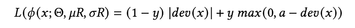
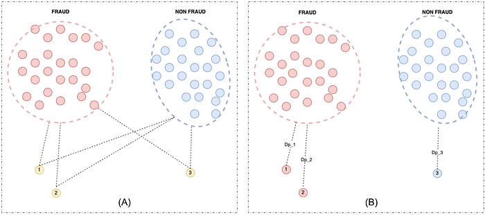
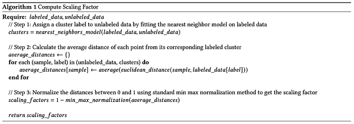
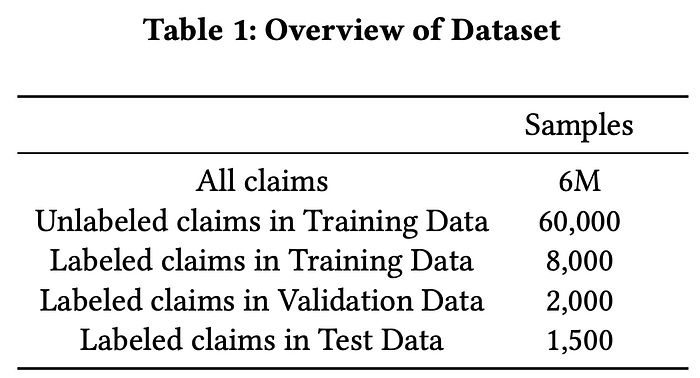
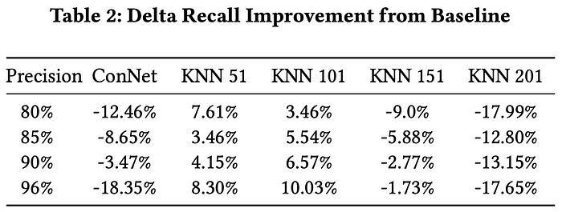
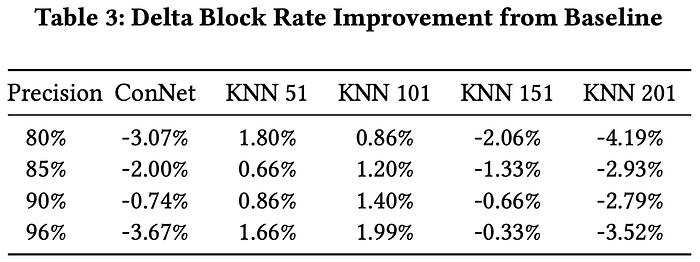

# Utilizing DevNet with Variational Loss for Fraud Detection in Hyperlocal Food Delivery

Co-authored with [Piyush Nikam](https://in.linkedin.com/in/piyushnikam), [Rutvik Vijjali](https://in.linkedin.com/in/rutvik-vijjali-338410155), [Meghana Negi](https://www.linkedin.com/in/meghana-negi/) and [Jose Matthew](https://www.linkedin.com/in/jose-mathew-550aa525/)

## 1. Introduction

The scale of hyperlocal food delivery and the growing priority towards customer satisfaction gives rise to fraud, leading to significant money drain towards illegitimate refunds or claims. Fraudulent customers try to game the system by raising false complaints for monetary gains and instant free food. This makes it crucial to have robust methods that can effectively detect and prevent potential fraud in real time. To learn a wide range of ever-changing fraud modus operandi (MOs), the training data for conventional supervised ML algorithms must be exhaustive, demanding a large set of signals and labeled data. While generating signals is often straightforward given the abundance of data, generating labels is labor-intensive and costly. In this context, semi-supervised models can be a viable solution where labeled data is limited.

We look to leverage effective semi-supervised models such as DevNet, which require a small amount of labeled data to effectively process a large volume of unlabeled data. To enhance the quality of the dataset, we propose the incorporation of a variational scaling factor for unlabeled samples generated from labeled samples during training. This factor scales the misclassification loss based on the hypothesized degree of fraud in each unlabeled sample, thereby guiding the model in situations where labels are not readily available.

We propose a novel approach to optimize anomaly scores by modifying the DevNet model loss function using a K-Nearest Neighbors (KNN) based variational scaling factor for nominal data. Our contributions are:

- We have utilized KNN distances to compute the similarity of unlabelled data to labelled fraud and non-fraud samples. These distances serves as a similarity metric, which is used to scale the loss contribution of the data, thereby introducing a variation factor that makes the learning process more robust.
- We have leveraged samples that are labeled as non-fraud to enforce the reduction of misclassification. Most semi-supervised approaches in fraud, use fraud-tagged samples effectively but seldom leverage the value of non-fraud-labeled samples. This becomes more important when the data is highly contaminated (significant ratio of fraud to non-fraud samples) and the feature space is large.
- We performed our experiments on an internal dataset having merely 0.15% manually labeled data and demonstrating the effectiveness of the proposed approach, both in terms of recall and block rate improvement. On average, our approach shows an approximately 6% improvement in recall and 1.3% improvement in block rate at fixed precision levels compared to the original DevNet framework.

## 2. Problem Statement

Our problem statement innately is not anomaly detection but fraud detection. Anomaly detection is identifying patterns in a dataset that do not conform to an established normal behavior. These anomalous patterns, often referred to as outliers, can be caused by various factors such as measurement errors, system faults, or simply random variations. On the other hand, fraud is a deliberate act of deception intended for personal or financial gain. Fraud involves complex methods to conceal illicit activities, often appearing as normal transactions. While anomalies can be innocent or unintentional, fraud is always intentional and malicious. Therefore, while all frauds might be anomalies, not all anomalies are frauds. In our work, we specifically focus on fraudulent anomalies; henceforth, any reference to ‘anomaly’ implies a fraud anomaly.

DevNet leverages a few labeled anomalies and a prior probability to enforce deviations of the anomaly scores of outliers from normal samples. This approach allows for end-to-end learning of anomaly scores, leading to more data-efficient training and significantly better scoring. A key component of this method is the Z-score based deviation loss function, as shown in the equation :

here 𝜇𝑅 is the mean and 𝜎𝑅 is the standard deviation of the prior-based anomaly score set, {r1,r2, …,rl} and 𝜙 (𝑥; Θ) is an anomaly score learner with parameters Θ. The deviation is then plugged into the contrastive loss as shown in the equation :

here _y=1_ if _x_ is an anomaly and _y=0_ if _x_ is a normal object,  
and the Z-Score confidence interval parameter is represented by _a_.

This deviation loss pushes the anomaly scores of normal samples close to a mean value while ensuring a significant deviation for anomalous samples. This approach encourages large positive deviations which are statistically significant for all anomalies, thus distinguishing them from normal samples.

A problem with this approach is the lack of labeled normal samples to learn normal data distribution. That is, in situations with high amounts of contamination in the assumed normal data, deviation loss fails to properly distinguish labeled anomalies effectively.

In this paper, we propose an approach to leverage the available labeled data to provide supervision for unlabeled training data rather than simply considering unlabeled data as normal samples. This enhancement can be addressed in two ways.

- The model should be capable of comprehending “normality” in unlabeled data, meaning how likely is the supposed normal sample to be a part of contamination. This implies providing the model with a prior understanding of the similarity between a normal sample and labeled samples, which we are estimating using the nearest neighbors approach.
- The model should prioritize learning from labeled non-fraud data compared to unlabeled data, by applying a higher penalty for misclassifications in the loss itself, thereby encouraging more accurate learning.

This research paper aims to explore these two strategies, with the goal of enhancing the performance of the DevNet model and maximizing the utility of labeled data.

## 3. Proposed Methodology

*(A): Each unlabeled sample (1, 2, …) is assigned to either fraud or non-fraud cluster using KNN model trained on labeled data. (B) : Calculating the average distance of unlabeled samples from all the samples of the assigned cluster.*

Our approach is focused on leveraging the similarity between the unlabeled and the labeled non-fraud samples, which is fed as supervision while learning on unlabeled data. To achieve this, we trained a K Nearest Neighbor algorithm on the available labeled data to learn a decision boundary and classify the unlabeled data into two clusters namely fraud and non-fraud clusters. As shown in (A) of above figure, we then assigned a label to each unlabeled sample (1, 2, …) by comparing it with these two clusters based on the label of the majority of its nearest neighbors. Once all unlabeled data samples are labeled, we calculate the average distance of each unlabeled sample from all the labeled samples within its assigned cluster.

This average distance Dₚ, as shown in (B) of above figure, acts as a similarity metric allowing us to distinguish between unlabeled samples. A higher average distance Dₚ would mean the point is less similar to the cluster. In above figure (B), Dₚ₁ < Dₚ₂, which represents that point 1 is more similar to point 2 in the fraud cluster. Mathematically, the average distance is represented as equation :

here _N_ is the number of points in a cluster, _d_ is the vector dimension, _x_ is the cluster point and _p_ is the unlabeled point.

We formulate this similarity as a scaling factor (𝛾ₓ) in the deviation loss, derived by normalizing average distances to a range of 0 to 1 and then subtracting from 1. It is incorporated in the original deviation score for nominal data of DevNet as shown in the below equation :

A higher 𝛾ₓ indicates a higher likelihood of being non-frauds hence relatively scaling up the deviation loss such that these samples accrue a higher penalty for misclassification. 𝛾ₓ will be lower for fraud anomalies leading to such samples having lower contribution towards overall learning and hence optimizing the model to be more resistant to contamination. The computation is presented in Algorithm as shown below.

## 4. Experiment

We demonstrate the efficacy of our methodology using our internal data of user claims for refunds. We compare our improvised contrastive loss function against the original loss function of the DevNet Framework. We utilize the K-Nearest Neighbors (KNN) Algorithm to ascertain similarity and produce scaling factors for unlabeled samples. Additionally, we illustrate the impact of modulating the KNN parameter _k _on the model’s performance. In our experiments, the value of _k_ is empirically determined and chosen specifically to illustrate the outcomes of increasing the value of _k_. For all the ablations, an odd number is selected as _k_ value to prevent a tie during cluster assignment. In this section, we first provide an overview of the dataset used for the experiment, then move to the evaluative metrics and in the end discuss the experiment results.

### 4.1 Dataset

For the experiment, we used a dataset of refund claims on the food delivery platform. The dataset contains around 6M claims with ~20% contamination (chosen for experimentation as actual value can’t be disclosed), out of which a mere 0.15% are manually labeled. When customers raise complaints about their food, we assign label-0 for genuine cases and label-1 if any fraud or abuse is detected. These labeled samples are further partitioned in an 80:20 ratio for training and validation purposes. From the unlabeled data, a random set of 1% claims is merged with available labeled data for training. For evaluating the trained model, out-of-time labeled claims are used. An overview of the dataset is shown in table below.

### 4.2 Metrics

The majority of consumer-facing fraud detection systems prioritize precision. This means that the negative impact of falsely identifying a ‘good’ customer as fraudulent is significantly higher than the reverse scenario. Hence in the paper, we measured the performance of our improvised loss function against the original loss function (baseline) using recall and block rate at varying precision levels. In the context of fraud detection, the block rate refers to the proportion of claims identified as fraudulent by the model out of all claims raised in the platform, represented as the following equation :

During the model training, we maintain the availability of labeled samples in every mini-batch by ensuring an equal count of labeled positive samples and unlabeled samples. Additionally, within the unlabeled samples, we ensure that _10%_ of them are from the labeled non-fraud samples with a default 𝛾ₓ set to _1_. We set the number of epochs to _50_ and train the model using _100_ batches per epoch with _batch_size=512_ samples per batch.

### 4.3 Experiment Results

For the experiments, results from the original DevNet Model are considered as the baseline. To preserve confidentiality, we only report delta improvement numbers for both the metrics in the _Delta Recall_ and _Delta Block Rate_ tables. The value in each cell of the tables represents the delta improvement or decrement in performance.

The Table 2 shows the delta improvement in the recall at different precision levels compared with baseline, ConNet and our proposed approach with different parametric values of _k_ in KNN. We observe that our enhanced loss function, calculated using KNN with 51 and 101 neighbors, consistently surpassed the baseline, achieving an average improvement of approximately 5.88% and 6.4% recall respectively. Conversely, using KNN with 151 and 201 neighbors demonstrated subpar performance, where the recall dropped by approximately 4.84% and 15.4% respectively. We hypothesize that considering more neighbors leads to noisy cluster assignment, which negatively impacts the overall model performance. Hence, to optimize DevNet model performance, the parameter _k_ should be carefully calibrated based on the availability of labeled samples, aiming to minimize erroneous cluster assignments to improve the final performance of the DevNet model.

The Table 3 shows the delta improvement in block rate at different precision levels compared with baseline, ConNet and our proposed approach with different parametric values of _k_ in KNN. We observe that our enhanced loss function, calculated using KNN with 51 and 101 neighbors, surpassed the baseline, achieving an average improvement of approximately 1.25% and 1.36% block rate respectively. Similar to the trend observed in recall performance, the KNN variants with 151 and 201 neighbors demonstrated subpar performance due to noisy cluster assignments. This resulted in a drop in block rate by approximately 1.1% and 3.36% respectively.

From Tables 2 & 3, the subpar performance of ConNet compared to baseline DevNet underscores the limitations of solely utilizing labeled anomalies in prior.

Considering the recall and block rate improvement of approximately 6% and 1.3% respectively with KNN 51 and 101 in conjunction with its business implications, it represents a substantial gain at our operational scale.

## 5. Conclusion & Future Work

In this paper, we propose a novel approach to leverage a KNN-based similarity measure, along with a variational scaling factor, to provide supervision for the misclassification of unlabeled data. We also demonstrate how to prioritize labeled data during training using the scaling factor. On an internal fraud detection dataset, we experimented with different _k_ values in the KNN model for generating the scaling factor, validating the robustness of the variational loss function. We observed that two variants namely DevNet with KNN 51 and KNN 101 achieved an improvement of approximately 6% in recall and 1.3% in the block rate at fixed precision levels. The parameter _k_ in KNN is dependent on the available labeled data and a value should be chosen that minimizes cluster assignment errors.

In the future, we intend to extend the experiment with other similarity scoring techniques like cosine similarity and compare the performance with the proposed KNN similarity. We also intend to use multi-class classification to assign clusters to unlabeled points based on different fraud categories.

---
**Tags:** Semi Supervised Learning · Fraud Detection · Food Delivery · Anomaly Detection · Swiggy Data Science
