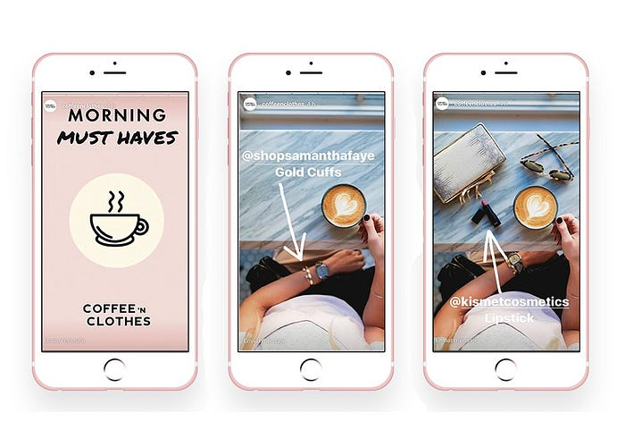
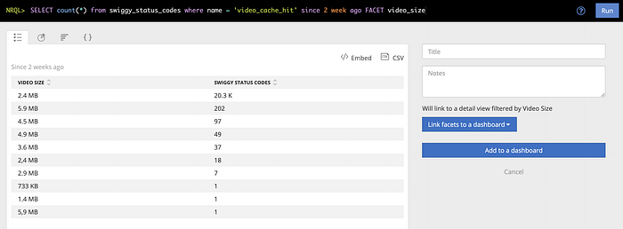

# Video Stories and Caching (iOS)

The article will teach you how you can show multiple videos in one view as we see in Instagram Stories.  
We’ll also learn how to cache the videos in the user’s device to help save that user’s data and network calls and smooth out their experience.  
**NOTE**: This implementation is for iOS, but the same logic can be applied in other codebases as well.

In general, whenever we want to play a video, we get the video URLs and simply present `**AVPlayerViewController**` with that URL.

Pretty straightforward right!

But the drawback of this implementation is you **can’t do customization**, which, if you are working in a good product company, will be every day ask. :D

One can say, we can alternatively use `**AVPlayerLayer**` which will do a similar job but the view and other elements we can customize.

But if you say, you want multiple videos to come similar to **Instagram stories**, then we surely have to deep dive a bit.

Now, Let me tell my use case.

In Swiggy, we want to show multiple videos, where each video should be shown ‘x’ number of times.   
On top of it, it should have a Instagram-like stories feature.  
- Video-2 should seamlessly autoplay after video-1 and so on  
- Jump to corresponding videos whenever the user taps left or right.

If caching is the question you have in your mind, I’ll get to that in a bit.

First thing, how to add multiple videos in one view.  
What we can do is create one `**AVPlayerLayer**` and assign the first video to it. When the first video gets completed, assign the next video to the same `**AVPlayerLayer**` .

For jumping to prev or next video:  
- Add tap gesture on the view  
- If the touch location ‘x’ is less than half of the screen, then assign prev video, else assign the next video

There we go. We got our own Insta-like Stories Video feature.

---

But our task is not done yet!!

**Now Back to Caching  
**We don't want that every time user navigates from one video to another, it again starts to download video from start.

Also, if the video comes again in the next session, we should not again do a server call. If we can cache the video, then the user’s internet will be saved, and also load on the server will be reduced.

Also, UX will improve as the user doesn’t have to wait longer to load the video.

**As a good developer, reducing user’s internet usage should be our priority.**

*Less Data Usage, Happy Customer*

The first thing we can use to load videos is **loadValuesAsynchronously**.

According to Apple documentation, **loadValuesAsynchronously:**

> Tells the asset to load the values of all of the specified keys (property names) that are not already loaded.

The advantage of using it is, it saves the video till is rendered. So it will not download the video from the start whenever the user navigates to a previous video. It will only download the part which was not rendered earlier.

**Example**: Video_1 is of 15 secs and the user saw 10 secs of that video and then jump to Video_2. Now if the user comes back to Video_1 again by tapping the left side, **loadValuesAsynchronously **will have that 10 secs video saved and will only download the rest of the 5 secs video.

More details on **loadValuesAsynchronously **can be read on this [link](https://developer.apple.com/documentation/avfoundation/avasynchronouskeyvalueloading/1387321-loadvaluesasynchronously).

---

The Caveat of this is it persists video data only for that session only. If the user kills and comes back to the app, then again video has to be downloaded.

Now comes the **Video Caching**!

What we can do here is when the video is rendered completely, we can export the video and save it to the user’s device. When the video comes again in the next session, we can pick the video from the device and simply load it.

**AVAssetExportSession  
**According to Apple documentation:

> An object that transcodes the contents of an asset source object to create an output of the form described by a specified export preset.

**What it means is, AVAssetExportSession acts as an exporter, through which can save the file to the user’s device. We have to give the output URL and output file type.**

More details on **AVAssetExportSession **can be read on this [link](https://developer.apple.com/documentation/avfoundation/avassetexportsession).

Now the only thing left is to fetch from the cache and load the video.  
Before loading, check if the video is present in the cache, fetch that local URL and give it to **loadValuesAsynchronously.**

**Caching will help reduce a lot of user data as well as server load. The impact will be in TBs**

What other use cases we can handle while doing the caching. These can be optional based on your use case.

**1. Ensure Optimum Storage**  
Before saving the video in the device, check whether enough storage is present in the device or not.

**2. Remove Deprecated Videos**  
Have a timestamp to each video, so that you can clean videos from device memory after x days.

**3. A limited number of Videos**  
Have only limited videos saved in the file at a time. Let's say 10. When the 11th video comes, delete the least used video and replace it with the new one. This will also help to not consume too much of the user’s device memory.

**4. Measure Impact**  
Don’t forget to add logs, so that you can measure the impact of your feature.  
I have used a custom New Relic Log Event.

To convert file size to a readable format, I'm fetching file size and converting it to Mbs.

This is how you can measure your impact.

**Total data saved = no of request * video_size = 2.4MB*20.3K ~= 49GB**

This is just two weeks of data. You do the math for the whole year. 😁  
And this will keep on increasing exponentially over time.

---

That’s it!!  
You have your own caching mechanism.

## Wrapping up

To conclude here, we saw how easily we can integrate multiple videos in one view itself, giving an Instagram-like story feature.  
Also why and how the caching mechanism plays an important role here. And how it will help the user to save a lot of data besides having a smooth user experience.

Do let me know if I missed something. Or if you can think of any more use cases.  
Thanks for your time. :)

> Acknowledging [NIHAR RANJAN](https://medium.com/u/4d81372863f6?source=post_page---user_mention--61fc63cc04f8---------------------------------------), for helping in this implementation.

---
**Tags:** Swiggy Engineering · Videos · Swiggy Mobile · Swift · IOS
