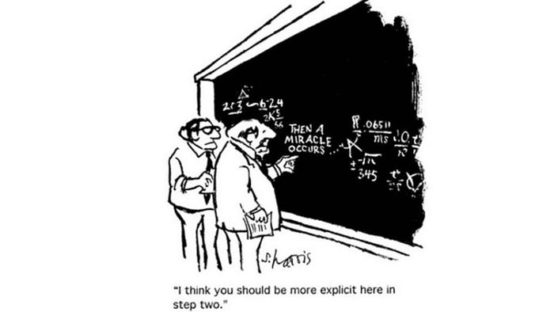
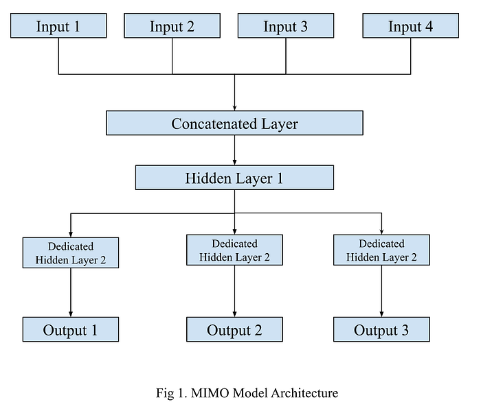
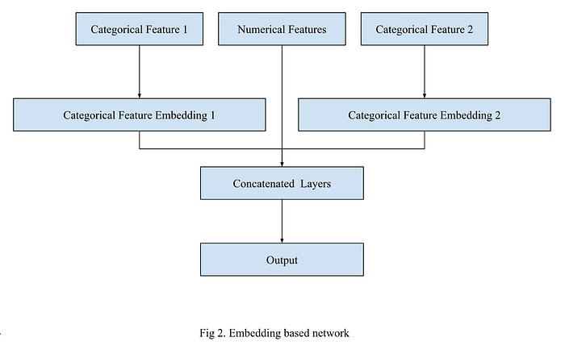
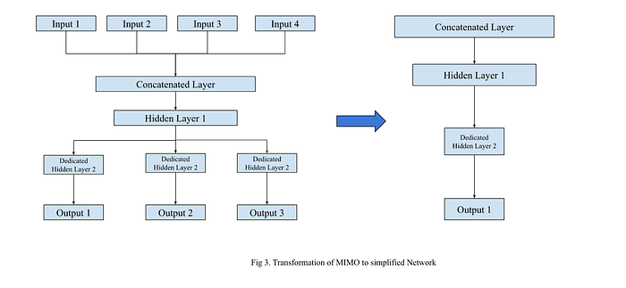
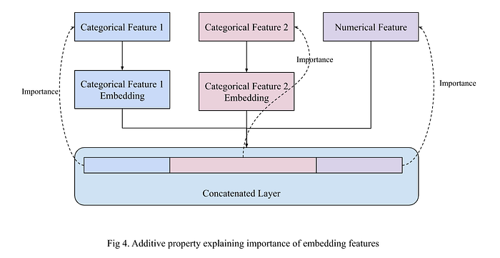

# We Hate Black Boxes! — Part I

“If you can’t explain it to a six year old, you don’t understand it yourself.” — ― **Albert Einstein**

For the past few months our predictions were singing “**Why this Kolavari Di**”. As a team we took our model to the doctor for checkup. Doctor said that it seems like a black box syndrome and prescribed capsules of Explainable AI (XAI). Jokes apart ,deep learning models are always criticized for being black box. And as a company we always believe in simple, crisp and transparent communication with our customers as well as stakeholders. Hence we took this challenge to make these models explainable for all. Explainability empower us with following pillars -

- **Trust: **XAI can help build trust in AI systems by making their decision-making processes more transparent and understandable. This is particularly important in high-stakes applications such as e-commerce or finance, where people need to be able to trust that AI is making accurate and unbiased decisions.
- **Bias and fairness: **XAI can help identify and mitigate bias in AI systems, which is a critical issue in many applications. By providing explanations for how a model arrived at a decision, it can be easier to identify sources of bias and take steps to address them.
- **Compliance:** Being a key player in quick e-commerce companies, there are expectation management requirements for AI systems to provide explanations for their decision-making processes. XAI can help ensure compliance with these expectations.
- **Collaboration: **XAI can also facilitate collaboration between humans and AI systems. By providing explanations for how a model arrived at a decision, humans can better understand the reasoning behind it and work together with the AI system to improve its performance. And it tries to improve the model to bridge the missing links.

In recent years, Data Science has played a key role in managing the vast and ever-growing scale of the food tech industry. Swiggy being a data centric company, Data Science has always been an integral part of all operations and decisions. Data Science has extensively used AI to optimize logistics operations, food quality, and personalize customer experiences, among other things. In order to navigate this intricate and competitive industry, we are compelled to construct increasingly elaborate and complex models. However, the use of AI also raises questions about transparency and accountability. How do we ensure that AI systems are making fair and unbiased decisions? How do we make AI explainable and understandable to customers and other stakeholders? This is where Explainable AI (XAI) kicks in.

In this blog, we will explore what are the challenges and why and how XAI is being used in the Swiggy, specifically complex Deep learning (DL) models. We will also discuss the challenges and opportunities associated with XAI, and how everyone can effectively implement XAI to improve their models and build trust. By the end of this blog, you will have a better understanding of how XAI can be used to transform the AI industry and make it more transparent, efficient, and trustworthy.

## Challenges

“Breathe in your fear. Face them. To conquer fear, you must become fear. Embrace your worst fear.” — **Batman Begins**

Being in a DL (deep learning) world, our worst fear is not being able to explain interactions between features for any predictions or anecdotes. As DL models are complex, non linear, opaque and that makes the decision making process of these models very difficult to explain and interpret. And in most of the cases, our models have multiple embeddings and complex graph structure, making it humanly impossible to comprehend these millions of trainable parameters. Each of our models have more than 2–3 millions of parameters and in some cases models have been built using transfer learning and complex custom loss functions to help to get performance benefits but got compromised in the explainability part until we dived deeply for a common XAI platform. We simplified our challenges into two basic problems -

## Complex Networks

As we are using a single model to capture the interactions and generate predictions for multiple use cases, we are following multi-input multi output (MIMO) networks to develop our DL models. Evaluating and forming a general understanding of these

models can be challenging and are not always straightforward.

## Embeddings

Being one of the most cognizable and customer centric company, our model consumes lots of categorical features as embeddings. As embeddings are high dimensional vectors,it is difficult to visualize and understand the relationships between vectors as well as other features. Embeddings are contextual and subjective in nature depending on choice of algorithm, dimension and data hence it depends on data scientists. Hence it is difficult to get specific interpretations for each embedding separately.

Despite these challenges, we came up with simple solutions to interpret these relationships using SHapley Additive exPlanations (SHAP).

## Solution

“I usually solve problems by letting them devour me” — **Franz Kafka**

Our solution has been built using [SHAP (Lundberg 2018](https://github.com/slundberg/shap)), a highly effective technique widely used in the industry for explaining machine learning models. SHAP allows us to attribute a model’s output to its input features, making it easier to understand the decision-making process. Our solution consists of two parts: global interpretation and local interpretation. The global interpretation provides a holistic view of the model, including feature importance and feature interactions, through summary plots and dependence plots. On the other hand, the local interpretation provides an explanation for individual predictions through force plots and waterfall charts. We utilized the [DeepExplainer module](https://github.com/kundajelab/deeplift) to provide explanations for our deep learning models. This module is based on the [DeepLift algorithm (Shrikumar, Greenside, and Kundaje, n.d. 2023)](https://arxiv.org/abs/1704.02685), which follows a series of steps to interpret the predictions of the model. These steps are as follows:

- **Choose a reference activation:** The DeepLIFT algorithm begins by selecting a reference activation for each input feature. The reference activation represents a baseline or default value for each feature.
- **Propagate the reference activation:** The reference activation is propagated through the layers of the neural network, producing a set of reference activations at each layer.
- **Compute the importance of each neuron: **The DeepLIFT algorithm then computes the importance of each neuron in the network by comparing its activation to the reference activation. Neurons that contribute significantly to the output of the network receive a high importance score.
- **Compute the contribution of each input feature:** Using the neuron importance scores, the DeepLIFT algorithm then computes the contribution of each input feature to the output of the network. This contribution can be positive or negative, indicating whether the feature is positively or negatively correlated with the output.
- **Sum the contributions:** Finally, the contributions of each input feature are summed to produce an overall importance score for each feature. These scores can be used to rank the features by importance and to provide insight into the decision-making process of the neural network.

Prior to using this we had to simplify our Embedding based MIMO networks to simple networks to use as it is for explanations and replication production models. Hence, for that leg, we extracted the longest possible linear network without any branches from the network. And created a wrapper function on top of input to prepare the input for the modified input layer. This helped us to use most of the implementation of DeepLift algorithm as it is and simplify the network for a single leg. To create a simplified network we used a [transfer learning method (Wang, Weiss, and Khoshgoftaar 2016)](https://journalofbigdata.springeropen.com/articles/10.1186/s40537-016-0043-6). For lookups, we extracted the lookup index and embeddings from the models and in the wrapper automatically it replaced categorical features with embeddings from the lookup. This allowed us to replicate the production model’s lookups and embeddings within a simple network structure, resulting in an exact replica of the original model.

We utilized the additive property of the DeepLIFT algorithm for the embeddings, which allowed us to distribute the importance of a categorical feature’s embeddings across the input vectors that correspond to that feature. By summing up the importance of all the vectors corresponding to each categorical feature, we were able to represent the participation and importance of that feature in specific predictions.

We will return with a follow-up blog post that delves into the practical implementation and impact of the solution, as it is incomplete without discussing these crucial aspects. Rest assured, I won’t prolong this current post unnecessarily. Ciao!

Until then, Swiggy karo fir jo chahe karo 😀

## References

- Lundberg, Scott M. 2018. “Consistent Individualized Feature Attribution for Tree Ensembles.” arXiv. [https://arxiv.org/abs/1802.03888.](https://arxiv.org/abs/1802.03888.)
- Shrikumar, Avanti, Peyton Greenside, and Anshul Kundaje. n.d. “Learning Important Features Through Propagating Activation Differences.” Proceedings of Machine Learning Research. Accessed February 17, 2023. [http://proceedings.mlr.press/v70/shrikumar17a.](http://proceedings.mlr.press/v70/shrikumar17a.)
- Wang, DingDing, Karl Weiss, and Taghi M. Khoshgoftaar. 2016. “A survey of transfer learning — Journal of Big Data.” Journal of Big Data. [https://journalofbigdata.springeropen.com/articles/10.1186/s40537-016-0043-6.](https://journalofbigdata.springeropen.com/articles/10.1186/s40537-016-0043-6.)

**Authors**

[Prince Raj](mailto:prince.raj_int@external.swiggy.in) [Soumyajyoti Banerjee](mailto:soumyajyoti.banerjee@swiggy.in) [Sunil Rathee](mailto:sunil.rathee@swiggy.in)

**Guide**

[Goda Doreswamy Ramkumar](mailto:goda.doreswamy@swiggy.in)

**Reviewer**

[Siddhartha Paul](mailto:siddhartha.paul@swiggy.in)

---
**Tags:** Data Science · Swiggy Data Science · Explainable Ai · Deep Learning · Machine Learning Models
