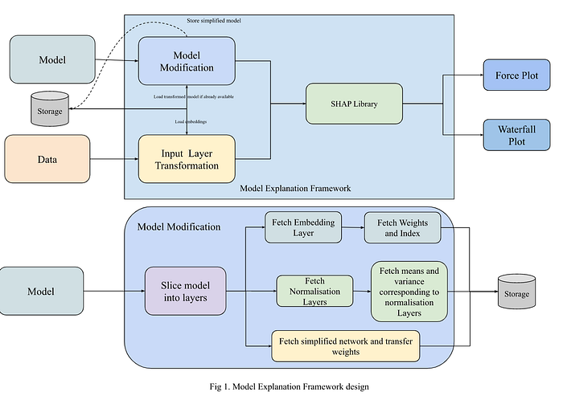
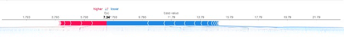
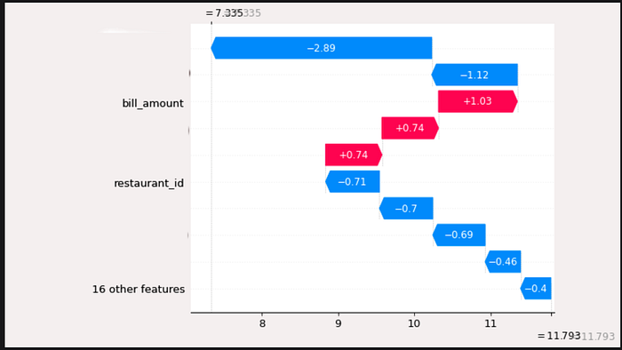
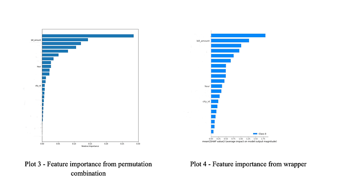
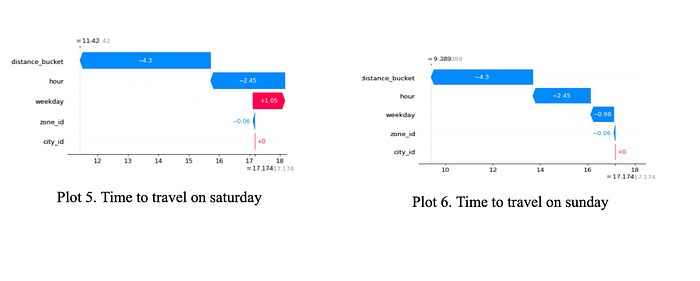
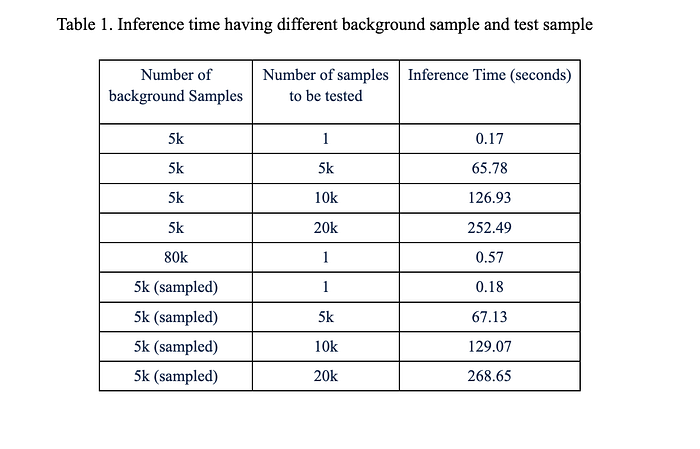

# We Hate Black Boxes! — Part II

In a [prior blog post](./we-hate-black-boxes-part-i-64e87ad6b56e.md), we explored our successful approach to utilizing explainable AI (XAI) for intricate deep learning (DL) networks. This current post primarily focuses on the implementation of our solution and the positive impact it has had on the Swiggy ecosystem.

### Implementation

“Strategy without tactics is the slowest route to victory. Tactics without strategy is the noise before defeat.” — **Sun Tzu**

A wrapper was developed to take in specifications for input features and tables containing embeddings. This wrapper generates output that is compatible with the concatenated layer. The concatenated layer then retrieves the embeddings that correspond to the inputs and normalizes the input data points using means and variances stored from the corresponding training data. A separate module has been created to take in the model and layer name specifications and construct a simple network-based model. This module also facilitates the transfer of weights from the source model to the newly created model, and ensures that they are stored in the appropriate location.

**force_plot = shap.force_plot(**

**deep_explainer.expected_value[0].numpy(),**

**compressed_shap_values_deep[0][0],**

**temp_df.iloc[0, :],**

**matplotlib=False,**

**)**

**shap_html = f”{shap.getjs()}{force_plot.html()}”**

*Plot 1. Example of force plot*

**shap.plots._waterfall.waterfall_legacy(**

**deep_explainer.expected_value[0].numpy(),**

**compressed_shap_values_deep[0][0],**

**feature_names=df.columns.tolist(),**

**)**

*Plot 2. Example of waterfall plot*

## Anecdotes

“knowledge without application is like a book that is never read” — **Christopher Crawford**

In In order to assess the framework, we analyzed its ability to provide a holistic understanding of the model, including impact of features on predictions as a global explanation. Additionally, we evaluated the framework’s ability to provide local interpretations by explaining individual inferences made by the model.

**Global Explanation**

In order to provide a comprehensive explanation of the model’s behavior, we previously employed a [feature permutation and combination method](https://eli5.readthedocs.io/en/latest/blackbox/permutation_importance.html) to measure the impact of individual features on each output leg by tracking changes in loss metrics. Through the use of a model explanation framework, we were able to determine the importance of each feature, and this ranking was found to be consistent with the results obtained through the older method. This validation serves as confirmation that the framework is working as expected.

**Local Explanation**

For local interpretation of the model, we relied majorly on human intelligence. However, we validated our interpretations through crowdsourcing using a neighbourhood point explanation method. To achieve this, we integrated similar data points by altering a single or pair of features, such as modifying the hour or day of the week while keeping all other features constant. Then, we shared these interpretations with multiple individuals to validate the explanations of the predictions. For example, when we changed the hour to create a neighbourhood point and examined the explanation, we observed that the deflection in the waterfall plot was primarily explained by the modified feature. For example, we modified the prediction for Bangalore city by changing the weekday from Sunday to Saturday, which resulted in an increase of time taken to travel for the dummy model. The corresponding plots clearly demonstrate that this change was due to the weekday, and this aligns with our understanding that traffic is generally higher on saturday than sunday based on our real-world experience.

In this plot we can clearly see that changing on weekdays shifted the prediction to a higher side. We have done multiple iterations with different types of models and datasets to build confidence and get validation for this method.

We attempted to apply the explainability framework on datasets of varying sizes. To enable local inference, we maintained a sample size of one while adjusting the size of the background data. Latency of our framework is very low, around 50 ms for local interpretations. However, generating feature importance plots for global explanations took over an hour for more than 80K data points. We are currently taking proactive measures to address this issue by optimising and parallelising gradient calculations to reduce the processing time.

## Conclusion

“I have promises to keep, And miles to go before I sleep”

- **Robert Frost **in **Stopping by Woods on a Snowy Evening**

We have established a roadmap for utilizing XAI within our internal team and making the framework accessible to all. Our primary use case for this framework is to use it during our regular anecdote sessions to gather on-ground feedback and explain the model’s functionality to stakeholders. In addition to these sessions, we have some solid plans in place to advance in transparent AI.

**Prioritising transparency and trust: **Provide a clear explanation of the AI model’s decision-making process to increase transparency and improve trust in the technology.

**Human-in-the-loop:** Incorporate human input and feedback to improve the accuracy and fairness of AI models. As well as to identify some anomalous or fraudulent behaviours of entities supported by AI validation.

**Regulatory compliance: **Ensure that AI-powered solutions are compliant with relevant regulations and standards, such as over speeding guidelines and ethical AI principles. Also will help to build several compliance related products for our partners (restaurant and delivery executives).

Additionally, by utilising XAI, we can improve the performance and real-world applicability of our models by accurately replicating real-world situations and making more informed inferences. Currently, this solution is only available for feed-forward neural networks, but we are working to extend it to recurrent neural networks as well. This will provide a comprehensive solution that can meet all requirements, and is a significant step towards a more transparent and trustworthy future.

## References

- Lundberg, Scott M. 2018. “Consistent Individualized Feature Attribution for Tree Ensembles.” arXiv. [https://arxiv.org/abs/1802.03888.](https://arxiv.org/abs/1802.03888.)
- Shrikumar, Avanti, Peyton Greenside, and Anshul Kundaje. n.d. “Learning Important Features Through Propagating Activation Differences.” Proceedings of Machine Learning Research. Accessed February 17, 2023. [http://proceedings.mlr.press/v70/shrikumar17a.](http://proceedings.mlr.press/v70/shrikumar17a.)
- Wang, DingDing, Karl Weiss, and Taghi M. Khoshgoftaar. 2016. “A survey of transfer learning — Journal of Big Data.” Journal of Big Data. [https://journalofbigdata.springeropen.com/articles/10.1186/s40537-016-0043-6.](https://journalofbigdata.springeropen.com/articles/10.1186/s40537-016-0043-6.)

Authors

[Prince Raj](mailto:prince.raj_int@external.swiggy.in) [Soumyajyoti Banerjee](mailto:soumyajyoti.banerjee@swiggy.in) [Sunil Rathee](mailto:sunil.rathee@swiggy.in)

Guide

[Goda Doreswamy Ramkumar](mailto:goda.doreswamy@swiggy.in)

Reviewer

[Siddhartha Paul](mailto:siddhartha.paul@swiggy.in)

---
**Tags:** Deep Learning · Artificial Intelligence · Explainable Ai · Shapley Values · Swiggy Data Science
