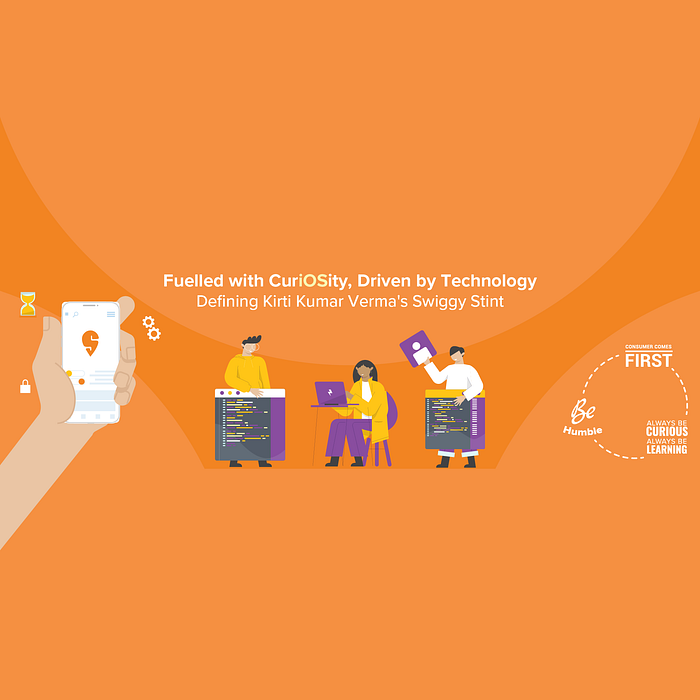
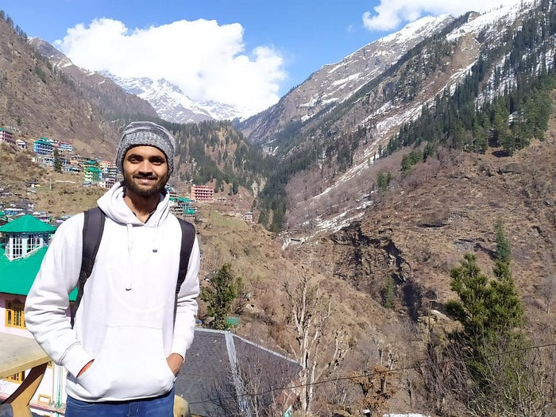

# What is it like to work as an iOS developer at Swiggy?

_Let’s get a sneak-peek from one of Swiggy’s tech team member_

Kirti Kumar Verma has been a part of Swiggy’s iOS tech team since January 2022, and his adaptability has enabled him to hit the ground running from day one. With the ability to see the best in people and to learn from everyone, he’s been a stand-out team member. Driven by curiosity and a passion for learning, Kirti is fueling Swiggy’s technological growth, and has some great insights on life at Swiggy.

Here’s a look at Kirti’s journey so far, what he feels about being a Swiggster, and what he values at work.

**To start off, tell us a bit about your academic background and your areas of professional interest.**

I did my B. Tech. in IT from the National Institute of Technology, Kurukshetra in 2019. Through my studies, I built a foundation in computer programming, algorithms, data structures, and operating systems. I also worked on various projects, both individually and in teams, which helped me develop my technical and problem-solving skills.

My areas of interest include mobile app development, user interface design, and performance optimisation. I have always been curious about exploring ways to create high-quality and user-friendly iOS applications that offer a seamless and engaging user experience. Aside from iOS engineering, I also find emerging technologies like augmented reality and machine learning quite fascinating, especially in terms of how I can integrate them into iOS applications to create more value for the users.

**All right, let’s dive into your role at Swiggy now. What is the most exciting part of your work here?**

That’s easy! The most exciting part of my role is the opportunity to collaborate with a diverse group of people. Solving tech problems at Swiggy involves working with fellow developers, designers, product managers, and other stakeholders. Each person brings their unique perspective, expertise, and creativity to the table, and together we develop innovative solutions that are greater than the sum of our parts. The synergy these interactions generate is incredibly exciting. Brainstorming sessions, hackathons, and other collaborative efforts can lead to breakthrough ideas that would not have been possible with just one person working alone. In addition, getting to solve real-world problems using technology is very fulfilling.

**And overall, how would you describe your Swiggy journey?**

My journey at Swiggy has been quite a ride, filled with new challenges and experiences. I’ve been fortunate enough to work with some brilliant individuals who are passionate about what they do. One of the things that I appreciate at Swiggy is the culture of innovation and experimentation. The dynamic and fast-paced environment here has pushed me to grow as a professional and also as a person.

**You’ve mentioned the importance of collaborating with others. Can you tell us something about the team you work with?**

The iOS mobile development team is a driven group of talented individuals who are passionate about building great features that are intuitive, user-friendly, and enjoyable to use. It’s important for us to stay focused and really pay attention to detail. Right from the user interface and user experience design to the underlying code and technology stack. As a team, we’re always looking for ways to improve the performance, reliability, and usability of the Swiggy app.

**Okay, let’s look back at the past couple of years. How has your everyday work life evolved from day one to now?**

My work life has changed significantly since day one. When I first joined here, I was eager to learn as much as possible and prove myself as a valuable member of the team. Initially, my work focused on learning the technology stack, the development process, and the specific requirements of the project. As I gained more experience and confidence, my responsibilities grew. I took on more complex tasks, contributed to the design of new features, and became more involved in the planning and management of projects. One of the biggest changes in my daily work has been the adoption of new technologies and development methodologies. Over time, we have embraced new tools and frameworks and have become quite efficient as a team and also as individuals.

**We’ve discussed your job, but we’d like to know a little more about what technology means to you. Why did you decide to make a career of it?**

For me, technology represents the beauty of human innovation, the power to create something bigger than yourself, and the ability to add value to people’s lives. It is the manifestation of human curiosity, creativity, and ingenuity, and it has transformed the way we live, work, and interact with each other. My decision to make a career in technology is driven by my passion for innovation, problem-solving, and creativity. Technology is a constantly evolving field, with new tools, techniques, and frameworks emerging all the time. This presents a unique opportunity to learn, grow, and keep my profession exciting.

**Speaking of technology as a whole, how do you believe your job makes an impact in the real world?**

I’d say, it’s the fact that we give life to ideas and create products that people can use to simplify their lives. The process of mobile development itself is incredibly rewarding. Watching an idea grow through stages of development, from ideation to deployment, is a thrilling experience. The feeling of pride and accomplishment that comes with releasing a product that meets users’ needs and exceeds their expectations is truly unmatched. I am grateful to Swiggy for giving me an opportunity to do so.

**What’s life like for an SDE-II at Swiggy?**

As an SDE-II at Swiggy, you have a high level of autonomy and responsibility, and you are expected to take ownership of your projects and deliver results. You work in a fast-paced environment, where priorities can shift quickly and deadlines can be tight. You are expected to collaborate with product managers, designers, and other stakeholders to define project requirements, and also to communicate effectively with your team members to ensure that projects are completed on time and as per the specification.

**And are there any projects that are especially close to your heart?**

It has to be building the Design Language System of Swiggy. A DLS is a collection of reusable components, patterns, and guidelines that define the visual and functional elements of a user interface. It serves as a common language for designers, developers, and other stakeholders to use when creating and maintaining digital products. This helps ensure consistency and coherence across all touchpoints. One major benefit of a design language system is that it saves time and effort by providing pre-built components which the designers can reuse across different streams. It also ensures that products are consistent in look and feel, which helps to build brand recognition among users.

As a developer, my role in building a DLS is to ensure that the system is technically sound, scalable, and easy to use. This involves creating a library of reusable components, documenting usage guidelines and best practices, and working closely with designers to ensure that the system meets their needs. One of the most rewarding aspects of building the DLS is seeing it being used by other teams within the organization. It is satisfying to know that my work is contributing to a more enjoyable experience for our customers as well as for our internal teams.

**If there was one piece of advice that you could give to aspiring engineers, what would it be?**

As the Swiggy value goes — [‘Always be Curious, Always be Learning’.](https://blog.swiggy.com/2022/12/21/here-are-swiggys-values/) By staying curious and seeking out new challenges, one can develop a deep understanding of the technology they are working with and find creative solutions to complex problems. At the same time, one needs to ‘Be Humble’ and be open to learning from others. No one person has all the answers, and there is always something to be gained from collaborating with and learning from others.

**Which Swiggy value do you connect with the most?**

One Swiggy value that I connect with the most is [‘Customer Comes First’. ](https://blog.swiggy.com/2022/12/21/here-are-swiggys-values/)Here, we put the customer at the center of everything we do and strive to exceed their expectations at every touchpoint. We prioritize features and services that enhance the customer experience, even if they may not be the easiest to implement.

**And to conclude, how would you describe Swiggy as a workplace to aspiring Swiggsters?**

Swiggy is a great place for anyone passionate about technology, innovation, and making a difference in the world. We have an energetic and agile work culture, which encourages employees to take ownership of their projects and push the boundaries of what’s possible. The company also offers a range of employee benefits, including work from anywhere, health insurance, and generous leave policies, which can help you maintain a healthy work-life balance while pursuing your career goals.

---
**Tags:** Swiggy Engineering · Swiggy Life · Employee Stories · Ios Developer · Career Growth
