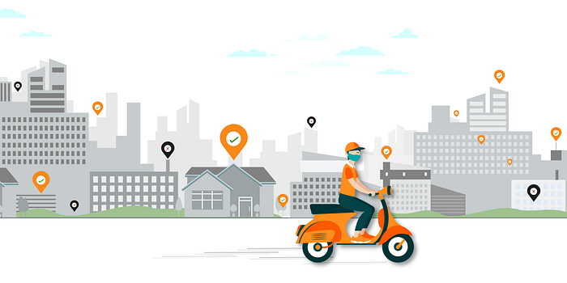
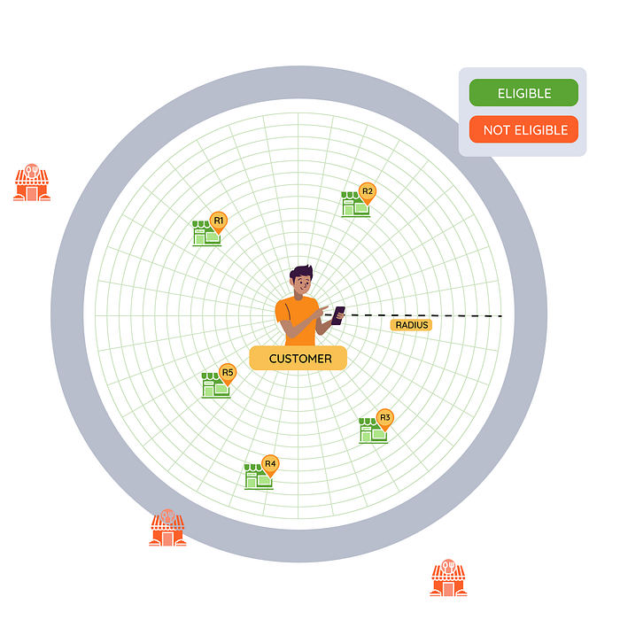
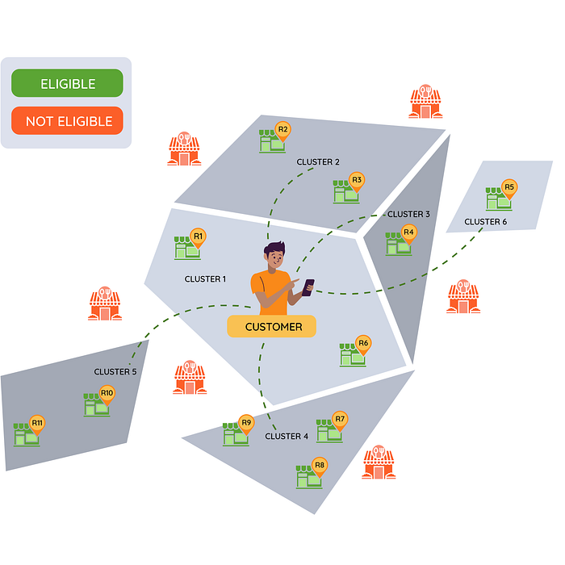
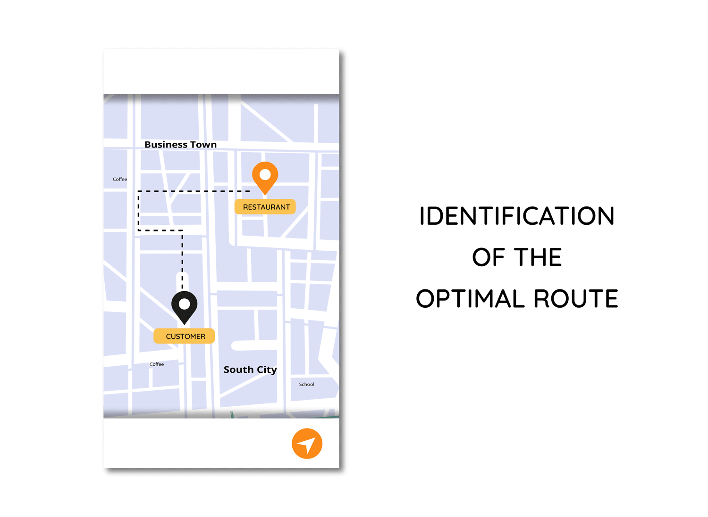
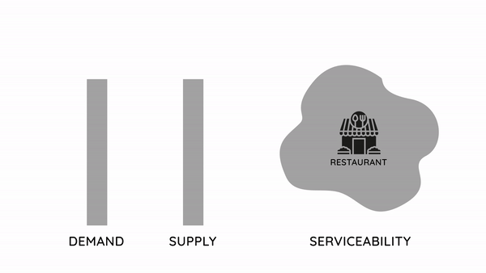
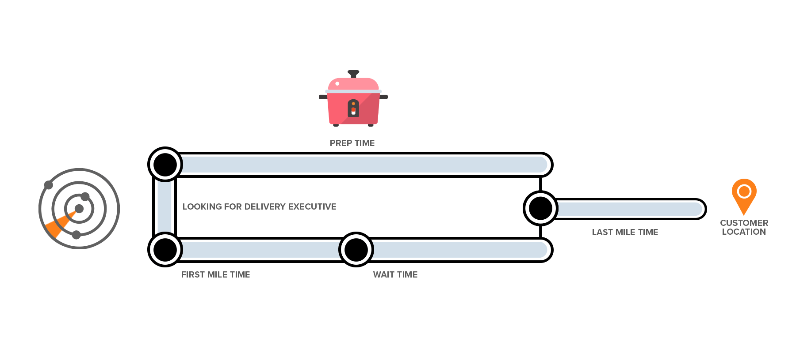
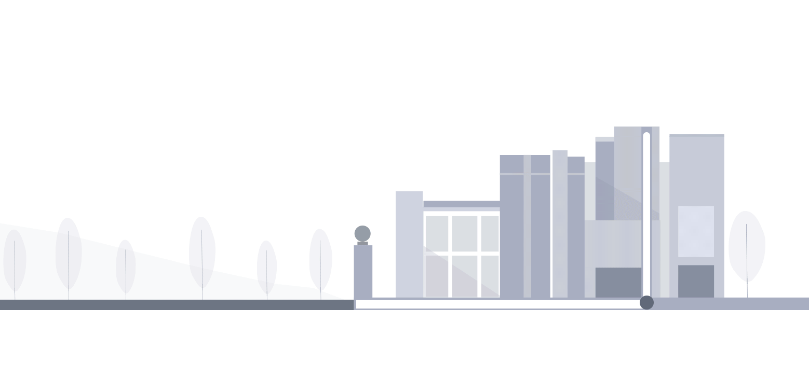
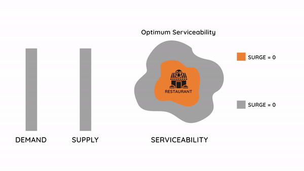

# What Serviceability means at Swiggy?

_After another hectic day of her own fights at the hospital’s Covid ward Dr. Rudra was ready to head home. She had skipped the two major meals of the day, and had Kakaji’s Special Biryani (a famous restaurant in the city) in her mind, ever since she stepped out of the hospital and into her car for the 20 Kms drive home. An hour after fighting heavy rains and traffic, Rudra gets home, opens the Swiggy app and hits the restaurant on the search. ‘This restaurant is unserviceable from your location’ notifies Swiggy. Rudra is disappointed… But why did this occur? Read ahead to find out._

If you have used Swiggy for delivering convenience at your doorstep, you would normally open the mobile app to browse a list of restaurants or grocery stores to order from. Alternatively you can search for a specific restaurant, grocery store, dish or item to order. Post selecting a restaurant or store, you select a bunch of items from the menu, checkout and pay for the order. Everything until now constitutes the pre-order stage of the order lifecycle.

Post this stage comes the Order Fulfilment phase (or the post order experience) where the order is prepared and packed for being delivered to the customer. A Delivery Partner is assigned for the delivery of the order who makes, what we call, the first mile journey to the restaurant or the store. The assigned Delivery Partner picks the order and embarks on the last mile journey to the customer location to fulfill the order request right at their doorstep.

From the above description, it would seem that the role of Delivery Systems are set in motion only once the order is in the _‘post-order phase’_ of delivery and fulfilment. However in assuming so, we are ignoring many critical delivery-related problems that occur during the _‘pre-order phase’_ such as:

1. How does Swiggy determine restaurants or stores to display on the customer app such that they are in the geographical vicinity of the customer location and any order from that particular restaurant or store is actually deliverable?
2. How does Swiggy determine the maximum distance between a restaurant/store and the customer location for which a delivery can be made? Can this be a constant global distance everywhere disregarding the local geography and parameters of the operating environment or does it need to be more dynamic in nature? To give a simple example — making a 4-kilometre delivery in a light traffic road network in Ahmedabad is drastically different than making a 4-kilometre delivery in a heavy traffic road network in Bangalore.
3. Swiggy can potentially get an unbounded flow of incoming orders which could result in a sudden growth in demand within a few minutes, but Swiggy operates with a delivery fleet whose numbers do not and can not magically grow within a few minutes. Hence to prevent overbooking of orders which can not be fulfilled in an acceptable time, Swiggy needs to maintain a demand-supply equilibrium.
4. Swiggy needs to ensure that it does not accept orders which will take too long to deliver and potentially turn to bad orders. For this, it needs to predict the time it will take to fulfill an order from a given customer location based on what they are ordering, from where they are ordering it, the status of the delivery fleet and various other factors. The same predicted delivery time needs to be shown to the customer up front in the pre-order stage of the order so that they are aware of what the expected time of delivery would be.

The above problems highlight the fact that for Swiggy, **the role of the Delivery Systems need to start right at the point when the customer opens the app for the initiation of the pre-order journey**. This is exactly where _‘Serviceability’_ comes into the picture. The Serviceability System is needed to determine if any given restaurant or store presented on the app is genuinely serviceable, based on a multitude of factors, all to ensure that promises made during the pre-order phase are actually fulfilled.

In this regard, the Serviceability System is broadly responsible for…

1. Filtering out restaurants, stores and outlets based on their geographical proximity to the customer location making it feasible to deliver the promise.
2. Calculating the actual route distance between the restaurants/store/outlet to the customer location in order to check if the distance is feasible to deliver or not.
3. Making a capacity check of the delivery fleet corresponding to the particular network of restaurants or stores to ensure that any order placed there can be delivered. Also if the delivery fleet goes under stress due to too many orders, the system should control the demand by gracefully degrading the serviceability to maintain the demand-supply equilibrium.
4. Predicting and promising the time it will take for the order to be delivered upfront for any given restaurant or store.
5. Determine surge pricing to be charged to the customer, based on the stress on the delivery fleet due to excessive demand and also due to environmental factors (traffic, weather, etc).
6. Making the final decision if the restaurant or the store can be displayed on the customer app based on the delivery feasibility determined by various factors such as distance, delivery time and stress.

In the sections below, we will walk through the various stages of serviceability calculation in greater detail.

## GeoFiltering of deliverable outlets

When a customer opens the Swiggy app, they do so from a defined location. This particular customer location is used to determine the set of restaurants or the stores which are eligible for delivery within the customer’s vicinity derived from the global set of restaurants and stores.

One of the most obvious ways to filter the restaurants and stores is to do so by drawing an imaginary circle of a X radius around the customer location and including all the restaurants and stores lying within that circumference while excluding the ones outside it. This radial concept of GeoFiltering is illustrated below.

*Radial GeoFiltering*

However a major drawback of the above approach is that it lacks directionality during GeoFiltering. Directionality during GeoFiltering would allow to have controlled, granular and well-defined boundaries of delivery, defined based on diverse geographical and operating conditions. To cite an example, here is how a directional GeoFiltering would look like:

*Directional GeoFiltering*

At Swiggy, the Serviceability system determines the customer cluster by marking a point-in-polygon search for the customer location, and then from there it does a directional discovery of target clusters of restaurants and stores. At the end of this, Serviceability comes up with a geo-filtered list of eligible stores and restaurants corresponding to that particular customer location.

## Calculating distances for making deliveries

While evaluating the serviceability of restaurants and stores, we need to calculate the distance from the restaurant or the store to the customer location. Now anyone familiar with mapping and routing domain might be aware that this is a fairly complex problem in itself. The distance calculation here is not _‘as a crow flies’_ calculation, but it is the actual route distance which will be travelled by the Delivery Partner in order to deliver the order from the restaurant or the store to the customer location.

From the scale at which Swiggy operates, there are roughly 2000–2500 restaurants or stores which are in the vicinity of a typical customer location. This means that we would need to find the route distance from these 2000+ restaurants to the customer location, every time a listing of restaurants or stores is requested on the Swiggy app — and that too within a few milliseconds. Now remember, there is not one, but many customers who are simultaneously browsing the app, so broaden your imagination to 100k listing requests made to the app per minute, which would translate to a whopping 200 million distance calculations per minute! That is like using your favorite Maps app to find distances for 200 million source and destination pairs per minute! Also we are talking about the serviceability check on the listing page. Once customers click on a restaurant or store, there is an additional serviceability check done on the menu and cart page, which would again need a distance calculation.

At Swiggy, we rely on **Open Street Maps** and **Google Directions** for determining the route distance, of which Open Street Maps is used in the majority of the cases. When calculating the distance using Open Street Maps data, we use **A-star bidirectional** search to find the shortest distance route from the source to destination in a graph — which in itself is a very costly operation computationally.

*Identification of the optimal Last Mile Route*

**At Swiggy, we find the distance stack to be one of the most challenging systems to scale. It is computationally intensive and expensive to determine distance calculation, while also requiring a massive scale on the number of distance calculations per minute. This also involves maintaining a few milliseconds latency per 2000+ distance calculations per listing call. In a later blog of this series, we will elaborate on our approach to scale this system to support massive traffic with acceptable latencies.**

## Determining stress on the delivery fleet and maintaining a Demand-Supply Equilibrium

At any given time, Swiggy operates with a defined capacity of delivery fleet across zones or regions. These delivery fleets experience various levels of stress based on the ratio of the demand to the Delivery Partners available, the growth and changes in demand, the decline and rise of Delivery Partners availability, the length and duration of the orders currently being fulfilled by busy Delivery Partners, etc. There are also external factors like rains, festivals, natural calamities which cause the Delivery Partners to operate under a stress scenario. Hence, at a given time, delivery fleets across zones or regions at Swiggy operate at discrete levels of supply state which is an indicator of the situation on the ground for that zone or region.

Given all the real-time data such as the demand-supply ratios, growth and changes in demand, availability of Delivery Partners and state of supply, the stress system at Swiggy shifts the stress level for a zone or region depending on the on-ground reality, at real time, on a discrete scale. This stress system notifies the serviceability and other systems whenever the delivery fleet is under stress to gracefully degrade their respective services. For instance, under stress the Serviceability system would avoid taking up orders which have longer last miles or higher delivery times, depending on the magnitude of the stress, to prevent accumulation of further stress. After some time of gracefully degrading the system, the demand and supply gap will reduce and achieve equilibrium which will result in the stress on the delivery fleet also dropping. When this equilibrium happens the stress system goes back to normal stress levels and the Serviceability and other systems start relaxing the services back to normal levels again.

*Graceful Degradation of Serviceability during stress*

The stress or the Graceful Degradation system at Swiggy can be thought of as a Finite State Machine with nodes representing the stress levels and the edges representing the transitions between those states. The edges for transitions between the states are triggered based on the ground situation and the various factors mentioned above.

## Predicting ‘Time to Deliver’ a potential Order

One of the most important factors while determining the Serviceability of a restaurant or the store and also to commit on a delivery time promise to the customer is the predicted time to deliver the order. There are a multitude of on-ground real time factors — delivery fleet parameters, store and restaurant factors, route distance and traffic scenarios — amongst others which affect the overall delivery time of the order. Hence it becomes very crucial to come up with an accurate prediction of delivery time in order to take a serviceability call accurately and also to promise a delivery time to the customer which we can comply with. If the actual delivery time turns out to be much more than the promised delivery time, then it ruins the customer expectations and experience. On the other hand if the predicted delivery time is much higher than the actual delivery time, then the customer might not even place an order with the restaurant or the store due to wrong expectations.

As illustrated below, a typical order delivery follows a typical journey like this. There are two parallel sets of legs which are being executed until the ‘_pick up_’ of the order — one on the restaurant/store side and one on the delivery side.

*A typical order journey in Swiggy*

The typical legs of the order journey are:

1. The Delivery Partner **Assignment Delay**: This is usually dependent on the availability of the Delivery Partner on the ground. In non-peak hours, when many Delivery Partners of a zone or region are free, we usually see a very low assignment delay, while in peak hours, when Delivery Partners are busy fulfilling other orders, the delay usually increases due to queuing.
2. The **First Mile Time**: This depends on factors like the location of the Delivery Partner when they are assigned the order, in addition to factors like traffic in the zone or the region en route to the restaurant or the store, speed of the Delivery Partner and their familiarity with the restaurant, store or the zone in general.
3. **Prep Time** of the restaurant or the store: This depends on the various factors of the restaurant or the store like how many orders they are concurrently processing (orders are not necessarily just Swiggy orders), the kind of the items that are being ordered, the preparation times of those items and other physical constraints of the restaurant or the store.
4. The Delivery Partner **Wait Time**: this depends on the other legs like assignment delay, the first mile time and the prep time. If the Delivery Partner arrives early before the order is prepared, then they need to wait for the remainder of the prep time before pickup. If the Delivery Partner arrives after the order is prepared, then the wait time is essentially zero since they can immediately pick up the order.
5. The **Last Mile Time**: This depends on factors like the customer location and its properties, the traffic in the route between the restaurant/store and the customer location, speed of the Delivery Partner and their familiarity with the region and the customer location. Another factor of the Last Mile Time is what we call the **Last Last Mile Time** of the order, which is the time taken to deliver the order at the customer doorstep once the Delivery Partner reaches the customer location. This is important because this can have very diverse values based on the type of the apartment, office, etc. where they might have to park the vehicle at specific points, check-in at the security gate, figure out the way to the specific block or building, figure out which elevator to take, etc.

*Last Last Mile*

Now you might wonder, how do we figure out an accurate delivery time for such complex journeys with multitude of external and internal factors which can affect the delivery times.

At Swiggy, the solution to this problem is **Data**. We leverage the vast amount of anonymized data that we have collected while fulfilling our past orders to this advantage. With real-time signals as inputs to the data models we have built from this massive amount of data, we are able to accurately predict the delivery time of potential orders at listing, menu or cart.

## Determining Surge

As we saw in the earlier discussion on demand supply equilibrium in stress scenarios, one of the levers of maintaining an equilibrium was to reduce the serviceability by cutting down on the last mile distances of the potential orders when stress hit.

Another way of maintaining equilibrium by controlling the demand side of things would be charging the customer a surge factor on the delivery of the order.

At Swiggy whenever the stress hits, we determine the surge factor on the basis of the level of the stress, the store or the restaurant, the time of the day and the distance of the customer location from the store or the restaurant (the last mile distance)

*Surge Pricing to maintain Demand-Supply Equilibrium*

Apart from this the surge system also has the capability to apply surge factor on special scenarios like rains, festivals or special events and occasions.

## Making the Serviceability Decision

In the article so far, we have described the calculations of various serviceability parameters like the last mile distance, the delivery time, the stress and the surge factor for a customer — restaurant/store pair at listing, menu and cart. These parameters form an important part while deciding whether to display a particular restaurant or store at listing, menu, collections or cart.** At a localized level, we determine the permissible limits to last mile distance to be travelled, the acceptable delivery time and the stress on delivery systems and based on these limits, we determine whether to take an order or not**. This in turn decides the fact, whether the restaurant or the store should be displayed on the app or not.

## Designing the Serviceability System for High Scale with Good Performance

During any listing call from the Swiggy app, the serviceability system needs to determine the serviceability for 2000+ restaurants or stores per call by calculating all the steps that have been described above. And all of this needs to happen within a fraction of second (less than 1/10th to be precise) in order to maintain good experience on the app latencies! Similarly when you browse the menu or checkout an order on the cart page, there need to be extra serviceability calls which need to happen in a few milliseconds.

Hence it is very important to design a high throughput system which can handle massive amounts of traffic with low latency with the capability to scale out horizontally as and when needed. Apart from this, the system needs to be resilient to various failures arising out of glitches during any stage of calculation of serviceability or any other external factors.

In the next blog of this series, we will discuss some of the design and architecture decisions as well as the learnings from designing such a system at Swiggy.

_(Illustrations by Shivani Barde)_

Update 1 — The second blog in this series around [designing the serviceability platform at Swiggy for high scale — Part 1](./designing-the-serviceability-platform-at-swiggy-for-high-scale-part-1-751a631f0379.md) is out now!

Update 2 — The third blog in this series around [designing the serviceability platform at Swiggy for high scale — Part 2](./designing-the-serviceability-platform-at-swiggy-for-high-scale-part-2-ab20365fbc23.md) is out now!

---
**Tags:** Serviceability · Swiggy · Swiggy Engineering
