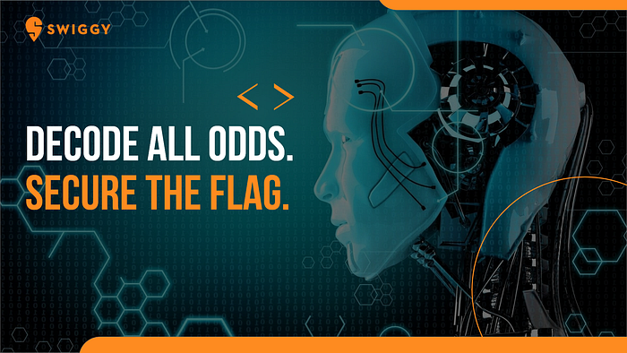
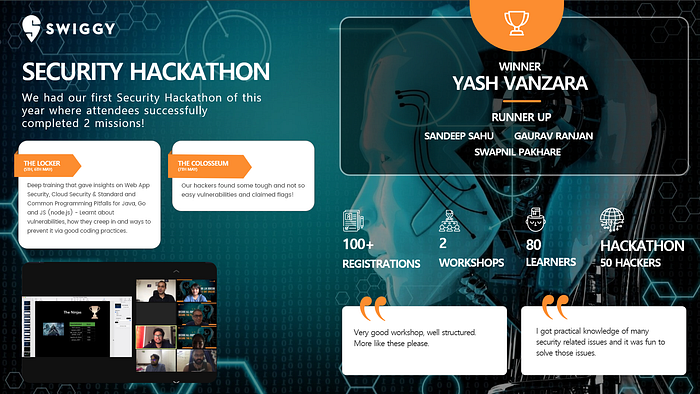

# Who captured the flag?

There are multiple learning and skilling opportunities that are provided to Swiggsters and we believe learning is a constant. One of the themes we wanted to highlight this time was on Security as it is a foundation for good engineering and is constantly evolving. We partnered with [DeepArmor](https://www.deeparmor.com/) to create a learning module on security and designed a Capture The Flag competition towards the end of the module. Though we were doing this fully virtually, it garnered great interest and participation from the engineers (about 100+!). The sessions were very hands-on and kept the learners on their toes as they learnt about different vulnerabilities and best practices to combat them. The CTF competition was very closely competed and came down to a tie breaker! Yash came out victorious and Team LaLaLand settled in for second place, and they all walked away with handsome prizes too.

This is one way through which we make learning fun at Swiggy and we look forward to sharing more unique learning experiences.

---
**Tags:** Swiggy Life · Swiggy Engineering · Security · Hackathons · Capture The Flag
