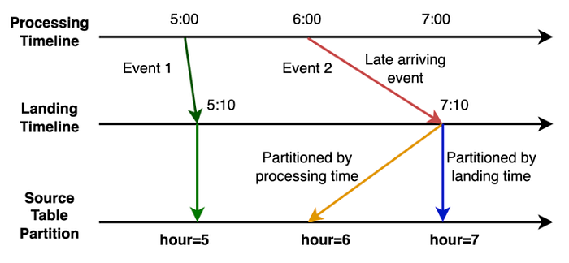
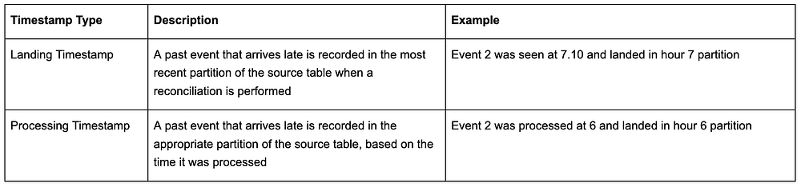
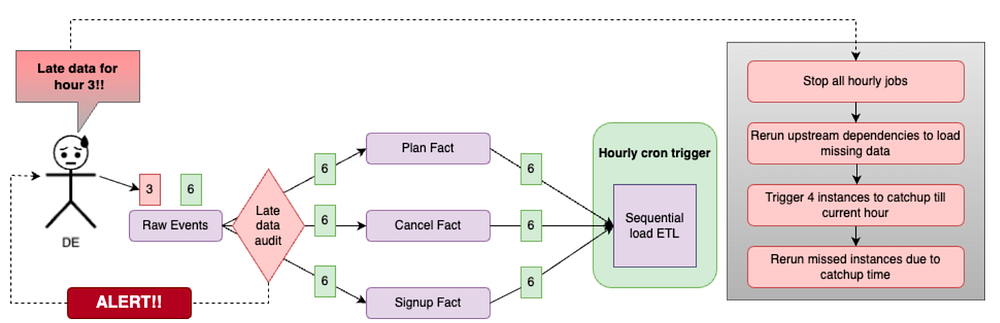
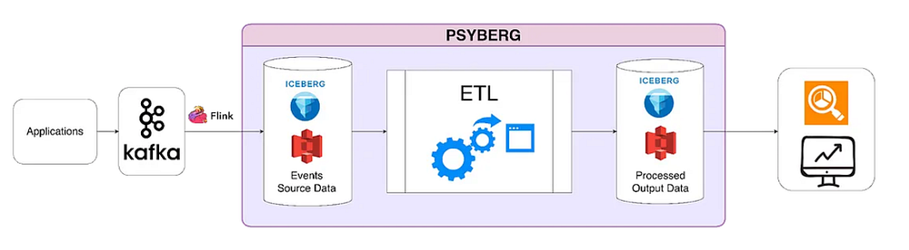
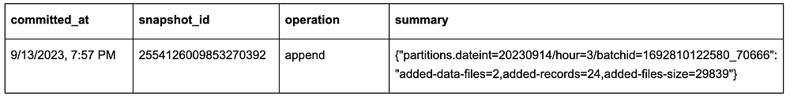
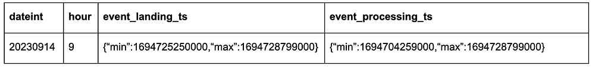
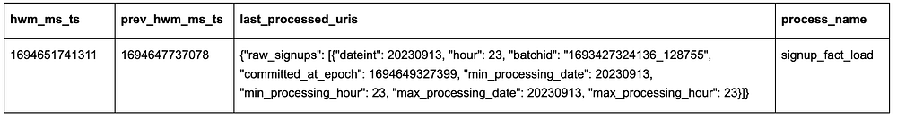

# Streamlining Membership Data Engineering at Netflix with Psyberg

By [_Abhinaya Shetty_](https://www.linkedin.com/in/abhinaya-shetty-ab871418/), [_Bharath Mummadisetty_](https://www.linkedin.com/in/bharath-chandra-mummadisetty-27591a88/)

At Netflix, our **Membership and Finance Data Engineering team** harnesses diverse data related to plans, pricing, membership life cycle, and revenue to fuel analytics, power various dashboards, and make data-informed decisions. Many metrics in** **[**Netflix’s financial reports**](https://s2.bl-1.com/h/i/dtZJ85P6/tWbBNBk) are powered and reconciled with efforts from our team! Given our role on this critical path, **accuracy** is paramount. In this context, managing the data, especially when it arrives late, can present a substantial challenge!

In this three-part blog post series, we introduce you to **_Psyberg_, our incremental data processing framework** designed to tackle such challenges! We’ll discuss batch data processing, the limitations we faced, and how Psyberg emerged as a solution. Furthermore, we’ll delve into the inner workings of Psyberg, its unique features, and how it integrates into our data pipelining workflows. By the end of this series, we hope you will gain an understanding of how Psyberg transformed our data processing, making our pipelines more efficient, accurate, and timely. Let’s dive in!

## The Challenge: Incremental Data Processing with Late Arriving Data

Our teams’ data processing model mainly comprises **batch pipelines**, which run at different intervals ranging from hourly to multiple times a day (also known as intraday) and even daily. We expect **complete and accurate data **at the end of each run. To meet such expectations, we generally run our pipelines with a lag of a few hours to leave room for late-arriving data.

## What is late-arriving data?

Late-arriving data is essentially delayed data due to system retries, network delays, batch processing schedules, system outages, delayed upstream workflows, or reconciliation in source systems.

## How does late-arriving data impact us?

You could think of our data as a puzzle. With each new piece of data, we must fit it into the larger picture and ensure it’s accurate and complete. Thus, we must reprocess the missed data to ensure data completeness and accuracy.

## Types of late-arriving data

Based on the structure of our upstream systems, we’ve classified late-arriving data into two categories, each named after the timestamps of the updated partition:

## Ways to process such data

Our team previously employed some strategies to manage these scenarios, which often led to unnecessarily reprocessing unchanged data. Some techniques we used were:

1. Using** fixed lookback **windows to always reprocess data, assuming that most late-arriving events will occur within that window. However, this approach usually leads to redundant data reprocessing, thereby increasing [ETL](https://en.wikipedia.org/wiki/Extract,_transform,_load) processing time and compute costs. It also becomes inefficient as the data scale increases. Imagine reprocessing the past 6 hours of data every hour!

2. **Add alerts** to flag when late arriving data appears, block the pipelines, and perform a manual intervention where we triggered backfill pipelines to handle the missed events. This approach was a simple solution with minimal extra processing for the most part and, hence, was our preferred solution. However, when the late events occurred, the pain of reprocessing data and catching up on all the dependent pipelines was not worth it! We will talk about this shortly.

At a high level, both these approaches were inefficient for intraday pipelines and impacted cost, performance, accuracy, and time. We developed **Psyberg**, an incremental processing framework using [Iceberg](https://iceberg.apache.org/) to handle these challenges more effectively.

## The state of our pipelines before Psyberg

Before diving into the world of Psyberg, it’s crucial to take a step back and reflect on the state of the data pipelines in our team before its implementation. The complexities involved in these processes and the difficulties they posed led to the development of Psyberg.

At Netflix, our backend microservices continuously generate real-time event data that gets streamed into Kafka. These raw events are the source of various data processing workflows within our team. We ingest this diverse event data and transform it into standardized fact tables. The fact tables then feed downstream intraday pipelines that process the data hourly. The sequential load ETL shown in the diagram below depicts one such pipeline that calculates an account's state every hour.

*Raw data for hours 3 and 6 arrive. Hour 6 data flows through the various workflows, while hour 3 triggers a late data audit alert.*

Let’s walk through an example to understand the complexity of this pre-Psyberg world.

Consider a simplified version of our pipelines where we process three events: signups, plan changes, and cancels. Now imagine that some signup events from hour 3 were delayed and sent in at hour 6 instead. Our audits would detect this and alert the on-call data engineer (DE). The on-call DE would then face the daunting task of making things right!

**Step 1**: Dive into the audit logs to identify the late-arriving data and the impacted workflows. In this case, they would discover that the late-arriving data for hour 3 must be included in the signup facts.

**Step 2**: Stop all impacted workflows and downstream jobs (such as the sequential load ETL) and patch the missed data in the fact tables. Now, the data in the signup fact is patched.

**Step 3**: Identify the number of partitions to be rerun for the sequential stateful load jobs to account for the delayed data and rerun them from the impacted date-hour. The DE would note that the data for hours 3–6 needs to be reprocessed and will retrigger four instances to be run sequentially. This step is crucial because missing signup events from hour 3 would result in us missing subsequent events for those affected accounts (e.g., a cancel event for a missed signup would have had no effect). As we capture the state of an account based on the sequence of different types of events, rerunning the sequential load ETL from hours 3 to 6 ensures the accurate representation of account states.

**Step 4**: Now that we’ve spent significant time triaging and resolving the alert, the sequential ETL workflow likely experienced a delay. As a result, we need to catch up to schedule. To compensate for the lost time, the DE must trigger a few additional instances until the latest hour that would have run if the data hadn’t arrived late.

This entire process was challenging and required significant manual intervention from the on-call DE perspective. Note that these are hourly jobs, so the alert could be triggered at any time of the day (or night!). Yes, they were infrequent, but a big pain point when they occurred! Also, the on-call DE was usually not the SME for these pipelines, as the late data could have arrived in any of our upstream pipelines. To solve these problems, we came up with Psyberg!

## Psyberg: The Game Changer!

Psyberg automates our data loads, making it suitable for various data processing needs, including intraday pipeline use cases. It leverages Iceberg metadata to facilitate processing incremental and batch-based data pipelines.

One of the critical features of Psyberg is its ability to detect and manage late-arriving data, no matter the partition it lands in. This feature allows data pipelines to handle late-arriving data effectively without manual intervention, ensuring higher data accuracy in our systems. [Iceberg metadata](https://iceberg.apache.org/spec/) and Psyberg’s own metadata form the backbone of its efficient data processing capabilities.

## ETL Process High Watermark

This is the last recorded update timestamp for any data pipeline process. This is mainly used to identify new changes since the last update.

## Iceberg Metadata

Psyberg primarily harnesses two key iceberg metadata tables — _snapshots and partitions_ — to manage the workload. All Iceberg tables have associated metadata that provide insight into changes or updates within the data tables.

The snapshots metadata table records essential metadata such as:

- The creation time of a snapshot
- The type of operation performed (append, overwrite, etc.)
- A summary of partitions created/updated during the generation of the Iceberg snapshot

These details enable Psyberg to track different operations and identify changes made to a source table since the previous high watermark. For example:

The partitions metadata table is particularly interesting as it stores:

- Information about partition keys used in the data table
- Column names and the range of values for each column within a specific partition

One unique aspect of Netflix’s internal implementation is that it provides the range of values for each column within a partition in a deserialized format. This information helps Psyberg comprehend the timestamp ranges for **both types** of late-arriving data (event and processing time) without querying the actual data.

## Psyberg Metadata

In addition to Iceberg metadata, Psyberg maintains its own metadata tables — the session table and the high watermark table. Both these tables are partitioned by the pipeline process name to maintain information related to each data pipeline independently.

The session table captures metadata specific to each pipeline run, including:

- Process name partition to track all the runs associated with the data pipeline process
- Session ID to track unique runs within the process
- Processing URIs to identify the input partitions involved in the load
- “from date”, “from hour”, “to date” and “to hour” for both event and processing times

The high watermark table stores relevant values from the session table at the end of each pipeline run:

- Latest and previous high water mark timestamp
- Metadata related to the latest run

This information is vital for each pipeline run instance as it helps determine the data to be loaded, updates the high water mark after processing, and finally generates output signals to inform downstream workflows about the date-hour up to which data is complete and available. It also serves as an essential resource for debugging and creating audits on the pipeline jobs.

## Conclusion

In this post, we described our data architecture at a high level, along with the pain points that led to the development of Psyberg. We also went into details related to the metadata that powers Psyberg. If you understand the challenges faced by the on-call DE and would like to learn more about our solution, please check out the [next iteration](https://netflixtechblog.medium.com/1d273b3aaefb) of this three-part series, where we delve deeper into different modes of Psyberg.

---
**Tags:** Data Pipeline · Data Integrity · Data · Iceberg
