# 100X Faster: How We Supercharged Netflix Maestro’s Workflow Engine

By [Jun He](https://www.linkedin.com/in/jheua/), [Yingyi Zhang](https://www.linkedin.com/in/yingyi-zhang-a0a164111/), [Ely Spears](https://www.linkedin.com/in/spearsem/)

## TL;DR

We recently upgraded the Maestro engine to go beyond scalability and improved its performance by **100X**! The overall overhead is reduced from seconds to milliseconds. We have updated the Maestro open source project with this improvement! Please visit the [Maestro GitHub repository](https://github.com/Netflix/maestro) to get started. If you find it useful, please [give us a star](https://github.com/Netflix/maestro).

## Introduction

In our previous [blog post](./maestro-netflixs-workflow-orchestrator-ee13a06f9c78.md), we introduced Maestro as a horizontally scalable workflow orchestrator designed to manage large-scale Data/ML workflows at Netflix. Over the past two and a half years, Maestro has achieved its design goal and successfully supported massive workflows with hundreds of thousands of jobs, managing millions of executions daily. As the adoption of Maestro increases at Netflix, new use cases have emerged, driven by Netflix’s evolving business needs, such as Live, Ads, and Games. To meet these needs, some of the workflows are now scheduled on a sub-hourly basis. Additionally, Maestro is increasingly being used for low-latency use cases, such as ad hoc queries, beyond traditional daily or hourly scheduled ETL data pipeline use cases.

While Maestro excels in orchestrating various heterogeneous workflows and managing user end-to-end development experiences, users have experienced noticeable speedbumps (i.e. ten seconds overhead) from the Maestro engine during workflow executions and development, affecting overall efficiency and productivity. Although being fully scalable to support Netflix-scale use cases, the processing overhead from Maestro internal engine state transitions and lifecycle activities have become a bottleneck, particularly during development cycles. Users have expressed the need for a high performance workflow engine to support iterative development use cases.

To visualize our end users’ needs for the workflow orchestrator, we create a 5-layer structure graph shown below. Before the change, Maestro reached level 4 but faced challenges to satisfy the user’s needs in level 5. With the new engine design, Maestro is able to power the users to work with their highest capacity and spark joy for end users during their development over the Maestro.

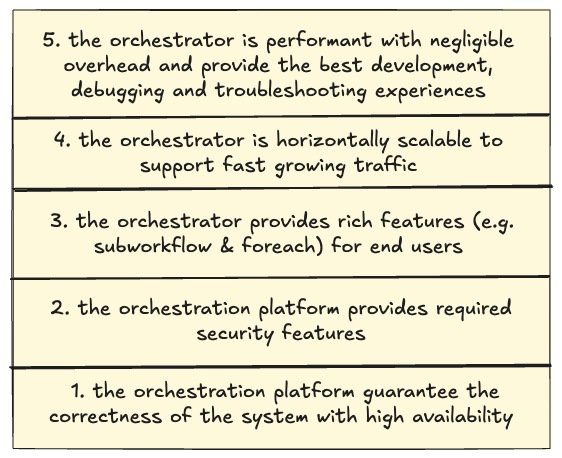
*Figure 1. A 5-layer structure showing needs for the workflow orchestrator.*

In this blog post, we will share our new engine details, explain our design trade-off decisions, and share learnings from this redesign work.

## Architectural Evolution of Maestro

### Before the change

To understand the improvements, we will first revisit the original architecture of Maestro to understand why the overhead is high. The system was divided into three main layers, as illustrated in the diagram below. In the sections that follow we will explain each layer and the role it played in our performance optimization.

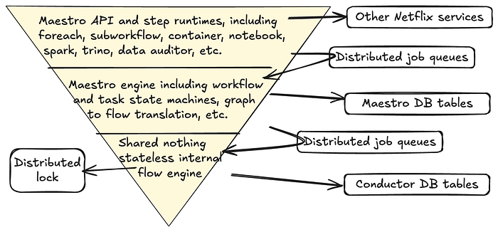
*Figure 2. The architecture diagram before the evolution.*

**Maestro API and Step Runtime Layer**

This layer offers seamless integrations with other Netflix services (e.g., compute engines like Spark and Trino). Using Maestro, thousands of practitioners build production workflows using a paved path to access platform services . They can focus primarily on their business logic while relying on Maestro to manage the lifecycle of jobs and workflows plus the integration with data platform services and required integrations such as for authentication, monitoring and alerting. This layer functioned efficiently without introducing significant overhead.

**Maestro Engine Layer**

The Maestro engine serves several crucial functions:

- Managing the lifecycle of workflows, their steps and maintaining their state machines
- Supporting all user actions (e.g., start, restart, stop, pause) on workflow and step entities
- Translating complex Maestro workflow graphs into parallel flows, where each flow is an array of sequentially chained flow tasks, translating every step into a flow task, and then executing transformed flows using the internal flow engine
- Acting as a middle layer to maintain isolation between the Maestro step runtime layer and the underlying flow engine layer
- Implementing required data access patterns and writing Maestro data into the database

In terms of speed, this layer had acceptable overhead but faced edge cases (e.g. a step might be concurrently executed by two workers at the same time, causing race conditions) due to lacking a strong guarantee from the internal flow engine and the external distributed job queue.

**Maestro Internal Flow Engine Layer**

The Maestro internal flow engine performed **2** primary functions:

- Calling task’s execution functions at a given interval.
- Starting the next tasks in an array of sequential task flows (not a graph), if applicable.

This foundational layer was based on Netflix OSS Conductor 2.x ([deprecated since Apr 2021](https://github.com/Netflix/conductor/releases/tag/v3.0.0)), which requires a dedicated set of separate database tables and distributed job queues.

The existing implementation of this layer introduces an impactful overhead (e.g. a few seconds to tens of seconds overall delays). The lack of strong guarantees (e.g. exactly once publishing) from this layer leads to race conditions which cause stuck jobs or lost executions.

### Options to consider

We have evaluated three options to address those existing issues:

- Option 1: Implement an internal flow engine optimized for Maestro specific use cases
- Option 2: Upgrade Conductor library to 4.0, which addresses the overheads and offers other improvements and enhancements compared with Conductor 2.X.
- Option 3: Use Temporal as the internal flow engine

One aspect that influenced our **assessment** of option two is that Conductor 2 provided a final callback capability in the state machine that was contributed specifically for Maestro’s use case to ensure database synchronization between the Conductor and Maestro engine states. It would require porting this functionality to Conductor 4 though it had been dropped given no other Conductor use cases besides Maestro relied on this. By rewriting the flow engine it would allow removal of several complex internal databases and database synchronization requirements which was attractive for simplifying operational reliability. Given Maestro did not need the full set of state engine features offered by Conductor, this motivated us to consider a flow engine rewrite as a higher priority.

The decision for Temporal was more straightforward. Temporal is optimized towards facilitating inter-process orchestration and would involve calling an external service to interact with the Temporal flow engine. Given Maestro is operating greater than a million tasks per day, many of which are long running, we felt it was an unnecessary source of risk to couple the DAG engine execution with an external service call. If our requirements went beyond lightweight state transition management we might reconsider because Temporal is a very robust control plane orchestration system, but for our needs it introduced complexity and potential reliability weak spots when there was no direct need for the advanced feature set that it offered.

After considering Option 2 and Option 3, we developed more conviction that Maestro’s architecture could be greatly simplified by not using a full DAG evaluation engine and having to maintain the state machine for two systems (Maestro and Conductor/Temporal). Therefore, we have decided to go with Option 1.

### After the change

To address these issues, we completely rewrote the Maestro internal flow engine layer to satisfy Maestro’s specific needs and optimize its performance. This new flow engine is lightweight with minimal dependencies, focusing on excelling in the two primary functions mentioned [above](./100x-faster-how-we-supercharged-netflix-maestros-workflow-engine-028e9637f041.md). We also replaced existing distributed job queues with internal ones to provide a strong guarantee.

The new engine is **highly performant, efficient, scalable, and fault-tolerant**. It is the foundation for all upper components of Maestro and provides the following guarantees to avoid race conditions:

- A single step should only be executed by a single worker at any given time
- Step state should never be rolled back
- Steps should always eventually run to a terminal state
- The internal flow state should be eventually consistent with the Maestro workflow state
- External API and user actions should not cause race conditions on the workflow execution

Here is the new architecture diagram after the change, which is much simpler with less dependencies:

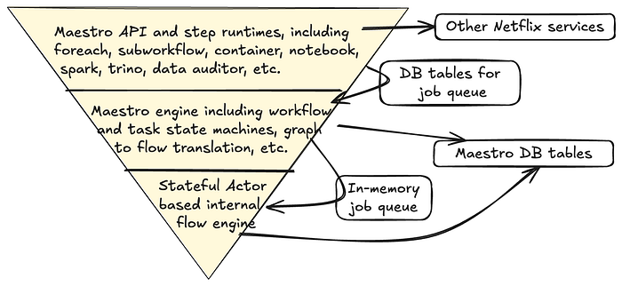
*Figure 3. The architecture diagram after the evolution.*

## New Flow Engine Optimization

The new flow engine significantly boosts speed by maintaining state in memory. It ensures consistency by using Maestro engine’s database as the source of truth for workflow and step states. During bootstrapping, the flow engine rebuilds its in-memory state from the database, improving performance and simplifying the overall architecture. This is in contrast to the previous design in which multiple databases had to be reconciled against one another (Conductor’s tables and Maestro’s tables) or else suffer race conditions and rare orphaned job status.

The flow engine operates on in-memory flow states, resembling a [write through caching pattern](https://docs.aws.amazon.com/whitepapers/latest/database-caching-strategies-using-redis/caching-patterns.html#write-through). Updates to workflow or step state in the database also update the in-memory flow state. If in-memory state is lost, the flow engine rebuilds it from the database, ensuring eventual consistency and resolving race conditions.

This design delivers lower latency and higher throughput, avoids inconsistencies from dual persistence, simplifies the architecture, and keeps the in‑memory view eventually consistent with the database.

### Maintaining Scalability While Gaining Speed

With the new engine, we significantly boost performance by collocating flows and their tasks on the same node throughout their lifecycle. Therefore, states of a flow and its tasks will stay in a single node’s memory without persisting to the database. This stickiness and locality bring great performance benefits but inevitably impact scalability since tasks are no longer reassigned to a new worker of the whole cluster in each polling cycle.

To maintain horizontal scalability, we introduced a flow group concept to partition running flows into groups. In this way, each Maestro flow engine instance only needs to maintain ownership of groups rather than individual flows, reducing maintenance costs (e.g., heartbeat) and simplifying reconciliation by allowing each Maestro node to load flows for a group in batches. Each Maestro node claims ownership of a group of flows through a flow group actor and manages their entire lifecycle via child flow actors. If ownership is lost due to node failure or long JVM GC, another node can claim the group to resume flow executions by reconciling internal state from Maestro database. The following diagram illustrates the ownership maintenance.

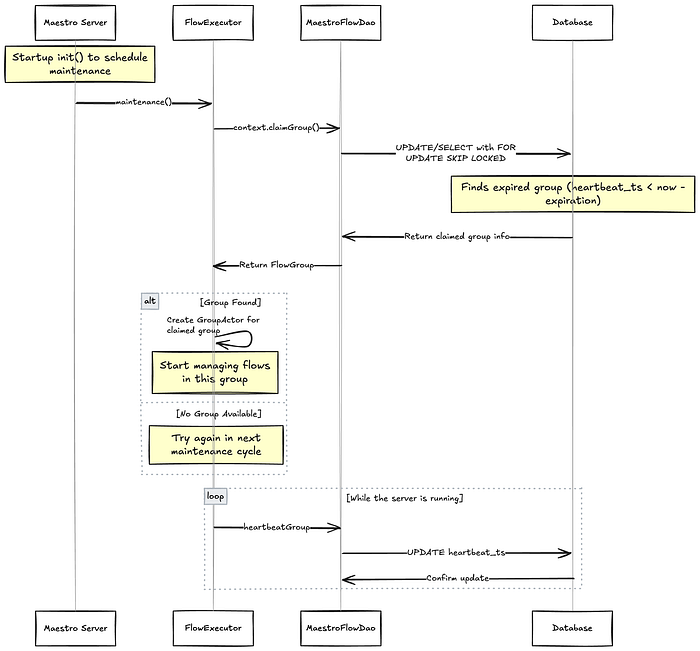
*Figure 4. Ownership maintenance sequence diagram.*

### Flow Partitioning

To efficiently distribute traffic, Maestro assigns a consistent group ID to flows/workflows by a simple stable ID assignment method, as shown in the diagram’s Partitioning Function box. We chose this simpler partitioning strategy over advanced ones, e.g. consistent hashing, primarily due to execution and reconciliation costs and consistency challenges in a distributed system.

Since Maestro decomposes workflows into hierarchical internal flows (e.g., foreach), parent flows need to interact with child flows across different groups. To enable this, the maximal group number from the parent, denoted as N’ in the diagram, is passed down to all child flows. This allows child flows, such as subworkflows or foreach iterations, to recompute their own group IDs and also ensures that a parent flow can always determine the group ID of its child flows using only their workflow identifiers.

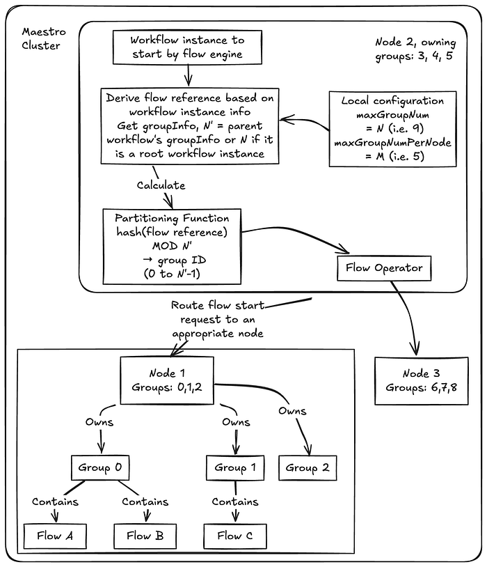
*Figure 5. Flow group partitioning mechanism diagram.*

After a flow’s group ID is determined, the flow operator routes the flow request to the appropriate node. Each node owns a specific range of group IDs. For example, in the diagram, Node 1 owns groups 0, 1, and 2, while Node 3 owns groups 6, 7, and 8. The groups then contain the individual flows (e.g., Flow A, Flow B).

In this design, the group size is configurable and nodes can also have different group size configurations. The following diagram shows a flow group partitioning example while the maximal group number is changed during the engine execution without impacting any existing workflows.

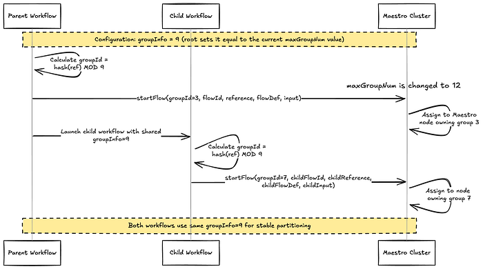
*Figure 6. A flow group partitioning example.*

In short, Maestro flow engine shares the group info across the parent and child workflows to provide a flexible and stable partitioning mechanism to distribute work across the cluster.

### Queue Optimization

We replaced both external distributed job queues in the existing system with internal ones, preserving the same fault‑tolerance and recovery guarantees while reducing latency and boosting throughput.

For the internal flow engine, the queue is a simple in‑memory Java blocking queue. It requires no persistence and can be rebuilt from Maestro state during reconciliation.

For the Maestro engine, we implemented a database‑backed in‑memory queue that provides **exactly‑once publishing and at‑least‑once delivery guarantees**, addressing multiple edge cases that previously required manual state correction.

This design is similar to the[ transactional outbox pattern](https://docs.aws.amazon.com/prescriptive-guidance/latest/cloud-design-patterns/transactional-outbox.html). In the same transaction that updates Maestro tables, a row is inserted into the `maestro_queue` table. Upon transaction commit, the job is immediately pushed to a queue worker on the same node, eliminating polling latency. After successful processing, the worker deletes the row from the database. A periodic sweeper re-enqueues any rows whose timeout has expired, ensuring another worker picks them up if a worker stalls or a node fails.

This design handles failures cleanly. If the transaction fails, both data and message roll back atomically, no partial publishing. If a worker or node fails after commit, the timeout mechanism ensures the job is retried elsewhere. On restart, a node rebuilds its in‑memory queue from the queue table, providing at-least-once delivery guarantee.

To enhance scalability and avoid contention across event types, each event type is assigned a `queue_id`. Job messages are then partitioned by `queue_id`, optimizing performance and maintaining system efficiency under high load.

## From Stateless Worker Model to Stateful Actor Model

Maestro previously used a shared-nothing stateless worker model with a polling mechanism. When a task started, its identifier was enqueued to a distributed task queue. A worker from the flow engine would pick the task identifier from the queue, load the complete states of the whole workflow (including the flow itself and every task), execute the task interface method once, write the updated task data back to the database, and put the task back in the queue with a polling delay. The worker would then forget this task and start polling the next one.

That architecture was simple and horizontally scalable (excluding database scalability considerations), but it had drawbacks. The process introduced considerable overhead due to polling intervals and state loading. The time spent in one polling cycle on distributed queues, loading complete states, and other DB queries was significant.

As Maestro engine decomposes complex workflow graphs into multiple flows, actions might involve multiple flows spanning multiple polling cycles, adding up to significant overhead (around ten seconds in the worst cases). Also, this design didn’t offer strong execution guarantees mainly because the distributed job queue could only provide at-least-once guarantees. Tasks might be dequeued and dispatched to multiple workers, workers might reset states in certain race conditions, or load stale states of other tasks and make incorrect decisions. For example, after a long garbage-collection pause or network hiccup, two workers can pick up the same task: one sets the task status as completed and then unblocks the downstream steps to move forward. However, the other worker, working off stale state, resets the task status back to running, leaving the whole workflow in a conflicting state.

In the new design, we developed a stateful actor model, keeping internal states in memory. All tasks of a workflow are collocated in the same Maestro node, providing the best performance as states are in the same JVM.

### Actor-Based Model

The new flow engine fits well into an actor model. We also deliberately designed it to allow sharing certain local states (read-only) between parent, child, and sibling actors. This optimization gains performance benefits without losing thread safety due to Maestro’s use cases. We used Java 21’s virtual thread support to implement it with minimal dependencies.

The new actor-based flow engine is fully message/event-driven and can take actions immediately when events are received, eliminating polling interval delays. To maintain compatibility with the existing polling-based logic, we developed a wakeup mechanism. This model requires flow actors and their child task actors to be collocated in the same JVM for communication over the in-memory queue. Since the Maestro engine already decomposes large-scale workflow instances into many small flows, each flow has a limited number of tasks that fit well into memory.

Below is a high-level overview of the Maestro execution flow based on the actor model.

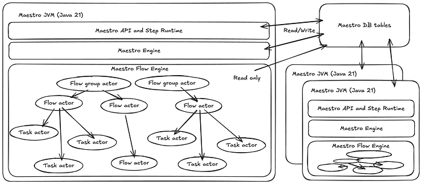
*Figure 7. The high level overview of the Maestro execution.*

- When a workflow starts or during reconciliation, the flow engine inserts (if not existing) or loads the Maestro workflow and step instance from the database, transforming it into the internal flow and task state. This state remains in JVM memory until evicted (e.g., when the workflow instance reaches a terminal state).
- A virtual thread is created for each entity (workflow instance or step attempt) as an actor to handle all updates or actions for this entity, ensuring thread safety and eliminating distributed locks and potential race conditions.
- Each virtual thread actor contains an in-memory state, a thread-safe blocking queue, and a state machine to update states, ensuring thread safety and high efficiency.
- Actors are organized hierarchically, with flow actors managing all their task actors. Flow actors and their task actors are kept in the same JVM for locality benefits, with the ability to relocate flow instances to other nodes if needed.
- An event can wake up a virtual thread by pushing a message to the actor’s job queue, enabling Maestro to move toward an event-driven approach alongside the current polling-based approach.
- A reconciliation process transforms the Maestro data model into the internal flow data.

### Virtual Thread Based Implementation

We chose Java virtual threads to implement various actors (e.g. group actors and flow actors), which simplified the actor model implementation. With a smaller amount of code, we developed a fully functional and highly performant event-driven distributed flow engine. Virtual threads fit very well in use cases like state machine transitions within actors. They are lightweight enough to be created in a large number without Out-Of-Memory risks.

However, virtual threads can potentially deadlock. They’re not suitable for executing user-provided logic or complex step runtime logic that might depend on external libraries or services outside our control. To address this, we separate flow engine execution from task execution logic by adding a separate worker thread pool (not virtual threads) to run actual step runtime business logic like launching containers or making external API calls. Flow/task actors can [wait indefinitely for the future of the thread poll executor to complete](https://github.com/Netflix/maestro/blob/main/maestro-flow/src/main/java/com/netflix/maestro/flow/engine/ExecutionContext.java#L96-L100) but don’t perform actual execution, allowing us to benefit from virtual threads while avoiding deadlock issues.

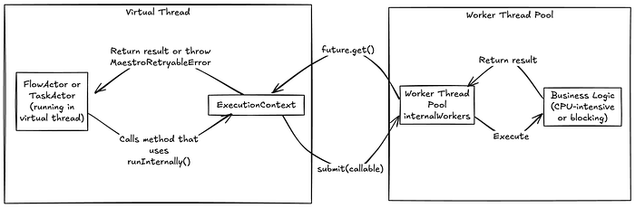
*Figure 8. Virtual thread and worker thread separation.*

### Providing Strong Execution Guarantees

To provide strong execution guarantees, we implemented a generation ID-based solution to ensure that a single flow or task is executed by only one actor at any time, with states that never roll back and eventually reach a terminal state.

When a node claims a new group or a group with an expired heartbeat, it updates the database table row and increments the group generation ID. During node bootstrap, the group actor updates all its owned flows’ generation IDs while rebuilding internal flow states. When creating a new flow, the group actor verifies that the database generation ID matches its in-memory generation ID, otherwise rejecting the creation and reporting a retryable error to the caller. Please check [the source code](https://github.com/Netflix/maestro/blob/main/maestro-flow/src/main/java/com/netflix/maestro/flow/dao/MaestroFlowDao.java) for the implementation details.

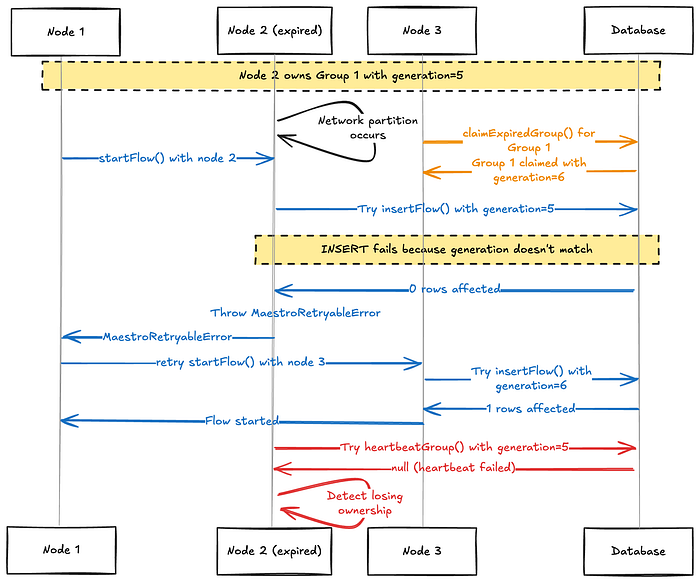
*Figure 9. An example sequence diagram showing how generation id provides a strong guarantee.*

Additionally, the new flow engine supports both event-driven execution and polling-based periodic reconciliation. Event-driven support allows us to extend polling intervals for state reconciliation at a very low cost, while polling-based reconciliation relaxes event delivery requirements to at-most-once.

## Testing, Validation and Rollout

Migrating hundreds of thousands of Netflix data processing jobs to a new workflow engine required meticulous planning and execution to avoid data corruption, unexpected traffic patterns, and edge cases that could hinder performance gains. We adopted a principled approach to ensure a smooth transition:

1. **Realistic Testing:** Our testing mirrored real-world use cases as closely as possible.
2. **Balanced Approach:** We balanced the need for rapid delivery with comprehensive testing.
3. **Minimal User Disruption:** The goal was for users to be unaware of the underlying changes.
4. **Clear Communication:** For cases requiring user involvement, clear communication was provided.

### Maestro Test Framework

To achieve our testing goals, we developed an adaptable testing framework for Maestro. This framework addresses the limitations of static unit and integration tests by providing a more dynamic and comprehensive approach, mimicking organic production traffic. It complements existing tests to instill confidence when rolling out major changes, such as new DAG engines.

The framework is designed to sample real user workflows, disconnecting business logic from external side effects like data reads or writes. This allows us to run workflow graphs of various shapes and sizes, reflecting the diverse use cases across Netflix. While system integrations are handled through deployment pipeline integration tests, the ability to exercise a wide variety of workflow topologies (e.g., parallel executions, for-each jobs, conditional branching and parameter passing between jobs) was crucial for ensuring the new flow engine’s correctness and performance.

The prototype workflow for the test framework focuses on auto-testing parameters, involving two main steps:

**1. Caching Production Workflows:**

- Successful production instances are queried from a historical Maestro feed table over a specified period.
- Run parameters, initiator, and instance IDs are extracted and organized into an instance data map.
- YAML definitions and subworkflow IDs are pulled from S3 storage.
- Both workflow definitions and instance data are cached on S3 for subsequent steps.

**2. Pushing, Running, and Monitoring Workflows:**

- Cached workflow definitions and instance data are loaded.
- Notebook-based jobs are replaced with custom notebooks, and certain job types (e.g., vanilla container runtime jobs, templated data movement jobs) and signal triggers are converted to a special no-op job type or skipped.
- Abstract job types like Write-Audit-Publish are expressed as a single step template but are translated to multiple reified nodes of the DAG when executed. These are auto-translated into several custom notebook job types to replace the generated nodes.
- Workflows and subworkflows are pushed, with only non-subworkflows being run using original production instance information.
- 1. In the parent workflow, each sub-workflow is replaced with a special no-op placeholder so that the overall topology is preserved but without executing any side-effects of child workflows and avoid cases using dynamic runtime parameter logic.
- 2. Each sub-workflow is then separately treated like a top-level parent workflow not initiated from its parent, to exercise the actual workflow steps of the sub-workflow.
- The custom notebook internally compares all passed parameters for each job.
- Workflow instances are monitored until termination (success or failure).
- An email detailing failed workflow instances is generated.

Future phases of the test framework aim to expand support for native steps, more templates, Titus and Metaflow workflows, and include more robust signal testing. Further integration with the ecosystem, including dedicated Genie clusters for no-op jobs and DGS for our internal workflow UI feature verification, is also being explored.

### Rollout Plan

Our rollout strategy prioritized minimal user disruption. We determined that an entire workflow, from its root instance, must reside in either the old or new flow engine, preventing mixed operations that could lead to complex failure modes and manual data reconciliation.

To facilitate this, we established a parallel infrastructure for the new workflow engine and leveraged our orchestrator gateway API to hide any routing or redirection logic from users. This approach provided excellent isolation for managing the migration. Initially, specific workflows could explicitly opt in via a system flag, allowing us to observe their execution and gain confidence. By scaling up traffic to the parallel infrastructure in direct proportion to what was scaled down from the original infrastructure, the dual infrastructure cost increase was negligible.

Once confident, we transitioned to a percentage-based cutover. In the event of a sustained failure in the new engine, our team could roll back a workflow by removing it from the new engine’s database and restarting it in the original stack. However, one consequence of rollback was that failed workflows had to restart from the beginning, recomputing previously successful steps, to ensure all artifacts were generated from a consistent flow engine.

Leveraging Maestro’s 10-day workflow timeout, we migrated users without disruption. Existing executions would either complete or time out. Upon restarting (due to failure/timeout) or triggering a new instance (due to success), the workflow would be picked up by the new engine. This effectively allowed us to gradually “drain” traffic from the old engine to the new one with no user involvement.

While the plan generally proceeded as expected with limited edge cases, we did encounter a few challenges:

- **Stuck Workflows:** Around 50 workflows with defunct or incorrect ownership information entered a stuck state. In some cases, a backlog of queued instances behind a stuck instance created a race condition in which a new instance would be started immediately when an old instance was terminated, perpetually keeping the workflow on the old engine. For these, we proactively contacted users to negotiate manual stop-and-restart times, forcing them onto the new engine.
- **Configuration Discrepancies:** A significant lesson learned was the importance of meticulous record-keeping and management of parallel infrastructure components. We discovered alerts, system flags, and feature flags configured for one stack but not the other. This led to a failure in a partner team’s system that dynamically rolled out a Python migration by analyzing workflow configurations. The absence of a required feature flag in the new engine stack caused the process to be silently skipped, resulting in incorrect Python version configurations for about 40 workflows. Although quickly remediated, this caused user inconvenience as affected workflows needed to be restarted and verified for no lingering data corruption issues. This issue also highlighted limitations in the testing framework since runtime configuration based on external API calls to the configuration service were not exercised in simulated workflow executions.

Despite these challenges, the migration was a success. We migrated over 60,000 active workflows generating over a million data processing tasks daily with almost no user involvement. By observing the flow engine’s lifecycle management latency, we validated a reduction in step launch overhead from around 5 seconds to 50 milliseconds. Workflow start overhead (incurred once per each workflow execution) also improved from 200 milliseconds to 50 milliseconds. Aggregating this over a million daily step executions translates to saving approximately 57 days of flow engine overhead per day, leading to a snappier user experience, more timely workflow status for data practitioners and greater overall task throughput for the same infrastructure scale.

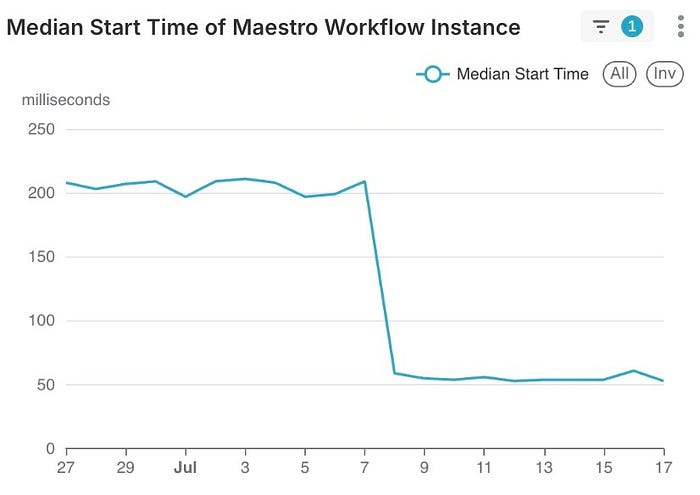

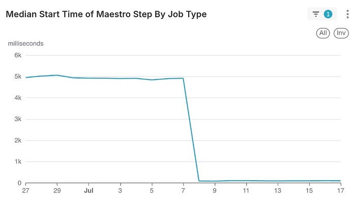

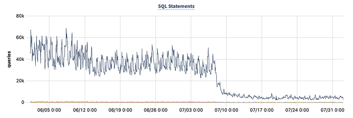

We additionally realized significant benefits internally with reduced maintenance effort due to the new flow engine’s simplified set of database components. We were able to delete nearly 40TB of obsolete tables related to the previous stateless flow engine and saw a 90% reduction in internal database query traffic which had previously been a significant source of system alerts for the team.

## Conclusion

The architectural evolution of Maestro represents a significant leap in performance, reducing overhead from seconds to milliseconds. This redesign with a stateful actor model not only enhances speed by 100X but also maintains scalability and reliability, ensuring Maestro continues to meet the diverse needs of Netflix’s data and ML workflows.

Key takeaways from this evolution include:

- **Performance matters:** Even in a system designed for scale, the speed of individual operations significantly impacts user experience and productivity.
- **Simplicity wins:** Reducing dependencies and simplifying architecture not only improved performance but also enhanced reliability and maintainability.
- **Strong guarantees are essential:** Providing strong execution guarantees eliminates race conditions and edge cases that previously required manual intervention.
- **Locality optimizations pay off:** Collocating related flows and tasks in the same JVM dramatically reduces overhead from the Maestro engine.
- **Modern language features help:** Java 21’s virtual threads enabled an elegant actor-based implementation with minimal code complexity and dependencies.

We’re excited to share these improvements with the open-source community and look forward to seeing how Maestro continues to evolve. The performance gains we’ve achieved open new possibilities for low-latency workflow orchestration use cases while continuing to support the massive scale that Netflix and other organizations require.

Visit the [Maestro GitHub repository](https://github.com/Netflix/maestro) to explore these improvements. If you have any questions, thoughts, or comments about Maestro, please feel free to create a [GitHub issue](https://github.com/Netflix/maestro/issues) in the Maestro repository. We are eager to hear from you. If you are passionate about solving large scale orchestration problems, please [join us](https://explore.jobs.netflix.net/careers?query=Data+Platform&Teams=Engineering&domain=netflix.com&sort_by=relevance).

## Acknowledgements

Special thanks to Big Data Orchestration team members for general contributions to Maestro and diligent review, discussion and incident response required to make this project successful: Davis Shepherd, Natallia Dzenisenka, Praneeth Yenugutala, Brittany Truong, Jonathan Indig, Deepak Ramalingam, Binbing Hou, Zhuoran Dong, Victor Dusa, and Gabriel Ikpaetuk — and and internal partners Yun Li and Romain Cledat.

Thank you to Anoop Panicker and Aravindan Ramkumar from our partner organization that leads Conductor development in Netflix. They helped us understand issues in Conductor 2.X that initially motivated the rearchitecture and helped provide context on later versions of Conductor that defined some of the core trade-offs for the decision to implement a custom DAG engine in Maestro.

We’d also like to thank our partners on the Data Security & Infrastructure and Engineering Support teams who helped identify and rapidly fix the configuration discrepancy error encountered during production rollout: Amer Hesson, Ye Ji, Sungmin Lee, Brandon Quan, Anmol Khurana, and Manav Garekar.

A special thanks also goes out to partners from the Data Experience team including Jeff Bothe, Justin Wei, and Andrew Seier. The flow engine speed improvement was actually so dramatic that it broke some integrations with our internal workflow UI that reported state transition durations. Our partners helped us catch and fix UI regressions before they shipped to avoid impact to users.

We also thank Prashanth Ramdas, Anjali Norwood, Eva Tse, Charles Zhao, Sumukh Shivaprakash, Joey Lynch, Harikrishna Menon, Marcelo Mayworm, Charles Smith and other leaders for their constructive feedback and guidance on the Maestro project.

---
**Tags:** Workflow · Orchestration · Distributed Systems · Data · Machine Learning
