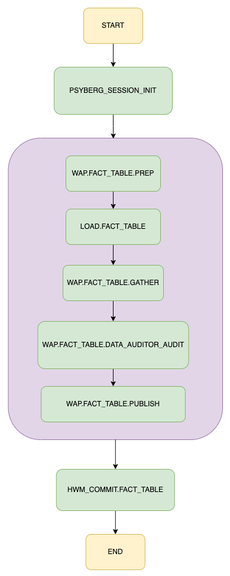
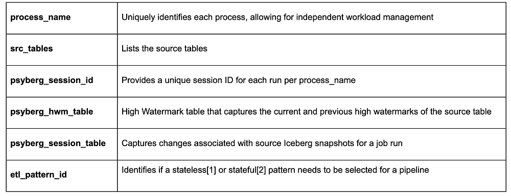
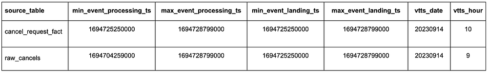
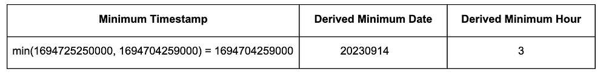
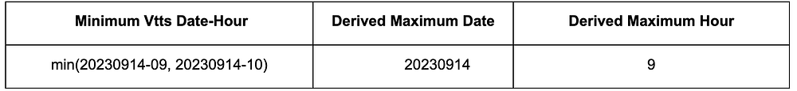

# Diving Deeper into Psyberg: Stateless vs Stateful Data Processing

By [_Abhinaya Shetty_](https://www.linkedin.com/in/abhinaya-shetty-ab871418/), [_Bharath Mummadisetty_](https://www.linkedin.com/in/bharath-chandra-mummadisetty-27591a88/)

In the [inaugural blog post](https://netflixtechblog.medium.com/f68830617dd1) of this series, we introduced you to the state of our pipelines before Psyberg and the challenges with incremental processing that led us to create the Psyberg framework within Netflix’s Membership and Finance data engineering team. In this post, we will delve into a more detailed exploration of Psyberg’s two primary operational modes: stateless and stateful.

## Modes of Operation of Psyberg

Psyberg has two main modes of operation or patterns, as we call them. Understanding the nature of the late-arriving data and processing requirements will help decide which pattern is most appropriate for a use case.

1. **Stateless Data Processing**: As the name suggests, one should use this pattern in scenarios where the columns in the target table solely depend on the content of the incoming events, irrespective of their order of occurrence. For instance, consider a scenario where we need to keep track of all the customer signups over time. In this case, the order of signups wouldn’t matter, and individual signup records are independent of each other. This information has only one source, and we can append new/late records to the fact table as and when the events are received.
2. **Stateful Data Processing**: This pattern is useful when the output depends on a sequence of events across one or more input streams. For example, the customer account lifecycle in a business might involve multiple stages, such as account creation, plan upgrades, downgrades, and cancellation. To derive attributes like the lifetime of an account or the latest plan the account is on, we need to track the sequence of these events across different input streams. A missed event in such a scenario would result in incorrect analysis due to a wrong derived state. Late-arriving data in such cases requires overwriting data that was previously processed to ensure all events are accounted for.

Let’s visualize how these two modes work within our data processing pipeline using a general workflow for loading a fact table. If you would like to learn more about how the workflows are orchestrated in Netflix Maestro scheduler, please check out this [blog post](./orchestrating-data-ml-workflows-at-scale-with-netflix-maestro-aaa2b41b800c.md) from our data platform team.



With this illustration as our guide, let’s explore each mode in more detail.

## The Psyberg Initialization Phase

This step invokes Psyberg with the required parameters. Based on these parameters, Psyberg then computes the correct data range for the pipeline processing needs.

Input parameters in this step include the following:



## Initialization for Stateless Data Processing

Let’s use the signup fact table as an example here. This table’s workflow runs hourly, with the main input source being an Iceberg table storing all raw signup events partitioned by landing date, hour, and batch id.

Here’s a YAML snippet outlining the configuration for this during the Psyberg initialization step:

```
- job:
   id: psyberg_session_init
   type: Spark
   spark:
     app_args:
       - --process_name=signup_fact_load
       - --src_tables=raw_signups
       - --psyberg_session_id=20230914061001
       - --psyberg_hwm_table=high_water_mark_table
       - --psyberg_session_table=psyberg_session_metadata
       - --etl_pattern_id=1
```

Behind the scenes, Psyberg identifies that this pipeline is configured for a stateless pattern since **etl_pattern_id=1**.

Psyberg also uses the provided inputs to detect the Iceberg snapshots that persisted after the latest high watermark available in the watermark table. Using the **summary column in snapshot metadata** [see the [Iceberg Metadata section in post 1](https://netflixtechblog.medium.com/f68830617dd1) for more details], we parse out the partition information for each Iceberg snapshot of the source table.

Psyberg then retains these processing URIs (an array of JSON strings containing combinations of landing date, hour, and batch IDs) as determined by the snapshot changes. This information and other calculated metadata are stored in the **psyberg_session_f** table. This stored data is then available for the subsequent** LOAD.FACT_TABLE** job in the workflow to utilize and for analysis and debugging purposes.

## Initialization for Stateful Data Processing

Stateful Data Processing is used when the output depends on a sequence of events across one or more input streams.

Let’s consider the example of creating a cancel fact table, which takes the following as input:

1. **Raw cancellation events** indicating when the customer account was canceled
2. A fact table that stores incoming **customer requests **to cancel their subscription at the end of the billing period

These inputs help derive additional stateful analytical attributes like the type of churn i.e. voluntary or involuntary, etc.

The initialization step for Stateful Data Processing differs slightly from Stateless. Psyberg offers additional configurations according to the pipeline needs. Here’s a YAML snippet outlining the configuration for the cancel fact table during the Psyberg initialization step:

```
- job:
   id: psyberg_session_init
   type: Spark
   spark:
     app_args:
       - --process_name=cancel_fact_load
       - --src_tables=raw_cancels|processing_ts,cancel_request_fact
       - --psyberg_session_id=20230914061501
       - --psyberg_hwm_table=high_water_mark_table
       - --psyberg_session_table=psyberg_session_metadata
       - --etl_pattern_id=2
```

Behind the scenes, Psyberg identifies that this pipeline is configured for a stateful pattern since **etl_pattern_id** is 2.

Notice the additional detail in the src_tables list corresponding to raw_cancels above. The **processing_ts** here represents the event processing timestamp which is different from the regular Iceberg snapshot commit timestamp i.e. **event_landing_ts** as described in [part 1](https://netflixtechblog.medium.com/f68830617dd1) of this series.

It is important to capture the range of a consolidated batch of events from all the sources i.e. both raw_cancels and cancel_request_fact, while factoring in late-arriving events. Changes to the source table snapshots can be tracked using different timestamp fields. Knowing which timestamp field to use i.e. **event_landing_ts** or something like **processing_ts** helps avoid missing events.

Similar to the approach in stateless data processing, Psyberg uses the provided inputs to parse out the partition information for each Iceberg snapshot of the source table.


*Sample parsed input for target snapshot_date 20230914 and snapshot_hour 9*

This is then used to query the partitions metadata table which has the min and max range for each column in the source table. In this case, we look at the min and max range of the **processing_ts** column to determine actual partitions for any late-arriving events. The minimum value here helps determine the lower limit of the data to be processed i.e. the derived minimum date and hour based on the input epoch timestamp.


*Lower Limit to be processed = least ( “min” event_processing_ts)*

It also tracks the VTTS (Valid To TimeStamp) of all the input streams and determines the minimum VTTS of all the streams together. This helps determine the upper limit of data to be processed, thus restricting the data load based on data completeness of all the streams combined.


*Upper Limit to be processed = least (vtts date-hour)*

Using this metadata from different streams, Psyberg calculates several parameters like minimum/maximum processing date and hour and event landing date hour. These parameters, along with other metadata, discussed in the previous post, are persisted in the **psyberg_session_f** table for analysis and debugging purposes.

## Write Audit Publish (WAP) process

The [Write Audit Publish (WAP) process](https://www.dremio.com/resources/webinars/the-write-audit-publish-pattern-via-apache-iceberg/) is a general pattern we use in our ETLs to validate writes to the uncommitted Iceberg snapshot before publishing to the target table. The **LOAD.FACT_TABLE** step takes **psyberg_session_id** and **process_name** as input arguments.

For stateless pattern, the processing URIs to be processed as part of the load step are identified by reading the **psyberg_session_f** table. This information is then used to filter the source table and apply the business logic to create the signup fact table. Any late-arriving signup events data is appended to the target table partitions as part of this. All these writes go into the uncommitted Iceberg snapshot managed by the WAP pattern.

Similarly, in the stateful pattern, the ETL step reads the **psyberg_session_f** table to identify the derived minimum and maximum date hour range to be processed, which acts as a filter for different input tables involved in the ETL. After applying the corresponding business logic for cancellation events, we create the cancel fact table along with columns like cancellation type (i.e., voluntary vs involuntary churn) representing the state of the canceled account. If there are any late-arriving events, Psyberg handles them automatically by providing the correct range to the data process to derive the state changes correctly.

## Audits

We run different audits on the uncommitted Iceberg snapshot created as part of the job run. Leveraging Psyberg metadata, we can identify the cohort of data involved as part of the job run. This helps in pinpointing changes and applying blocking audits efficiently. Audits like source-to-target count comparison and checking for no missing events in the target Iceberg snapshot ensure data integrity and completeness. Once the audits pass successfully, the data is published to the target table.

## HWM Commit

Leveraging Psyberg metadata tables, we determine the latest timestamp associated with the Iceberg snapshot seen as part of the job run. This timestamp is used to update the high watermark table with the new high watermark so that the subsequent pipeline instance can pick up the next set of changes.

## Conclusion

This exploration shows how Psyberg brings efficiency, accuracy, and timeliness to Stateless and Stateful Data Processing within the Membership and Finance data engineering team. Join us in the [next part](https://netflixtechblog.medium.com/260fbe366fe2) of our blog series, where we’ll discuss how it also helps automate the end-to-end catchup of different pipelines.

---
**Tags:** Data · Data Pipeline · Data Integrity · Iceberg
