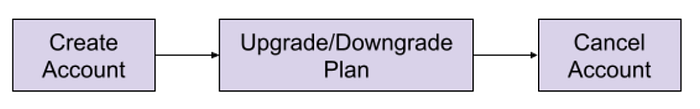
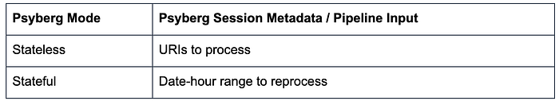
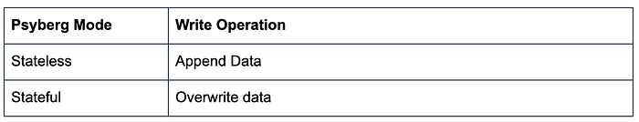
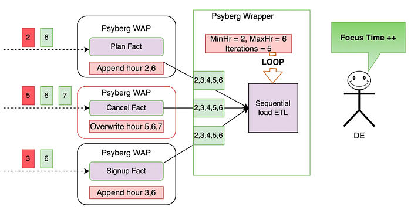

# Psyberg: Automated end to end catch up

By [_Abhinaya Shetty_](https://www.linkedin.com/in/abhinaya-shetty-ab871418/), [_Bharath Mummadisetty_](https://www.linkedin.com/in/bharath-chandra-mummadisetty-27591a88/)

This blog post will cover how Psyberg helps automate the end-to-end catchup of different pipelines, including dimension tables.

In the previous installments of this series, we [introduced Psyberg](https://netflixtechblog.medium.com/f68830617dd1) and delved into its core operational modes: [Stateless and Stateful Data Processing](https://netflixtechblog.medium.com/1d273b3aaefb). Now, let’s explore the state of our pipelines after incorporating Psyberg.

## Pipelines After Psyberg

Let’s explore how different modes of Psyberg could help with a multistep data pipeline. We’ll return to the sample customer lifecycle:

**Processing Requirement**:   
Keep track of the end-of-hour state of accounts, e.g., **Active/Upgraded/Downgraded/Canceled.**

**Solution**:   
One potential approach here would be as follows

1. Create **two stateless** **fact** tables :  
a. Signups  
b. Account Plans
2. Create **one stateful** **fact** table:  
a. Cancels
3. Create a **stateful dimension** that reads the above fact tables every hour and derives the latest account state.

Let’s look at how this can be integrated with Psyberg to auto-handle late-arriving data and corresponding end-to-end data catchup.

## Navigating the Workflow: How Psyberg Handles Late-Arriving Data

We follow a generic workflow structure for both stateful and stateless processing with Psyberg; this helps maintain consistency and makes debugging and understanding these pipelines easier. The following is a concise overview of the various stages involved; for a more detailed exploration of the workflow specifics, please turn to the [second installment](https://netflixtechblog.medium.com/1d273b3aaefb) of this series.

## 1. Psyberg Initialization

The workflow starts with the Psyberg initialization (init) step.

- **Input**: List of source tables and required processing mode
- **Output**: Psyberg identifies new events that have occurred since the last high watermark (HWM) and records them in the session metadata table.

The session metadata table can then be read to determine the pipeline input.

## 2. Write-Audit-Publish (WAP) Process

This is the general pattern we use in our ETL pipelines.

**a. Write  
**Apply the ETL business logic to the input data identified in Step 1 and write to an unpublished iceberg snapshot based on the Psyberg mode

**b**. **Audit  
**Run various quality checks on the staged data. Psyberg’s metadata session table is used to identify the partitions included in a batch run. Several audits, such as verifying source and target counts, are performed on this batch of data.

**c. Publish  
**If the audits are successful, cherry-pick the staging snapshot to publish the data to production.

## 3. Psyberg Commit

Now that the data pipeline has been executed successfully, the new high watermark identified in the initialization step is committed to Psyberg’s high watermark metadata table. This ensures that the next instance of the workflow will pick up newer updates.

## Callouts

- Having the Psyberg step isolated from the core data pipeline allows us to maintain a consistent pattern that can be applied across stateless and stateful processing pipelines with varying requirements.
- This also enables us to update the Psyberg layer without touching the workflows.
- This is compatible with both Python and Scala Spark.
- Debugging/figuring out what was loaded in every run is made easy with the help of workflow parameters and Psyberg Metadata.

## The Setup: Automated end-to-end catchup

Let’s go back to our customer lifecycle example. Once we integrate all four components with Psyberg, here’s how we would set it up for automated catchup.

The three fact tables, comprising the signup and plan facts encapsulated in Psyberg’s stateless mode, along with the cancel fact in stateful mode, serve as inputs for the stateful sequential load ETL pipeline. This data pipeline monitors the various stages in the customer lifecycle.

In the sequential load ETL, we have the following features:

- **Catchup Threshold**: This defines the lookback period for the data being read. For instance, only consider the last 12 hours of data.
- **Data Load Type**: The ETL can either load the missed/new data specifically or reload the entire specified range.
- **Metadata Recording**: Metadata is persisted for traceability.

Here is a **walkthrough** on how this system would automatically catch up in the event of late-arriving data:

**Premise:** All the tables were last loaded up to hour 5, meaning that any data from hour 6 onwards is considered new, and anything before that is classified as late data (as indicated in red above)

**Fact level catchup**:

1. During the Psyberg initialization phase, the signup and plan facts identify the late data from hours 2 and 3, as well as the most recent data from hour 6. The ETL then appends this data to the corresponding partitions within the fact tables.
2. The Psyberg initialization for the cancel fact identifies late data from hour 5 and additional data from hours 6 and 7. Since this ETL operates in stateful mode, the data in the target table from hours 5 to 7 will be overwritten with the new data.
3. By focusing solely on updates and avoiding reprocessing of data based on a fixed lookback window, both Stateless and Stateful Data Processing maintain a minimal change footprint. This approach ensures data processing is both efficient and accurate.

**Dimension level catchup**:

1. The Psyberg wrapper for this stateful ETL looks at the updates to the upstream Psyberg powered fact tables to determine the date-hour range to reprocess. Here’s how it would calculate the above range:  
**MinHr = least(min processing hour from each source table)**  
This ensures that we don’t miss out on any data, including late-arriving data. In this case, the minimum hour to process the data is hour 2.  
**MaxHr = least(max processing hour from each source table)  
**This ensures we do not process partial data, i.e., hours for which data has not been loaded into all source tables. In this case, the maximum hour to process the data is hour 6.
2. The ETL process uses this time range to compute the state in the changed partitions and overwrite them in the target table. This helps overwrite data only when required and minimizes unnecessary reprocessing.

As seen above, by chaining these Psyberg workflows, we could automate the catchup for late-arriving data from hours 2 and 6. The Data Engineer does not need to perform any manual intervention in this case and can thus focus on more important things!

## The Impact: How Psyberg Transformed Our Workflows

The introduction of Psyberg into our workflows has served as a valuable tool in enhancing accuracy and performance. The following are key areas that have seen improvements from using Psyberg:

- **Computational Resources Used:   
**In certain instances, we’ve noticed a significant reduction in resource utilization, with the number of Spark cores used dropping by 90% following the implementation of Psyberg, compared to using fixed lookback windows
- **Workflow and Table Onboarding:   
**We have onboarded 30 tables and 13 workflows into incremental processing since implementing Psyberg
- **Reliability and Accuracy:   
**Since onboarding workflows to Psyberg, we have experienced zero manual catchups or missing data incidents
- **Bootstrap template:   
**The process of integrating new tables into incremental processing has been made more accessible and now requires minimal effort using Psyberg

These performance metrics suggest that adopting Psyberg has been beneficial to the efficiency of our data processing workflows.

## Next Steps and Conclusion

Integrating Psyberg into our operations has improved our data workflows and opened up exciting possibilities for the future. As we continue to innovate, Netflix’s data platform team is focused on creating a comprehensive solution for incremental processing use cases. This platform-level solution is intended to enhance our data processing capabilities across the organization. You can read more about this [here](./incremental-processing-using-netflix-maestro-and-apache-iceberg-b8ba072ddeeb.md)!

In conclusion, Psyberg has proven to be a reliable and effective solution for our data processing needs. As we look to the future, we’re excited about the potential for further advancements in our data platform capabilities.

---
**Tags:** Data · Data Integrity · Automated Catchup · Iceberg · Data Pipeline
