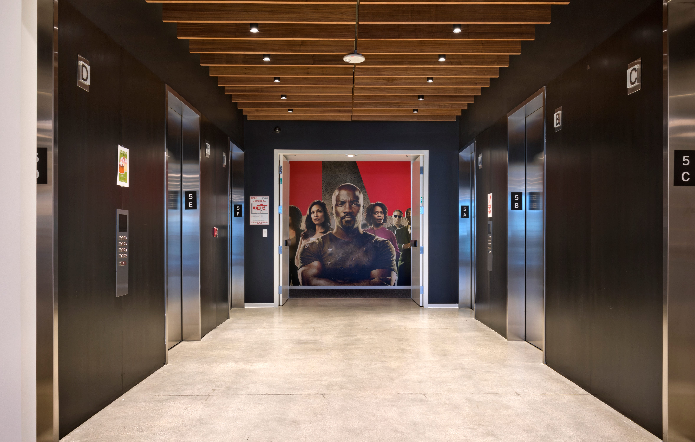

# A Day in the Life of a Content Analytics Engineer

> Part of our series on who works in Analytics at Netflix — and what the role entails

_by _[_Rocio Ruelas_](https://www.linkedin.com/in/rocioruelas/)

Back when we were all working in offices, my favorite days were Monday, Wednesday, and Friday. Those were the days with the best breakfast items on the cafeteria menu! I started the day by arriving at the LA office right before 8am and finding a parking spot close to the entrance. I would greet the familiar faces at the reception desk and take a moment to check out which Netflix Original was currently being projected across the lobby. Take the elevator uninterrupted up to the top floor. Grab myself a plate of scrambled eggs, salsa, and bacon. Pour myself some coffee. Then sit at a small table next to the floor-to-ceiling windows with a clear view of the Hollywood sign.

*My morning journey from lobby to elevators to breakfast (Photo Credit: Netflix)*

During the day, the LA office buzzes with excitement and conversation. My time in the morning is like the calm before the storm — a chance to reflect before my head is full of numbers and figures. I often think about all the things that led me to becoming a Netflix employee. From my family immigrating to the United States from Mexico when I was very young to the teachers and professors that encouraged a low income student like me to dream big. It has been a journey and I’m grateful to be at a place that values the voice I bring to the table.

At the time of posting we’re working from home due to the pandemic, so my days look a bit different: The hot breakfasts are not as consistent and conversations are mainly with my dog. We still find ways to keep connected, but I for one am looking forward to when the office is fully open and I can look out to the Hollywood sign again.

_Ok. But what do I actually do? (Besides eating breakfast)_

## What do I do at Netflix?

I’m a Senior Analytics Engineer on the Content and Marketing Analytics Research team. My team focuses on innovating and maintaining the metrics Netflix uses to understand performance of our shows and films on the service. We partner closely with the [business strategy team](https://jobs.netflix.com/teams/strategy-and-analysis) to provide as much information as we can to our content executives, so that — combined with their industry experience — they can make the best decisions for Netflix.

Being an Analytics Engineer is like being a hybrid of a librarian 📚 and a Swiss army knife 🛠️: Two good things to have on hand when you’re not quite sure what you will need. Like a librarian, I have access to an encyclopedia of knowledge about our content data and have become the resident expert in one of our most important internal metrics. And like a Swiss army knife, I possess a multitude of tools to get the job done — be it SQL, Jupyter Notebooks, Tableau, or Google Sheets.

One of my favorite things about being an Analytics Engineer is the variety. I have some days where I am brainstorming and collaborating with amazing colleagues and other days where I can put my headphones on to work out a tough problem or build a dashboard.

One of my current projects involves understanding how viewing habits have evolved over the past several years. We started out with a small working group where we brainstormed the key questions to address, what data we could use to answer said questions, and came up with a work plan for how the analysis might take shape. Then I put on my headphones and got to work, writing SQL and using Tableau to present the data in a useful way. **We met frequently to discuss our findings and iterate on the analysis.** The great thing about these working groups is that we each contribute different skills and ideas. We benefit from both our individual strengths and our willingness to collaborate — Our [values](https://jobs.netflix.com/culture) of Selflessness and Inclusion, in action.

## How did I become interested in Analytics?

I did not set out from the start to be an Analyst. I never had a 5 year plan and my path has been a winding one.

*Yours truly, featuring part of my extensive Netflix apparel collection*

In college, I majored in Physics because it was “the science that explains all the other sciences”. But what I ended up liking most about it was the math. Between that and the fact that there aren’t many entry-level physics jobs, I pursued a PhD in Applied Mathematics. This turned out to be a wise choice as I avoided entering the workforce right before the 2008 recession.

I loved grad school. The lectures, the research, and most of all the lifelong friendships. But as much as I enjoyed being a student, the academic track wasn’t for me. So without much of a plan I headed back home to California after graduation.

Looking around to see what I could do with my Applied Math background, I quickly settled on Data Science. I wasn’t well versed in it but I knew it was in demand. I started my new data science career as an analyst at a small marketing company. I had an incredible boss who encouraged me to learn new skills on the job. I honed my SQL and Python skills and implemented a clustering model. I also got my first introduction to working for an actual business.

Later on I went to Hulu to grow in the core skills of a data scientist. But while the predictive modeling I was doing was interesting and challenging, I missed being close to the business. As an analyst, I got to attend more meetings with the decision makers and be part of the conversation.

So by the time the opportunity arose to interview for a position at Netflix, I had figured out that Analytics was the best area for me.

> It has been a journey and I’m grateful to be at a place that values the voice I bring to the table.

## Why Netflix?

Growing up I watched a lot of TV. I mean **a lot** of TV. But I never thought I could actually work in the TV and Film business. I feel incredibly fortunate to be working at a job I am passionate about and to be at a company that brings joy to people around the world.

Even though I’d been a loyal Netflix customer since the DVD days, I had not heard about their unique culture until I started interviewing. When I did read the [culture doc](https://jobs.netflix.com/culture) (which I recently learned is also published in Spanish and 12 other languages!), it sounded pretty intimidating. Phrases like “high performance” and “dream team” made me imagine an almost gladiator-style workplace. But I quickly learned this wasn’t the case. Through a combination of my existing network, the interview process, and other online resources about the company, I found that folks are actually very friendly and helpful! Everyone just wants to do their best work and help you do your best work too. Think more _The Great British Baking Show_ and less _Hell’s Kitchen_. Selflessness really is embraced as an important Netflix value.

Having been here for 3 years now, I can say that working at Netflix is really special. The company is always evolving, big decisions are made in a transparent way, and I’m encouraged to voice my thoughts. But the single most important factor is the people. My Content Analytics teammates continuously impress me not only with their quality of work, but also with their kindness and mutual trust. This foundation makes innovating more fun, lets us be open about our passions outside of work, and means we genuinely enjoy each other’s company. That balance is crucial for me and is why this truly is the place where I can do my best work.

---

_If this post resonates with you and you’d like to explore opportunities with Netflix, check out our _[_analytics site_](http://research.netflix.com/research-area/analytics)_, search _[_open roles_](http://jobs.netflix.com/search?team=Data+Science+and+Engineering)_, and learn about our _[_culture_](http://jobs.netflix.com/culture)_. You can also find more stories like this _[_here_](./analytics-at-netflix-who-we-are-and-what-we-do-7d9c08fe6965.md)_._

---
**Tags:** Netflix · Analytics · Data Science · Data Visualization · Data Engineering
