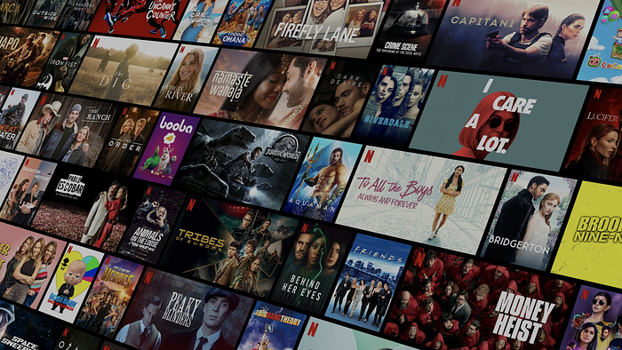
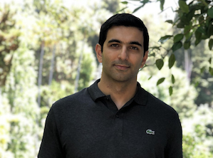

# A Day in the Life of an Experimentation and Causal Inference Scientist @ Netflix

[_Stephanie Lane_](https://www.linkedin.com/in/stephanielane1/)_, _[_Wenjing Zheng_](https://www.linkedin.com/in/wenjing-zheng/)_, _[_Mihir Tendulkar_](https://www.linkedin.com/in/tendulkar/)

*Source credit: Netflix*

Within the rapid expansion of data-related roles in the last decade, the title _Data Scientist_ has emerged as an umbrella term for myriad skills and areas of business focus. What does this title mean within a given company, or even within a given industry? It can be hard to know from the outside. At Netflix, our data scientists span many areas of technical specialization, including experimentation, causal inference, machine learning, NLP, modeling, and optimization. Together with data analytics and data engineering, we comprise the larger, centralized Data Science and Engineering group.

Learning through data is in Netflix’s DNA. Our quasi-experimentation helps us constantly improve our streaming experience, giving our members fewer buffers and ever better video quality. We use A/B tests to introduce new product features, such as our daily Top 10 row that help our members discover their next favorite show. Our experimentation and causal inference focused data scientists help shape business decisions, product innovations, and engineering improvements across our service.

In this post, we discuss a day in the life of experimentation and causal inference data scientists at Netflix, interviewing some of our stunning colleagues along the way. We talked to scientists from areas like Payments & Partnerships, Content & Marketing Analytics Research, Content Valuation, Customer Service, Product Innovation, and Studio Production. You’ll read about their backgrounds, what best prepared them for their current role at Netflix, what they do in their day-to-day, and how Netflix contributes to their growth in their data science journey.

## Who we are

One of the best parts of being a data scientist at Netflix is that there’s no one type of data scientist! We come from many academic backgrounds, including economics, radiotherapy, neuroscience, applied mathematics, political science, and biostatistics. We worked in different industries before joining Netflix, including tech, entertainment, retail, science policy, and research. These diverse and complementary backgrounds enrich the perspectives and technical toolkits that each of us brings to a new business question.

We’ll turn things over to introduce you to a few of our data scientists, and hear how they got here.

### What brought you to the field of data science? Did you always know you wanted to do data science?

*Roxy Du (Product Innovation)*

_[Roxy D.] A combination of interest, passion, and luck! While working on my PhD in political science, I realized my curiosity was always more piqued by methodological coursework, which led me to take as many stats/data science courses as I could. Later I enrolled in a data science program focused on helping academics transition to industry roles._

*Reza Badri (Content Valuation)*

_[Reza B.] A passion for making informed decisions based on data. Working on my PhD, I was using optimization techniques to design radiotherapy fractionation schemes to improve the results of clinical practices. I wanted to learn how to better extract interesting insight from data, which led me to take several courses in statistics and machine learning. After my PhD, I started working as a data scientist at Target, where I built mathematical models to improve real-time pricing recommendation and ad serving engines._

*Gwyn Bleikamp (Payments)*

_[Gwyn B.]: I’ve always loved math and statistics, so after college, I planned to become a statistician. I started working at a local payment processing company after graduation, where I built survival models to calculate lifetime value and experimented with them on our brand new big data stack. I was doing data science without realizing it._

### What best prepared you for your current role at Netflix? Are there any experiences that particularly helped you bring a unique voice/point of view to Netflix?

*David Cameron (Studio Production)*

_[David C.] I learned a lot about sizing up the potential impact of an opportunity (using back of the envelope math), while working as a management consultant after undergrad. This has helped me prioritize my work so that I’m spending most of my time on high-impact projects._

*Aliki Mavromoustaki (Content & Marketing)*

_[Aliki M.] My academic credentials definitely helped on the technical side. Having a background in research also helps with critical thinking and being comfortable with ambiguity. Personally I value my teaching experiences the most, as they allowed me to improve the way I approach and break down problems effectively._

## What we do at Netflix

But what does a day in the life of an experimentation/causal inference data scientist at Netflix actually look like? We work in cross-functional environments, in close collaboration with business, product and creative decision makers, engineers, designers, and consumer insights researchers. Our work provides insights and informs key decisions that improve our product and create more joy for our members. To hear more, we’ll hand you back over to our stunning colleagues.

### Tell us about your business area and the type of stakeholders you partner with on a regular basis. How do you, as a data scientist, fill in the pieces between product, engineering, and design?

_[Roxy D.] I partner with product managers to run AB experiments that drive product innovation. I collaborate with product managers, designers, and engineers throughout the lifecycle of a test, including ideation, implementation, analysis, and decision-making. Recently, we introduced a simple change in kids profiles that helps kids more easily find their rewatched titles. The experiment was conceived based on what we’d heard from members in consumer research, and it was very gratifying to address an underserved member need._

_[David C.] There are several different flavors of data scientist in the Artwork and Video team. My specialties are on the Statistics and Optimization side. A recent favorite project was to determine the optimal number of images to create for titles. This was a fun project for me, because it combined optimization, statistics, understanding of reinforcement learning _[_bandit_](https://en.wikipedia.org/wiki/Multi-armed_bandit)_ algorithms, as well as general business sense, and it has far-reaching implications to the business._

### What are your responsibilities as the data scientist in these projects? What technical skills do you draw on most?

_[Gwyn B.] _**_Data scientists can take on any aspect of an experimentation project. Some responsibilities I routinely have are: designing tests, metrics development and defining what success looks like, building data pipelines and visualization tools for custom metrics, analyzing results, and communicating final recommendations with broad teams. Coding with statistical software and SQL are my most widely used technical skills._**

_[David C.] One of the most important responsibilities I have is doing the exploratory data analysis of the counterfactual data produced by our bandit algorithms. These analyses have helped our stakeholders identify major opportunities, bugs and tighten up engineering pipelines. One of the most common analyses that I do is a look-back analysis on the explore-data. This data helps us analyze natural experiments and understand which type of images better introduce our content to our members._

*Wenjing Zheng (Partnerships)*

*Stephanie Lane (Partnerships)*

_[Stephanie L. & Wenjing Z.] As data scientists in Partnerships, we work closely with our business development, partner marketing, and partner engagement teams to create the best possible experience of Netflix on every device. Our analyses help inform ways to improve certain product features (e.g., a Netflix row on your Smart TV) and consumer offers (e.g., getting Netflix as part of a bundled package), to provide the best experiences and value for our customers. But randomized, controlled experiments are not always feasible. We draw on technical expertise in varied forms of causal inference — interrupted time series designs, inverse probability weighting, and causal machine learning — to identify promising natural experiments, design quasi-experiments, and deliver insights. Not only do we own all steps of the analysis and communicate findings within Netflix, we often participate in discussions with external partners on how best to improve the product. Here, we draw on strong business context and communication to be most effective in our roles._

### What non-technical skills do you draw on most?

_[Aliki M.] Being able to adapt my communication style to work well with both technical and non-technical audiences. Building strong relationships with partners and working effectively in a team._

_[Gwyn B.] Written communication is among the topmost valuable non-technical assets. Netflix is a memo-based culture, which means we spend a lot of time reading and writing. This is a primary way we share results and recommendations as well as solicit feedback on project ideas. Data Scientists need to be able to translate statistical analyses, test results, and significance into recommendations that the team can understand and action on._

### How is working at Netflix different from where you’ve worked before?

_[Reza B.] The Netflix culture makes it possible for me to continuously grow both technically and personally. Here, I have the opportunity to take risks and work on problems that I find interesting and impactful. Netflix is a great place for curious researchers that want to be challenged everyday by working on interesting problems. The tooling here is amazing, which made it easy for me to make my models available at scale across the company._

*Mihir Tendulkar (Payments)*

_[Mihir T.] Each company has their own spin on data scientist responsibilities. At my previous company, we owned everything end-to-end: data discovery, cleanup, ETL, analysis, and modeling. By contrast, Netflix puts data infrastructure and quality control under the purview of specialized platform teams, so that I can focus on supporting my product stakeholders and improving experimentation methodologies. My wish-list projects are becoming a reality here: studying experiment interaction effects, quantifying the time savings of Bayesian inference, and advocating for Mindhunter Season 3._

_[Stephanie L.] In my last role, I worked at a research think tank in the D.C. area, where I focused on experimentation and causal inference in national defense and science policy. What sets Netflix apart (other than the domain shift!) is the context-rich culture and broad dissemination of information. New initiatives and strategy bets are captured in memos for anyone in the company to read and engage in discourse. This context-rich culture enables me to rapidly absorb new business context and ultimately be a better thought partner to my stakeholders._

Data scientists at Netflix wear many hats. We work closely with business and creative stakeholders at the ideation stage to identify opportunities, formulate research questions, define success, and design studies. We partner with engineers to implement and debug experiments. We own all aspects of the analysis of a study (with help from our stellar data engineering and experimentation platform teams) and broadly communicate the results of our work. In addition to company-wide memos, we often bring our analytics point of view to lively cross-functional debates on roll-out decisions and product strategy. These responsibilities call for technical skills in statistics and machine learning, and programming knowledge in statistical software (R or Python) and SQL. But to be truly effective in our work, we also rely on non-technical skills like communication and collaborating in an interdisciplinary team.

You’ve now heard how our data scientists got here and what drives them to be successful at Netflix. But the tools of data science, as well as the data needs of a company, are constantly evolving. Before we wrap up, we’ll hand things over to our panel one more time to hear how they plan to continue growing in their data science journey at Netflix.

### How are you looking to develop as a data scientist in the near future, and how does Netflix help you on that path?

_[Reza B.] As a researcher, I like to continue growing both technically and non-technically; to keep learning, being challenged and work on impactful problems. Netflix gives me the opportunity to work on a variety of interesting problems, learn cutting-edge skills and be impactful. I am passionate about improving decision making through data, and Netflix gives me that opportunity. Netflix culture helps me receive feedback on my non-technical and technical skills continuously, providing helpful context for me to grow and be a better scientist._

_[Aliki M.] True to our Netflix values, I am very curious and want to continue to learn, strengthen and expand my skill set. Netflix exposes me to interesting questions that require critical thinking from design to execution. I am surrounded by passionate individuals who inspire me and help me be better through their constructive feedback. Finally, my manager is highly aligned with me regarding my professional goals and looks for opportunities that fit my interests and passions._

_[Roxy D.] I look forward to continuously growing on both the technical and non-technical sides. Netflix has been my first experience outside academia, and I have enjoyed learning about the impact and contribution of data science in a business environment. I appreciate that Netflix’s culture allows me to gain insights into various aspects of the business, providing helpful context for me to work more efficiently, and potentially with a larger impact._

As data scientists, we are continuously looking to add to our technical toolkit and to cultivate non-technical skills that drive more impact in our work. Working alongside stunning colleagues from diverse technical and business areas means that we are constantly learning from each other. Strong demand for data science across all business areas of Netflix affords us the ability to collaborate in new problem areas and develop new skills, and our leaders help us identify these opportunities to further our individual growth goals. The constructive feedback culture in Netflix is also key in accelerating our growth. Not only does it help us see blind spots and identify areas of improvement, it also creates a supportive environment where we help each other grow.

## Learning more

Interested in learning more about data roles at Netflix? You’re in the right place! Check out our post on [Analytics at Netflix](./analytics-at-netflix-who-we-are-and-what-we-do-7d9c08fe6965.md) to find out more about two other data roles at Netflix — Analytics Engineers and Data Visualization Engineers — who also drive business impact through data. You can search our open roles in Data Science and Engineering [here](https://jobs.netflix.com/search?team=Data+Science+and+Engineering). Our culture is key to our impact and growth: read about it [here](https://jobs.netflix.com/culture).

---
**Tags:** Experimentation · Causal Inference · Ab Testing · Data Science
