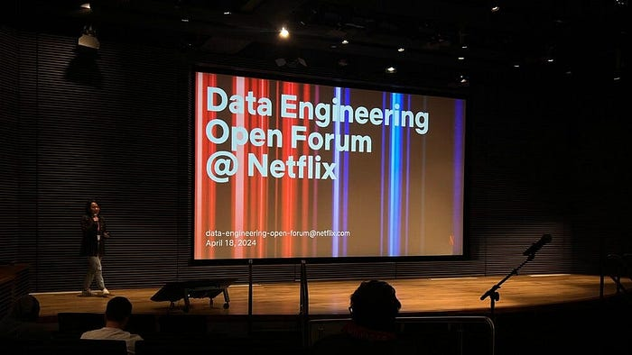
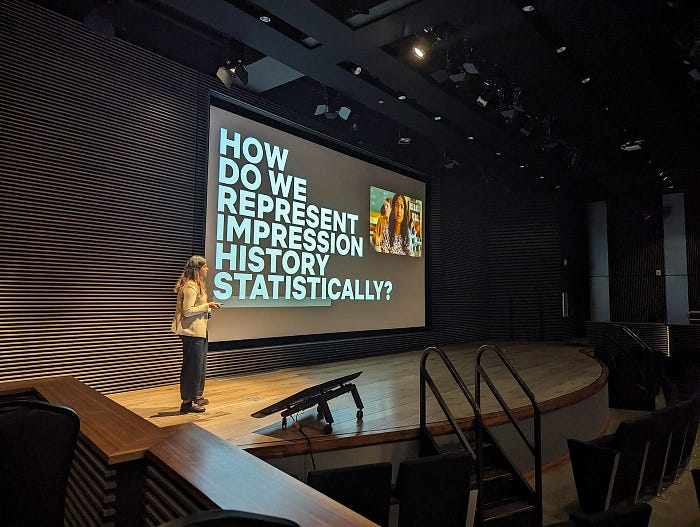
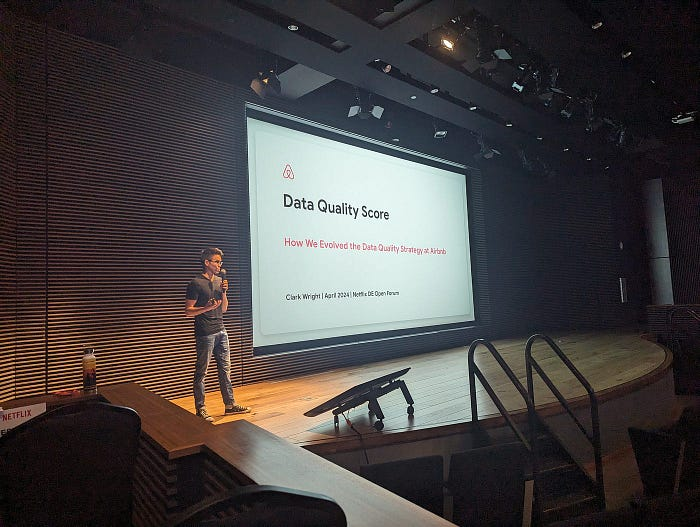

# A Recap of the Data Engineering Open Forum at Netflix

> A summary of sessions at the first Data Engineering Open Forum at Netflix on April 18th, 2024

*The Data Engineering Open Forum at Netflix on April 18th, 2024.*

At Netflix, we aspire to entertain the world, and our data engineering teams play a crucial role in this mission by enabling data-driven decision-making at scale. Netflix is not the only place where data engineers are solving challenging problems with creative solutions. On April 18th, 2024, we hosted the inaugural Data Engineering Open Forum at our Los Gatos office, bringing together data engineers from various industries to share, learn, and connect.

At the conference, our speakers share their unique perspectives on modern developments, immediate challenges, and future prospects of data engineering. We are excited to share the recordings of talks from the conference with the rest of the world.

---

### Opening Remarks

[**Recording**](https://youtu.be/9NnnYHuH8GQ?si=nYBpQPhGwxX-oo1l)

**Speaker**: [Max Schmeiser](https://www.linkedin.com/in/max-schmeiser/) (Vice President of Studio and Content Data Science & Engineering)

**Summary**: Max Schmeiser extends a warm welcome to all attendees, marking the beginning of our inaugural Data Engineering Open Forum.

---

### Evolving from Rule-based Classifier: Machine Learning Powered Auto Remediation in Netflix Data Platform

[**Recording**](https://youtu.be/0j6b9V9tmKA?si=fMEuLmrIK5ATi52d)

**Speakers:**

- [Stephanie Vezich Tamayo](https://www.linkedin.com/in/stephanievezich/) (Senior Machine Learning Engineer at Netflix)
- [Binbing Hou](https://www.linkedin.com/in/binbing-hou/) (Senior Software Engineer at Netflix)

**Summary**: At Netflix, hundreds of thousands of workflows and millions of jobs are running every day on our big data platform, but diagnosing and remediating job failures can impose considerable operational burdens. To handle errors efficiently, Netflix developed a rule-based classifier for error classification called “Pensive.” However, as the system has increased in scale and complexity, Pensive has been facing challenges due to its limited support for operational automation, especially for handling memory configuration errors and unclassified errors. To address these challenges, we have developed a new feature called “Auto Remediation,” which integrates the rules-based classifier with an ML service.

---

### Automating the Data Architect: Generative AI for Enterprise Data Modeling

[**Recording**](https://youtu.be/DtzIIVJq8wA?si=i5fLXA7G8IMyiF0u)

**Speaker**: [Jide Ogunjobi](https://www.linkedin.com/in/jide-o-87602512/) (Founder & CTO at Context Data)

**Summary**: As organizations accumulate ever-larger stores of data across disparate systems, efficiently querying and gaining insights from enterprise data remain ongoing challenges. To address this, we propose developing an intelligent agent that can automatically discover, map, and query all data within an enterprise. This “Enterprise Data Model/Architect Agent” employs generative AI techniques for autonomous enterprise data modeling and architecture.

---

*Tulika Bhatt, Senior Data Engineer at Netflix, shared how her team manages impression data at scale.*

### Real-Time Delivery of Impressions at Scale

[**Recording**](https://youtu.be/ARTHgxoJmCE?si=MDx1Qa8W7nNxkA_m)

**Speaker:** [Tulika Bhatt](https://www.linkedin.com/in/tulikabhatt/) (Senior Data Engineer at Netflix)

**Summary**: Netflix generates approximately 18 billion impressions daily. These impressions significantly influence a viewer’s browsing experience, as they are essential for powering video ranker algorithms and computing adaptive pages, With the evolution of user interfaces to be more responsive to in-session interactions, coupled with the growing demand for real-time adaptive recommendations, it has become highly imperative that these impressions are provided on a near real-time basis. This talk will delve into the creative solutions Netflix deploys to manage this high-volume, real-time data requirement while balancing scalability and cost.

---

### Reflections on Building a Data Platform From the Ground Up in a Post-GDPR World

[**Recording**](https://youtu.be/WdSsneeI6RE?si=-gpe4DprVQKoZt_V)

**Speaker**: [Jessica Larson](https://www.linkedin.com/in/jessmlarson/) (Data Engineer & Author of “Snowflake Access Control”)

**Summary**: The requirements for creating a new data warehouse in the post-GDPR world are significantly different from those of the pre-GDPR world, such as the need to prioritize sensitive data protection and regulatory compliance over performance and cost. In this talk, Jessica Larson shares her takeaways from building a new data platform post-GDPR.

---

### Unbundling the Data Warehouse: The Case for Independent Storage

[**Recording**](https://youtu.be/CmEIJ-lagVU?si=Z4VcYL_FBV4bIGJW)

**Speaker**: [Jason Reid](https://www.linkedin.com/in/jasonreid/) (Co-founder & Head of Product at Tabular)

**Summary**: Unbundling a data warehouse means splitting it into constituent and modular components that interact via open standard interfaces. In this talk, Jason Reid discusses the pros and cons of both data warehouse bundling and unbundling in terms of performance, governance, and flexibility, and he examines how the trend of data warehouse unbundling will impact the data engineering landscape in the next 5 years.

---

*Clark Wright, Staff Analytics Engineer at Airbnb, talked about the concept of Data Quality Score at Airbnb.*

### Data Quality Score: How We Evolved the Data Quality Strategy at Airbnb

[**Recording**](https://youtu.be/Lv-bFDSzrqw?si=SBdnoFcOHjqe34Ve)

**Speaker**: [Clark Wright](https://www.linkedin.com/in/clark-wright/) (Staff Analytics Engineer at Airbnb)

**Summary**: Recently, Airbnb published a post to their Tech Blog called [Data Quality Score: The next chapter of data quality at Airbnb](https://medium.com/airbnb-engineering/data-quality-score-the-next-chapter-of-data-quality-at-airbnb-851dccda19c3). In this talk, Clark Wright shares the narrative of how data practitioners at Airbnb recognized the need for higher-quality data and then proposed, conceptualized, and launched Airbnb’s first Data Quality Score.

---

### Data Productivity at Scale

[**Recording**](https://youtu.be/KP5ml1tOfbY?si=hmyBjQRx422zUg-k)

**Speaker**: [Iaroslav Zeigerman](https://www.linkedin.com/in/izeigerman/) (Co-Founder and Chief Architect at Tobiko Data)

**Summary**: The development and evolution of data pipelines are hindered by outdated tooling compared to software development. Creating new development environments is cumbersome: Populating them with data is compute-intensive, and the deployment process is error-prone, leading to higher costs, slower iteration, and unreliable data. SQLMesh, an open-source project born from our collective experience at companies like Airbnb, Apple, Google, and Netflix, is designed to handle the complexities of evolving data pipelines at an internet scale. In this talk, Iaroslav Zeigerman discusses challenges faced by data practitioners today and how core SQLMesh concepts solve them.

---

Last but not least, thank you to the organizers of the Data Engineering Open Forum: [Chris Colburn](https://www.linkedin.com/in/chris-colburn/), [Xinran Waibel](https://www.linkedin.com/in/xinranwaibel/), [Jai Balani](https://www.linkedin.com/in/jaibalani/), [Rashmi Shamprasad](https://www.linkedin.com/in/rashmi-shamprasad-51630b19/), and [Patricia Ho](https://www.linkedin.com/in/patriciapho/).

Until next time!

> If you are interested in attending a future Data Engineering Open Forum, we highly recommend you join our [Google Group](https://groups.google.com/g/data-engineering-open-forum) to stay tuned to event announcements.

---
**Tags:** Data Engineering · Software Engineering · Data Science · Technology · Data
