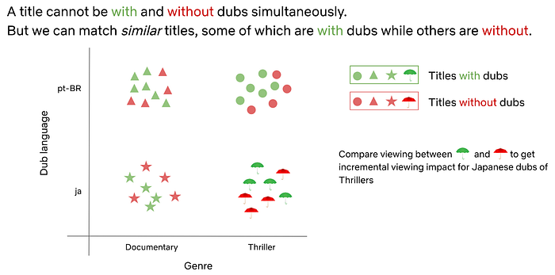
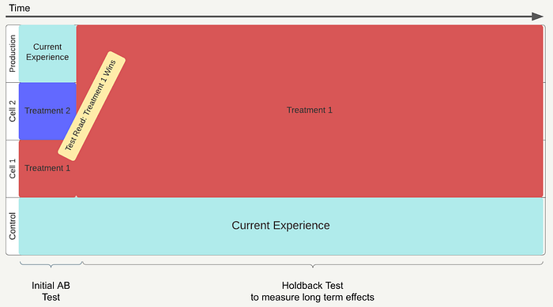
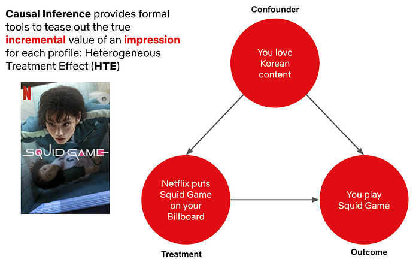
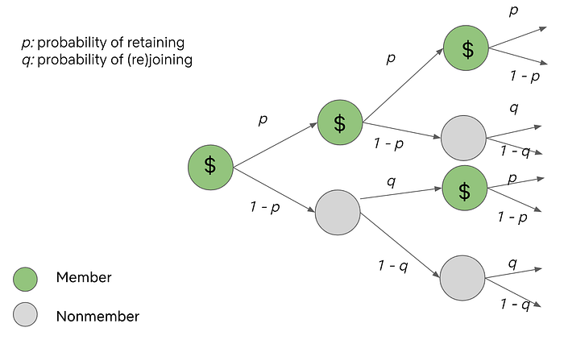

# A Survey of Causal Inference Applications at Netflix

At Netflix, we want to entertain the world through creating engaging content and helping members discover the titles they will love. Key to that is understanding causal effects that connect changes we make in the product to indicators of member joy.

To measure causal effects we rely heavily on [AB testing](./decision-making-at-netflix-33065fa06481.md), but we also leverage [quasi-experimentation](https://netflixtechblog.com/quasi-experimentation-at-netflix-566b57d2e362) in cases where AB testing is limited. Many scientists across Netflix have contributed to the way that Netflix analyzes these causal effects.

To celebrate that impact and learn from each other, Netflix scientists recently came together for an internal Causal Inference and Experimentation Summit. The weeklong conference brought speakers from across the content, product, and member experience teams to learn about methodological developments and applications in estimating causal effects. We covered a wide range of topics including difference-in-difference estimation, double machine learning, Bayesian AB testing, and causal inference in recommender systems among many others.

We are excited to share a sneak peek of the event with you in this blog post through selected examples of the talks, giving a behind the scenes look at our community and the breadth of causal inference at Netflix. We look forward to connecting with you through a future external event and additional blog posts!

---

### Incremental Impact of Localization

[Yinghong Lan](https://www.linkedin.com/in/yinghong-lan-2368656b), [Vinod Bakthavachalam](https://www.linkedin.com/in/vinod-bakthavachalam), [Lavanya Sharan](https://www.linkedin.com/in/lavanyasharan), [Marie Douriez](https://www.linkedin.com/in/mariedouriez/en), [Bahar Azarnoush](https://www.linkedin.com/in/bahareh-azarnoush), [Mason Kroll](https://www.linkedin.com/in/mason-kroll-19244946)

At Netflix, we are passionate about connecting our members with great stories that can come from anywhere, and be [loved everywhere](https://about.netflix.com/en/news/the-hottest-travel-destinations-have-been-one-story-away). In fact, we stream in more than 30 languages and 190 countries and strive to localize the content, through subtitles and dubs, that our members will enjoy the most. Understanding the heterogenous incremental value of localization to member viewing is key to these efforts!

In order to estimate the incremental value of localization, we turned to causal inference methods using historical data. Running large scale, randomized experiments has both technical and operational challenges, especially because we want to avoid withholding localization from members who might need it to access the content they love.

*Conceptual overview of using double machine learning to control for confounders and compare similar titles to estimate incremental impact of localization*

We analyzed the data across various languages and applied double machine learning methods to properly control for measured confounders. We not only studied the impact of localization on overall title viewing but also investigated how localization adds value at different parts of the member journey. As a robustness check, we explored various simulations to evaluate the consistency and variance of our incrementality estimates. These insights have played a key role in our decisions to scale localization and delight our members around the world.

A related application of causal inference methods to localization arose when some dubs were delayed due to pandemic-related shutdowns of production studios. To understand the impact of these dub delays on title viewing, we simulated viewing in the absence of delays using the method of synthetic control. We compared simulated viewing to observed viewing at title launch (when dubs were missing) and after title launch (when dubs were added back).

To control for confounders, we used a placebo test to repeat the analysis for titles that were not affected by dub delays. In this way, we were able to estimate the incremental impact of delayed dub availability on member viewing for impacted titles. Should there be another shutdown of dub productions, this analysis enables our teams to make informed decisions about delays with greater confidence.

### Holdback Experiments for Product Innovation

[Travis Brooks](https://www.linkedin.com/in/traviscb1998), [Cassiano Coria](https://www.linkedin.com/in/cassianocoria), [Greg Nettles](https://www.linkedin.com/in/nettlesgreg), [Molly Jackman](https://www.linkedin.com/in/molly-jackman-1a757644), [Claire Lackner](https://www.linkedin.com/in/clairelackner)

At Netflix, there are many examples of holdback AB tests, which show some users an experience without a specific feature. They have substantially improved the member experience by measuring long term effects of new features or re-examining old assumptions. However, when the topic of holdback tests is raised, it can seem too complicated in terms of experimental design and/or engineering costs.

We aimed to share best practices we have learned about holdback test design and execution in order to create more clarity around holdback tests at Netflix, so they can be used more broadly across product innovation teams by:

1. Defining the types of holdbacks and their use cases with past examples
2. Suggesting future opportunities where holdback testing may be valuable
3. Enumerating the challenges that holdback tests pose
4. Identifying future investments that can reduce the cost of deploying and maintaining holdback tests for product and engineering teams

Holdback tests have clear value in many product areas to confirm learnings, understand long term effects, retest old assumptions on newer members, and measure cumulative value. They can also serve as a way to test simplifying the product by removing unused features, creating a more seamless user experience. In many areas at Netflix they are already commonly used for these purposes.

*Overview of how holdback tests work where we keep the current experience for a subset of members over the long term in order to gain valuable insights for improving the product*

We believe by unifying best practices and providing simpler tools, we can accelerate our learnings and create the best product experience for our members to access the content they love.

### Causal Ranker: A Causal Adaptation Framework for Recommendation Models

[Jeong-Yoon Lee](https://www.linkedin.com/in/jeongyoonlee), [Sudeep Das](https://www.linkedin.com/in/datamusing)

Most machine learning algorithms used in personalization and search, including deep learning algorithms, are purely associative. They learn from the correlations between features and outcomes how to best predict a target.

In many scenarios, going beyond the purely associative nature to understanding the causal mechanism between taking a certain action and the resulting incremental outcome becomes key to decision making. Causal inference gives us a principled way of learning such relationships, and when coupled with machine learning, becomes a powerful tool that can be leveraged at scale.

*Compared to machine learning, causal inference allows us to build a robust framework that controls for confounders in order to estimate the true incremental impact to members*

At Netflix, many surfaces today are powered by recommendation models like the personalized rows you see on your homepage. We believe that many of these surfaces can benefit from additional algorithms that focus on making each recommendation as useful to our members as possible, beyond just identifying the title or feature someone is most likely to engage with. Adding this new model on top of existing systems can help improve recommendations to those that are right in the moment, helping find the exact title members are looking to stream now.

This led us to create a framework that applies a light, causal adaptive layer on top of the base recommendation system called the Causal Ranker Framework. **The framework consists of several components: impression (treatment) to play (outcome) attribution, true negative label collection, causal estimation, offline evaluation, and model serving.**

We are building this framework in a generic way with reusable components so that any interested team within Netflix can adopt this framework for their use case, improving our recommendations throughout the product.

### Bellmania: Incremental Account Lifetime Valuation at Netflix and its Applications

[Reza Badri](https://www.linkedin.com/in/hamidreza-badri-97840347), [Allen Tran](https://www.linkedin.com/in/realallentran)

Understanding the value of acquiring or retaining subscribers is crucial for any subscription business like Netflix. While customer lifetime value (LTV) is commonly used to value members, simple measures of LTV likely overstate the true value of acquisition or retention because there is always a chance that potential members may join in the future on their own without any intervention.

We establish a methodology and necessary assumptions to estimate the monetary value of acquiring or retaining subscribers based on a causal interpretation of incremental LTV. This requires us to estimate both on Netflix and off Netflix LTV.

To overcome the lack of data for off Netflix members, we use an approach based on Markov chains that recovers off Netflix LTV from minimal data on non-subscriber transitions between being a subscriber and canceling over time.

*Through Markov chains we can estimate the incremental value of a member and non member that appropriately captures the value of potential joins in the future*

Furthermore, we demonstrate how this methodology can be used to (1) forecast aggregate subscriber numbers that respect both addressable market constraints and account-level dynamics, (2) estimate the impact of price changes on revenue and subscription growth, and (3) provide optimal policies, such as price discounting, that maximize expected lifetime revenue of members.

---

Measuring causality is a large part of the [data science culture](./netflix-a-culture-of-learning-394bc7d0f94c.md) at Netflix, and we are proud to have so many stunning colleagues leverage both experimentation and quasi-experimentation to drive member impact. The conference was a great way to celebrate each other’s work and highlight the ways in which causal methodology can create value for the business.

We look forward to sharing more about our work with the community in upcoming posts. To stay up to date on our work, follow the [Netflix Tech Blog](https://netflixtechblog.com/), and if you are interested in joining us, we are currently looking for [new stunning colleagues](https://jobs.netflix.com/search?q=data+science&team=Data+Science+and+Engineering) to help us entertain the world!

---
**Tags:** Data Science · Machine Learning · Causal Inference · Netflix · Technology
