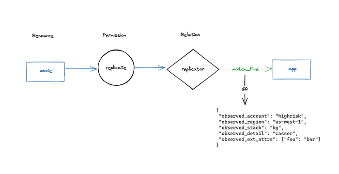

# ABAC on SpiceDB: Enabling Netflix’s Complex Identity Types

By [Chris Wolfe](https://www.linkedin.com/in/chris-w-0a884022/), [Joey Schorr](https://www.linkedin.com/in/joseph-s-4324904/), and [Victor Roldán Betancort](https://www.linkedin.com/in/vroldanbet/)

## Introduction

The authorization team at Netflix recently sponsored work to add Attribute Based Access Control (ABAC) support to AuthZed’s [open source Google Zanzibar inspired](https://github.com/authzed/spicedb) authorization system, [SpiceDB](https://authzed.com/products/spicedb). Netflix required attribute support in SpiceDB to support core Netflix application identity constructs. This post discusses why Netflix wanted ABAC support in SpiceDB, how Netflix collaborated with AuthZed, the end result–[SpiceDB Caveats](https://authzed.com/docs/reference/caveats), and how Netflix may leverage this new feature.

Netflix is always looking for security, ergonomic, or efficiency improvements, and this extends to authorization tools. [Google Zanzibar](https://authzed.com/blog/what-is-google-zanzibar) is exciting to Netflix as it makes it easier to produce authorization decision objects and reverse indexes for resources a principal can access.

Last year, while experimenting with Zanzibar approaches to authorization, Netflix found SpiceDB, the [open source Google Zanzibar inspired permission system](https://github.com/authzed/spicedb), and built a prototype to experiment with modeling. The prototype uncovered trade-offs required to implement Attribute Based Access Control in SpiceDB, which made it poorly suited to Netflix’s core requirements for application identities.

## Why did Netflix Want Caveated Relationships?

Netflix application identities are fundamentally attribute based: e.g. an instance of the Data Processor runs in eu-west-1 in the test environment with a public shard.

Authorizing these identities is done not only by application name, but by specifying specific attributes on which to match. An application owner might want to craft a policy like “Application members of the EU data processors group can access a PI decryption key”. This is one normal relationship in SpiceDB. But, they might also want to specify a policy for compliance reasons that only allows access to the PI key from data processor instances running in the EU within a sensitive shard. Put another way, an identity should only be considered to have the “is member of the `EU-data-processors `group” if certain identity attributes (like region==eu) match in addition to the application name. This is a Caveated SpiceDB relationship.

## Netflix Modeling Challenges Before Caveats

SpiceDB, being a Relationship Based Access Control (ReBAC) system, expected authorization checks to be performed against the existence of a specific relationship between objects. Users fit this model — they have a single user ID to describe who they are. As described above, Netflix applications do not fit this model. Their attributes are used to scope permissions to varying degrees.

Netflix ran into significant difficulties in trying to fit their existing policy model into relations. To do so Netflix’s design required:

- An event based mechanism that could ingest information about application autoscaling groups. An autoscaling group isn’t the lowest level of granularity, but it’s relatively close to the lowest level where we’d typically see authorization policy applied.
- Ingest the attributes describing the autoscaling group and write them as separate relations. That is for the data-processor, Netflix would need to write relations describing the region, environment, account, application name, etc.
- At authZ check time, provide the attributes for the identity to check, e.g. “can app bar in us-west-2 access this document.” SpiceDB is then responsible for figuring out which relations map back to the autoscaling group, e.g. name, environment, region, etc.
- A cleanup process to prune stale relationships from the database.

What was problematic about this design? Aside from being complicated, there were a few specific things that made Netflix uncomfortable. The most salient being that i**t wasn’t resilient to an absence of relationship data, e.g. if a new autoscaling group started and reporting its presence to SpiceDB had not yet happened, the autoscaling group members would be missing necessary permissions to run**. All this meant that Netflix would have to write and prune the relationship state with significant freshness requirements. This would be a significant departure from its existing policy based system.

While working through this, Netflix hopped into the SpiceDB Discord to chat about possible solutions and found an open community issue: the [caveated relationships proposal](https://github.com/authzed/spicedb/issues/386).

## The Beginning of SpiceDB Caveats

The SpiceDB community had already explored [integrating SpiceDB with Open Policy Agent (OPA)](https://github.com/authzed/spicedb/issues/158) and concluded it strayed too far from Zanzibar’s core promise of global horizontal scalability with strong consistency. With Netflix’s support, the AuthZed team pondered a Zanzibar-native approach to Attribute-Based Access Control.

The requirements were captured and published as the [caveated relationships proposal on GitHub](https://github.com/authzed/spicedb/issues/386) for feedback from the SpiceDB community. The community’s excitement and interest became apparent through comments, reactions, and conversations on the [SpiceDB Discord server](https://authzed.com/discord). Clearly, Netflix wasn’t the only one facing challenges when reconciling SpiceDB with policy-based approaches, so Netflix decided to help! By sponsoring the project, Netflix was able to help AuthZed prioritize engineering effort and accelerate adding Caveats to SpiceDB.

## Building SpiceDB Caveats

### Quick Intro to SpiceDB

The [SpiceDB Schema Language](https://authzed.com/docs/reference/schema-lang) lays the rules for how to build, traverse, and interpret SpiceDB’s Relationship Graph to make authorization decisions. SpiceDB Relationships, e.g., `document:readme writer user:emilia`, are stored as relationships that represent a graph within a datastore like CockroachDB or PostgreSQL. SpiceDB walks the graph and decomposes it into subproblems. These subproblems are assigned through [consistent hashing](https://authzed.com/blog/consistent-hash-load-balancing-grpc/) and dispatched to a node in a cluster running SpiceDB. Over time, each node caches a subset of subproblems to support a distributed cache, reduce the datastore load, and achieve SpiceDB’s horizontal scalability.

### SpiceDB Caveats Design

The fundamental challenge with policies is that their input arguments can change the authorization result as understood by a centralized relationships datastore. If SpiceDB were to cache subproblems that have been “tainted” with policy variables, the likelihood those are reused for other requests would decrease and thus severely affect the cache hit rate. As you’d suspect, this would jeopardize one of the pillars of the system: its ability to scale.

Once you accept that adding input arguments to the distributed cache isn’t efficient, you naturally gravitate toward the first question: what if you keep those inputs out of the cached subproblems? They are only known at request-time, so let’s add them as a variable in the subproblem! The cost of propagating those variables, assembling them, and executing the logic pales compared to fetching relationships from the datastore.

The next question was: how do you integrate the policy decisions into the relationships graph? The SpiceDB Schema Languages’ core concepts are [Relations](https://authzed.com/docs/reference/glossary#relation) and [Permissions](https://authzed.com/docs/reference/glossary#permission); these are how a developer defines the shape of their relationships and how to traverse them. Naturally, being a graph, it’s fitting to add policy logic at the edges or the nodes. That leaves at least two obvious options: **policy at the Relation level, or policy at the Permission level.**

After iterating on both options to get a feel for the ergonomics and expressiveness the choice was **policy at the relation level**. After all, SpiceDB is a Relationship Based Access Control (ReBAC) system. Policy at the relation level allows you to parameterize each relationship, which brought about the saying “this relationship exists, but with a Caveat!.” With this approach, SpiceDB could do request-time relationship vetoing like so:

```
definition human {}

caveat the_answer(received int) {
  received == 42
}
definition the_answer_to_life_the_universe_and_everything {
  relation humans: human with the_answer
  permission enlightenment = humans
```

Netflix and AuthZed discussed the concept of static versus dynamic Caveats as well. A developer would define static Caveat expressions in the SpiceDB Schema, while dynamic Caveats would have expressions defined at run time. The discussion centered around typed versus dynamic programming languages, but given SpiceDB’s Schema Language was designed for type safety, it seemed coherent with the overall design to continue with static Caveats. To support runtime-provided policies, the choice was to introduce expressions as arguments to a Caveat. Keeping the SpiceDB Schema easy to understand was a key driver for this decision.

For defining Caveats, the main requirement was to provide an expression language with first-class support for partially-evaluated expressions. [Google’s CEL](https://github.com/google/cel-spec) seemed like the obvious choice: a protobuf-native expression language that evaluates in linear time, with first-class support for partial results that can be run at the edge, and is not turing complete. CEL expressions are type-safe, so they wouldn’t cause as many errors at runtime and can be stored in the datastore as a compiled protobuf. Given the near-perfect requirement match, it does make you wonder what Google’s Zanzibar has been up to since the white paper!

To execute the logic, SpiceDB would have to return a third response `CAVEATED`, in addition to `ALLOW` and `DENY`, to signal that a result of a CheckPermission request depends on computing an unresolved chain of CEL expressions.

SpiceDB Caveats needed to allow static input variables to be stored before evaluation to represent the multi-dimensional nature of Netflix application identities. Today, this is called “Caveat context,” defined by the values written in a SpiceDB Schema alongside a Relation and those provided by the client. Think of build time variables as an expansion of a templated CEL expression, and those take precedence over request-time arguments. Here is an example:

```
caveat the_answer(received int, expected int) {
  received == expected
}
```

Lastly, to deal with scenarios where there are multiple Caveated subproblems, the decision was to collect up a final CEL expression tree before evaluating it. The result of the final evaluation can be `ALLOW`, `DENY`, or `CAVEATED`. Things get trickier with wildcards and SpiceDB APIs, but let’s save that for another post! If the response is `CAVEATED`, the client receives a list of missing variables needed to properly evaluate the expression.

To sum up! The primary design decisions were:

- Caveats defined at the Relation-level, not the Permission-level
- Keep Caveats in line with SpiceDB Schema’s type-safe nature
- Support well-typed values provided by the caller
- Use Google’s CEL to define Caveat expressions
- Introduce a new result type: `CAVEATED`

## How do SpiceDB Caveats Change Authorizing Netflix Identities?

[SpiceDB Caveats](https://authzed.com/docs/reference/caveats) simplify this approach by allowing Netflix to specify authorization policy as they have in the past for applications. Instead of needing to have the entire state of the authorization world persisted as relations, the system can have relations and attributes of the identity used at authorization check time.

Now Netflix can write a Caveat similar to `match_fine` , described below, that takes lists of expected attributes, e.g. region, account, etc. This Caveat would allow the specific application named by the relation as long as the context of the authorization check had an observed account, stack, detail, region, and extended attribute values that matched the values in their expected counterparts. This [playground](https://play.authzed.com/s/51q8FOZ1PlzG/assertions) has a live version of the schema, relations, etc. with which to experiment.


*A movie resource with the replicate permission and a relation using the match_fine caveat*

```
definition app {}

caveat match_fine(
  expected_accounts list<string>,
  expected_regions list<string>,
  expected_stacks list<string>,
  expected_details list<string>,
  expected_ext_attrs map<any>,
  observed_account string,
  observed_region string,
  observed_stack string,
  observed_detail string,
  observed_ext_attrs map<any>
) {
  observed_account in expected_accounts &&
  observed_region in expected_regions &&
  observed_stack in expected_stacks &&
  observed_detail in expected_details &&
  expected_ext_attrs.isSubtreeOf(observed_ext_attrs)
}

definition movie {
  relation replicator: app with match_fine
  permission replicate = replicator
}
```

Using this SpiceDB Schema we can write a relation to restrict access to the replicator application. It should only be allowed to run when

- It is in the `highrisk` or `birdie` accounts
- AND in either `us-west-1` or `us-east-1`
- AND it has stack `bg`
- AND it has detail `casser`
- AND its extended attributes contain the key-value pair ‘foo: bar’

```
movie:newspecial#replicator@app:mover[match_fine:{"expected_accounts":["highrisk","birdie"],"expected_regions":["us-west-1","us-east-1"],"expected_stacks":["bg"],"expected_details":["casser"],"expected_ext_attrs":{"foo":"bar"}}]
```

With the playground we can also make assertions that can mirror the behavior we’d see from the CheckPermission API. These assertions make it clear that our caveats work as expected.

```
assertTrue:
- 'movie:newspecial#replicate@app:mover with {"observed_account": "highrisk", "observed_region": "us-west-1", "observed_stack": "bg", "observed_detail": "casser", "observed_ext_attrs": {"foo": "bar"}}'
assertFalse:
- 'movie:newspecial#replicate@app:mover with {"observed_account": "lowrisk", "observed_region": "us-west-1", "observed_stack": "bg", "observed_detail": "casser", "observed_ext_attrs": {"foo": "bar"}}'
- 'movie:newspecial#replicate@app:purger with {"observed_account": "highrisk", "observed_region": "us-west-1", "observed_stack": "bg", "observed_detail": "casser", "observed_ext_attrs": {"foo": "bar"}}'
```

## Closing

Netflix and AuthZed are both excited about the collaboration’s outcome. Netflix has another authorization tool it can employ and SpiceDB users have another option with which to perform rich authorization checks. Bridging the gap between policy based authorization and ReBAC is a powerful paradigm that is already benefiting companies looking to Zanzibar based implementations for modernizing their authorization stack.

## Acknowledgments

- [Chris Wolfe](https://www.linkedin.com/in/chris-w-0a884022/)
- [Joey Schorr](https://www.linkedin.com/in/joseph-s-4324904/)
- [Victor Roldán Betancort](https://www.linkedin.com/in/vroldanbet/)
- [Cheston Lee](https://www.linkedin.com/in/chestonlee/)

## Additional Reading

- [What is Google Zanzibar](https://authzed.com/blog/what-is-google-zanzibar)
- [Annotated Google Zanzibar Paper](https://authzed.com/zanzibar)
- [SpiceDB, an Open Source, Google Zanzibar Inspired Authorization System](https://github.com/authzed/spicedb)
- [Google’s CEL](https://github.com/google/cel-spec)
- SpiceDB [Glossary](https://authzed.com/docs/reference/glossary)
- [Top-3 Most Used SpiceDB Caveat Patterns (authzed.com)](https://authzed.com/blog/top-three-caveat-use-cases/)
- [How Permissions are Answered in SpiceDB](https://authzed.com/blog/check-it-out)
- [Netflix Complex Identities Example Schema](https://play.authzed.com/s/51q8FOZ1PlzG)

---
**Tags:** Authorization · Distributed Systems · Security · Software Architecture
