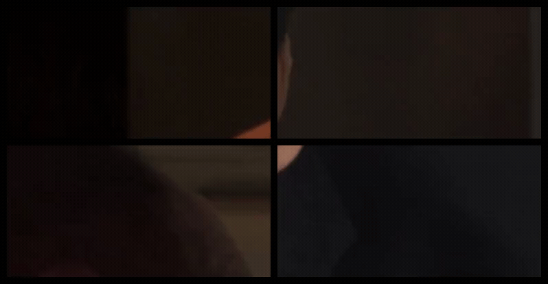
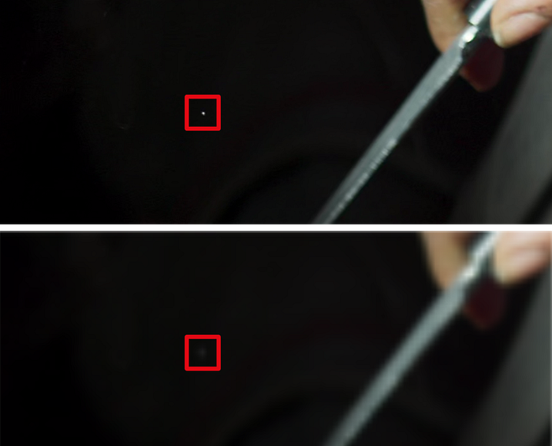
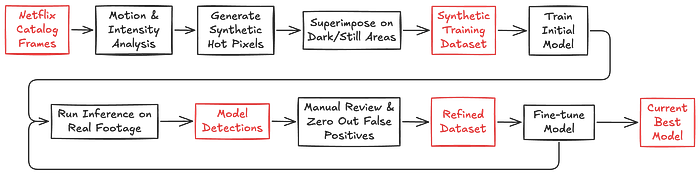

# Accelerating Video Quality Control at Netflix with Pixel Error Detection

_By _[_Leo Isikdogan_](https://www.isikdogan.com/)_, Jesse Korosi, Zile Liao, Nagendra Kamath, Ananya Poddar_

At Netflix, we support the filmmaking process that merges creativity with technology. This includes reducing manual workloads wherever possible. Automating tedious tasks that take a lot of time while requiring very little creativity allows our creative partners to devote their time and energy to what matters most: creative storytelling.

With that in mind, we developed a new method for quality control (QC) that automatically detects pixel-level artifacts in videos, reducing the need for manual visual reviews in the early stages of QC.

*Examples of detected pixel errors.*

## Why This Matters

Netflix is deeply invested in ensuring our content creators’ stories are accurately carried from production to screen. As such, we invest manual time and energy in reviewing for technical errors that could distract from our members’ immersion in and enjoyment of these stories.

Teams spend a lot of time manually reviewing every shot to identify any issues that could cause problems down the line. One of the problems they look for is tiny bright spots caused by malfunctioning camera sensors (often called hot or lit pixels). Flagging those issues is a painstaking and error-prone process. They can be hard to catch even when every single frame in a shot is manually inspected. And if left undetected, they can surface unexpectedly later in production, leading to labor-intensive and costly fixes.

By automating these QC checks, we help production teams spot and address issues sooner, reduce tedious manual searches, and address issues before they accumulate.

*Proof of Concept: hours spent on full-frame manual QC vs. minutes with the automated workflow.*

## Precision at the Pixel Level: Pixel Error Detection

Pixel errors come in two main types:

1. Hot (lit) pixels: single frame bright pixels
2. Dead (stuck) pixels: pixels that don’t respond to light

Earlier work at Netflix addressed detecting dead pixels using techniques based on pixel intensity gradients and statistical comparisons [[1](https://patents.google.com/patent/US11107206B2/en), [2](https://www.researchgate.net/publication/326104534_Shot_Change_and_Stuck_Pixel_Detection_of_Digital_Video_Assets)]. In this work, we focus on hot pixels, which are a lot harder to flag manually.

Hot pixels in a frame can occupy only a few pixels and appear for just a single frame. Imagine reviewing thousands of high-resolution video frames looking for hot pixels. To reduce manual effort, we built a highly efficient neural network to pinpoint pixel-level artifacts in real time. While detection of hot pixels is not entirely new in video production workflows, we do it at scale and with near-perfect recall rates.

Detecting artifacts at the pixel level requires the ability to identify small-scale, fine features in large images. It also requires leveraging temporal information to distinguish between actual pixel artifacts and naturally bright pixels with artifact-like features, such as small lights, catch lights, and other specular reflections.

Given those requirements, we designed a bespoke model for this task. Many mainstream computer vision models downsample inputs to reduce dimensionality, but pixel errors are sensitive to this. For example, if we downsample a 4K frame to 480p resolution, pixel-level errors almost entirely disappear. For that reason, our model processes large-scale inputs at full resolution rather than explicitly downsampling them in pre-processing.

*Why Downsampling Fails. Top: Original frame crop showing a prominent hot pixel. Bottom: Same area after 8x downscaling, causing the artifact to become nearly invisible before it even reaches the model.*

The network analyzes a window of five consecutive frames at a time, giving it the temporal context it needs to tell the difference between a one-off sensor glitch and a naturally bright object that persists across frames.

For every frame, the model outputs a continuous-valued map of pixel error occurrences at the input resolution. During training, we directly optimize those error maps by minimizing dense, pixel-wise loss functions.

During inference, our algorithm binarizes the model’s outputs using a confidence threshold, then performs connected component labeling to find clusters of pixel errors. Finally, it calculates the centroids of those clusters to report (x, y) locations of the found pixel errors.

**All of this processing happens in real-time on a single GPU.**

## Building a Synthetic Pixel Error Generator

Pixel errors are rare and make up a very small portion of videos, both temporally and spatially, in the context of the total volume of footage captured and the full resolution of a given frame. Therefore, they are hard to annotate manually. Initially, we had virtually no data to train our model. To overcome this, we developed a synthetic pixel error generator that closely mimicked real-world artifacts. We simulated two main types of pixel errors: symmetrical and curvilinear.

**_Symmetrical:_** Most pixel errors are symmetrical along at least one axis.

*Symmetrical Artifacts. Left: Three real examples of hot pixels. Right: Three synthetically generated hot pixel samples.*

**_Curvilinear:_** Some pixel errors follow curvilinear structures.

*Curvilinear Artifacts. Left: Three real examples of hot pixels. Right: Three synthetically generated hot pixel samples.*

To create realistic training samples, we superimposed these synthetic errors onto frames from the Netflix catalog. We added those artificial hot pixels to where they would be most visible: dark, still areas in the scenes. Instead of sampling (x, y) coordinates for the synthetic errors uniformly, we sampled them from a heatmap, with selection probabilities determined by the amount of motion and image intensity.

Synthetic data was essential for training our initial model. However, to close the domain gap and improve precision, we needed to run multiple tuning cycles on fresh, real-world footage.

After training an initial model solely on this synthetic data, we refined it iteratively with real-world data as follows:

1. Inference: Run the model on previously unseen footage without any added synthetic hot pixels.
2. False Positive Elimination: Manually review detections and zero out labels for false positives, which is easier than labeling hot pixels from scratch.
3. Fine-tuning and Iteration: Fine-tune on the refined dataset and repeat until convergence.

*Synthetic-to-Real Training Pipeline*

While false positives represent a small percentage of total input volume, they can still constitute a meaningful number of alerts in absolute terms given the scale of content processing. We continue to refine our model and reduce false positives through ongoing application on real-world datasets. This synthetic-to-real refinement loop steadily reduces false alarms while preserving high sensitivity.

## Looking Ahead

What once required hours of painstaking manual review can now potentially be completed in minutes, freeing creative teams to focus on what matters most: the art of storytelling. As we continue refining these capabilities through ongoing real-world deployment, we’re inspired by the many ways production teams can gain more time to build amazing stories for audiences around the world. We are also working with our partners to better understand how pixel errors affect the viewing experience, which will help us further optimize our models.

---
**Tags:** Image Processing · Video Production · Quality Assurance · Machine Learning
