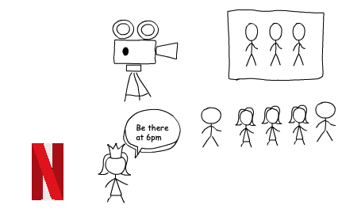
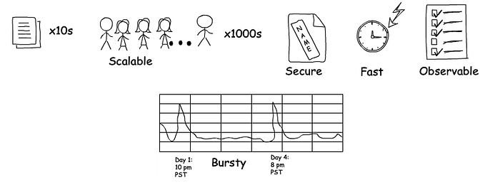
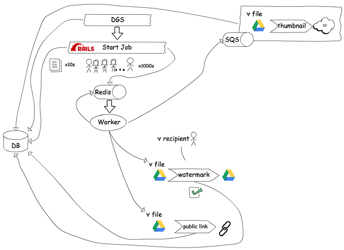
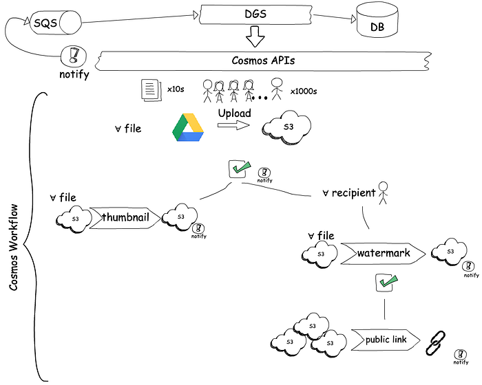
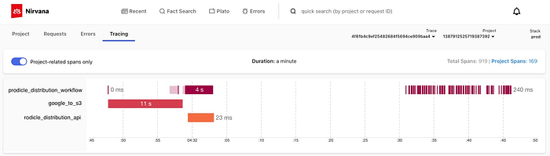

# Achieving observability in async workflows

_Written by _[_Colby Callahan_](https://www.linkedin.com/in/colbycallahan)_, _[_Megha Manohara_](https://www.linkedin.com/in/megha-manohara-ba71b09/)_, and _[_Mike Azar_](https://www.linkedin.com/in/mike-azar-7064883b/)_._

**Managing and operating asynchronous workflows can be difficult without the proper tools and architecture that puts observability, debugging, and tracing at the forefront.**

Imagine getting paged outside normal work hours — users are having trouble with the application you’re responsible for, and you start diving into logs. However, they are scattered across multiple systems, and there isn’t an easy way to tie related messages together. Once you finally find useful identifiers, you may begin writing SQL queries against your production database to find out what went wrong. You’re joining tables, resolving status types, cross-referencing data manually with other systems, and by the end of it all you ask yourself why?

*An upset on-call*

This was the experience for us as the backend team on Prodicle Distribution, which is one of the many services offered in the suite of content production-facing applications called Prodicle.

Prodicle is one of the many applications that is at the exciting intersection of connecting the world of content productions to [Netflix Studio Engineering](./netflix-studio-engineering-overview-ed60afcfa0ce.md). It enables a Production Office Coordinator to keep a Production’s cast, crew, and vendors organized and up to date with the latest information throughout the course of a title’s filming. (e.g. Netflix original series such as La Casa De Papel), as well as with Netflix Studio.

*Users of Prodicle: Production Office Coordinator on their job*

As the adoption of Prodicle grew over time, Productions asked for more features, which led to the system quickly evolving in multiple programming languages under different teams. When our team took ownership of Prodicle Distribution, we decided to revamp the service and expand its implementation to multiple UI clients built for web, [Android and iOS](./netflix-android-and-ios-studio-apps-kotlin-multiplatform-d6d4d8d25d23.md).

**Prodicle Distribution**

Prodicle Distribution allows a production office coordinator to send secure, watermarked documents, such as scripts, to crew members as attachments or links, and track delivery. One distribution job might result in several thousand watermarked documents and links being created. If a job has 10 files and 20 recipients, then we have 10 x 20 = 200 unique watermarked documents and (optionally) links associated with them depending on the type of the Distribution job. The recipients of watermarked documents are able to access these documents and links in their email as well as in the Prodicle mobile application.

*Prodicle Distribution*

Our service is required to be elastic and handle bursty traffic. It also needs to handle third-party integration with Google Drive, making copies of PDFs with watermarks specific to each recipient, adding password protection, creating revocable links, generating thumbnails, and sending emails and push notifications. We are expected to process 1,000 watermarks for a single distribution in a minute, with non-linear latency growth as the number of watermarks increases. The goal is to process these documents as fast as possible and reliably deliver them to recipients while offering strong observability to both our users and internal teams.

*Prodicle Distribution Requirements*

**Asynchronous workflow**

Previously, the Distribution feature of Prodicle was treated as its own unique application. In late 2019, our team started integrating it with the rest of the ecosystem by writing a thin Java [Domain graph service](./open-sourcing-the-netflix-domain-graph-service-framework-graphql-for-spring-boot-92b9dcecda18.md) (DGS) to wrap the asynchronous watermarking functionality that was then in Ruby on Rails. The watermarking functionality, at the start, was a simple offering with various Google Drive integrations for storage and links. Our team was responsible for Google integrations, watermarking, bursty traffic management, and on-call support for this application. We had to traverse multiple codebases, and observability systems to debug errors and inefficiencies in the system. Things got hairy. New feature requests were adding to the maintenance burden for the team.

*Initial offering of Prodicle Distribution backend*

When we decided to migrate the asynchronous workflow to Java, we landed on these additional requirements: 1. We wanted a scalable service that was near real-time, 2. We wanted a workflow orchestrator with good observability for developers, and 3. We wanted to delegate the responsibility of watermarking and bursty traffic management for our asynchronous functions to appropriate teams.

*Migration consideration for Prodicle Distribution’s asynchronous workflow*

We evaluated what it would take to do this ourselves or rely on the offerings from our platform teams — [Conductor](./evolution-of-netflix-conductor-16600be36bca.md) and one of the new offerings [Cosmos](./the-netflix-cosmos-platform-35c14d9351ad.md). Even though Cosmos was developed for asynchronous media processing, we worked with them to expand to generic file processing and tune their workflow platform for our near real-time use case. Early prototypes and load tests validated that the offering could meet our needs. We leaned into Cosmos because of the low variance in latency through the system, separation of concerns between the API, workflow, and the function systems, ease of load testing, customizable API layer and notifications, support for File I/O abstractions and elastic functions. Another benefit was their observability portal and its capabilities with search. We also migrated the ownership of watermarking to another internal team to focus on developing and supporting additional features.

*Current architecture of Prodicle Distribution on Cosmos*

With Cosmos, we are well-positioned to expand to future use cases like watermarking on images and videos. The Cosmos team is dedicated to improving features and functionality over the next year to make observations of our async workflows even better. It is great to have a team that will be improving the platform in the background as we continue our application development. We expect the performance and scaling to continue to get better without much effort on our part. We also expect other services to move some of their processing functionality into Cosmos, which makes integrations even easier because services can expose a function within the platform instead of GRPC or REST endpoints. The more services move to Cosmos, the bigger the value proposition becomes.

**Deployed to Production for Productions**

With productions returning to work in the midst of a global pandemic, the adoption of Prodicle Distribution has grown 10x, between June 2020 and April 2021. Starting January 2021 we did an incremental release of Prodicle Distribution on Cosmos and completed the migration in April 2021. We now support hundreds of productions, with tens of thousands of Distribution jobs, and millions of watermarks every month.

**With our migration of Prodicle Distribution to Cosmos, we are able to use their observability portal called Nirvana to debug our workflow and bottlenecks.**

*Observing Prodicle Distribution on Cosmos in Nirvana*

Now that we have a platform team dedicated to the management of our async infrastructure and watermarking, our team can better maintain and support the distribution of documents. Since our migration, the number of support tickets has decreased. It is now easier for the on-call engineer and the developers to find the associated logs and traces while visualizing the state of the asynchronous workflow and data in the whole system.

*A stress-free on-call*

---
**Tags:** Asynchronous · Workflow Management · Software Engineering · Netflix Studio · Tracing
