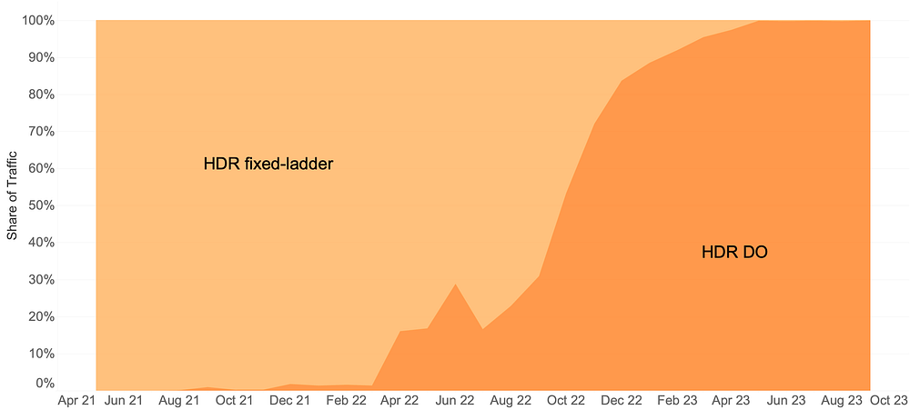
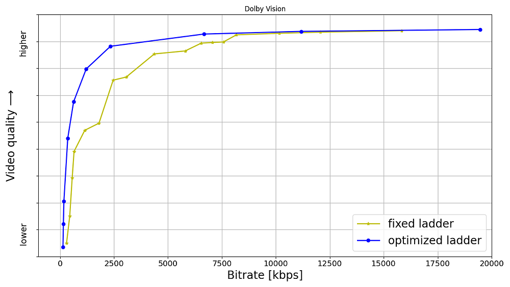
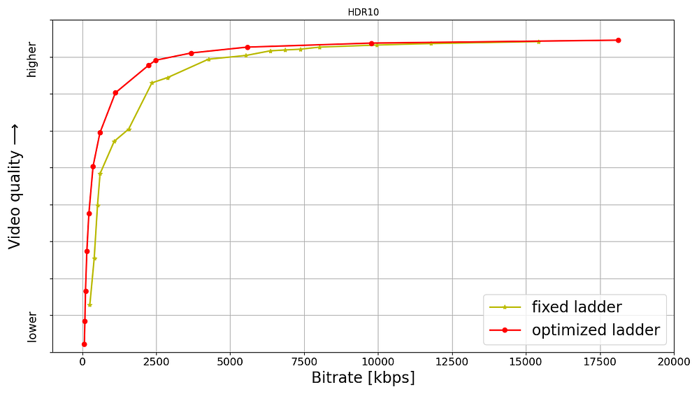
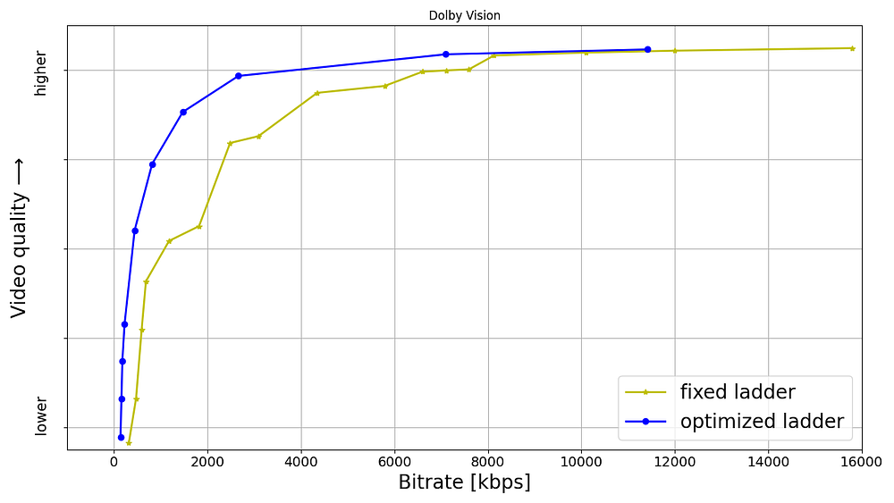
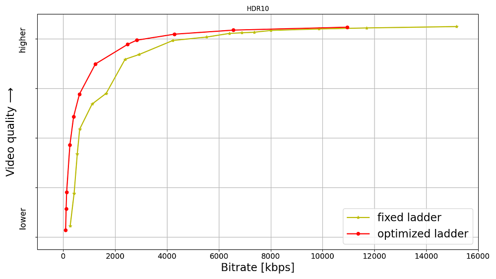

# All of Netflix’s HDR video streaming is now dynamically optimized

by [Aditya Mavlankar](https://www.linkedin.com/in/aditya-mavlankar-7139791/), [Zhi Li](https://www.linkedin.com/in/henryzhili/), [Lukáš Krasula](https://www.linkedin.com/in/luk%C3%A1%C5%A1-krasula-a0171b6a/) and [Christos Bampis](https://www.linkedin.com/in/christosbampis/)

High dynamic range ([HDR](https://developer.apple.com/videos/play/tech-talks/502/)) video brings a wider range of luminance and a wider gamut of colors, paving the way for a stunning viewing experience. Separately, our invention of Dynamically Optimized ([DO](https://netflixtechblog.com/dynamic-optimizer-a-perceptual-video-encoding-optimization-framework-e19f1e3a277f)) encoding helps achieve optimized bitrate-quality tradeoffs depending on the complexity of the content.

HDR was launched at Netflix in 2016 and the number of titles available in HDR has been growing ever since. We were, however, missing the systematic ability to measure perceptual quality ([VMAF](https://netflixtechblog.com/vmaf-the-journey-continues-44b51ee9ed12)) of HDR streams since VMAF was limited to standard dynamic range (SDR) video signals.

As noted in [an earlier blog post](./optimized-shot-based-encodes-for-4k-now-streaming-47b516b10bbb.md), we began developing an HDR variant of VMAF; let’s call it HDR-VMAF. A vital aspect of such development is subjective testing with HDR encodes in order to generate training data. The pandemic, however, posed unique challenges in conducting a conventional in-lab subjective test with HDR encodes. We improvised as part of a collaborative effort with Dolby Laboratories and conducted subjective tests with 4K-HDR content using high-end OLED panels in calibrated conditions created in participants’ homes [1],[2]. Details pertaining to HDR-VMAF exceed the scope of this article and will be covered in a future blog post; for now, suffice it to say that the first version of HDR-VMAF landed internally in 2021 and we have been improving the metric ever since.

The arrival of HDR-VMAF allowed us to create HDR streams with DO applied, i.e., HDR-DO encodes. Prior to that, we were using a fixed ladder with predetermined bitrates — regardless of content characteristics — for HDR video streaming. We A/B tested HDR-DO encodes in production in Q3-Q4 2021, followed by improving the ladder generation algorithm further in early 2022. We started backfilling HDR-DO encodes for existing titles from Q2 2022. By June 2023 the entire HDR catalog was optimized. The graphic below (Fig. 1) depicts the migration of traffic from fixed bitrates to DO encodes.

*Fig. 1: Migration of traffic from fixed-ladder encodes to DO encodes.*

## Bitrate versus quality comparison

HDR-VMAF is designed to be format-agnostic — it measures the perceptual quality of HDR video signal regardless of its container format, for example, Dolby Vision or HDR10. HDR-VMAF focuses on the signal characteristics (as a result of lossy encoding) instead of display characteristics, and thus it does not include display mapping in its pipeline. Display mapping is the specific tone mapping applied by the display based on its own characteristics — peak luminance, black level, color gamut, etc. — and based on content characteristics and/or metadata signaled in the bitstream.

Two ways that HDR10 and Dolby Vision differ are: **1)** the preprocessing applied to the signal before encoding **2)** the metadata informing the display mapping on different displays. So, HDR-VMAF will capture the effect of **1)** but ignore the effect of **2)**. Display capabilities vary a lot among the heterogeneous population of devices that stream HDR content — this aspect is similar to other factors that vary session to session such as ambient lighting, viewing distance, upscaling algorithm on the device, etc. “VMAF not incorporating display mapping” implies the scores are computed for an “ideal display” that’s capable of representing the entire luminance range and the entire color gamut spanned by the video signal — thus not requiring display mapping. This background is useful to have before looking at rate vs quality curves pertaining to these two formats.

Shown below are rate versus quality examples for a couple of titles from our HDR catalog. We present two sets. Within each set we show curves for both Dolby Vision and HDR10. The first set (Fig. 2) corresponds to an episode from a gourmet cooking show incorporating fast-paced scenes from around the world. The second set (Fig. 3) corresponds to an episode from a relatively slower drama series; slower in terms of camera action. The optimized encodes are chosen from the convex hull formed by various rate-quality points corresponding to different bitrates, spatial resolutions and encoding recipes.

For brevity we skipped annotating ladder points with their spatial resolutions but the overall observations from our [previous article on SDR-4K encode optimization](./optimized-shot-based-encodes-for-4k-now-streaming-47b516b10bbb.md) apply here as well. The fixed ladder is slow in ramping up spatial resolution, so the quality stays almost flat among two successive 1080p points or two successive 4K points. On the other hand, the optimized ladder presents a sharper increase in quality with increasing bitrate.

The fixed ladder has predetermined 4K bitrates — 8, 10, 12 and 16 Mbps — it deterministically maxes out at 16 Mbps. On the other hand, the optimized ladder targets very high levels of quality on the top rung of the bitrate ladder, even at the cost of higher bitrates if the content is complex, thereby satisfying the most discerning viewers. In spite of reaching higher qualities than the fixed ladder, the HDR-DO ladder, on average, occupies only 58% of the storage space compared to fixed-bitrate ladder. This is achieved by more efficiently spacing the ladder points, especially in the high-bitrate region. After all, there is little to no benefit in packing multiple high-bitrate points so close to each other — for example, 3 QHD (2560x1440) points placed in the 6 to 7.5 Mbps range followed by the four 4K points at 8, 10, 12 and 16 Mbps, as was done on the fixed ladder.

*Fig. 2: Rate-quality curves comparing fixed and optimized ladders corresponding to an episode from a gourmet cooking show incorporating fast-paced scenes from around the world.*

*Fig. 3: Rate-quality curves comparing fixed and optimized ladders corresponding to an episode from a drama series, which is slower in terms of camera action.*

It is important to note that the fixed-ladder encodes had constant duration group-of-pictures (GoPs) and suffered from some inefficiency due to shot boundaries not aligning with Instantaneous Decoder Refresh (IDR) frames. The DO encodes are shot-based and so the IDR frames align with shot boundaries. For a given rate-quality operating point, the DO process helps allocate bits among the various shots while maximizing an overall objective function. Also thanks to the DO framework, within a given rate-quality operating point, _challenging shots_ can and do burst in bitrate up to the _codec level limit_ associated with that point.

## Member benefits

We A/B tested the fixed and optimized ladders; first and foremost to make sure that devices in the field can handle the new streams and serving new streams doesn’t cause unintended playback issues. A/B testing also allows us to get a read on the improvement in quality of experience (QoE). Overall, the improvements can be summarized as:

- 40% fewer rebuffers
- Higher video quality for both bandwidth-constrained as well as unconstrained sessions
- Lower initial bitrate
- Higher initial quality
- Lower play delay
- Less variation in delivered video quality
- Lower Internet data usage, especially on mobiles and tablets

## Will HDR-VMAF be open-source?

Yes, we are committed to supporting the open-source community. The current implementation, however, is largely tailored to our internal pipelines. We are working to ensure it is versatile, stable, and easy-to-use for the community. Additionally, the current version has some algorithmic limitations that we are in the process of improving before the official release. When we do release it, HDR-VMAF will have higher accuracy in perceptual quality prediction, and be easier to use “out of the box”.

## Summary

Thanks to the arrival of HDR-VMAF, we were able to optimize our HDR encodes. Fixed-ladder HDR encodes have been fully replaced by optimized ones, reducing storage footprint and Internet data usage — and most importantly, improving the video quality for our members. Improvements have been seen across all device categories ranging from TVs to mobiles and tablets.

## Acknowledgments

We thank all the volunteers who participated in the subjective experiments. We also want to acknowledge the contributions of our colleagues from Dolby, namely Anustup Kumar Choudhury, Scott Daly, Robin Atkins, Ludovic Malfait, and Suzanne Farrell, who helped with preparations and conducting of the subjective tests.

We thank Matthew Donato, Adithya Prakash, Rich Gerber, Joe Drago, Benbuck Nason and Joseph McCormick for all the interesting discussions on HDR video.

We thank various internal teams at Netflix for the crucial roles they play:

- The various [client device and UI engineering](https://jobs.netflix.com/team?slug=client-and-ui-engineering) teams at Netflix that manage the Netflix experience on various device platforms
- The [data science and engineering](https://jobs.netflix.com/team?slug=data-science-and-engineering) teams at Netflix that help us run and analyze A/B tests; we thank Chris Pham in particular for generating various data insights for the encoding team
- The [Playback Systems](https://www.youtube.com/watch?v=5ju4W9KAzcY) team that steers the Netflix experience for every client device including the experience served in various encoding A/B tests
- The [Open Connect](https://openconnect.netflix.com/en/) team that manages Netflix’s own content delivery network
- The Content Infrastructure and Solutions team that manages the [compute platform](./the-netflix-cosmos-platform-35c14d9351ad.md) that enables us to execute video encoding at scale
- The Streaming Encoding Pipeline team that helps us orchestrate the generation of various streaming assets

_Find our work interesting? Join us and be a part of the amazing team that brought you this tech-blog; open positions:_

- [_Software Engineer, Cloud Gaming_](https://jobs.netflix.com/jobs/305482718)
- [_Software Engineer, Live Streaming_](https://jobs.netflix.com/jobs/296600425)

## References

**[1]** L. Krasula, A. Choudhury, S. Daly, Z. Li, R. Atkins, L. Malfait, A. Mavlankar, “Subjective video quality for 4K HDR-WCG content using a browser-based approach for “at-home” testing,” Electronic Imaging, vol. 35, pp. 263–1–8 (2023) [[online](https://library.imaging.org/admin/apis/public/api/ist/website/downloadArticle/ei/35/8/IQSP-263)]  
**[2]** A. Choudhury, L. Krasula, S. Daly, Z. Li, R. Atkins, L. Malfait, “Testing 4K HDR-WCG professional video content for subjective quality using a remote testing approach,” SMPTE Media Technology Summit 2023

---
**Tags:** Video Compression · Video Quality · Encoding · High Dynamic Range · Netflix
