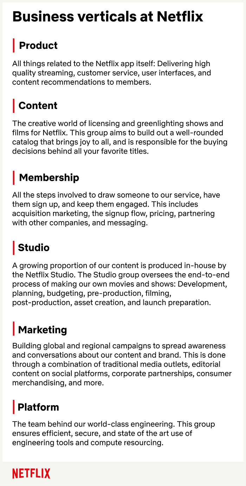
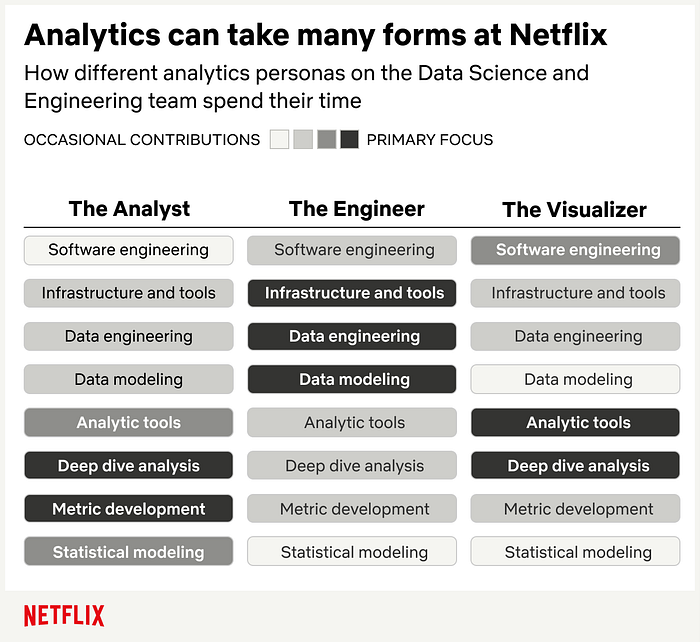

# Analytics at Netflix: Who We Are and What We Do

> An Introduction to Analytics and Visualization Engineering at Netflix

_by _[_Molly Jackman_](https://www.linkedin.com/in/molly-jackman-1a757644/)_ & _[_Meghana Reddy_](https://www.linkedin.com/in/meghanareddy/)

*Explained: Season 1 (Photo Credit: Netflix)*

Across nearly every industry, there is recognition that data analytics is key to driving informed business decision-making. But there is far less agreement on what that term “data analytics” actually means — or what to call the people responsible for the work.

Even within Netflix, we have many groups that do some form of data analysis, including [business strategy](http://jobs.netflix.com/teams/strategy-and-analysis) and [consumer insights](http://jobs.netflix.com/teams/consumer-insights-marketing). But here we are talking about Netflix’s [Data Science and Engineering](http://jobs.netflix.com/teams/data-science-and-engineering) group, which specializes in analytics at scale. The group has technical, engineering-oriented roles that fall under two broad category titles: _“Analytics Engineers” _and_ “Visualization Engineers.” _In this post, we refer to these two titles collectively as the “analytics role.” These professionals come from a wide range of backgrounds and bring different skills to their work, while sharing a common drive to generate and scale business impact through data.

> Individuals in these roles possess deep business context and are thought leaders alongside their business counterparts. This enables them to fully understand where their partners are coming from.

## What’s the purpose of the analytics role at Netflix?

When you think about data at Netflix, what comes to mind? Oftentimes it is our content recommendation algorithm or the online delivery of video to your device at home. Both are integral parts of the business, but far from the whole picture. Data is used to inform a wide range of questions — ‘_How can we make the product experience even better?’, ‘Which shows and films bring the most joy to our members?’, ‘Who can we partner with to expand access to our service in new markets?’._ Our Analytics and Visualization Engineers are taking on these and other big questions for the company, informing decision-making across every corner of the business.

*We align our analytic teams with business area verticals*

Since the problem space is so varied, we align our analytics professionals with the listed business area verticals rather than organizing them within a single functional horizontal. The expectation is that individuals in these roles possess deep business context and are thought leaders alongside their business counterparts. This enables them to fully understand where their partners are coming from. It also means Analytics and Visualization Engineers are a specialized resource and a rare commodity. There are many more questions and stakeholders than analytics team members, and the job is _not_ to take on every request. Instead, these individual contributors are given **freedom** to choose their projects and are **responsible** for prioritizing the ones that will have the most business impact (and deprioritizing the rest). This requires a lot of judgment and embodies our “[context not control](http://jobs.netflix.com/culture)” culture.

_“OK, but what do they actually _**_do_**_…?”_

## What does the job entail?

You’ve probably caught on to some common themes: People in the analytics role are highly connected to the business, solve end-to-end problems, and are directly responsible for improving business outcomes. But what makes this group really shine are their differences. They come from lots of backgrounds, which yields different perspectives on how to approach problems. We use the catch-all titles of Analytics and Visualization Engineers so as to not get too hung up on specific credentials. Instead, people are empowered to leverage their unique skills to make Netflix better.

A couple other defining characteristics of the role are full ownership of the problem (in Netflix lingo, you are the “informed captain” of your space) and creating trustworthy outputs. These are only possible through the one-two punch of deep business context 👊 and technical excellence 👊. **Full ownership often means building new data pipelines, navigating complex schemas and large data sets, developing or improving metrics for business performance, and creating intuitive visualizations and dashboards — always with an eye towards actionable insights.**

> We use the catch-all titles of Analytics and Visualization Engineers so as to not get too hung up on specific credentials. Instead, people are empowered to leverage their unique skills to make Netflix better.

Because these professionals vary in their expertise, so too does their day-to-day. Below are three broadly defined personas to help illustrate some of the different backgrounds, motivations, and activities of individuals in the analytics role at Netflix. Many of our colleagues have come in with expertise that spans multiple personas. Others have grown into new areas as part of their professional development at Netflix. Ultimately, _these skills are all on a continuum_, some broad and some deep, and these are just a few examples of such expertise. So if you find yourself connecting with _any_ part of these descriptions, the analytics role could be for you.

- **The Analyst** is motivated by delivering metrics, findings, or dashboards that drive analytical insights and business decisions. They love to communicate their discoveries to nontechnical audiences, explain caveats, and debate analytic choices and strategic implications with peers and stakeholders. Their expertise is descriptive analytic methodology, but they have the necessary tools to be scrappy (e.g. coding, math, stats), and do what’s required to answer the highest priority business questions.
- **The Engineer** enjoys making data available by piping it in from new sources in optimal ways, building robust data models, prototyping systems, and doing project-specific engineering. They’re still analysts at heart but, similar to data engineers, they have a deep understanding of data warehouse capabilities and are pros at data processing optimization and performance tuning. Being at this intersection of disciplines allows them to produce full-stack outputs, layering visualizations and analytics on their projects.
- **The Visualizer **is passionate about the scalability, beauty, and functionality of dashboards and their capability for telling a visual story. They also have an eye for principled engineering, i.e. managing the data under the surface. They want to pick the perfect chart type for the narrative while also focusing on delivering key analytic insights. They may use industry tools (e.g. Tableau, Looker, Power BI) to their fullest extent, developing a deeper understanding of analytics by examining these tools under the hood. Or they may create sophisticated visuals from scratch and build the type of custom UI that enterprise tools don’t offer (e.g. JavaScript web apps).

## Introducing Analytics at Netflix

Whether you’re a data professional, student, or Netflix enthusiast, we invite you to meet our stunning colleagues and hear their stories. If this series resonates with you and you’d like to explore opportunities with us, check out our [analytics site](http://research.netflix.com/research-area/analytics), search [open roles](http://jobs.netflix.com/search?team=Data+Science+and+Engineering), and learn about our [culture](http://jobs.netflix.com/culture).

Welcome to Analytics at Netflix!

---

### Related Posts:

- [How Our Paths Brought Us to Data and Netflix](./how-our-paths-brought-us-to-data-and-netflix-4eced44a6872.md)
- [A Day in the Life of a Content Analytics Engineer](./a-day-in-the-life-of-a-content-analytics-engineer-eb0250b993be.md)
- [Mythbusting the Analytics Journey](./mythbusting-the-analytics-journey-58d692ea707e.md)

---
**Tags:** Netflix · Analytics · Data Science · Data Visualization · Data Engineering
